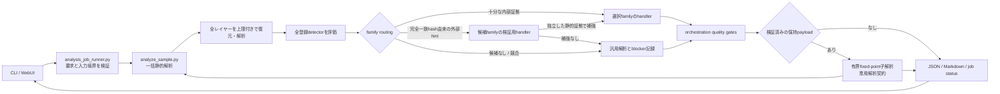

# AI非依存の一括静的解析オーケストレーション

## 目的

既知マルウェアの受付、静的復元、family選択、family固有解析、設定・通信先・終端payload・特徴的ロジックの品質判定までを、生成AIへ検体や途中結果を渡さず、ローカルのスクリプトだけで再現可能に実行します。WebUIは解析処理を内包せず、検証済みジョブ契約を介して同じ処理を起動・監視します。本リポジトリが提供するのはscript-onlyのCLI／Python API契約であり、HTTPを待ち受けるWebUI backendそのものではありません。

本経路は検体を実行せず、抽出した通信先へ接続せず、外部サービスへ提出しません。ライブC2確認、公開sandbox取得、OSINT照会は別の承認・記録・安全境界を持つ後続処理です。

## 標準経路



正本の入口は次の2段です。

- `analysis-framework/common/analysis_job_runner.py`: WebUIまたはローカルAPI向けの受付、入力境界、同一interpreterのsanitized runtime preflight、ジョブ状態、timeout、log上限、成果物の独立再検証を管理します。
- `analysis-framework/common/analyze_sample.py`: 静的復元、分類、適用性判定、handler実行、知識成果物、品質ゲートを実行します。

WebUIからfamily別scriptを直接呼び分けたり、任意のcommand lineを組み立てたりしません。これによりCLIとWebUIの結果差、引数注入、未検証handlerの迂回を防ぎます。

## family選択と候補検証

familyは証拠の強さを分けて扱います。

1. 検体内部の構造、復号済み設定、レビュー済み検出器などの強い証拠は、自動選択へ利用できます。
2. MalwareBazaar等の外部ラベルは、完全一致SHA-256に束縛した候補hintとしてだけ利用します。
3. 候補hintだけではfamilyを確定しません。対応形式の安全なhandlerを検証用に実行し、別系統の静的証拠で補強できた場合だけ昇格します。
4. 複数familyが競合する場合、都合のよい1件を選ばず、競合とblockerを残します。

MalwareBazaarのWindows検体を通常取得するときは、`malwarebazaar_batch.py --windows`が取得用のprivate rootへ`manifest.json`と同じ階層の`family-hints.json`を自動生成します。private rootはrepository外へ置き、生成されたhint manifestを解析ジョブの入力snapshotへ含めます。

```powershell
python .\analysis-framework\common\malwarebazaar_batch.py `
  --windows `
  --limit 50 `
  --root C:\malware-lab\private\malwarebazaar\windows-20260820
```

既存の取得manifestから手動で再生成する場合は、`acquisition_items`を持つ公開collection manifestまたは`items`を持つprivate取得manifestを`--collection-manifest`へ渡します。

```powershell
python .\analysis-framework\common\build_family_hint_manifest.py `
  --collection-manifest C:\malware-lab\private\malwarebazaar\windows-20260820\manifest.json `
  --output C:\malware-lab\private\malwarebazaar\windows-20260820\family-hints.json
```

公開済みcollectionのsummaryを入力にする従来経路も利用できます。

```powershell
python .\analysis-framework\common\build_family_hint_manifest.py `
  --publication-summary .\analysis-results\collections\<collection>\publication-summary.json `
  --output C:\malware-lab\intake\hints\family-hints.json
```

変換対象はallowlistで正規化できるMalwareBazaarの`signature`または直接tagだけです。各候補は取得metadata内の完全一致SHA-256へ束縛し、`verification-only`として扱います。providerのsignature／tagは候補handlerを試すための外部由来情報であり、family帰属の根拠ではありません。URL、ファイル名、曖昧なtag、SHA-256と矛盾するmetadataから候補を結び付けることはできず、候補を昇格するには別系統の静的証拠が必要です。

## 完了判定

`orchestration.json`は少なくとも次の観点を機械判定します。

- family帰属: 選択根拠、候補検証、競合の有無
- handler: 対象family・入力形式・実行状態・補強証拠
- config: familyが要求する設定項目の抽出状態と根拠
- network: 配布先、C2、exfiltration先、通常サービスの役割分離と根拠
- terminal payload: 認証済みバイナリ成果物、親子関係、未解決stage
- function logic: 特徴的な関数またはスクリプトロジックと全体フロー

文字列として自己申告されたhashだけでは、終端payload取得済みとしません。取得済みとして扱う成果物は、wrapperが実際に読み取った通常ファイルから計算したSHA-256とsizeが一致し、安全な相対pathを持つ必要があります。

familyによってconfigやC2を持たない場合もあるため、単純に全項目の存在を強制しません。family profileが要求する能力、観測できなかった理由、解析上限を区別し、未解決なら`blockers`へ残します。

## 再開計画と後継workflow

保存済みorchestrationを再実行する前に、`analysis_resume_planner.py plan-resume`でread-onlyの再開計画を作成できます。plannerは保存済みrequest、親子state、report、解析実装commitment、phaseごとの結果とblockerを単一snapshotとして検証し、検体を実行せず、成果物を書き換えず、解析用network通信も行いません。

```powershell
python .\analysis-framework\common\analysis_resume_planner.py plan-resume `
  --orchestration-id <orchestration-id> `
  --repository C:\work\AI-security-analysis `
  --input-root C:\malware-lab\intake `
  --work-root C:\malware-lab\work
```

標準出力の`status`とprocess終了コードは次の契約です。

- `complete`: 全workflowが完了済みです。終了コードは`0`です。
- `actionable`: 保存済み証拠とretry budgetの範囲で再開候補があります。終了コードは`20`です。
- `blocked`: 自動再開できません。終了コードは`20`です。`20`はplannerの失敗ではないため、`status`と各workflowの`decision`を確認します。
- 入力、state、report、hash、親子整合性の検証エラー: 機械可読errorを標準エラーへ出し、終了コードは`2`です。

plannerはblockerの完全一致またはレビュー済みprefix policyと、phase証拠のfingerprintを使って判定します。workflow attemptが複数あり再試行履歴が保存されていない場合も、現在のstage fingerprintと実装commitmentが変わっていなければ同一証拠のno-progressとして保守的に停止し、retry budgetを超えたblind retryも抑止します。policyにない未知のblocker、混在している未知のblocker、証拠commitmentの不整合はfail-closedで`blocked`とし、文字列の部分一致から実行可能と推測しません。

`resume`はprocess中断など、同じrequest・実装・証拠を使う中断回復だけに使用します。静的証拠の追加、Ghidra解析の追加、detector／handlerの実装変更、入力やpolicyの変更が必要な場合は、公開済みstateを同じworkflowとして再開せず、新しいIDとrequest commitmentを持つsuccessor workflowを作成します。plannerは計画を返すだけであり、再開やsuccessor作成を自動実行しません。

## Ghidra関数解析後の品質ゲート再整合

`ghidra_function_batch.py`がcaseの関数解析をfinalizeするときは、代表関数解析成果物を独立validatorで検証した後、既存`orchestration.json`の`function_analysis` gateだけを自動再整合します。gateが`required_missing`で検証済み関数解析が揃った場合は`required_missing`から`satisfied`へ変更し、対応する`function_analysis` blockerと同じ位置のnext actionだけを除去して、残余blockerからorchestration状態を再計算します。

family、config、network、terminal payloadなど他のgate、blocker、next actionは保持します。したがって関数解析が完了しても、終端payload等が未解決ならcaseは`partial`のままです。既に満たされたfunction gateへの再実行は冪等に扱い、参照、artifact hash、schema、reportとのblocker対応、関数解析validationのいずれかが不正なら更新せずfail-closedにします。成功時は更新した`orchestration.json`のartifact hashとreportの状態を再計算し、`report.json`を再封印します。

## 終端payloadの保持と固定点解析

family handlerがraw bytesを復元した場合、隔離workerは上限付き一時領域へ保存します。親processはその通常ファイルを再読込し、worker申告値に依存せずSHA-256とsizeを再計算して、case配下の安全な相対pathへ保持します。観測したbinary数と保持数が一致しない、走査が打ち切られた、再hashできない、hardlink／reparse／境界外pathを検出した場合は後段解析へ渡しません。

family handlerが返す公開結果と復元bytesは分離します。format、size、hash、config等のfamily固有検証を完了した場合だけ、worker内部の`terminal_payload` recordへbytesを置けます。親processはそのrecordを一時fileへ保存して再hashし、一致した通常fileだけを`p/<sha256>.<kind別拡張子>`へ保持します。公開JSONにはbytesを複製せず`content_exported=false`を残し、root reportの`retained_artifact_paths`はsorted uniqueな保持pathだけを列挙します。各pathに埋め込んだSHA-256と`artifact_sha256`が一致しない、重複する、許可外拡張子または任意pathを含むreportは拒否します。

保持できたpayloadは、rootとは別の解析契約で同じ静的解析器へ再投入します。子契約は`archive_mode=raw`、family強制なし、外部family hintなし、通常解析、個別payload上限128 MiBに固定します。秘密のarchive passwordはargvや環境変数へ出さず、所有者限定の一時request fileからworkerへ渡し、payload本体は標準入力で渡します。

固定点queueには次のhard limitがあります。

- 最大64 payload、最大128 edge、最大深さ4
- 個別payload 128 MiB、合計256 MiB
- job内の後段解析全体300秒、子processごと120秒
- SHA-256によるvisited集合、cycle除外、同一payloadの共有edge除外
- timeout、上限到達、途中生成case、契約不一致、seal不一致は`partial`として記録

`follow-on-analysis.json`はroot、node、edge、除外理由、解析契約SHA-256を持つ機械可読グラフです。terminal stateへ到達した子caseだけを`summary.json`の`derived_cases`へ公開し、rootの`cases`／`counts`とは別に`derived_counts`へ集計します。edge上限、再読込byte上限、期限、成果物検証失敗で走査できなかった保持metadataは、先頭4,096件を親・子SHA-256、size、path、role、kind、理由付きで`omitted_metadata`へ残します。上限を超えた残余は、親ごとの件数と多重集合canonical SHA-256を`omitted_metadata_commitments`へ残します。WebUI runnerはroot／child契約を現在コードと要求から再計算し、seal済みroot caseから全countsを再計算したうえで、グラフ本体のSHA-256、安全フラグ、hard counter、DAGの深さ、edgeとnode状態、子reportのsemantic seal、成果物hash、lineage、summaryとの完全一致を再検証します。さらに親wrapperから残余`Counter`を独立再計算し、`edge + omitted_metadata + commitment`が全保持metadataを多重度込みで完全分割することを照合します。omissionまたはcommitmentが1件でもあれば必ず`partial`です。commitmentがあるgraphでは親昇格を禁止し、保持file本体の再SHA-256は引き続き有界・期限付きで実施します。

`terminal-payload-acquisition.json`は、この検証済みグラフから最深の終端frontierを決定的に抽出します。厳格な`complete`子だけを`selected_sha256`へ採用し、timeout、解析途中、深さ・size・件数・合計byte上限、cycle、omissionは`pending_sha256`と機械可読`blockers`へ分離します。公開するのはSHA-256、size、深さ、role、kind、親SHA-256、解析状態だけで、payload本文や秘密値は含めません。外部取得は自動実行せず、`external_retrieval_attempted=false`、`network_contacted=false`を固定します。job runnerはこの成果物を`follow-on-analysis.json`から再計算し、artifact SHA-256、件数、状態が完全一致しない結果を拒否します。

子handlerが同じSHA-256を再出力した場合は、自己edgeを`cycle_excluded`として記録します。そのSHA-256はfrontierから消去せず、`cycle_detected`理由を持つ`pending_sha256`へ残します。したがって取得済みbytesを失わず、同時に自己cycleを解析完了へ誤昇格させません。

保持済みと解析済みは同義ではありません。子caseが厳格な`complete`へ到達すると、子解析契約SHA-256、子reportのsemantic hash、成果物hash検証、当該親からの通常／shared edgeをproofとして親wrapperへ結び付け、深いstageから順に親の`orchestration.json`と`report.json`を再計算・再sealします。`depth_limit`やcycle等の除外edge、別rootのroot契約caseは親昇格へ流用しません。全品質gateが満たされた親だけを`complete`へ昇格し、他のblocker、timeout、途中case、proof不一致があれば`partial`のまま残します。昇格した親SHA-256は`follow-on-analysis.json`の`promoted_parent_sha256`へ記録し、全reportのproof保持case集合と完全一致させます。runnerはresolved familyのwrapperから必要な保持payloadとoutcomeを再計算し、wrapper内部proof、親proof、親子双方のstrict complete、子semantic hashを完全一致で検証します。

親昇格ではproof、品質gate、artifact manifest、全JSON serializationを先に完了し、その後に各fileをatomic replaceして`report.json`を最後に保存します。複数file全体を単一filesystem transactionにはできないため、I/O失敗時はcompleteとして公開しないfail-closed方式です。

## 主な成果物

各caseでは、従来の成果物に加えて次を保存します。

- `family-routing.json`: 選択family、候補family、証拠tier、候補実行可否
- `candidate-handler-assessment.json`: 候補handlerの安全性、互換性、観測証拠、失敗理由
- `orchestration.json`: family、config、network、終端payload、関数ロジックの品質ゲート
- `report.json`: 上記を含むcase状態、blocker、解析契約、成果物hash
- `follow-on-analysis.json`: 保持payloadを辿った固定点解析グラフ、上限、除外理由、子解析契約SHA-256
- `terminal-payload-acquisition.json`: 終端frontier、採用SHA-256、保留SHA-256、未取得理由、安全フラグ

`summary.json`は、検出器が選択したfamilyと、候補handlerだけが観測したfamilyを分離して集計します。候補検証の試行数をfamily確定数へ混入させません。root入力の`cases`／`counts`と後段payloadの`derived_cases`／`derived_counts`も分離します。

## WebUI／ローカルAPIとの契約

ジョブ要求は固定schemaのJSONとし、入力は管理者が用意した`input-root`配下、出力は解析repositoryと相互包含しない専用`jobs-root`配下へ限定します。`assessment_only`契約とfollow-on状態も結合し、通常解析で後続解析が無効化された結果を成功扱いしません。詳細は[ローカル静的解析ジョブ契約](LOCAL-ANALYSIS-JOB-CONTRACT.md)を参照してください。

```powershell
python .\analysis-framework\common\analysis_job_runner.py schema

python .\analysis-framework\common\analysis_job_runner.py validate `
  --request C:\malware-lab\requests\job.json `
  --input-root C:\malware-lab\intake `
  --jobs-root C:\malware-lab\jobs

python .\analysis-framework\common\analysis_job_runner.py run `
  --request C:\malware-lab\requests\job.json `
  --input-root C:\malware-lab\intake `
  --jobs-root C:\malware-lab\jobs
```

UIは`schema`出力をrequest formとclient検証の正本にし、option、上限、family一覧を複製しません。production実行ではisolated workerが実際に読んだ入力SHA-256とroot／child解析契約を`contract-inputs/analysis-contract-bundle.json`へ固定し、file hashを`result.json`へ記録します。

UPXと7zzをproductionで使う場合も、client requestへ実行file pathを追加しません。service operatorが別rootで管理するstrict JSON manifestと、そのmanifest raw bytesのSHA-256 pinをrunner CLIへ同時に固定します。runnerはmanifest、host platform、各binaryのsize／SHA-256、単一link、非reparse、input／job／repository rootとの分離を検証し、jobごとの`contract-inputs/static-tools/`へ単一handleからsnapshotして、そのcopyだけをroot解析とfollow-on解析へ渡します。tool identityとsnapshot manifest SHA-256は解析契約と`result.json`へ残します。DIECはproductionの信頼済みtool契約では無効です。詳細なmanifest schemaと運用例は[ローカル静的解析ジョブ契約](LOCAL-ANALYSIS-JOB-CONTRACT.md)を参照してください。

UIは`status.json`、`progress.json`、`result.json`を表示し、解析processの標準出力を無制限に中継しません。`result.json`はrootの`counts`に加え、`derived_counts`、follow-on状態、検証済み`follow-on-analysis.json`への相対pathを返します。サービスadapterを実装する場合も、公開する操作はジョブ作成と状態取得に限定し、任意path、任意環境変数、shell、外部通信option、資格情報を受理しません。localhost以外へ公開する場合は、この契約とは別に認証、CSRF対策、rate limit、監査logを設計する必要があります。

`analysis_job_runner.py status`が返すのは`status.json`単体ではなく、`status.json`、`progress.json`、存在する場合は`result.json`を検証して束ねたsnapshotです。WebUI adapterは`schema --artifact snapshot`をdecode契約の正本とし、内包job IDと状態遷移を再検証した結果だけを表示します。

serviceは`analysis-framework/requirements.txt`をsystem siteまたは専用venvへ導入したinterpreterでrunnerを起動します。runner、full analyzer、隔離handler、follow-on workerは同じ`sys.executable`をisolated modeで使用し、`PYTHONNOUSERSITE=1`の最小環境で固定依存importとcatalog構築を通過しなければjobを開始しません。個別handlerは実行直前に再帰依存監査を行い、handler本体とrepository-local Python依存を単一handleから取得したSHA-256付きbytes snapshotだけで実行します。監査後に元pathを再importせず、manifest外local import、差し替え、hardlink、reparseを拒否します。このためWindows固有pathへ固定せずREMnuxでも動かせますが、user-siteだけへ依存を置いた環境は`runtime_dependency_unavailable`として拒否されます。

production jobは`analysis/.private-temp/`を所有者限定で排他的に作成し、full analyzerと隔離workerの`TEMP`、`TMP`、`TMPDIR`をすべてこのpathへ固定します。handler／follow-on workerはその内側へさらに専用一時directoryを作ります。host側の一時pathは継承しません。process終了後は解析出力treeと同じ件数・合計size・reparse・hardlink上限で再検証し、directory identityが変わっていないこと、内容が空であることを確認して非再帰削除します。残存file、link、差替え、quota超過は成功として公開しません。

UPX／7zzの各processも共通containmentに加え、stdout／stderrを各1 MiB、一時treeを10,000 entry／合計1 GiB以下、active processを8件、memoryを1 GiBへ制限します。一時treeは50 ms間隔と終了後にlink非追跡で検証し、抽出fileは単一handleからsize上限付きで再読込します。tool processへAPI key、Python注入環境、hostの一時pathを渡しません。

runner経由のfull analyzerだけでなく、`analyze_sample.py`のdirect CLIが再起動するisolated full analyzer、2段のruntime preflight、入力manifest worker、follow-on workerも、正常終了時まで子孫processを残さない共通containment境界で動作します。Windowsは`KILL_ON_JOB_CLOSE`付きJob Objectへ割り当て、full analyzerとdirect CLIをactive process 32件・job全体4 GiB、各runtime preflightとmanifest workerを4件・1 GiB、follow-on workerを8件・2 GiBへ制限します。direct CLIの明示timeoutは最大24時間、runtime preflightは各30秒、follow-on workerは固定点queueの子timeout以下です。従来入口の`invoke_analysis.py`が起動する各stageも32件・4 GiB、`import_ghidra_project.py`が起動するGhidra headless importも64件・8 GiBの同じ必須境界を使い、割当失敗時は無制限実行へfallbackしません。POSIXは独立process group、`RLIMIT_AS`、`RLIMIT_NPROC`を併用し、親から継承したより厳しい上限を緩めません。

これらはprocess／memory／子孫寿命の防御層であって、敵対的コードに対するkernel sandboxではありません。Windowsではprocess生成後にJob Objectへ割り当てるまでの短いraceがあり、POSIXでは子processが`setsid`等で別sessionへ移るとprocess group終了から逃れる余地があります。runnerの出力100,000 entry・合計1 GiB・空き256 MiB監視もjob単位かつ0.5秒間隔であり、同時jobを含む`jobs-root`全体のglobal quotaではありません。Windowsの`chmod`だけではPOSIX modeと同じACL保証にならないため、job-private一時領域とtool snapshotのservice account分離はdeployment側ACLでも強制します。本番配備では、専用低権限service account、検体snapshotとjob root以外を拒否するACL、OSのoutbound deny、同時実行数とglobal filesystem quota、Windowsのより強い起動brokerまたはcontainer／VM、POSIXのcontainer／cgroupを別境界として併用します。

## handler追加の完了条件

既知familyの自動対応を追加するときは、次を同じ変更で行います。

1. detectorまたは完全一致hash候補から、familyを正規化してroutingできるようにする。
2. handlerの入力形式、size上限、出力schema、副作用なしの条件を宣言する。
3. import時と実行時のファイル書込み、process起動、network、環境変更を拒否する。
4. config、C2候補、終端payload、特徴的ロジックを、値と根拠の組で返す。
5. 正常系、形式不一致、誤検知抑止、破損入力、過大入力、timeout、秘密値無害化をテストする。
6. `automation_coverage.py`を再実行し、機械監査表を同期する。

カバレッジ表は宣言の件数だけでなく、安全preflightを通過して実際に共通wrapperから呼べるhandlerを区別します。未対応または危険なhandlerを数値上だけ「自動化済み」にしません。

## 生成AIを使う境界

通常の既知family解析では生成AIを使いません。次の場合だけ、機械成果物とblockerを入力として解析者レビューまたは生成AI補助へ進めます。

- 既存detectorが競合し、候補handlerでも補強できない
- 新しいpacker、暗号、VM、設定schemaで静的復元が停止した
- 特徴的な関数の意味付けや新familyとの関係を追加調査する必要がある
- OSINT文脈、campaign、actor帰属の人手判断が必要である

手動結果は機械成果物を上書きせず、根拠と由来を持つ別のreview結果として追加します。手動で解決した再現可能な処理は、上限、形式検証、失敗時の状態を持つdetector、unpacker、handler、ruleへ戻し、次回以降のAI依存を減らします。

## カバレッジ再生成

```powershell
python .\analysis-framework\common\automation_coverage.py `
  --json-output .\analysis-results\catalog\automation-coverage.json `
  --markdown-output .\analysis-results\catalog\AUTOMATION-COVERAGE.md

python .\analysis-framework\common\automation_coverage.py `
  --json-output .\analysis-results\catalog\automation-coverage.json `
  --markdown-output .\analysis-results\catalog\AUTOMATION-COVERAGE.md `
  --check
```

数値は「family名が登録されているか」ではなく、detector、自動handler、安全preflight、入力形式、候補検証の各状態を確認して解釈します。これは実装構造と無害なprobeによるpreflightのカバレッジであり、実検体を使った解析完了率、config／C2抽出成功率、終端payload到達率、誤検知率を測定した値ではありません。

2026-08-10時点の生成結果では、登録86 familyのうち76 family（88.37%）がdetector・安全handler・品質policyを備えた自動routing経路を持ち、84 family（97.67%）が安全なscript-only handlerを持ちます。残りは候補検証専用8 family、detectorと自動handlerのない2 familyです。この値は経路を構成できることを示し、各実検体の品質gate通過を保証しません。正本は[自動解析カバレッジ](../../analysis-results/catalog/AUTOMATION-COVERAGE.md)です。
