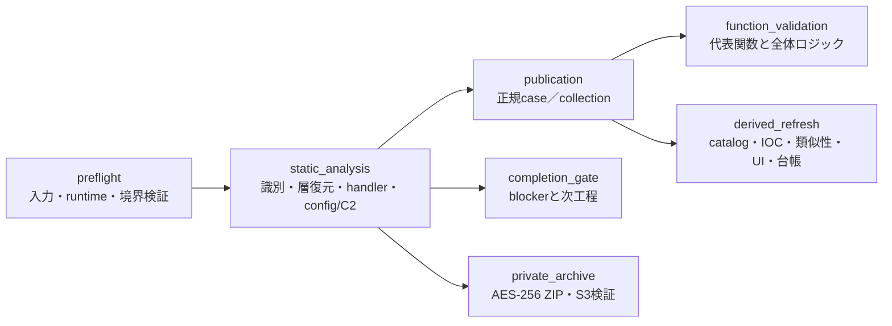

# 解析lifecycleの自動化

`analysis-framework/common/analysis_lifecycle.py`は、検体の初期識別から静的解析、正規case公開、代表関数の完了確認、catalog／UI更新、非公開解析dataのS3保管までを、固定stageで接続するoperator向けrunnerです。既存解析器を置き換えず、各工程の厳格な契約を1つの再開可能なworkflowとして束ねます。

このrunnerが自動化する対象は、証拠を機械的に再検証できる工程です。未復元payload、family帰属、代表関数、設定、C2などに証拠不足がある場合、推測で`complete`へ昇格しません。`partial`、blocker code、次に必要な静的解析種別をJSONへ残して停止します。

## 固定stage



| stage | 自動処理 | 既定 | repository書込み | 外部network |
|---|---|---:|---:|---:|
| `preflight` | request schema、入力境界、runtime、静的tool契約を検証 | 有効 | なし | なし |
| `static_analysis` | 既存の隔離job runnerでone-shot静的解析を実行 | 有効 | なし | なし |
| `publication` | one-shot成果物を既存publisherで正規case／collectionへ反映 | 無効 | あり | なし |
| `function_validation` | 公開collectionの代表関数と全体ロジックを検証 | publicationと連動 | なし | なし |
| `completion_gate` | case blockerを再収集し、次工程を機械可読化 | 有効 | なし | なし |
| `derived_refresh` | catalog、IOC、類似性、checksum、UI、終端payload台帳を公式generatorで更新・再検証 | 無効 | あり | なし |
| `private_archive` | 入力／job成果物を対象別AES-256 ZIPにし、S3側size・SSE・SHA-256を検証 | 無効 | なし | S3のみ |

`publication`、`derived_refresh`、`private_archive`はrequestで明示した場合だけ有効になります。通常解析にlive C2、外部sandbox、VirusTotal、MalwareBazaar downloadなどを混在させません。

## 安全境界

- requestに任意command、任意module、任意Python、環境変数、URL、endpoint、credential、出力pathを指定できません。
- 検体実行、CLR load、macro実行、script実行、live C2、malware registration、taskingは常に無効です。
- 入力root、job root、repositoryは相互に分離し、symlink、junction、reparse point、hardlink、境界外pathをfail-closedで拒否します。
- 静的解析は入力をjob-private snapshotへ固定し、元fileの変更、差替え、件数、size、出力quota、時間、process数、memoryを既存job runnerで制限します。
- public reportは相対path、件数、status、hash、blockerだけを保持します。raw payload、復号key、credential、絶対local pathを出力しません。
- S3保管は`private_archive.enabled=true`のときだけ行います。保管sourceは`inputs`と`job_output`の固定選択肢だけで、任意pathはrequestできません。
- S3 archiveは標準`archive_analysis_datastore.py`を使い、password `infected`のWinZip AES-256、対象別ZIP、AWS CLI／host IAM role、remote size・SSE・SHA-256 metadata検証を必須とします。成功後もsourceは削除しません。

## requestを作る

最小requestは次のとおりです。入力pathは`--input-root`からの相対pathです。

```json
{
  "schema_version": 1,
  "workflow_id": "daily-20260815-sample-001",
  "job": {
    "schema_version": 1,
    "job_id": "daily-20260815-sample-001",
    "inputs": ["target-001/sample.zip"],
    "options": {
      "archive_mode": "auto",
      "minimum_confidence": "medium",
      "assessment_only": false,
      "force_container_probe": false,
      "max_static_layers": 6,
      "retry_max_static_layers": 10
    }
  },
  "publication": {
    "enabled": false,
    "manifest": null,
    "collection_id": null,
    "expected_contract_sha256": null,
    "allow_partial_staging": false
  },
  "maintenance": {
    "refresh_repository": false
  },
  "private_archive": {
    "enabled": false,
    "target": null,
    "include": []
  }
}
```

利用中のrunnerが受理する厳密schemaは機械的に取得できます。

```powershell
py -3.13 -B .\analysis-framework\common\analysis_lifecycle.py schema `
  > C:\analysis-work\lifecycle-request.schema.json
```

## planで副作用前に確認する

`plan`はrepositoryや成果物を書き換えません。固定stage graph、書込みstage、network stage、安全flag、request SHA-256を表示します。`--input-root`と`--work-root`はrepository外へ分離し、`--work-root`は先に作成してください。

```powershell
New-Item -ItemType Directory -Force C:\analysis-work\jobs | Out-Null

py -3.13 -B .\analysis-framework\common\analysis_lifecycle.py plan `
  --request C:\analysis-work\request.json `
  --repository . `
  --input-root C:\analysis-inputs `
  --work-root C:\analysis-work\jobs
```

## 静的解析だけを実行する

```powershell
py -3.13 -B .\analysis-framework\common\analysis_lifecycle.py run `
  --request C:\analysis-work\request.json `
  --repository . `
  --input-root C:\analysis-inputs `
  --work-root C:\analysis-work\jobs `
  --timeout-seconds 3600
```

`run`は同じ`workflow_id`を上書きしません。別解析には新しいIDを使います。終了codeは次の意味です。

| code | 意味 |
|---:|---|
| `0` | requestで有効な全stageが完了 |
| `20` | 静的解析は安全に完了したが、追加解析blockerまたは未実行依存stageが残る |
| `1` | 実行stageが失敗 |
| `2` | request、path、state、fingerprintなどの契約違反 |

成果物はrepository外の次の位置へ作られます。

```text
C:\analysis-work\jobs\
├─ jobs\<job_id>\
│  ├─ request.json
│  ├─ status.json
│  ├─ progress.json
│  ├─ result.json
│  └─ analysis\
└─ lifecycles\<workflow_id>\
   ├─ request.json
   ├─ state.json
   ├─ report.json
   └─ private-archive-report.json  # S3保管を有効化した場合だけ
```

## 公開と派生成果物更新を有効にする

正規caseへ公開する場合は、取得manifestとcollection IDを固定します。`expected_contract_sha256`を指定すると、one-shotで再計算した解析契約が一致しない限り公開しません。nullの場合も、検証済みone-shot summaryから取得した契約をpublisherへpinします。

```json
{
  "enabled": true,
  "manifest": "analysis-results/research/daily-20260815/acquisition-manifest.json",
  "collection_id": "daily-20260815-static",
  "expected_contract_sha256": null,
  "allow_partial_staging": false
}
```

`maintenance.refresh_repository=true`を同時に指定すると、publication成功後に次を公式実装で更新し、直後にcheckします。

- case identity metadataとcatalog
- IOC index
- code／logic similarity
- family checksum manifest
- UI用data、case詳細、portal索引
- 終端payload未取得台帳

`partial` caseを正規公開へ混ぜる操作は既定で拒否します。レビュー済み追加解析stagingとして公開する場合だけ`allow_partial_staging=true`を使います。publisher側のblocker allowlist、case integrity、semantic seal、artifact manifest検証は省略されません。

## 非公開dataをS3へ保管する

```json
{
  "enabled": true,
  "target": "daily-20260815-sample-001",
  "include": ["inputs", "job_output"]
}
```

- `inputs`: 解析時にSHA-256付きで固定したjob-private input snapshot。元input-rootを再読込しない
- `job_output`: 固定job directory。input snapshot、private static artifact、log、公開前成果物を含む

資格情報らしい名前、reparse point、通常file以外、重複member、変更中fileが1件でもあるとarchive全体を拒否します。upload後は`private-archive-report.json`の`status=verified`、archive SHA-256、manifest SHA-256、SSE `AES256`を再検証します。local sourceは自動削除しません。

## 状態確認、再検証、再開

`status`は公開可能なsummaryだけを読みます。

```powershell
py -3.13 -B .\analysis-framework\common\analysis_lifecycle.py status `
  --work-root C:\analysis-work\jobs `
  --workflow-id daily-20260815-sample-001
```

`verify`はstateを書き換えず、保存request、全stage fingerprint、job安全契約、result hash、S3 reportを再検証します。

```powershell
py -3.13 -B .\analysis-framework\common\analysis_lifecycle.py verify `
  --workflow-id daily-20260815-sample-001 `
  --repository . `
  --input-root C:\analysis-inputs `
  --work-root C:\analysis-work\jobs
```

中断や一時的なpublication／generator／S3失敗は`resume`で未完stageだけを再試行できます。成功済みstageは再実行しません。

```powershell
py -3.13 -B .\analysis-framework\common\analysis_lifecycle.py resume `
  --workflow-id daily-20260815-sample-001 `
  --repository . `
  --input-root C:\analysis-inputs `
  --work-root C:\analysis-work\jobs `
  --timeout-seconds 3600
```

再開時はrequest SHA-256と各stage実装fileのSHA-256を再計算します。解析器、publisher、完了validator、generator、archiver、lifecycle runnerのいずれかが変更された場合、古い成功状態を新しい契約へ流用せず`stage_contract_changed`で停止します。その場合は新しい`workflow_id`で再解析してください。

## partialから解析完了へ進める

`completion_gate`はcaseごとのblockerを集約し、次のような`next_actions`を返します。

| next action | 必要な作業 |
|---|---|
| `representative_function_static_review` | Ghidra MCPやmanaged IL解析で代表関数とcall graphを証拠化 |
| `terminal_payload_static_recovery` | 未復元resource、overlay、virtualization、packer、decoderを静的に復元 |
| `configuration_and_c2_static_recovery` | config schema、C2 host／port、protocol framingを静的に確定 |
| `family_attribution_review` | exact hash、構造、config、protocolの複数証拠でfamilyを再評価 |
| `complete_case_or_enable_reviewed_partial_staging` | caseを完了するか、レビュー済みpartial stagingとして明示公開 |
| `review_machine_readable_blocker` | family固有blockerと既存証拠を確認 |

Ghidraによる追加解析は[AI非依存の一括静的解析オーケストレーション](AI-FREE-STATIC-ANALYSIS-ORCHESTRATION.md)の証拠形式へ従います。Ghidra MCPではprogram selectorを明示し、取得したロジックをcaseだけへ手入力して終わらせず、可能な範囲でdetector、unpacker、handler、function analyzer、fixtureへ戻します。更新した解析器で新しいworkflowを実行し、blockerが機械的に解除されることを完了条件とします。

## 自動化しても省略しない確認

1. `report.json`のcase state、complete／resumable boolean、blockerが整合する。
2. artifact manifest、semantic SHA-256、analysis contractが公式validatorで一致する。
3. family選択にはpositive handler evidenceまたはレビュー済みexact証拠がある。
4. config／C2はraw string出現だけでなく、decoder、field、利用箇所まで静的に対応する。
5. 代表関数はinventory、選定理由、callers／callees、API、定数、ロジックが保持される。
6. terminal payload未取得を、delivery componentやcontext-only peer情報で完了扱いにしない。
7. repository派生成果物はwrite後の公式checkに合格する。
8. 非公開dataはS3 remote metadata検証後もsourceを保持する。

このlifecycleは、反復可能な工程を徹底的に自動化しつつ、解析証拠が存在しない部分を自動生成しないための制御層です。
