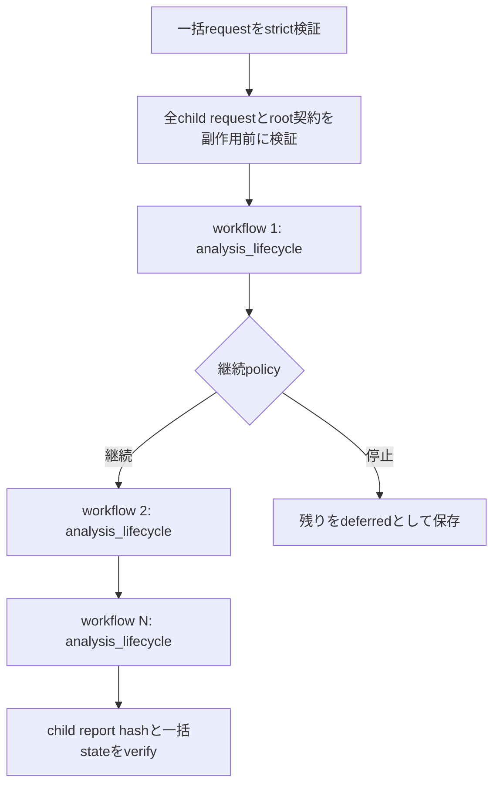

# 解析全体オーケストレータ

`analysis-framework/common/analysis_orchestrator.py`は、複数の[解析lifecycle](ANALYSIS-LIFECYCLE-AUTOMATION.md)を、安全な順序で直列実行するoperator向けcontrol planeです。初期識別、静的解析、正規case公開、代表関数検証、派生成果物更新、非公開dataのS3保管という既存処理は置き換えません。検証済みの単一検体lifecycleを複数束ね、停止方針、状態保存、再開、一括検証を追加します。

この機能は、日次解析や解析待ちqueueのように複数の入力を順番に処理する場合に使用します。1件だけ解析する場合は`analysis_lifecycle.py`を直接使用します。

## 全体構成



同時実行数は常に1です。case tree、collection、catalog、IOC索引、類似性索引、UI生成物を複数processが同時更新しないため、publicationを含むchild workflowを並列実行しません。各child lifecycleと一括orchestrationには別々のOS file lockがあり、同じIDを複数processが同時更新すると`workflow_locked`で停止します。

## 自動化する範囲

| 層 | 実装 | 主な責務 |
|---|---|---|
| 一括control plane | `analysis_orchestrator.py` | 複数requestの順序、継続policy、state、再開、一括verify |
| 単一検体lifecycle | `analysis_lifecycle.py` | preflight、静的解析、公開、関数検証、完了gate、派生更新、S3保管 |
| 隔離job | `analysis_job_runner.py` | 入力snapshot、quota、process containment、one-shot解析、安全契約 |
| 解析engine | `analyze_sample.py`とfamily handler | family／campaign識別、層復元、config／C2、terminal payload、静的ロジック |
| 公開・整合 | publisher／validator／generator | case seal、artifact hash、catalog、IOC、類似性、UI、終端payload台帳 |

自動化しても、証拠不足を推測で埋めません。未復元payload、family帰属、代表関数、設定、C2、protocolが不足する場合は`partial`、blocker、次の最小作業を保持します。Ghidra MCPや専用decoderによる追加静的解析が必要な対象は、機械可読blockerを残したまま解析者へ戻します。

## 一括request

一括requestは次の4 keyだけを受理します。

```json
{
  "schema_version": 1,
  "orchestration_id": "daily-20260815-static",
  "workflows": [
    {
      "schema_version": 1,
      "workflow_id": "daily-20260815-sample-001",
      "job": {
        "schema_version": 1,
        "job_id": "daily-20260815-sample-001",
        "inputs": ["sample-001/target.zip"],
        "options": {}
      },
      "publication": {
        "enabled": false,
        "manifest": null,
        "collection_id": null,
        "expected_contract_sha256": null,
        "allow_partial_staging": false
      },
      "maintenance": {
        "refresh_repository": false
      },
      "private_archive": {
        "enabled": false,
        "target": null,
        "include": []
      }
    }
  ],
  "policy": {
    "continue_after_partial": true,
    "continue_after_failure": false
  }
}
```

完全な2件用templateは[一括解析request例](examples/analysis-orchestration-request.json)にあります。正確なschemaは次のコマンドで出力します。

```powershell
py -3.13 -B .\analysis-framework\common\analysis_orchestrator.py schema `
  > C:\analysis-work\analysis-orchestration.schema.json
```

### 固定制約

- `workflows`は1件以上256件以下です。
- `orchestration_id`、全`workflow_id`、全`job_id`は一括request内で一意にします。
- child要素は`analysis_lifecycle.py`の厳格requestそのものです。任意command、module、Python、環境変数、URL、credential、出力pathは追加できません。
- `maintenance.refresh_repository=true`は最大1件だけ許可し、必ず最後のworkflowへ置きます。これにより、全publication後に公式generatorを1回実行できます。
- repository、input root、work rootは相互に分離します。
- request、保存state、lock、入力、公開manifestにsymlink、junction、reparse pointを使用できません。

## 継続policy

| field | `true` | `false` |
|---|---|---|
| `continue_after_partial` | blockerを保持して次のworkflowへ進む | 残りを`deferred`にして停止する |
| `continue_after_failure` | failureを保持して次のworkflowへ進む | 残りを`deferred`にして停止する |

日次triageでは通常、`continue_after_partial=true`、`continue_after_failure=true`を使うと、1件の難読化検体やhandler failureでqueue全体が止まりません。正規公開やgenerator更新を伴う厳格batchでは、`continue_after_failure=false`を推奨します。

`deferred`は解析済みや安全確認済みを意味しません。先行workflowのpolicy stopにより未開始であることを示します。`resume`で先行workflowが`complete`になれば、後続を順に開始します。

## 実行前のplan

`plan`はrepository、job、stateを書き換えません。childごとの固定stage、repository書込み、S3 network、実行順、安全flagを表示します。

```powershell
py -3.13 -B .\analysis-framework\common\analysis_orchestrator.py plan `
  --request C:\analysis-work\daily-request.json `
  --repository . `
  --input-root C:\analysis-inputs `
  --work-root C:\analysis-work\jobs `
  --timeout-seconds 3600
```

確認する項目は次のとおりです。

1. `execution.mode`が`sequential`である。
2. `maximum_parallel_workflows`が`1`である。
3. `runs_after`がrequest順と一致する。
4. S3保管を使わない場合、`datastore_network_enabled=false`である。
5. 全childの`sample_execution`、`live_c2`、通常解析networkが無効である。
6. repository refreshを行うworkflowが最後である。

## 新規実行

```powershell
py -3.13 -B .\analysis-framework\common\analysis_orchestrator.py run `
  --request C:\analysis-work\daily-request.json `
  --repository . `
  --input-root C:\analysis-inputs `
  --work-root C:\analysis-work\jobs `
  --timeout-seconds 3600
```

終了codeは単一lifecycleと同じです。

| code | 意味 |
|---:|---|
| `0` | 全workflowが`complete` |
| `20` | `partial`または`deferred`が残る |
| `1` | 1件以上のworkflowが`failed` |
| `2` | request、path、state、fingerprint、lockなどの契約違反 |

同じ`orchestration_id`やchild `workflow_id`を新規`run`で再利用しません。既存状態を続ける場合は`resume`、解析器の実装が変わった場合は新しいIDで再解析します。

## 状態と成果物

```text
C:\analysis-work\jobs\
├─ jobs\<job_id>\
├─ lifecycles\<workflow_id>\
│  ├─ request.json
│  ├─ state.json
│  ├─ report.json
│  └─ execution.lock
└─ orchestrations\<orchestration_id>\
   ├─ request.json
   ├─ state.json
   ├─ report.json
   └─ execution.lock
```

一括`report.json`には、childごとのstatus、attempt回数、blocker、stage status、child report SHA-256だけを保存します。絶対local path、raw payload、復号key、credential、private S3 sourceは公開reportへ含めません。

## 状態確認、検証、再開

状態表示は保存stateと一致する公開reportだけを返します。

```powershell
py -3.13 -B .\analysis-framework\common\analysis_orchestrator.py status `
  --work-root C:\analysis-work\jobs `
  --orchestration-id daily-20260815-static
```

read-only一括検証は、全child lifecycleのrequest／fingerprint／成果物、child report hash、一括state／reportを再検証します。

```powershell
py -3.13 -B .\analysis-framework\common\analysis_orchestrator.py verify `
  --orchestration-id daily-20260815-static `
  --repository . `
  --input-root C:\analysis-inputs `
  --work-root C:\analysis-work\jobs
```

中断または一時的な失敗を続ける場合は`resume`を使います。

```powershell
py -3.13 -B .\analysis-framework\common\analysis_orchestrator.py resume `
  --orchestration-id daily-20260815-static `
  --repository . `
  --input-root C:\analysis-inputs `
  --work-root C:\analysis-work\jobs `
  --timeout-seconds 3600
```

再開時の規則は次のとおりです。

- `complete` childは再実行せず、read-only `verify`とreport SHA-256照合を行います。
- `partial`、`failed`、中断中のchildだけを既存lifecycleの`resume`へ渡します。
- `deferred` childは先行policy stopが解消した後に初回`run`します。
- 成功済みchildのreport、静的解析summary、解析tree全file、入力snapshot、解析契約bundleが変化していれば停止します。
- 保存後にorchestrator、解析器、publisher、validator、generator、archiverが変わった場合、古い成功状態を新しい実装へ流用しません。
- 1 workflowの最大試行回数は5回です。超過後は`maximum_workflow_attempts_exceeded`になります。

## コードレビューで強化した境界

今回のレビューでは、既存の単一lifecycleに次のhardeningを加えました。

1. 成功済み静的解析の`result.json`と`summary.json`だけでなく、解析tree全fileのpath、size、SHA-256をsealする。
2. 入力snapshot manifestと各snapshot fileのsize、SHA-256、entry集合を再検証する。
3. 解析契約bundleと任意のfamily hint／trusted tool manifestのpinを再検証する。
4. finalized stateと公開reportの差替えを`lifecycle_report_state_mismatch`で拒否する。
5. stateのkey、型、status、依存関係、attempt、時刻、blocker、成果物hash、全体とchildの状態遷移、安全flagを厳格検証する。
6. 同じworkflowを複数processが同時更新する操作をOS lockで拒否する。
7. S3 archive直前にも静的成果物と入力snapshotを再検証し、保存targetの一致を必須にする。

これにより、partial workflowの再開前にjob成果物が差し替わり、そのままpublicationやS3保管へ渡る経路をfail-closedにしました。

## 追加解析へ戻す条件

一括実行の目的は、全件を形式的に`complete`へすることではありません。次の場合は自動昇格せず、対象childのblockerと`next_actions`を使って追加解析します。

- terminal payloadまたは後段loaderが未復元
- virtualized／packed method bodyが静的に確定していない
- family、campaign、build variantが複数候補のまま
- config fieldのdecoderと利用箇所が結び付いていない
- C2 host／portだけでprotocol framingが未確認
- 代表関数、caller／callee、定数、API、全体ロジックが未記録
- context-only OSINTや別検体のIOCしかない

Ghidraを使う場合はMCPでprogram selectorを明示し、任意scriptは無効のままにします。復元したロジックはcase文書だけで終わらせず、可能な範囲でdetector、unpacker、handler、decoder、fixtureへ戻し、新しいworkflowで再現します。

## 完了前チェック

```powershell
py -3.13 -B -m pytest -q -p no:cacheprovider `
  .\analysis-framework\tests\test_analysis_lifecycle.py `
  .\analysis-framework\tests\test_analysis_orchestrator.py

py -3.13 -B -m ruff check `
  .\analysis-framework\common\analysis_lifecycle.py `
  .\analysis-framework\common\analysis_orchestrator.py `
  .\analysis-framework\tests\test_analysis_lifecycle.py `
  .\analysis-framework\tests\test_analysis_orchestrator.py
```

caseやcatalogを更新した場合は、各caseのartifact／semantic integrity、`refresh_case_inventory.py --check`、UI／portal、終端payload台帳の公式checkも省略しません。
