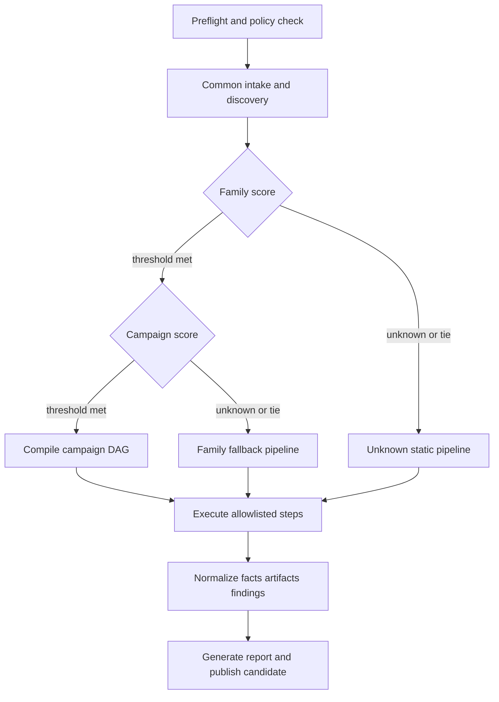

# 宣言型マルウェア解析基盤 設計

状態: 提案中
Target API: `asa/v1alpha1`
Scope: `analysis-framework/` の次期構成

## 1. 目的

現行基盤では、分類情報の一部は `registry/malware_types.json` と各ファミリーの
`campaigns.json` に宣言されている一方、実際の処理順序は
`Invoke-Analysis.ps1`、`Invoke-FamilyBatch.ps1`、各ファミリー配下の Python CLI に
分散している。本設計では次を実現する。

1. ファミリー識別、キャンペーン識別、必要ツール、解析順序、分岐、成果物を YAML で確認できる。
2. ZIP、PE、.NET、スクリプト、文字列、IOC、レポートなどの共通処理を再利用する。
3. Python 実装を一つのパッケージ配下へ集約し、ファミリー用ディレクトリには原則 YAML と説明だけを置く。
4. 未知パターンを既知 handler に強制せず、安全な汎用解析で停止する。
5. 検体実行、外部通信、機密情報出力を既定で禁止し、権限を実行計画の段階で検証する。
6. すべての finding に入力、解析ステップ、ツール版、根拠、確度を付け、再現可能にする。

YAML はバイナリ解析そのものを実装しない。YAML は「どの観測事実を使って何を選び、
どの許可済みステップをどの条件で実行するか」を定義する。PE、.NET、復号、逆アセンブルなどの
ロジックは、型付きの Python step plugin または制約された tool adapter に残す。

## 2. 現行コードの課題

### 2.1 実行制御の分散

- `Invoke-Analysis.ps1` は ValleyRAT の一部 campaign だけを `switch` で処理する。
- `Invoke-FamilyBatch.ps1` は AgentTesla/RemcosRAT 専用で、ファイル種別と campaign 名を直接判定する。
- VenomRAT と MX-Go は独立 CLI で、共通エントリーポイントから実行されない。
- `campaigns.json` の `recommended_stages` は説明用であり、実行エンジンへ接続されていない。

### 2.2 重複と仕様のずれ

- entropy、ASCII/UTF-16 文字列、IOC、PE section/import/resource の抽出が複数ファイルに重複する。
- ZIP の展開、パス検証、SHA-256、JSON 出力は `malware_io.py` に集約され始めているが、
  一部の個別解析器は独自実装を持つ。
- no-redirect HTTP、サイズ制限、ネットワーク許可の実装が複数存在する。
- 既知 SHA-256 と campaign の対応が registry、`detect.py`、`known-cases.json` に重複する。
- detector の関数契約と出力形式が完全には統一されていない。
- 出力 JSON の `schema_version`、安全フラグ、エラー表現、provenance が揃っていない。

### 2.3 外部ツールの不可視性

- FLOSS と Ghidra はドキュメント/profileには現れるが、共通 runner が前提条件や版を管理しない。
- JARM のパスや Python のパスがコードの既定値に含まれる。
- 必須ツール欠如と任意ツール欠如の扱い、timeout、出力契約が統一されていない。

### 2.4 安全制御の実装依存

- 「ネットワークなし」「検体実行なし」は主に各スクリプトの実装と運用規約で守られている。
- YAML 化だけを行うと、任意コマンドを定義できる危険な workflow engine になり得る。
- case profile に C2 や復号情報があり、解析定義・case 固有値・機密値の境界が曖昧である。

## 3. 設計原則

1. **facts first**: family 名ではなく、汎用 discovery が生成した構造的 facts から分類する。
2. **two-stage routing**: family を選んだ後、別の規則で campaign/build variant を選ぶ。
3. **DAG execution**: 単純な手順列ではなく、入出力依存から実行順を確定する。
4. **allowlisted plugins**: YAML は登録済み step ID だけを参照し、Python path や shell command を持たない。
5. **capability gating**: filesystem、外部ツール、network、sensitive output を実行前に policy と照合する。
6. **immutable artifacts**: 中間 artifact は content hash で識別し、同名上書きを避ける。
7. **typed outputs**: step の入出力は JSON Schema/Pydantic model で検証する。
8. **explicit confidence**: `confirmed`、`inferred`、`unverified` と根拠を finding 単位で保持する。
9. **safe unknown path**: 未知 family/campaign は汎用静的解析後に `needs_review` で停止する。
10. **compatibility before removal**: 既存 CLI は移行期間中、次期 engine を呼ぶ薄い wrapper として残す。

## 4. 目標ディレクトリ構成

```text
analysis-framework/
  pyproject.toml
  src/asa/
    cli.py                         # analyze / plan / validate / tools / report
    engine/
      compiler.py                  # YAML + facts -> 実行 DAG
      runner.py                    # DAG 実行、再開、状態管理
      context.py                   # run context と artifact reference
      conditions.py                # 制限された条件 DSL
      policy.py                    # capability/approval 判定
      provenance.py                # finding と artifact の由来
      cache.py                     # input/step/version による cache key
      errors.py
    models/
      definition.py
      plan.py
      artifact.py
      finding.py
      run.py
    catalog/
      steps.py                     # step ID -> Python callable
      tools.py                     # tool ID -> adapter
    steps/                         # 全解析実装をここに集約
      intake/                      # hash、AES-ZIP、safe path、artifact graph
      containers/                  # ZIP/RAR/ISO/MSI/OLE/CAB
      static/                      # strings、IOC、PE、.NET、Go、resource
      scripts/                     # JS/VBS/HTA/PowerShell layers
      deobfuscation/               # base64、xor、AES、marker 等
      family_specific/             # 再利用不能な狭い decoder
        valleyrat_vvas.py
        valleyrat_n520.py
        agenttesla_config.py
      enrichment/                  # sandbox evidence、VT、passive metadata
      network/                     # 明示承認を要する bounded probe
      reporting/                   # normalize、report、Sigma/YARA material
    adapters/
      floss.py
      ghidra_mcp.py
      jarm.py
      yara.py
      sigma.py
  definitions/
    policies/
      offline-default.yaml
      approved-live-check.yaml
    tools/
      floss.yaml
      ghidra-mcp.yaml
      jarm.yaml
      yara.yaml
    workflows/
      discovery.yaml
      unknown-static.yaml
      publishable-report.yaml
    malware/
      valleyrat.yaml
      agenttesla.yaml
      remcosrat.yaml
      venomrat.yaml
      unclassified/
        mx-go.yaml
    cases/                         # reviewed case override。secret は置かない
      <sha256>.yaml
  schemas/
    malware-definition.schema.json
    tool-definition.schema.json
    policy.schema.json
    run.schema.json
    finding.schema.json
  docs/
  tests/
    unit/
    schema/
    plans/
    integration/
    safety/
```

`analysis-framework/malware/<family>/` にある Python 実装は最終的に `src/asa/steps/` へ移す。
ファミリー固有であってもコードの場所は一元化し、family/campaign との対応は YAML で表す。

## 5. 処理モデル


### フェーズ0: 事前確認

1. YAML と schema version を検証する。
2. step ID、artifact reference、依存関係、循環参照を検証する。
3. 必須/任意ツールの存在と版を調べる。
4. workflow が要求する capability と runtime policy を比較する。
5. 実行予定を `plan.json` として出力する。この時点では検体へ外部ツールを適用しない。

### フェーズ1: 受け入れと探索

常に共通の `discovery.yaml` を実行する。SHA-256、container graph、member hash、magic、
ファイル種別、PE/.NET/Go/script の基礎 facts を生成する。復号済み bytes は既定でメモリまたは
quarantine artifact store に置き、公開結果フォルダへは出さない。

### フェーズ2: ファミリー選択

全 family definition の `classification.family.rules` を同じ facts に適用し、score と理由を得る。
既知 hash は高い evidence になり得るが、構造 evidence と別に記録する。同点または閾値未満は
`unknown` とし、analyst override があっても campaign を自動確定しない。

### フェーズ3: キャンペーン選択

選択 family の campaign rules のみを評価する。container/loader/payload/config/infrastructure を
別 facts namespace に保持し、delivery が同じだけで final payload/C2 を継承しない。
campaign が決まらない場合は family の `fallback_pipeline` を使用する。

### フェーズ4: 計画のコンパイル

base workflow、family defaults、campaign pipeline、reviewed case override を次の優先順位で merge する。

```text
policy ceiling
  > engine invariants
  > base workflow
  > family definition
  > campaign definition
  > reviewed case override
  > runtime options
```

下位層は上位の安全制約を緩和できない。たとえば case override は `network: denied` を
`allowed` に変更できず、runtime の承認と専用 policy が必要である。

### フェーズ5: DAG実行

runner は `needs` と artifact reference をもとに topological order を作る。独立した read-only step は
並列実行できるが、同じ artifact の materialization、Ghidra project 操作、rate-limited API は
resource lock を使う。各 step の状態は以下に限定する。

- `succeeded`: 出力契約を満たした。
- `skipped`: `when` が false、または不要だった。
- `partial`: 任意出力の一部だけ得られた。
- `blocked`: capability、approval、必須ツール、reviewed value が不足した。
- `failed`: 入力契約または処理が失敗した。

### フェーズ6: 正規化とレポート生成

step 固有 JSON を直接レポートへ連結しない。normalizer が artifact graph と findings を共通 model へ
変換し、reporter が README、IOC JSON、Sigma/YARA material、manifest、history candidate を生成する。
公開先へのコピーは別の `publish` 操作とし、禁止拡張子、magic、サイズ、secret scan を再確認する。

## 6. データモデル

### 6.1 観測事実（Fact）

Fact は分類と分岐に使う機械可読な観測事実である。

```yaml
path: artifacts.submission.members[0].pe.is_dotnet
value: true
source_step: static.pe.inspect
source_artifact: sha256:...
confidence: confirmed
```

Fact は step が生成し、definition は読み取るだけである。definition が観測事実を捏造しない。

### 6.2 成果物（Artifact）

Artifact は入力、中間物、または公開可能出力である。

```yaml
artifact_id: artifact:payload-1
sha256: ...
media_type: application/vnd.microsoft.portable-executable
storage_class: quarantine
created_by: deobfuscation.agenttesla.recover
parents: [artifact:script-1]
publishable: false
```

`storage_class` は `memory`、`quarantine`、`evidence`、`publishable`。実行可能 bytes、復号 payload、
Ghidra project は `publishable: false` を engine invariant とする。

### 6.3 所見（Finding）

```yaml
finding_id: finding:c2-1
kind: network.endpoint
value: example.invalid:443
role: candidate_c2
confidence: inferred
evidence:
  - artifact:config-1
  - fact:config.endpoint
source_steps:
  - family.valleyrat.n520_config
limitations:
  - no process-attributed communication was observed
```

finding は配布 URL、正規通信、decoy 通信、候補 C2、confirmed C2 を `role` で分離する。

### 6.4 実行記録（Run）

`run.json` は definition digest、engine version、runtime policy、tool versions、全 step 状態、
network contact、sample execution、開始/終了時刻を記録する。再実行時は definition digest と
step implementation version が一致する出力だけを cache から再利用する。

## 7. Step plugin 契約

すべての Python step は同じ interface を実装する。

```python
class Step(Protocol):
    spec: StepSpec

    def run(self, context: StepContext, inputs: InputModel) -> StepResult:
        ...
```

`StepSpec` は次を持つ。

- 安定した ID と implementation version
- input/output model
- capability
- default timeout と resource lock
- deterministic/cacheable の可否
- sensitive fields と redaction 方針
- sample bytes を materialize するか

YAML の `uses` は catalog の ID と version range を参照する。例:

```yaml
uses: static.pe.inspect@^1
```

禁止事項:

- YAML 内の Python module path、PowerShell、shell command
- `eval` 可能な式
- 任意の出力 path
- definition からの tool executable path 上書き
- secret の literal 埋め込み

## 8. ツールアダプター

外部ツールは step から直接 `subprocess` せず adapter を経由する。

### FLOSS連携

- tool definition が探索方法、許容版、固定引数、timeout を定める。
- 入力は quarantine artifact だけ。出力は text/JSON と tool metadata。
- timeout や非対応形式は `partial` とし、workflow 全体を必ずしも失敗させない。

### Ghidra MCP連携

- localhost endpoint のみを許可する。
- program-scoped call は artifact hash から作った明示 selector を必須とする。
- arbitrary script capability は既定で存在させない。
- import/analyze、symbols、references、decompile、exported text を別 operation として catalog 化する。
- Ghidra project 自体は quarantine であり、公開物には含めない。

### ネットワーク対応ツール

- VirusTotal などの API enrichment と live C2 probe を別 capability にする。
- `network.passive_api` と `network.active_target` を区別する。
- host、port、method、最大送受信量、redirect、timeout を compiled plan に固定する。
- live target は reviewed case data と明示 runtime approval の両方を要求する。

## 9. Policy と安全境界

既定 `offline-default.yaml` は以下を許可しない。

- sample execution
- debugger execution
- `rundll32`、`regsvr32`、PowerShell reflection 等による payload 起動
- external network
- arbitrary Ghidra scripts
- sensitive credential の publishable output

capability の例:

```text
filesystem.sample.read
filesystem.quarantine.write
external.floss
external.ghidra_mcp
network.passive_api
network.active_target
sensitive.config.extract
sensitive.config.publish
sample.execute
```

`sample.execute` は本基盤の標準 policy では常に deny とする。将来 sandbox connector を追加する場合も、
ローカル runner ではなく、明確に分離された remote submission adapter として実装する。

## 10. 分類規則

条件式は YAML の構造 DSL とし、文字列式を評価しない。

```yaml
all:
  - fact: artifacts.submission.member_names
    contains_all: [chgport.exe, LoggerCollector.dll, vvaS.bin]
  - fact: artifacts.submission.member_count
    gte: 3
```

対応 operator は `exists`、`equals`、`in`、`in_ref`、`contains`、`contains_any`、
`contains_all`、`matches`、`gt/gte/lt/lte`、`all/any/not` に限定する。
regex は長さと実行時間を制限する。

score rule は family/campaign ごとに positive/negative evidence を加算する。既知 hash、構造、
namespace、config marker を別 reason として返す。閾値、同点処理、hard exclusion を definition に明記する。

## 11. ケース固有情報

case YAML は解析コードの代わりではなく、reviewed value と期待値だけを保持する。

- expected outer/inner SHA-256
- artifact selector
- XOR key や marker など静的解析で検証済みの値
- expected plaintext SHA-256
- process-attributed external evidence の参照
- reviewed live target（実行許可ではない）

資格情報、API key、GitHub token は保存しない。secret が必要な step は `secret_ref: env:VT_API_KEY`
のような参照だけを受け、run output には存在有無のみを記録する。

## 12. 生成ドキュメント

定義と catalog から次を自動生成する。

- family/campaign 一覧と識別根拠
- campaign ごとの DAG 図と実行順
- step 入出力、必要ツール、capability、失敗時確認点
- 成果物一覧と publish 可否
- CLI 実行例
- schema version と変更履歴

手書きドキュメントは「なぜ」「解析上の注意」「証拠評価」を担当し、機械的な stage 一覧を重複記載しない。

## 13. 主要設計判断

| 設計判断 | 採用 | 理由 |
|---|---|---|
| 定義形式 | YAML + JSON Schema | 人が読みやすく、CI で厳格に検証できる |
| 実行モデル | DAG | 条件分岐、再利用、並列化、再開に適する |
| 実装配置 | 単一 Python package の step catalog | family 配下の重複 CLI を減らす |
| 条件式 | 構造 DSL | `eval` と任意コード実行を避ける |
| 外部ツール | allowlisted adapter | 版、timeout、安全制約、出力を統一する |
| case 情報 | definition と分離 | campaign 共通ロジックと検体固有値を混同しない |
| 出力 | artifact/fact/finding/run の共通 model | provenance と report 生成を統一する |
| 移行 | strangler pattern | 現行回帰を維持しながら段階的に置換できる |

## 14. 非目標

- YAML だけで新しい暗号や packer を解析できるようにすること。
- 未確認の family label から payload、config、C2 protocol を推定すること。
- ローカルで検体を動的実行すること。
- 解析結果を無条件に `analysis-results/` へ公開すること。
- すべての外部ツールを必須化すること。
