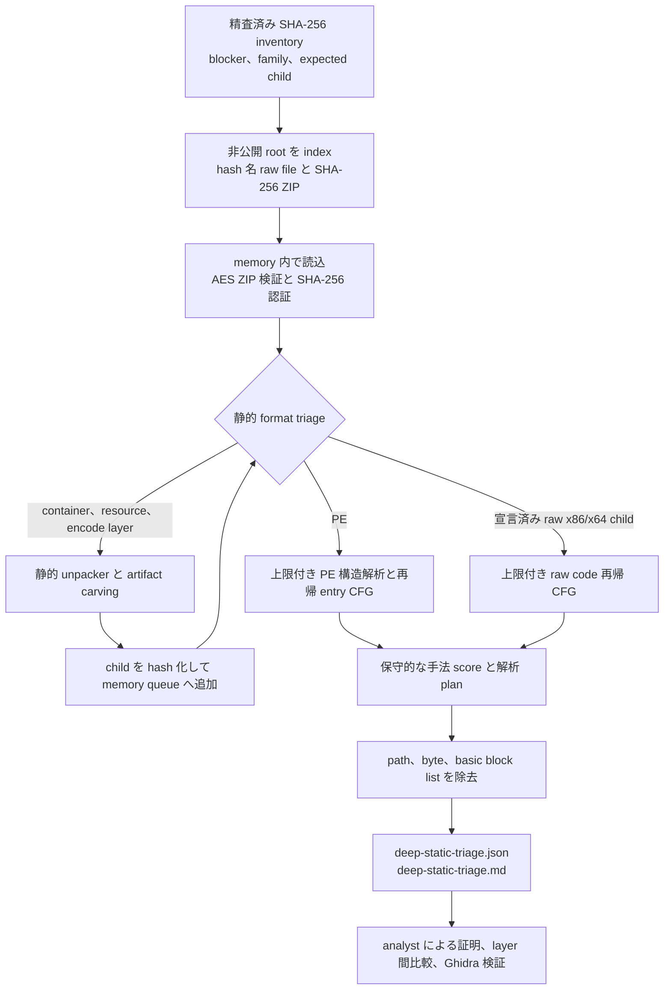

# 難解検体の深層静的解析

## 目的と根拠基準

このワークフローは、通常の string、PE metadata、1 pass の decompile では terminal payload または config を復元できなかった検体を再調査します。精査済み inventory は `analysis-framework/inventories/static-hard-cases.yaml` です。現在は対象内の 80 case と、必要な terminal byte が提出検体に存在しなかった 5 case を分けて記録しています。byte がないことは取得または感染 chain の境界であり、deobfuscator で無から再構築することはできません。

このワークフローが生成するのは解析優先度を決める根拠であり、protector を自動帰属するものではありません。特に、この corpus では古典的な control flow flattening（CFF）は**証明されていません**。indegree の高い hub、strongly connected component、密な entry graph は dispatcher 復元を優先する根拠にはなりますが、それだけで検体が flatten されているとは判断できません。CFF finding には、dispatcher state の復元と、変換後 block から元の successor への再現可能な mapping が必要です。この基準は、[Tigress](https://tigress.wtf/flatten.html) が説明する dispatcher 中心の変換、および [Debray らの研究](https://www.cs.arizona.edu/~debray/Publications/unflatten.pdf)が扱う復元問題と整合します。

同様に `not_observed` は、**上限付きで再帰 decode した entry point CFG では観測されなかった**ことだけを意味します。image の別領域、復元 child、未訪問 callback、動的に供給される code にその手法がないという意味ではありません。`suspected` は調査経路を選ぶ hint であり、この文書に示す証明なしに確定 finding へ昇格させてはいけません。

## 2026-07-17 の検証済み実行

完了した inventory 実行では 80/80 case を認証・解析し、root/child layer は合計 155 でした。partial、入力欠落、入力 error、budget 制限に達した case、expected child が不足した case はありませんでした。認識済み protector/obfuscator marker を持つ case は 16 でした。

| 結果 | 計測値 |
|---|---:|
| 解析した inventory case | 80 / 80 |
| 解析した layer | 155 |
| marker を持つ case | 16 |
| budget 制限に達した case | 0 |
| expected child が不足した case | 0 |

従来の 32 MiB 超 size gate により除外されていた 6 case はすべて構造解析を完了しました。3 つの QuasarRAT root から RAR overlay/resource、2 つの RedLine Stealer root から同一の PE resource child、1 つの HijackLoader root から拡張 gap を除去した PE を得ました。これにより解析 skip は解消しましたが、必ずしも terminal payload/config の復元が完了したわけではありません。

古典的な native CFF は引き続き未確認です。以前、低信頼 CFF の調査 threshold を超えた唯一の重複なし native child は `6f7a3520fb5a30d1c747e7d232b219c1c97a2270429da7aa1f572ac2c60b28be` でした。この child は 2 つの RedLine root に共通します。追加検証では reachable block 26、最大 indegree 5、SCC size 6、候補 node の outdegree 1 であり、多方向 dispatcher ではなく loop/join 形状と判定しました。dispatcher state と元 successor の mapping は成立せず、CFF 候補から除外しました。

managed triage は 23 layer を評価しました。Vidar の KoiVM case 10 件はすべて KoiVM の調査 hint を生成しました。別に 5 managed layer が high-fanout switch により managed CFF hint を生成しました。対象は njRAT root `da590d16...faa51`、njRAT child `7a09d4c7...6e28`、Snake Keylogger child `dd4ddcb9...a280` と `09f0d477...d50d`、VenomRAT child `7a66395f...ff05` です。これらは review 候補であり、flattening の証明ではありません。以前の RedLine hint は改訂済みの corroboration rule を満たしません。

managed `resource_obfuscation` の評価は、`suspected` が 11 layer、`inconclusive` が 4 layer、`not_observed` が 8 layer です。独立した protector marker を伴わない高 entropy resource が 1 つだけの case は `inconclusive` とし、positive finding に昇格しません。native false-positive control は 13 個の CLR entry thunk を `not_evaluable` に振り分けます。native CFF は 5 件を `confounded`、indirect flow は 4 件を `confounded` と評価しました。

StealC root `52b078c339720a09902be86de5e6875f2f31a8c24091453f96858b294f923924` の 15 indirect transfer は、Ghidra MCP による追加検証で 2 つの GetModuleHandleA/GetProcAddress resolver return と 13 個の通常の IAT thunk に分解できました。obfuscation dispatcher ではないため、indirect obfuscation 候補から除外しました。

RemcosRAT root `78b21599a83dbfad39c17202d37dd2b6d552c9679755bc199a9826f3dd0e40db` は、7-Zip 26.x 向けの scriptless NSIS fallback により、想定中間 layer `e9ed0be544b08189ceca2ec8e6ae8f74d62335ed006f0b207fb211df6bbdcb3a` を再現可能に復元して解析しました。fallback は default layout、境界、XOR 復号、PE 構造が 1 つの候補だけを相互に裏付ける場合に限って採用し、曖昧な候補は fail closed とします。

## 必ず守る安全境界

この経路は静的解析専用です。

- 提出 binary または復元 binary を起動、load、install、register、invoke しません。
- CPU instruction を emulate しません。Ghidra p-code は静的 IR/SSA view としてだけ使用し、p-code emulator はこのワークフローの対象外です。
- 検体から抽出した URL、domain、IP address、port、C2 service、payload host、第三者 scanning service へ接続しません。
- 復元した raw binary を repository に永続化しません。child byte は batch 実行中の memory にだけ存在し、永続化する成果物は sanitize 済み JSON と Markdown です。
- 解析の直前と直後に host safety check を実行します。出力先は stdout だけとし、repository へ redirect または commit しません。
- archive name、marker string、family label、既存 report は hint として扱います。解析前に検体 byte を SHA-256 で認証します。

batch report には `executed: false`、`emulated: false`、`network_contacted: false`、`raw_artifacts_written: false` を反復して記録します。これらは意図した code path を文書化する field であり、host safety check の代わりにはなりません。

## 実装済みワークフロー



`unpackers/static_control_flow.py` は、file に裏付けられた実行可能 PE range だけを map し、native entry point から上限付き recursive descent を行います。block、既知 edge、未解決 successor、SCC、dispatcher 候補、indirect transfer、overlap decode、anti-analysis に関係する instruction、通常でない stack pointer write を記録します。opaque predicate の自動証明は意図的に狭く、同一 register に対する隣接した `xor`、`sub`、`cmp` の直後にある `jz`/`jnz` だけを扱います。この証明が適用できない場合は、両 edge を保持します。

`analysis-framework/common/deep_static_triage.py` は inventory を展開し、非公開 sample root を index 化し、暗号化された単一 member archive を検証して、carve した child を同じ静的 pipeline へ再帰的に渡します。budget は入力 size、graph depth、node 数、block 数、instruction 数、block 当たりの byte 数を制限します。`--max-total-layer-bytes` は root を含め、解析 queue に受け入れた重複なし layer payload byte の合計です。process の peak memory 上限ではなく、parser/unpacker 内の一時 allocation も含まないため、peak memory がこの値を超える場合があります。raw code layer を disassemble するのは、SHA-256 と bitness の対応を inventory で明示した場合だけです。

## 手法選択 matrix

| 観測した障害 | 経路選択に使う根拠 | 最初の静的方法 | 任意の専門手法 | 復元を主張する前に必要な証明 | 重要な制約 |
|---|---|---|---|---|---|
| 古典的 CFF の疑い | reachable hub、高 indegree、SCC loop、CFG density | dispatcher 候補を順位付けし、state assignment を backward slice | 静的 SSA、abstract interpretation、狭く制限した SMT。[Stadeo](https://github.com/eset/stadeo) と比較、または [Miasm](https://github.com/cea-sec/miasm) 上に実装 | state 値から各書換 block の successor を再現でき、変換前後の CFG 差分を示せる | packer/VM dispatcher stub でも同じ graph 形状になり得る |
| Opaque predicate | 定数 flag producer または不審な conditional edge | flag/data を backward slice し、すべての reaching definition で predicate を証明 | Ghidra High p-code SSA または offline symbolic expression | すべての reachable input で branch 結果が不変。それ以外は両 edge を保持 | 現行自動化が証明するのは隣接した同一 register pattern だけ |
| Indirect jump/call 難読化 | indirect transfer 数、未解決 successor、table 状参照 | target expression を slice し、base/index/bound を復元して table entry を検証 | angr CFG/decompiler 解析または Miasm IR | 追加する各 edge が table entry または解決済み target expression に裏付けられる | 通常の import thunk と packer stub の indirect call が交絡要因 |
| Overlap code または anti-disassembly | instruction 内を指す target、decode ownership の競合、trap、decode failure | branch context ごとに recursive decode し、競合 stream を分離 | 正確な address を使う Ghidra instruction context review | 採用 stream に predecessor と整合する successor があり、data を code と誤認していない | linear sweep は不適切で、overlap は malformed/unreachable data の場合もある |
| 独自 VM または protector dispatch | 高 entropy entry、少ない import、handler 風 indirect loop、stack state 変更 | fetch/decode/dispatch を特定し、handler semantics を静的に cluster 化 | layout/version 検証後に限り version 固有 devirtualizer | bytecode format、handler table、handler effect を再現できる | marker または VM 風 stub だけでは protector の識別や元 logic の復元にならない |
| Managed IL/resource 難読化 | CLR metadata、manifest resource、難読化 IL、managed protector marker | metadata/resource を parse し、IL CFG を構築して decoder call chain に定数伝播 | [dnlib](https://github.com/0xd4d/dnlib)、レビュー済み [de4dot](https://github.com/de4dot/de4dot) handler、protector 固有 tool | 復元 resource/constant を metadata token と IL call chain に結び付けられる | native CLR entry thunk は managed program CFG ではなく、malformed/decoy metadata で parser が失敗し得る |
| Packer/container または大容量 root | packer marker、通常でない section、overlay/resource carrier、従来の size gate | image 全体を copy せず構造を parse し、child を carve/hash 化して別々に解析 | 検証済みの version 固有 unpack 手順 | child に整合する format/section/import と新しい認証済み SHA-256 がある | loader stub CFG は payload ではなく packer を表す場合がある |
| 暗号化 buffer または string 生成 | 高 entropy resource/buffer と decoder 参照 | key/IV/counter を復元し、data 変換だけを再実装 | 使用箇所から backward slice し、取得 ciphertext byte で known-answer test | decoder 出力が決定的で、複数 call site で cross-check できる | algorithm 名や entropy の推測だけでは復号根拠にならない |

難しい indirect flow では、program 全体を symbolic explore するより、使用箇所から backward slice する方が有効です。Mandiant は [LummaC2 の indirect control flow 解析](https://cloud.google.com/blog/topics/threat-intelligence/lummac2-obfuscation-through-indirect-control-flow/)でこの方法を説明しています。[angr CFG](https://docs.angr.io/en/v9.2.81/analyses/cfg.html) と [decompiler](https://docs.angr.io/en/v9.2.60/analyses/decompiler.html) は offline analyst 手法として利用できますが、現行 batch が自動実行するものではありません。Miasm と Stadeo も同様に、焦点を絞った復元を支援するもので、万能な one-click pass ではありません。

## Protector と runtime 固有の制約

### UPX と MPRESS

marker string と section name は経路選択 hint としてだけ扱います。version 固有手順を使う前に PE layout と packer stub を確認します。UPX/MPRESS entry stub は loop、hub、高 entropy、indirect transfer を持ち、CFF/VM heuristic を過大評価させる場合があります。認証済み child で CFG 評価をやり直し、root stub の finding を child へ引き継ぎません。静的復元の成功には、単に marker が消えたことではなく、整合する PE と新しい SHA-256 が必要です。

### Themida と WinLicense

[themida-unmutate](https://github.com/ergrelet/themida-unmutate) は、検証済み 3.x layout の静的 mutation 難読化解除と trampoline 修復に有用な一次資料です。汎用 Themida/WinLicense VM devirtualizer ではなく、文書化された対応 version を各検体で検証する必要があります。以前の 2.x layout、変更版 protector build、runtime 由来 state、virtualized region は別の研究課題です。Themida marker を、保護 payload の復元根拠として報告してはいけません。

### KoiVM 固有の制約

[OldRod](https://github.com/Washi1337/OldRod) は、対応する KoiVM bytecode を disassemble し、CIL へ recompile できます。ただし生成後の control flow、string、resource の単純化までは保証せず、変更版 KoiVM では検知処理や定数の調整が必要な場合があります。対応する静的変換後も managed IL CFG、resource、family config 解析を継続します。変換は中間 layer であり、case の終点ではありません。

### VMProtect 固有の制約

[NoVmp](https://github.com/can1357/NoVmp) は、限定された VMProtect x64 3.x を対象とする静的 devirtualizer です。version と architecture に固有の研究経路であり、すべての VMProtect build を decode できる根拠ではありません。現在の hard-case corpus には VMProtect 帰属を検証済みの case がないため、byte string または VM 風 dispatcher だけを理由にこの経路を選択しません。

### .NET protector と loader

native entry thunk ではなく、CLR metadata、method body、manifest resource から開始します。dnlib は多くの焦点型 tool が使う metadata/IL object model を提供し、de4dot は過去の obfuscator 群の handler を提供します。どちらも malformed metadata、native mixed-mode loader、独自 resource crypto、現行 commercial protector revision、terminal byte が外部にある loader からの復元を保証しません。decode した各 constant/child を field、method、resource へ追跡できるよう、metadata token と hash を保持します。

## Parent/child artifact の規則

解析は layer 単位です。以前の report が 1 つの感染 chain としてまとめていても、root archive、installer、packer stub、resource carrier、raw loader、terminal payload は別 node です。

1. 解釈の前に各 child を hash 化します。
2. parent relation と artifact kind を記録します。
3. 未確認 child は depth、node、size budget の範囲内だけで queue に追加します。
4. child に対して format、protector marker、CFG/IL 解析を再実行します。
5. 観測 child hash と inventory の `expected_children` を比較します。
6. 不足 expected child は absence や benign ではなく、未解決として扱います。
7. 復元 byte は公開せず、hash、size、関係、上限付き finding、正確な failure state だけを公開します。

この区別は container と packer で特に重要です。root parse の成功は terminal payload の復元完了を意味せず、難しい root CFG から静的に carve した child の CFG を推定することもできません。

## 再現可能な command

PowerShell で repository root から実行します。safety check の出力は画面にだけ表示します。

```powershell
$repo = (Get-Location).Path
$python = 'C:\Users\Administrator\.cache\codex-runtimes\codex-primary-runtime\dependencies\python\python.exe'
$env:PYTHONPATH = "$repo\.work\test-deps;$repo\analysis-framework\src;$repo\analysis-framework\common;$repo"
$safetyPatterns = @('MalwareSamples', 'kentai', 'static-hard-cases', 'deep_static_triage')

& .\analysis-framework\common\analysis_safety_check.ps1 `
  -Phase start -Pattern $safetyPatterns
```

safety 結果が clean でなければ停止します。その後、hash 名 raw file または `<sha256>.zip` archive を含む可能性があるすべての非公開 root に対して inventory を実行します。

```powershell
& $python .\analysis-framework\common\deep_static_triage.py `
  --inventory .\analysis-framework\inventories\static-hard-cases.yaml `
  --root C:\Users\Administrator\MalwareSamples `
  --root C:\Users\Administrator\Desktop\kentai `
  --root .\.work\malwarebazaar-family-expansion-20260717 `
  --root .\.work `
  --password infected `
  --archive-password infected `
  --sevenzip 'C:\Program Files\7-Zip\7z.exe' `
  --max-depth 3 `
  --max-nodes 64 `
  --max-input-size 268435456 `
  --max-total-layer-bytes 536870912 `
  --max-blocks 4096 `
  --max-instructions 50000 `
  --max-block-bytes 4096 `
  --output-dir .\analysis-results\research\audits\static-hard-cases
```

outer MalwareBazaar ZIP password と inner archive password は別の入力です。inventory field `container_probe` は、一般的な PE layout heuristic が root を container と分類しない場合でも、レビュー済み 7-Zip probe を有効にします。公開 report は `archive_unlock_attempted` だけを保持し、password 自体は保持しません。NSIS 入力では executable filename hint を保持し、7-Zip 26.x が synthetic NSIS script を出力しない場合でも、相互に一意に裏付けられた encoded command stream を復元できます。曖昧な一致は fail closed とします。

非公開の焦点型 PE または宣言済み raw code を調べる場合は、CFG component を直接実行します。この出力は basic block address を含むため、公開 result tree ではなく非公開 work directory に保存します。

```powershell
$sample = 'C:\malware-lab\private\<sha256>'
$privateCfg = 'C:\tmp\deep-static-cfg.json'

& $python .\unpackers\static_control_flow.py `
  --input $sample `
  --output $privateCfg `
  --max-input-bytes 268435456 `
  --max-blocks 4096 `
  --max-instructions 50000 `
  --max-block-bytes 4096

# inventory で宣言した raw x86-64 layer に限る
& $python .\unpackers\static_control_flow.py `
  --input $sample `
  --raw-bits 64 `
  --base-address 0 `
  --entry-offset 0 `
  --output $privateCfg `
  --max-input-bytes 268435456
```

最後に同じ host gate を実行し、出力を disk へ保存しません。

```powershell
& .\analysis-framework\common\analysis_safety_check.ps1 `
  -Phase end -Pattern $safetyPatterns
```

## 出力契約

batch が書き出すのは次の 2 file だけです。

```text
analysis-results/research/audits/static-hard-cases/
  deep-static-triage.json
  deep-static-triage.md
```

`deep-static-triage.json` は、safety flag、summary count、case 別 status、認証済み layer hash/size、parent/child relation、sanitize 済み unpack metadata、上限付き CFG metric/手法評価、budget state、expected child 比較を含みます。`deep-static-triage.md` は analyst 向けの簡潔な summary です。公開 sanitizer は path、byte object、完全な basic block list を除去します。どちらの出力にも復元 executable は含まれません。

CLI は最後に次のような JSON object を表示します。

```json
{
  "status": "complete",
  "json": "deep-static-triage.json",
  "markdown": "deep-static-triage.md",
  "summary": {
    "total": 80,
    "analyzed": 80,
    "partial": 0,
    "not_found": 0,
    "input_errors": 0,
    "layers_analyzed": 155,
    "budget_limited_cases": 0,
    "protector_marker_cases": 16,
    "expected_children_missing_cases": 0
  }
}
```

上記の数値は 2026-07-17 の最終計測値です。case/layer ごとの詳細は生成済み JSON report を正とします。

## 失敗時と review 時の確認

| Status または症状 | 意味 | 必要な確認 |
|---|---|---|
| safety check が clean ではない | 一致する process、service、task、Run key、connection、security evidence がある | 停止し、host state を特定して封じ込める。safety report を Git に保存しない |
| `not_found` | 要求 SHA-256 に一致する local 候補を index できない | すべての非公開 root を指定し、raw filename が hash、または archive が `<sha256>.zip` であることを確認 |
| `input_error` | 候補はあるが認証済み byte を load できない | `acquisition_attempts` で archive read、member hash、raw hash、size failure を確認し、検証を迂回せず再取得 |
| `archive_read_failed` | AES ZIP 構造、password、size、parser の検証失敗 | regular member が 1 つで、合意済み password であることを確認し、archive member を起動して抽出しない |
| `parse_failed` または `unsupported_architecture` | PE parser が image を拒否、または machine type が x86/x64 外 | format と hash を確認し、PE decode を強制せず managed/container/raw data へ明示的に振り分け |
| `dependency_unavailable` | Capstone または pefile が利用不能 | レビュー済み offline dependency set を復元し、空 CFG を negative result と解釈しない |
| `entrypoint_unmapped` | entry RVA が file-backed map range にない | section table、truncation、overlay、TLS callback、child artifact を確認し、file 全体を linear sweep しない |
| `budget_exhausted` または `budget_limited=true` | CFG または layer traversal が明示上限へ到達 | partial result を保持し、1 つの上限だけを意図的に上げて再実行し、hash/count を比較。unpack 済みとは分類しない |
| expected child が不足 | 過去に想定された layer を再現できない | parent extractor、depth/node/size 制限、提出 chain が byte を欠いていないか確認 |
| marker はあるが整合する child がない | protector string はあるが検証済み terminal image がない | 帰属を hint のままにし、false marker、overlay、resource、version layout の可能性を確認 |
| native .NET CFG が小さな indirect thunk 1 つ | native CLR bootstrap を測定した | metadata/IL/resource 解析へ振り分け、native VM/CFF 結論を抑制 |
| `suspected` 手法 | heuristic threshold に達した | family、campaign、YARA、report の assertion に使う前に matrix の証明基準を適用 |
| `not_observed` 手法 | 上限付き entry CFG が heuristic を満たさない | scope と budget を明記し、全体に存在しないとは主張しない |

## Ghidra MCP による検証

Ghidra は静的 cross-check であり、実行環境ではありません。symbol、reference、call graph、type、comment、rename、decompiler 根拠には Ghidra MCP を優先します。program scope の各 call に正確な program selector を渡し、複数の root/child が開いている場合に現在表示中の tab へ依存しません。MCP service は localhost だけに bind し、filesystem scope は `C:\Users\Administrator` 配下に限定し、任意 script 実行は無効（`GHIDRA_MCP_ALLOW_SCRIPTS` を未設定または false）に保ちます。

[Ghidra の p-code operation semantics](https://ghidra.re/ghidra_docs/languages/html/pcodedescription.html)と静的な [HighFunction representation](https://ghidra.re/ghidra_docs/api/ghidra/program/model/pcode/HighFunction.html)を使って definition を追跡し、修復した CFG edge を検証します。各結論を裏付ける program hash と address を記録します。このワークフローでは emulation、debugger action、任意 Ghidra script を実行しません。

## このワークフローが保証しないこと

万能な静的 unpacker/deobfuscator はありません。runtime 生成 key、environment に束縛された state、外部 payload、self-modifying code、未対応 VM revision、欠落 terminal byte は、安全境界を守る限り未解決のままになる場合があります。正確な blocker 条件を伴う健全な未解決結果は、誤った payload、捏造した edge、過信した family/C2 assertion より有用です。
