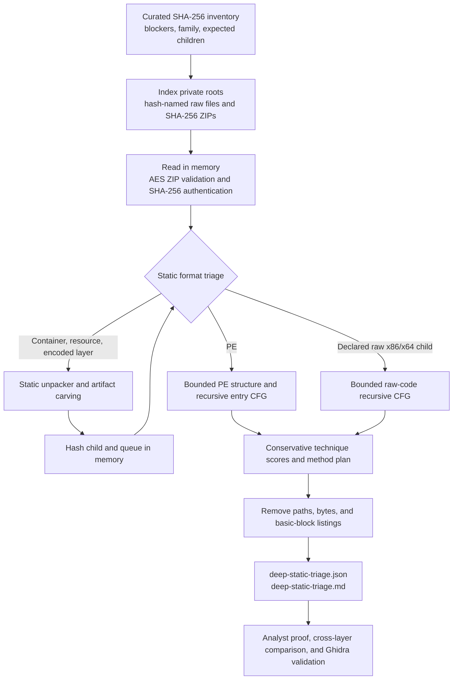

# Deep static analysis of difficult samples

## Purpose and evidence standard

This workflow revisits samples for which ordinary strings, PE metadata, or one-pass
decompilation did not recover the terminal payload or configuration. The curated
inventory is `analysis-framework/inventories/static-hard-cases.yaml`. It currently
contains 80 in-scope cases and separately records five cases whose required terminal
bytes were never present in the submitted sample. Missing bytes are an acquisition or
infection-chain boundary; no deobfuscator can reconstruct them from nothing.

The workflow produces prioritization evidence, not automatic protector attribution.
In particular, classic control-flow flattening (CFF) has **not yet been proven** in
this corpus. A high-indegree hub, a strongly connected component, or a dense entry
graph is enough to prioritize dispatcher recovery, but not enough to call a sample
flattened. A CFF finding requires recovery of the dispatcher state and a reproducible
mapping from transformed blocks to original successors. This evidence standard is
consistent with the dispatcher-oriented transformation described by
[Tigress](https://tigress.wtf/flatten.html) and the recovery problem treated by
[Debray and colleagues](https://www.cs.arizona.edu/~debray/Publications/unflatten.pdf).

Likewise, `not_observed` means only **not observed in the bounded, recursively
decoded entry-point CFG**. It does not mean that the technique is absent elsewhere in
the image, a recovered child, an unvisited callback, or dynamically supplied code.
`suspected` is a routing hint and must not be promoted to a confirmed finding without
the proof listed in this document.

## Validated 2026-07-17 run

The completed inventory run authenticated and analyzed 80/80 cases and 142 total
root/child layers. There were no partial, missing-input, input-error, or
budget-limited cases. Sixteen cases had a recognized protector/obfuscator marker, and
one case retained a missing expected child.

| Result | Measured value |
| --- | ---: |
| Inventory cases analyzed | 80 / 80 |
| Layers analyzed | 142 |
| Marker-bearing cases | 16 |
| Budget-limited cases | 0 |
| Cases missing an expected child | 1 |

The six legacy over-32-MiB size-gate cases were all structurally analyzed: three
QuasarRAT roots exposed RAR overlays/resources, two RedLine Stealer roots exposed the
same PE resource child, and one HijackLoader root exposed an inflated-gap-removed PE.
This resolves the analysis skip, not necessarily the terminal payload/configuration.

Classic native CFF remains unconfirmed. The only unique native candidate child that
crossed the low-confidence CFF routing threshold was
`6f7a3520fb5a30d1c747e7d232b219c1c97a2270429da7aa1f572ac2c60b28be`.
It occurs under two RedLine roots, so the JSON contains two candidate rows for one
unique child. Dispatcher state and original successor mapping have not been proven.

Managed triage assessed 23 layers. All ten Vidar KoiVM cases produced a KoiVM routing
hint. Separately, five managed layers produced a managed-CFF hint from high-fanout
switches: njRAT root `da590d16...faa51`, njRAT child `7a09d4c7...6e28`, Snake
Keylogger children `dd4ddcb9...a280` and `09f0d477...d50d`, and VenomRAT child
`7a66395f...ff05`. These are review candidates, not proven flattening; the prior
RedLine hint no longer meets the revised corroboration rule.

Managed `resource_obfuscation` assessments are `suspected` for 11 layers,
`inconclusive` for 4, and `not_observed` for 8. An inconclusive case has one
high-entropy resource without an independent protector marker and is not promoted to
a positive finding. Native false-positive controls route thirteen CLR entry thunks to
`not_evaluable`. Native CFF has five `confounded` assessments; indirect-flow has four
`confounded` assessments and one remaining `suspected` StealC root
`52b078c339720a09902be86de5e6875f2f31a8c24091453f96858b294f923924`.
The StealC result is a routing hint from 15 indirect transfers, not proof of
obfuscation or payload recovery.

The one missing expected child is RemcosRAT intermediate
`e9ed0be544b08189ceca2ec8e6ae8f74d62335ed006f0b207fb211df6bbdcb3a`.
No budget was exhausted, so it remains an extractor/raw-layer verification gap rather
than a size/traversal-limit result.

## Non-negotiable safety boundary

This path is static-only:

- Do not launch, load, install, register, or invoke a submitted or recovered binary.
- Do not emulate CPU instructions. Ghidra p-code is used only as a static IR/SSA view;
  a p-code emulator is outside this workflow.
- Do not contact URLs, domains, IP addresses, ports, C2 services, payload hosts, or
  third-party scanning services extracted from a sample.
- Do not persist recovered raw binaries in the repository. Child bytes exist only in
  memory while the batch runs; persistent products are sanitized JSON and Markdown.
- Run the host safety check immediately before and after analysis. Its output is
  stdout-only and must never be redirected into or committed to the repository.
- Treat archive names, marker strings, family labels, and existing reports as hints.
  Authenticate sample bytes by SHA-256 before analysis.

The batch report repeats `executed: false`, `emulated: false`,
`network_contacted: false`, and `raw_artifacts_written: false`. These fields document
the intended code path; they do not replace the host safety check.

## Implemented workflow



`unpackers/static_control_flow.py` maps only file-backed executable PE ranges and
uses bounded recursive descent from the native entry point. It records blocks,
known edges, unresolved successors, SCCs, dispatcher candidates, indirect transfers,
overlapping decodes, anti-analysis-sensitive instructions, and unusual stack-pointer
writes. Its only automatic opaque-predicate proof is deliberately narrow: an adjacent
`xor`, `sub`, or `cmp` of a register with itself followed by `jz`/`jnz`. Both edges
must remain when that proof does not apply.

`analysis-framework/common/deep_static_triage.py` expands the inventory, indexes
private sample roots, validates encrypted single-member archives, and recursively
passes carved children to the same static pipeline. Budgets bound input size, graph
depth, node count, blocks, instructions, and bytes per block. The
`--max-total-layer-bytes` value is the sum of unique layer payload bytes admitted to
the analysis queue, including the root. It is not a peak process-memory limit and
does not include temporary allocations made inside parsers or unpackers, so peak
memory can exceed this value. A raw code layer is disassembled only when its
SHA-256-to-bitness mapping is explicitly declared in the inventory.

## Technique-to-method decision matrix

| Observed obstacle | Evidence used for routing | First static method | Optional specialist method | Proof required before claiming recovery | Important limitation |
| --- | --- | --- | --- | --- | --- |
| Suspected classic CFF | Reachable hub, high indegree, SCC loop, CFG density | Rank dispatcher candidates; backward-slice state assignments | Static SSA, abstract interpretation, then narrowly bounded SMT; compare with [Stadeo](https://github.com/eset/stadeo) or build on [Miasm](https://github.com/cea-sec/miasm) | State values map every rewritten block to reproducible successors; before/after CFG diff | Packer and VM dispatcher stubs can produce the same graph shape |
| Opaque predicates | Constant flag producer or suspicious conditional edge | Backward flag/data slice; prove the predicate for all reaching definitions | Ghidra High P-code SSA or an offline symbolic expression | A branch outcome is invariant for all reachable inputs; otherwise retain both edges | Current automation proves only the adjacent same-register pattern |
| Indirect jump/call obfuscation | Indirect-transfer count, unresolved successors, table-like references | Slice target expression, recover base/index/bounds and validate table entries | angr CFG/decompiler analysis or Miasm IR | Every added edge is backed by a table entry or solved target expression | Indirect calls from ordinary import thunks and packer stubs are confounders |
| Overlapping code or anti-disassembly | Target inside an instruction, conflicting decode ownership, traps, decode failures | Recursive decode per branch context; split conflicting streams | Ghidra instruction-context review with explicit addresses | Each accepted stream has a predecessor and coherent successor; data is not decoded as code | Linear sweep is unsuitable; an overlap can also be malformed or unreachable data |
| Custom VM or protector dispatch | High-entropy entry, tiny imports, handler-like indirect loop, stack-state mutation | Identify fetch/decode/dispatch and statically cluster handler semantics | Version-specific devirtualizer only after layout/version validation | Bytecode format, handler table, and handler effects are reproducible | A marker or VM-shaped stub does not identify a protector or recover original logic |
| Managed IL/resource obfuscation | CLR metadata, manifest resources, obfuscated IL, managed protector marker | Parse metadata/resources, construct IL CFG, propagate constants through decoder call chains | [dnlib](https://github.com/0xd4d/dnlib), reviewed [de4dot](https://github.com/de4dot/de4dot) handlers, or protector-specific tooling | Recovered resource/constant is tied to metadata token and IL call chain | The native CLR entry thunk is not the managed program CFG; malformed or decoy metadata can defeat parsers |
| Packer/container or oversized root | Packer marker, unusual sections, overlay/resource carrier, earlier size gate | Parse structure without copying the full image; carve and hash children; analyze each child separately | A validated version-specific unpacking recipe | Child has coherent format/sections/imports and a new authenticated SHA-256 | A loader-stub CFG describes the packer, not necessarily the payload |
| Encrypted buffer or string generation | High-entropy resource/buffer plus decoder references | Recover key/IV/counter and reimplement only the data transform | Backward slice from use site; known-answer tests over captured ciphertext bytes | Decoder output is deterministic and cross-checked at multiple call sites | Algorithm-name or entropy guesses alone are not decryption evidence |

For difficult indirect flows, the useful pattern is to slice backward from the use
site rather than symbolically explore the whole program. Mandiant documents that
approach in its [LummaC2 indirect-control-flow analysis](https://cloud.google.com/blog/topics/threat-intelligence/lummac2-obfuscation-through-indirect-control-flow/).
[angr CFG](https://docs.angr.io/en/v9.2.81/analyses/cfg.html) and
[decompiler](https://docs.angr.io/en/v9.2.60/analyses/decompiler.html) analyses are
available as offline analyst methods, but are not automatically invoked by the
current batch. The same is true of Miasm and Stadeo: they inform or support a focused
recovery, not a universal one-click pass.

## Protector- and runtime-specific limits

### UPX and MPRESS

Treat marker strings and section names as route hints only. Confirm the PE layout and
packer stub before using a version-specific recipe. UPX or MPRESS entry stubs can have
loops, hubs, high entropy, and indirect transfers that inflate CFF/VM heuristics. Run
CFG assessment again on the authenticated child; do not transfer a root-stub finding
to that child. A successful static recovery needs a coherent PE and a new SHA-256,
not merely a removed marker.

### Themida and WinLicense

[themida-unmutate](https://github.com/ergrelet/themida-unmutate) is a useful primary
reference for static mutation deobfuscation and trampoline repair in tested 3.x
layouts. It is not a general Themida/WinLicense VM devirtualizer, and its documented
version coverage must be verified against each sample. Earlier 2.x layouts, modified
protector builds, runtime-derived state, and virtualized regions remain separate
research problems. Never report a Themida marker as proof that a protected payload
was recovered.

### KoiVM

[OldRod](https://github.com/Washi1337/OldRod) can disassemble and recompile supported
KoiVM bytecode to CIL. Its own scope does not promise simplification of the resulting
control flow, strings, or resources, and modified KoiVM variants can require adjusted
detection or constants. After any supported static conversion, continue with managed
IL CFG, resource, and family-config analysis; conversion is an intermediate layer,
not the end of the case.

### VMProtect

[NoVmp](https://github.com/can1357/NoVmp) is a static devirtualizer aimed at a defined
VMProtect x64 3.x scope. It is a version- and architecture-specific research route,
not evidence that every VMProtect build can be decoded. The current hard-case corpus
does not contain a case with verified VMProtect attribution, so this route must not be
selected solely because a byte string or VM-like dispatcher was found.

### .NET protectors and loaders

Start with CLR metadata, method bodies, and manifest resources rather than the native
entry thunk. dnlib provides the metadata/IL object model used by many focused tools;
de4dot provides handlers for a historical set of obfuscators. Neither guarantees
recovery from malformed metadata, native mixed-mode loaders, custom resource crypto,
current commercial protector revisions, or a loader whose terminal bytes are
external. Preserve metadata tokens and hashes so that every decoded constant or child
can be traced back to a field, method, or resource.

## Parent/child artifact rules

Analysis is layer-specific. A root archive, installer, packer stub, resource carrier,
raw loader, and terminal payload are different nodes even if a prior report grouped
them as one infection chain.

1. Hash every child before any interpretation.
2. Record the parent relation and artifact kind.
3. Queue a previously unseen child only within depth, node, and size budgets.
4. Run format, protector-marker, and CFG/IL analysis again on the child.
5. Compare observed child hashes with `expected_children` in the inventory.
6. Treat a missing expected child as unresolved, not absent or benign.
7. Do not publish the recovered bytes. Publish hashes, sizes, relationships, bounded
   findings, and precise failure states only.

This distinction is especially important for containers and packers: a successful
root parse does not imply terminal payload recovery, and a difficult root CFG says
nothing about a statically carved child's CFG until that child is analyzed.

## Reproducible commands

Run from the repository root in PowerShell. Keep safety-check output on screen only.

```powershell
$repo = (Get-Location).Path
$python = 'C:\Users\Administrator\.cache\codex-runtimes\codex-primary-runtime\dependencies\python\python.exe'
$env:PYTHONPATH = "$repo\.work\test-deps;$repo\analysis-framework\src;$repo\analysis-framework\common;$repo"
$safetyPatterns = @('MalwareSamples', 'kentai', 'static-hard-cases', 'deep_static_triage')

& .\analysis-framework\common\analysis_safety_check.ps1 `
  -Phase start -Pattern $safetyPatterns
```

Stop if the safety result is not clean. Then run the inventory across every private
root that may contain a hash-named raw file or `<sha256>.zip` archive:

```powershell
& $python .\analysis-framework\common\deep_static_triage.py `
  --inventory .\analysis-framework\inventories\static-hard-cases.yaml `
  --root C:\Users\Administrator\MalwareSamples `
  --root C:\Users\Administrator\Desktop\kentai `
  --root .\.work\malwarebazaar-family-expansion-20260717 `
  --root .\.work `
  --password infected `
  --max-depth 3 `
  --max-nodes 64 `
  --max-input-size 268435456 `
  --max-total-layer-bytes 536870912 `
  --max-blocks 4096 `
  --max-instructions 50000 `
  --max-block-bytes 4096 `
  --output-dir .\analysis-results\static-hard-cases
```

For a private, focused PE or declared raw-code review, run the CFG component directly.
This output includes basic-block addresses and belongs in a private work directory,
not the public result tree:

```powershell
$sample = 'C:\malware-lab\private\<sha256>'
$privateCfg = 'C:\tmp\deep-static-cfg.json'

& $python .\unpackers\static_control_flow.py `
  --input $sample `
  --output $privateCfg `
  --max-input-bytes 268435456 `
  --max-blocks 4096 `
  --max-instructions 50000 `
  --max-block-bytes 4096

# For an inventory-declared raw x86-64 layer only:
& $python .\unpackers\static_control_flow.py `
  --input $sample `
  --raw-bits 64 `
  --base-address 0 `
  --entry-offset 0 `
  --output $privateCfg `
  --max-input-bytes 268435456
```

Finish with the same host gate and again keep the output off disk:

```powershell
& .\analysis-framework\common\analysis_safety_check.ps1 `
  -Phase end -Pattern $safetyPatterns
```

## Output contract

The batch writes only:

```text
analysis-results/static-hard-cases/
  deep-static-triage.json
  deep-static-triage.md
```

`deep-static-triage.json` contains the safety flags, summary counts, per-case status,
authenticated layer hashes and sizes, parent/child relations, sanitized unpacking
metadata, bounded CFG metrics/technique assessments, budget state, and expected-child
comparison. `deep-static-triage.md` is a compact analyst summary. The public sanitizer
removes paths, byte objects, and full basic-block listings. Neither output contains a
recovered executable.

The CLI prints a final JSON object like this:

```json
{
  "status": "complete",
  "json": "deep-static-triage.json",
  "markdown": "deep-static-triage.md",
  "summary": {
    "total": 80,
    "analyzed": 80,
    "partial": 0,
    "not_found": 0,
    "input_errors": 0,
    "layers_analyzed": 142,
    "budget_limited_cases": 0,
    "protector_marker_cases": 16,
    "expected_children_missing_cases": 1
  }
}
```

The numbers above are the measured 2026-07-17 run. The generated JSON report remains
the source of truth for per-case and per-layer details.

## Failure and review checks

| Status or symptom | Meaning | Required check |
| --- | --- | --- |
| Safety check is not clean | Matching process, service, task, Run key, connection, or security evidence exists | Stop; identify and contain the host state before continuing. Do not save the safety report in Git |
| `not_found` | No indexed local candidate for the requested SHA-256 | Confirm all private roots were supplied and the raw filename is the hash or the archive is `<sha256>.zip` |
| `input_error` | A candidate existed, but no authenticated bytes were loaded | Inspect `acquisition_attempts` for archive read, member hash, raw hash, or size failure; reacquire rather than bypass validation |
| `archive_read_failed` | AES ZIP structure, password, size, or parser validation failed | Verify a single regular member and the agreed password; never extract by launching an archive member |
| `parse_failed` or `unsupported_architecture` | PE parser rejected the image or machine type is outside x86/x64 | Confirm format and hash; route managed/container/raw data explicitly instead of forcing PE decoding |
| `dependency_unavailable` | Capstone or pefile is unavailable | Restore the reviewed offline dependency set; do not interpret an empty CFG as a negative result |
| `entrypoint_unmapped` | Entry RVA is not backed by a mapped file range | Review section table, truncation, overlays, TLS callbacks, and child artifacts; do not linear-sweep the whole file |
| `budget_exhausted` or `budget_limited=true` | A CFG or layer traversal reached an explicit bound | Retain the partial result, raise one bound deliberately, rerun, and compare hashes/counts; never label the sample unpacked |
| Expected child is missing | A historically expected layer was not reproduced | Check parent extractor, depth/node/size limits, and whether the submitted chain omitted the bytes |
| Marker without coherent child | A protector string was observed but no validated terminal image followed | Keep attribution as a hint; inspect false-marker, overlay, resource, and version-layout possibilities |
| Native .NET CFG is one tiny indirect thunk | The native CLR bootstrap was measured | Route to metadata/IL/resource analysis; suppress native VM/CFF conclusions |
| `suspected` technique | Heuristic threshold was reached | Apply the matrix proof standard before using the finding in family, campaign, YARA, or report assertions |
| `not_observed` technique | The bounded entry CFG did not meet the heuristic | State the scope and budgets; do not claim global absence |

## Ghidra MCP validation

Ghidra is a static cross-check, not an execution environment. Prefer Ghidra MCP for
symbols, references, call graphs, types, comments, renames, and decompiler evidence.
Always pass the exact program selector on every program-scoped call; never rely on the
currently visible tab when multiple roots or children may be open. Keep the MCP
service bound to localhost, keep its filesystem scope under
`C:\Users\Administrator`, and leave arbitrary script execution disabled
(`GHIDRA_MCP_ALLOW_SCRIPTS` unset/false).

Use [Ghidra's p-code operation semantics](https://ghidra.re/ghidra_docs/languages/html/pcodedescription.html)
and the static [HighFunction representation](https://ghidra.re/ghidra_docs/api/ghidra/program/model/pcode/HighFunction.html)
to trace definitions and validate repaired CFG edges. Record the program hash and
addresses supporting each conclusion. Do not invoke emulation, debugger actions, or
arbitrary Ghidra scripts in this workflow.

## What this workflow does not promise

There is no universal static unpacker or deobfuscator. Runtime-generated keys,
environment-bound state, external payloads, self-modifying code, unsupported VM
revisions, and missing terminal bytes can remain unresolved under the safety boundary.
A sound unresolved result with a precise blocking condition is preferable to a false
payload, invented edge, or overconfident family/C2 assertion.
