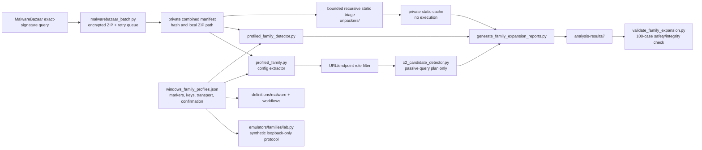

# Profile-defined family expansion, 2026-07-17

## Scope and verified outcome

The ten newest MalwareBazaar samples for each of ten additional exact signatures
were acquired as encrypted ZIP archives and analyzed statically. The final
validation covered 100/100 inner SHA-256 values, ten detector routes, ten config
extractor routes, all public case files, and every offline safety flag.

| Family | Samples | Main submitted formats | Recovered layers | Publishable static findings |
| --- | ---: | --- | ---: | --- |
| AsyncRAT | 10 | XLSM, JS, HTA, PS1, EXE | 1 | 3 stage URL candidates |
| XWorm | 10 | JS, VBS, HTA | 0 | none |
| QuasarRAT | 10 | EXE, BAT | 2; 3 size-gated | none |
| njRAT | 10 | EXE, JS, VBS | 3 | 4 public-IP discovery services; excluded from IOC/C2 |
| DarkComet | 10 | EXE | 8 | none |
| DCRat | 10 | EXE, PS1, VBS, JS | 6 | 1 stage URL candidate |
| RedLine Stealer | 10 | EXE, CAB, RAR, ISO | 4; 2 size-gated | 1 C2 candidate and 1 stage URL |
| Snake Keylogger | 10 | JS, EXE | 2 | none |
| GuLoader | 10 | VBS, JS, EXE | 2 | none |
| HijackLoader | 10 | MSI, EXE, PS1 | 1; 1 size-gated | none |

No family-specific encrypted config structure was fully recovered in this batch.
Accordingly, the source signature establishes reviewed family selection, but does
not turn embedded strings into confirmed C2. The only C2-role literal retained was
`80.234.41.242:7895` in a RedLine Stealer case, at candidate confidence. Five
delivery-stage URLs remain IOC candidates. Certificate, documentation, placeholder,
and public-IP discovery values are not emitted as C2 targets.

No sample or recovered layer was executed. Extracted infrastructure was not
contacted, and liveness was not inferred.

## Component relationships



The ten `analysis-framework/malware/<family>/detect.py` files are deliberately
thin adapters. Executable detection logic is centralized in
`profiled_family_detector.py`; extractor behavior is centralized in
`extractors/profiled_family.py`; family differences are data in the profile JSON.
Declarative YAML selects allowlisted offline steps from `asa.catalog`.

## Network-role model

| Role | Included in IOC list | Included in C2 observation plan | Interpretation |
| --- | --- | --- | --- |
| `c2_candidate` | yes | yes | Requires decoded config and family protocol correlation |
| `stage_url_candidate` | yes | no | Delivery or payload location, not C2 by itself |
| `host_discovery_service` | no | no | Public IP/geolocation lookup used as behavior context |
| certificate/documentation | no | no | Build/runtime metadata without malicious ownership evidence |

The C2 detector creates Shodan query strings offline. It does not query Shodan,
open a socket, fetch a stage, calculate a live JARM, or claim service liveness.
The emulator uses a synthetic uint32-length-plus-JSON frame that is explicitly not
wire compatible with the malware. It binds and connects only to literal loopback
addresses.

## Reproducible order

1. Run `analysis_safety_check.ps1` and keep its output outside the repository.
2. Query/download encrypted archives with `malwarebazaar_batch.py`.
3. If `pending` is non-zero, finish other static work and rerun the same command.
   Existing archives are reused; `retry_queue` hashes are attempted again.
4. Run bounded recursive static triage into a private cache.
5. Scaffold or refresh the exact-hash family registries and declarative YAML.
6. Generate publish-safe reports, YARA, config output, and passive C2 plans.
7. Run the 100-case validator.
8. Run unit tests, pydoc verification, YARA compilation, and `git diff --check`.
9. Run the ending safety check; do not commit its output.

Representative commands from the repository root:

```powershell
python analysis-framework/common/malwarebazaar_batch.py `
  --signature AsyncRAT --signature XWorm --limit 10 --query-limit 100 `
  --root C:\malware-lab\family-expansion-YYYYMMDD

python analysis-framework/common/generate_family_expansion_reports.py `
  --manifest C:\malware-lab\family-expansion-YYYYMMDD\combined-manifest.json `
  --cache C:\malware-lab\family-expansion-analysis-YYYYMMDD `
  --output-root analysis-results

python analysis-framework/common/validate_family_expansion.py `
  --manifest C:\malware-lab\family-expansion-YYYYMMDD\combined-manifest.json `
  --cache C:\malware-lab\family-expansion-analysis-YYYYMMDD `
  --output-root analysis-results `
  --run-id malwarebazaar-YYYYMMDD
```

## Output image and failure checks

```text
analysis-results/<family>/malwarebazaar-20260717/
  README.md
  IOC-LIST.md
  manifest.json
  rules/yara/<family>_profile.yar
  cases/<sha256>/
    README.md
    IOC-LIST.md
    indicators.json
    config.json
    c2-observation-plan.json
```

- `retry_pending > 0`: rerun acquisition later; do not silently replace a newest
  selected hash with an older sample.
- Hash mismatch: quarantine the archive metadata and reacquire; do not analyze it.
- `root_size_gate_over_32_mib`: record the unresolved bound. A size gate is not an
  unpacking success or benign verdict.
- No marker/config: retain exact-signature attribution separately from config and
  C2 confidence.
- Only discovery/certificate/doc URLs: report behavior context, not IOC/C2.
- Any `sample_executed=true`, `network_contacted=true`, or executable under the
  public result tree: validation must fail.

## Detection material and false positives

Each family run contains a medium-confidence marker-cluster YARA rule. It combines
multiple strings and a size bound; it still requires benign-corpus validation.
Exact hashes are high precision but have no variant coverage. A shared Sigma
template for script hosts plus explicit remote-content syntax is stored under
`analysis-results/_shared/rules/sigma/`; it is low confidence because software
deployment and administration scripts can overlap. Direct PE cases do not receive
invented process, registry, or network events.

## Duplication audit

An AST-normalized scan initially found seven structural duplicate groups among 560
implementation functions. Archive member validation, loopback enforcement, and the
one-shot loopback collector were centralized in `unpackers/path_safety.py` and
`emulators/common.py`. The post-refactor scan covered 549 implementation functions
and left one group: three intentionally uniform CLI parser builders. Forty focused
regression tests passed after the refactor.
