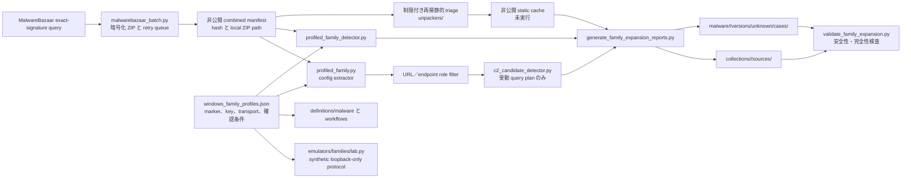

# profile 定義によるファミリー拡張（2026-07-17）

## 対象と検証結果

追加 10 signature について、MalwareBazaar で新しい順に各 10 検体を暗号化 ZIP として取得し、静的解析しました。最終 validator は内部 SHA-256 100/100 件、detector 10 route、config extractor 10 route、公開 case file、offline safety flag を検証しています。

| ファミリー | 検体数 | 主な提出形式 | 回収 layer | 公開可能な静的 finding |
|---|---:|---|---:|---|
| AsyncRAT | 10 | XLSM、JS、HTA、PS1、EXE | 1 | stage URL 候補 3 件 |
| XWorm | 10 | JS、VBS、HTA | 0 | なし |
| QuasarRAT | 10 | EXE、BAT | 2、size gate 3 | なし |
| njRAT | 10 | EXE、JS、VBS | 3 | 公開 IP 確認 service 4 件（IOC/C2 から除外） |
| DarkComet | 10 | EXE | 8 | なし |
| DCRat | 10 | EXE、PS1、VBS、JS | 6 | stage URL 候補 1 件 |
| RedLine Stealer | 10 | EXE、CAB、RAR、ISO | 4、size gate 2 | C2 候補 1 件、stage URL 1 件 |
| Snake Keylogger | 10 | JS、EXE | 2 | なし |
| GuLoader | 10 | VBS、JS、EXE | 2 | なし |
| HijackLoader | 10 | MSI、EXE、PS1 | 1、size gate 1 | なし |

この batch では、ファミリー固有の暗号化 config 構造を完全には回収できませんでした。source signature はレビュー対象のファミリー選択を裏付けますが、埋込み文字列を確認済み C2 へ昇格させる根拠にはなりません。C2 役割で残した literal は RedLine Stealer case の `80.234.41.242:7895` だけで、確度は candidate です。配布 stage URL 5 件は IOC 候補として残し、証明書、文書、placeholder、公開 IP 確認値は C2 target から除外しています。

検体と回収 layer は実行していません。抽出インフラへ接続せず、稼働状態も推測していません。

## component の関係



`analysis-framework/malware/<family>/detect.py` の 10 file は薄い adapter です。実行可能な detection logic は `profiled_family_detector.py`、extractor 挙動は `extractors/profiled_family.py` に集約し、ファミリー差分は profile JSON に置いています。declarative YAML は `asa.catalog` で許可した offline step だけを選びます。

## 通信値の role model

| role | IOC 一覧 | C2 observation plan | 解釈 |
|---|---|---|---|
| `c2_candidate` | 含む | 含む | 復号 config とファミリー protocol の相関が必要 |
| `stage_url_candidate` | 含む | 含めない | 配布先または payload location。単独では C2 ではない |
| `host_discovery_service` | 含めない | 含めない | 挙動文脈として使う公開 IP／位置情報確認 service |
| 証明書／文書 | 含めない | 含めない | 悪性所有の根拠がない build/runtime metadata |

C2 detector は Shodan query 文字列を offline で作るだけです。Shodan query、socket 接続、stage 取得、live JARM 計算、service 稼働判定は行いません。emulator は malware と wire compatible ではない synthetic な uint32-length＋JSON frame を使い、literal loopback address だけへ bind／connect します。

## 再現可能な順序

1. `analysis_safety_check.ps1` を実行し、出力は repository 外に置く。
2. `malwarebazaar_batch.py` で暗号化 archive を query／取得する。
3. `pending` が 0 でなければ他の静的作業を先に終え、同じ command を再実行する。既存 archive を再利用し、`retry_queue` の hash だけを再試行する。
4. 制限付き再帰静的 triage を非公開 cache へ出力する。
5. exact-hash family registry と declarative YAML を作成または更新する。
6. 公開可能 report、YARA、config、受動 C2 plan を生成する。
7. 100 case validator を実行する。
8. unit test、pydoc 検証、YARA compile、`git diff --check` を実行する。
9. 終了時 safety check を実行し、その出力は commit しない。

repository root からの代表 command:

```powershell
python analysis-framework/common/malwarebazaar_batch.py `
  --signature AsyncRAT --signature XWorm --limit 10 --query-limit 100 `
  --root C:\malware-lab\family-expansion-YYYYMMDD

python analysis-framework/common/generate_family_expansion_reports.py `
  --manifest C:\malware-lab\family-expansion-YYYYMMDD\combined-manifest.json `
  --cache C:\malware-lab\family-expansion-analysis-YYYYMMDD `
  --output-root analysis-results `
  --run-id malwarebazaar-YYYYMMDD

python analysis-framework/common/validate_family_expansion.py `
  --manifest C:\malware-lab\family-expansion-YYYYMMDD\combined-manifest.json `
  --cache C:\malware-lab\family-expansion-analysis-YYYYMMDD `
  --output-root analysis-results `
  --run-id malwarebazaar-YYYYMMDD
```

## 出力構成と失敗時の扱い

```text
analysis-results/
├─ malware/<family>/versions/unknown/cases/<sha256>/
│  ├─ README.md
│  ├─ IOC-LIST.md
│  ├─ indicators.json
│  ├─ config.json
│  ├─ c2-observation-plan.json
│  └─ metadata.json
└─ collections/<run-id>/
   ├─ manifest.json                 # case_id と family_sources
   └─ sources/<family>/
      ├─ README.md
      ├─ IOC-LIST.md
      ├─ manifest.json
      └─ rules/yara/<family>_profile.yar
```

- `retry_pending > 0`: 後で取得を再実行し、新しい選択 hash を古い検体で暗黙に置換しない。
- hash 不一致: archive metadata を隔離して再取得し、解析しない。
- `root_size_gate_over_32_mib`: 未解決の上限として記録する。size gate は unpack 成功や benign 判定ではない。
- marker／config なし: exact-signature 帰属と config／C2 確度を分離して残す。
- discovery／証明書／文書 URL だけ: IOC／C2 ではなく挙動文脈として報告する。
- `sample_executed=true`、`network_contacted=true`、または公開成果物内の executable: validation を失敗させる。

IOC Markdown は `種別 (Type)`、`値 (Value)`、`役割 (Role)`、`確度 (Confidence)`、`根拠 (Source)` の 5 列で統一します。

## 検知 material と誤検知

family source ごとに中信頼の marker-cluster YARA rule を置きます。複数文字列と size 上限を組み合わせますが、benign corpus 検証が必要です。exact hash は高精度でも亜種を検出できません。script host と明示的 remote-content syntax の共有 Sigma template は `analysis-results/_shared/rules/sigma/` に置きます。software 配布や管理 script と重なるため低信頼です。直接 PE case に process、registry、network event を補いません。

## 重複監査

AST 正規化 scan では当初 560 implementation function 中 7 structural duplicate group を検出しました。archive member validation、loopback 強制、one-shot loopback collector を `unpackers/path_safety.py` と `emulators/common.py` に集約しました。refactor 後は 549 implementation function を調べ、意図的に均一な CLI parser builder 3 件の 1 group だけが残りました。refactor 後の focused regression test は 40 件成功しています。
