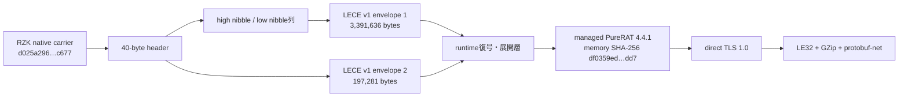

# PureRAT 4.4.1 direct-TLS系の静的復元とC2判定設計

## 結論

SHA-256 `d025a29613e300d7755f878eb1d23d8a8a042cb2d3eb9005d66664ab9b97c677` は、RZK native carrier内に2本のlow-nibble符号化LECE envelopeを保持します。静的復元と、公開sandboxのmemory artifactを独立に照合した結果、終端はmanaged PureRAT 4.4.1です。

終端設定で確認したC2候補は `45.192.211[.]77` のTCP `56001`、`56002`、`56003`です。通信順序は「plaintext prelude後にTLSへ昇格」ではなく、最初のwire byteからTLS 1.0、その内側がlittle-endian 32-bit長、GZip、protobuf-netです。

## 復元チェーン

`unpackers/rzk_lece_unpacker.py` は40-byte headerの生値を出力せず、offset、size、SHA-256だけを記録します。復元artifactも実行しません。2本の復元結果は次のとおりです。

| 項目 | envelope 1 | envelope 2 |
|---|---:|---:|
| 復元size | 3,391,636 bytes | 197,281 bytes |
| SHA-256 | `7380307213421ecb40e52679197a880fd577f73b893917adf1adeaa0ea946d7c` | `834137bd16aad89523a830247aa143e332c9527a7a15ad626adb637e8ce8bc56` |
| magic | `LECE 01` | `LECE 01` |

LECEは配布層の構造であり、このmagicだけをPureRAT判定へ使ってはいけません。終端familyはmanaged PEの設定・証明書・version・通信実装を別途検証します。

## 終端設定と秘密情報の扱い

公開sandboxのfull process memoryから復元されたmanaged PEは98,304 bytesで、SHA-256は `df0359edefe34a970af39227978dbe7f1caa09caf98a2c6db53f49187ec25dd7` です。設定からPureRAT 4.4.1、campaign ID、3ポート、証明書subject `CN=PureRAT Agent`を確認しました。

埋め込みPFX、秘密鍵、復号済みcredentialはrepositoryへ保存しません。報告にはleaf certificateまたはPFXのSHA-256など、照合に必要な非秘密metadataだけを残します。

## C2判定

`analysis-framework/common/purerat_direct_tls_probe.py` は次の境界で動作します。

実装済みのreview済みprofileは `purerat-441-d025a296-45-192-211-77-56001-direct-tls10` だけです。root SHA-256、terminal SHA-256、`45.192.211[.]77:56001`、TLS 1.0、leaf certificate SHA-256 `b3ae061b0b14a89d5134c279775b8f77a42214323c6bddab07f4d81ca2fc5c57`を完全固定し、1項目でも変更されたdictはDNS解決前に拒否します。`56002`と`56003`は静的設定候補として残しますが、同一証明書との対応を独立にreviewするまでこの能動profileへ追加しません。

1. `allow_network`と`allow_legacy_tls`の両方を明示しない限り通信しない。
2. review済みendpoint、期待するTLS negotiated version、証明書SHA-256 pinを必須にする。
3. raw TCP socketへplaintext preludeを送らず、TLS 1.0 handshakeを最初に行う。
4. handshake後のnegotiated TLS versionが`TLSv1`と完全一致し、かつleaf certificate SHA-256 pinも完全一致した場合だけ、当該設定に対するC2判定をconfirmedにする。片方だけの一致ではconfirmedにしない。
5. TLS negotiated versionまたは証明書の不一致はinconclusiveとして扱い、レビュー済み完全一致build／endpointは除外するが、PureRAT familyのC2ではないという否定根拠にはしない。機械可読結果では`tls_version_mismatch_excludes_exact_build_endpoint=true`、`tls_version_mismatch_excludes_family_c2=false`、`tls_version_mismatch_excludes_c2=false`と、対応する`certificate_mismatch_*`の値を常に明示する。
6. このapplication dataを送らないTLS version＋証明書pin probeでは、victim metadata、registration、task poll、plugin結果、command結果を送信しない。

Nmap向けには `analysis-framework/nmap/scripts/purerat-direct-tls.nse` を分離しました。旧`purerat-c2.nse`はplaintext prelude variant専用のまま残します。新scriptはreview済み `45.192.211[.]77:56001`以外をscript側で接続せず、TLS接続後にleaf certificate SHA-256を読むだけで即切断します。Nmap socketではTLS 1.0を厳密に強制したことを保証しにくいため、証明書・endpoint完全一致でもconfidenceは0.92とし、Nmap結果だけを`c2_confirmed=true`へ昇格しません。Python probeはnegotiated TLS versionと証明書pinの両方が完全一致した場合だけ当該profileをconfirmedにできますが、application dataやtaskを確認しないため、共通monitorでのmethod confidence上限は同じく0.92です。

frame codecはoffline解析用です。little-endian 32-bit長、GZip、protobuf-netを上限付きで展開し、既知ProtoInclude discriminatorを分類します。確認済み対応はregistration `1`、heartbeat `2`、status/error `3`、plugin result `4`、plugin request `5`、configuration update `38`、command `86`です。

## 既存実装へ反映すべき差分

従来の`04000000` plaintext prelude後にTLS 1.2へ昇格するprofileは、この4.4.1検体へ適用できません。既存profile、monitor、Nmap NSEを一括で置換すると別variantを壊すため、次のdispatchを追加するのが安全です。

- static configまたはILから`SslStream.AuthenticateAsClient`が送信処理より先にあること、TLS enum値`192`、GZip/protobuf-net framingを確認した場合だけ`purerat_direct_tls`を選ぶ。
- 旧`purerat_tls_prelude`はvariant固有profileとして残し、根拠がない検体へ継承しない。
- active detectorはhandler単位で旧probeとdirect-TLS probeを分岐する。
- NSEはTLS 1.0や証明書pinを扱えない環境では、TCP openだけを低confidence観測として記録し、protocol-confirmedにしない。

## 防御的host emulator

終端assembly `df0359edefe34a970af39227978dbe7f1caa09caf98a2c6db53f49187ec25dd7`を再解析し、protobuf-net基底contract `GClass2`、`ProtoInclude(1, GClass4)`、`GClass4`の`ProtoMember(1..20)`を確認しました。送信call chainも`Serializer.Serialize<GClass2>`、GZip、LE32長、圧縮bodyの順で確定しています。公開証拠は[`purerat_441_emulator_evidence.json`](../malware/purehvnc/purerat_441_emulator_evidence.json)へ、MVID、型inventory digest、代表methodのsemantic SHA-256として保存し、raw CIL、PFX、秘密鍵は含めていません。

RAT emulator registryの`evidence_sha256`は、この公開JSONをstrict UTF-8で読み、CRLFだけをLFへ正規化したSHA-256 `73422aedd0227225850dc2df3edea996b3bd1c30ec334c0c079f93c8277822a8`です。`analysis-framework/malware/purehvnc/purerat_host_emulator.py`は、全`GClass4` memberをdefaultのままにした固定registration `0a00`だけを生成します。deterministicなLE32／GZip frameは26 bytes、SHA-256は`fae7f27b56eed121c893860cd4764d64541fe1a0b67bc22da050e70161f44001`です。実ユーザー名、端末名、HWID、OS、campaign等は設定しません。

実行範囲はoffline fixtureまたは`127.0.0.1` loopbackだけです。共通runnerのprofileは`offline_or_loopback_only`として扱い、外部live sessionはDNS解決・socket作成より前に拒否します。TLS client certificate、PFX、秘密鍵は読み込みません。

状態遷移は次のとおりです。

1. 完全一致profileと公開evidence pinを検証する。
2. 注入済みoffline／loopback streamへ固定registrationを1 frameだけ送信する。
3. LE32／GZip／protobuf-net responseを最大1 frameだけ受信する。
4. discriminator `5`、`38`、`86`等を分類し、plugin／fileを保持せず、configurationを適用せず、commandを実行しない。
5. heartbeat、既知message、未知messageのいずれにも返信せず終了する。

受信frameの公開結果にはdiscriminator、分類、size、SHA-256だけを残し、protobuf本文やcommand引数は残しません。frameを受信しなかった短時間sessionはC2停止や非C2の根拠にしません。偽の実行結果、追加payload要求、task poll、常時接続は未実装です。

この境界により、C2追跡用のprotocol知識を保存しつつ、未知commandの実行、追加payload取得、被害端末情報の送信を既定で防止します。
