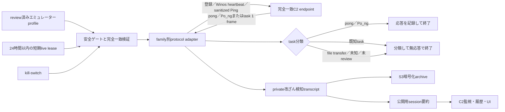

# 防御的RATホストエミュレーター

## 目的

RATのC2へ、実端末情報を含まない最小限の登録、Winos heartbeat、またはprivacy-safeなPing requestだけを送信し、サーバーから返るheartbeat応答やtaskを安全に分類・追跡するための仕組みです。マルウェア本体は実行せず、受信したcommandも実行・返信しません。将来は長時間観測へ拡張できますが、初期版はreview済みの完全一致endpointに対する短時間・単一接続だけを扱います。

AgentTeslaのFTPのような一方向のexfiltration sink、StealC／Lumma／Remusのtask service、loader stage配布channelは、対話型RATの遠隔操作channelと役割が異なるため、このエミュレーターの対象外です。それらは既存のbounded probeで扱います。

## 構成

family adapterは暗号化、frame復号、review済みregistration／heartbeat／Ping requestの構築、task分類だけを担当します。heartbeat応答やtaskへのreply、任意操作結果のfake replyは構築しません。socket、DNS、時間・byte上限、kill-switch、transcriptは共通層が管理します。adapterからshell、process、filesystem、registry、別hostへのnetwork接続を呼び出せない構造にします。

profileの`live_scope`は、短期leaseを必須とする`leased_external`と、外部接続を常に拒否する`offline_or_loopback_only`を区別します。fieldの欠落、未知値、adapterとの不一致はfail-closedです。`offline_or_loopback_only`はprofile検証直後、lease、MaxMind、DNS、socketより前に拒否し、live leaseも付与しません。

ValleyRAT／Winosの`valleyrat-winos-heartbeat-20260803-ljdnxz`はcontrol channel `ljdnxz.cc:8868`だけを対象とする`offline_or_loopback_only` profileです。stage channel `:8856`はprofileへ含めません。共通runnerとの結合はpreflightと127.0.0.1統合testまでに限定し、外部live用CLIから実行できません。これは、loopback fixtureを実C2確認やlive evidenceへ誤って昇格させないためです。公開loopback session CLIとsidecar契約は、offline結果を`c2_confirmed=false`として区別するschemaを別途reviewするまで追加しません。

PureRAT／PureHVNC 4.4.1の`purerat-441-d025a296-direct-tls10-empty-gclass4`も`offline_or_loopback_only` profileです。全memberがdefaultの匿名固定`GClass4` registrationであるprotobuf `0a00`をLE32／GZipでframe化し、注入済みoffline streamまたは`127.0.0.1` loopbackへ1回だけ送信します。受信は最大1 application frameだけを分類し、heartbeat、task、既知・未知messageのいずれにも返信しません。plugin／fileを保持せず、configurationを適用せず、commandを実行しません。外部live registrationはprofile検証直後、lease、MaxMind、DNS、socketより前に拒否します。

両familyの比較とprofile IDは[ValleyRAT／PureRATエミュレーターの実装状況](VALLEYRAT-PURERAT-EMULATOR-STATUS.md)を参照してください。ValleyRAT固有の手順は[防御的エミュレーション](../malware/valleyrat/docs/EMULATION.md)、PureRAT固有の手順は[PureRAT／PureHVNCの防御的エミュレーション](../malware/purehvnc/docs/EMULATION.md)にあります。AsyncRAT／VenomRATのdetector、host emulator、C2側loopback fixtureは[専用手順](ASYNCRAT-VENOMRAT-C2-EMULATION.md)にまとめています。

## live sessionの許可条件

次をすべて満たす場合だけ実C2へ接続します。

1. 現在のtaskでユーザーがlive RAT emulationを明示的に許可している。
2. `rat_emulator_live_leases.json`の完全一致leaseが`reviewed_at_utc <= 現在時刻 < expires_at_utc`を満たし、参照profile registryのsource／SHA-256 pinが一致する。
3. MaxMind GeoLite2 City／ASNのbuild時刻を接続前に確認し、24時間以上前なら更新が完了している。
4. エミュレーター専用registry、元のC2 probe registry、検体、静的解析証拠のSHA-256 pinが一致する。
5. host、port、単一のglobal IP、SNI、送信frame、上限がprofileと完全一致する。
6. `--allow-network`、`--allow-live-c2-emulation`、`--acknowledge-profile`、kill-switch fileが揃っている。

CLIは任意の`--host`、`--port`、lease path、検証時刻を公開しません。DNSの複数IP、fallback、redirect、reconnectは試行しません。profile不一致、lease期限到達、上限超過は通信前またはsession中にfail-closedで終了します。live開始時の残lease秒はmonotonic deadlineへ変換し、profile session期限との短い方を各I/Oへ適用します。

## 短期live leaseの更新手順

短期leaseはprofileそのものを変更せず、現在の接続許可だけを最大24時間に区切る別registryです。更新時は次の順で再レビューします。

1. `leased_external`の対象profileについて、検体SHA-256、endpoint、単一pinned IP、SNI、証明書SHA-256、protocol profile object SHA-256を再確認する。各`evidence_source`はstrict UTF-8 JSONのCRLFだけをLFへ正規化したSHA-256で固定し、LF／CRLF以外の内容変更を拒否する。`offline_or_loopback_only`へleaseを追加しない。
2. `rat_emulator_profiles.json`もstrict UTF-8 JSONのCRLFだけをLFへ正規化したSHA-256を取得し、lease registryの`profile_registry.source`と`profile_registry.sha256`へ固定する。evidenceとregistryの両方でCRLF／LFによりpinが変わらないことをtestし、lease延長だけを理由にprofile registryを編集しない。
3. `leased_external`の全profileを1件ずつ含め、`offline_or_loopback_only`は含めない。`reviewed_at_utc`、24時間以内の`expires_at_utc`、`review_owner`を更新し、未知、欠落、重複profileを残さない。
4. lease validatorのstrict UTF-8、重複key、size、reparse／hardlink、registry pin、開始・終了境界testを実行する。
5. `run_defensive_rat_emulator.py preflight --profile-id <完全一致ID>`で、通信せずlease source／SHA-256、review時刻、期限、review ownerを確認する。

lease更新では既存live summary、監視sidecar、静的evidenceを変更・再生成しません。期限切れのまま実行を継続せず、再レビューできないprofileはleaseから黙って削除せず、validatorを失敗させた状態で停止します。

## commandの扱い

| 送受信種別 | 端末上の処理 | live動作 | 記録 |
|---|---|---|---|
| registration／Winos heartbeat／AsyncRAT・VenomRAT Ping request | 実端末情報を取得しない | review済み固定frameをprofileどおりに1回だけ送信 | 種類、sequence、長さ、SHA-256 |
| `pong`／`Po_ng` | 実処理なし | 1 frameを観測し、返信せず終了 | 応答種別、長さ、SHA-256 |
| shell／process／registry／画面等のtask | 実行しない | 分類し、返信せず終了 | 正規化した種類、長さ、SHA-256 |
| file／plugin／stage転送 | 取得・保存・実行しない | 応答しないで終了 | command ID、宣言長、受信済み部分のSHA-256 |
| 未知command | 推測しない | 応答しないで終了 | opcode、長さ、SHA-256 |

受信commandの本文、引数、path、URL、tokenを公開成果物へ保存しません。N520とPureRATはfake resultの型・outcomeをoffline metadataとして表現できますが、wire byteを生成せず、全sessionで`task_executed=false`、`real_effect_performed=false`、`synthetic_reply_sent=false`を保持します。Winosのreview済みACK、vvaSのheader-only fixture、Onyxの空HTTP ACKはoperation resultと別扱いです。

## family別の初期準備度

| family／protocol | 現在復元済みの範囲 | 初期エミュレーターの範囲 | 主な不足情報 |
|---|---|---|---|
| ValleyRAT／N520 | TLS server-first handshake、session鍵、AES-CBC／HMAC／CRC frame、command decode、plugin command 16／18 | 空command 1登録、bounded受信、command fingerprint。offline fake resultはresult command `2`まで固定しwire化しない | command 2 payload serializerとACK値 |
| ValleyRAT／Winos | LE32 total-length、固定header、C9 heartbeat、command byte分類 | 固定C9を1回送信。loopbackは`C9 00` statusとclient registrationへの`CA` ACKだけを返す | operation result形式、stage要求、外部live |
| AsyncRAT 0.5.8 | TLS、gzip MessagePack、`ClientInfo`、token `0x06000024`の`KeepAlivePacket`、Ping／pong | 合成`ClientInfo`、空`Message`の固定Ping、1 frame受信、無応答終了。offline detectorと固定pongだけのloopback C2 fixture | 任意操作の分類表とresult serializer |
| VenomRAT 6.0.3 | TLS、gzip MessagePack、`ClientInfo`、token `0x06000056`の`KeepAlivePacket`、`Pac_ket=Ping`／`Po_ng` | 合成`ClientInfo`、空`Message`の固定Ping、1 frame受信、無応答終了。offline detectorと固定Po_ngだけのloopback C2 fixture | command別result serializer |
| DarkComet | RC4とserver-first `IDTYPE` | 受信・fingerprint | client identity、command／result mapping |
| PureRAT／PureHVNC 4.4.1 direct-TLS | TLS 1.0、LE32／GZip／protobuf-net、`GClass2`／`GClass4` registration schema | 匿名固定`GClass4`を1回送信。synthetic fixtureのresult候補`4`はexact返信契約未確認のmetadataとして保持し、wire化しない | command result型、result payload serializer、外部live |
| Remcos／Quasar／Gh0st／NanoCore等 | 部分的なtransportまたは状態モデル | offline／loopbackのみ | 実C2互換の登録・command・結果形式 |

exact ILの`KeepAlivePacket`はactive window titleを`Ping.Message`へ入れますが、エミュレーターは`GetActiveWindowTitle`を呼ばず、空文字へsanitizeします。「heartbeat応答まで」と「遠隔commandを受信できる」は同じ完成度ではありません。公開要約では、`handshake_confirmed`、`registration_accepted`、Ping request送信、heartbeat応答、task受信を分け、`synthetic_reply_sent=false`を明示します。

## transcriptと公開証拠

private transcriptは1 event 1 JSONとし、sequence、直前event SHA-256、raw frame SHA-256、event SHA-256を連鎖します。最終manifestにevent数とroot SHA-256を固定し、変更、削除、並べ替え、truncate、raw frame変更を検出します。hash chainは改ざん防止そのものではなく、改ざん検知の仕組みです。

raw frame、復号command、鍵、token、合成ID、PCAPはgitへ追加しません。session単位でpassword `infected`のWinZip AES-256 archiveへまとめ、`malware-analysis-datastore-720232834682`へ保存します。公開用sidecarには次だけを残します。

- session IDとUTC開始・終了時刻
- emulator／protocol profile IDとregistry SHA-256
- live lease registryのsource／SHA-256、review時刻、期限、review owner
- handshake、registration、Ping request、heartbeat応答の確認状態
- command件数と、種類・opcode・wire長・wire SHA-256
- 任意操作結果のfake replyが0件であり、実処理を行っていないこと
- private transcriptのroot SHA-256とarchive manifest参照

## 通常C2監視との統合

RATエミュレーターは通常監視を長時間化せず、終了したsessionの公開sidecarだけを`run_c2_monitoring_pipeline.py`へ渡します。sidecarは期待SHA-256、endpoint、family、profile、registry pinを再検証し、allowlist項目だけをmonitoring resultへ結合します。

command受信はmalware protocolが活動中である強い肯定証拠ですが、観測時間内にcommandが届かなかったことは停止判定に使いません。通常のreachability／DNS履歴と、`protocol_activity_tracking`を別々に保持します。

## 将来の常時稼働

常時観測へ移行する前に、専用VMまたはcontainer、専用service account、OSレベルのegress allowlist、同時接続1、現行の短期live leaseに加えたprocess間のatomic claim、profile別cooldown、指数backoff、log rotation、S3 upload完了確認、強制停止手段を追加します。任意commandを実行できるhoneypotにはせず、result serializerを別途復元・検証するまでは受信taskへ返信しない設計を維持します。
