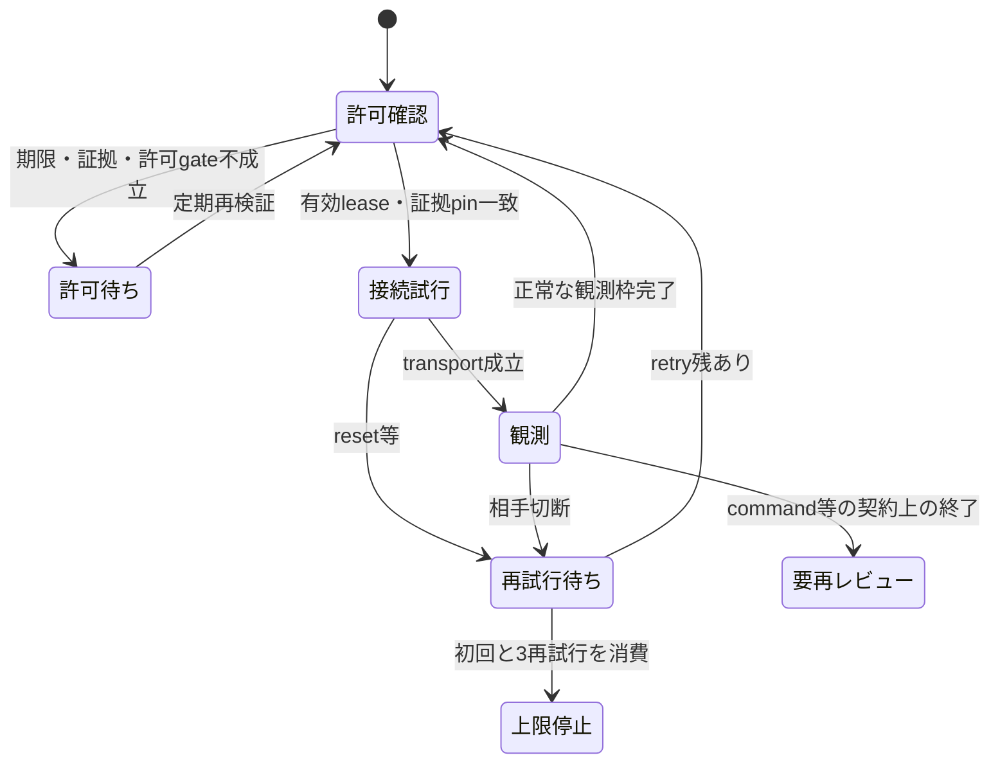

# PureRAT／ValleyRATの継続観測と未解決の通信要件

## 2026-09-05に確認した停止原因

Kaliの保存transcriptとPCAPを読み取り専用で確認しました。この確認では新規C2接続、検体実行、受信command実行を行っていません。日時はUTCです。

| 対象 | 確認済みの観測 | 判断と未確定事項 |
|---|---|---|
| PureRAT 4.4.1 | 8/26〜27の保存済み87 session要約はreset 81件、timeout 6件。PCAPの確認streamはTCP確立、104-byte ClientHello送信、相手のACK、約20秒後の相手RST | TLS確立前に停止。登録field不足をこのresetの原因にはできない。中継装置、server実装、access policy等のどれが原因かは未確定 |
| PureRAT supervisor | 8/29 03:13に期限切れleaseのpreflightを4回失敗として数え、circuitを開いた。以後のPCAPはheaderのみ | ローカル許可待ちを接続失敗へ混入した運用上の不具合。containerのrunning表示は観測中を意味しない |
| ValleyRAT Winos | 8/29 08:45:52〜09:57:44の約72分間接続。3回の再接続のうち2回は直後、最後は約3分43秒で相手RST。16-byte同一応答2件 | 復号payloadは`C9 01`。現行分類器ではregistration challenge。操作commandではない。8時間継続は未達 |

Winosの16-byte応答SHA-256は`71af0aa853657cead04df5ce4b9a730f6acd385046529761f68394e4e9fe2d4c`です。raw PCAP／frameはKaliのrepository外へ保持しています。resetの送信元IP・方向はPCAPで確認しましたが、送信主体が攻撃者本人か中継装置かは断定しません。

## 検体通信要件と解析残件

新たな検体本体またはraw逆コンパイル成果物は今回の作業環境で未取得です。Ghidra bridgeのinstance一覧も空でした。以下は既存の検体由来evidenceと実装の再照合であり、新規のbinary逆コンパイルを完了したものではありません。

保存先以外の取得経路もKaliから確認しました。MalwareBazaarではPureRAT終端`df0359…`、Winos主制御`024ab2…`、Winos root `6469edd6…`の完全hash照会がすべて`hash_not_found`でした。既存Triage解析`260623-xf5ppsfw4y`、`260810-ezt37sar5v`、`260810-frgnkswvex`のoverview取得はHTTP 403でした。VirusTotalではPureRAT終端がHTTP 404、Winos主制御は完全hashと908,800 byteが一致しましたが、`download_url`はHTTP 403／`ForbiddenError`でした。[公式の取得API](https://docs.virustotal.com/reference/files-download-url)は特別な取得権限を要求します。403から検体不存在を結論せず、取得権限または保管済みartifactが必要な状態として残します。

この照会では検体download・新規sandbox提出・C2接続を行っていません。既存のAPI keyはSSHの標準入力からKaliの子processへ渡し、値をKaliのfileや公開成果物へ保存していません。

| 要件 | 検体由来の既存根拠 | 現在の実装と追加解析 |
|---|---|---|
| PureRAT transport | terminal `df0359edefe34a970af39227978dbe7f1caa09caf98a2c6db53f49187ec25dd7`。TLS enum 192、SNIなし、証明書pin、LE32＋GZip＋protobuf-net。[静的復元](PURERAT-DIRECT-TLS-STATIC-RECOVERY.md) | TLS 1.0の実negotiated versionを検証し、TCP／TLS段階を個別記録。PCAPとexact endpointの再レビューが必要 |
| PureRAT registration | `GClass2`のProtoInclude 1＝`GClass4`、20 member。[protocol evidence](../../analysis-results/malware/purehvnc/versions/v4.4.1/cases/d025a29613e300d7755f878eb1d23d8a8a042cb2d3eb9005d66664ab9b97c677/protocol-evidence.json)の`contracts`と`state_behavior.registration` | 匿名空messageのみ。C2が必須とするmember集合は未確定。実端末情報は収集しない |
| PureRAT heartbeat | 同evidenceの`state_behavior.heartbeat`は20〜59秒のscheduler、空`GClass8` challenge、`Class2.method_0`のresponse処理を記録 | safe sessionに未送信codecはあるが、外部profileは追加送信を許可していない。元CILのtimer・方向・counter・field値を再確認してから統合する |
| Winos heartbeat／登録要求 | `FUN_180001f10`→`FUN_180002890`の15-byte C9構築、今回照合した`C9 01`応答。[通信解析](../malware/valleyrat/docs/COMMUNICATION-PROTOCOL-ANALYSIS.md) | C9送信と登録要求分類のみ。exact sampleのLOGININFO構築関数、token値、packing、header、登録完了遷移を取得する必要がある |

公開参照実装の4688-byte LOGININFOをexact sampleのserializerとして代用しません。`winos_registration_reference_evidence.json`の未確定項目を、参照実装との類似だけで確認済みに変えません。受信command、plugin、stage、configurationを実行・適用する経路も追加していません。

## コード改善

- 共通transportでTCP keepaliveを有効化。Linuxではidle 60秒、間隔20秒、3 probe。これはTCPのidle対策で、application heartbeatやregistrationを代替しない。
- TCP接続開始・成立、TLS handshake開始・完了をtranscriptへ記録。失敗要約へ`transport_phase`を残し、実negotiated TLS versionを検証。
- preflight失敗は`waiting_preflight`として待機し、接続retryを消費しない。同一原因のイベント連打を抑え、有効な許可へ復帰すると`preflight_restored`を記録。
- MaxMind cache不足・期限切れ等、TCP開始前のruntime gateも接続失敗と分離。observerへlicense keyを渡さず、cache更新は従来のsetup処理で行う。
- reset／refusal／timeout／EOFは初回＋最大3再試行。永続circuitは再起動をまたいで保持し、新leaseのpreflight成功後だけ再レビュー更新を反映。
- command・未知frame・TLS pin違反による終了は`policy-stop.json`へ保持。同じleaseのままDockerが再起動しても接触を繰り返さない。
- Winosの`supervise`入口は、有界sessionが正常に時間枠を完了した場合に次の枠へ進む。lease期限は延長せず、期限切れでは待機する。
- SIGTERM／SIGINTを共通I/O guardへ渡し、次のI/O前に終了。kill-switchはcooldown中も確認。実行中のTCP／TLS接続待ちは既存timeout（最大30秒）まで残る場合があるため、継続observerのDocker停止猶予を45秒にする。
- 状態JSONは10秒ごと、または状態遷移時にatomic更新。Docker healthは90秒以内の更新と状態を検査し、許可待ち・circuit停止・policy停止をunhealthyと表示。
- session保存先は512 MiBまたは32,768 entryで新規接続を拒否。既存証跡は削除せず`archive_required`を表示。1 session中は従来のframe／byte上限が別途有効。



## Kaliでの運用

PureRATの既存Composeにはhealthcheckを追加しています。Winos継続supervisorは次の重ね合わせで選びます。buildはrepository rootを相対参照します。

```bash
cd analysis-framework/docker/rat-emulators
sudo docker compose -f docker-compose.winos-external.yml \
  -f docker-compose.winos-continuous.yml config --quiet
sudo docker compose -f docker-compose.winos-external.yml \
  -f docker-compose.winos-continuous.yml build
```

起動前に、既存手順のegress規則・保存先・kill-switch・公式取得済みMaxMind cache・再レビュー済み24時間以内のleaseを揃えます。leaseは自動更新しません。file単位のread-only bind mountを使うため、hostでlease fileをatomic置換した場合はobserver containerを再作成してmountを更新してください。同じpathへrenameしても旧inodeを参照し続ける場合があります。再開時も同時接続は1です。

Winosは`transcripts/sessions/`へ新sessionを分離し、従来の直下sessionを保持します。`observer-status.json`、`observer-events.jsonl`、`retry-circuit.json`、`policy-stop.json`は現在状態、経過、接続失敗上限、契約上の停止を表します。PCAP継続modeは対象IP／portを固定したまま8時間timeoutを外し、64 MB×16 fileのringを使います。再起動を含む保存file数上限は256で、到達時は既存fileを削除せずcapture開始を拒否します。

```bash
sudo docker ps --format '{{.Names}} {{.Status}}'
sudo docker exec rat-emulators-purerat-observer-1 \
  python -B /opt/rat-external-observer/observer_status.py purerat
```

`healthy`もC2登録受理やoperator活動の確認を意味しません。`connected`、application受信件数、登録受理の証拠、command分類を別々に確認してください。

## 検証と未完了事項

Kaliの独立した検証directoryで、期限待ちからの復帰、retry非消費、reset／EOFの4回上限、再起動後の停止維持、TLS pin違反停止、kill-switch中断、容量上限、health鮮度、実loopback socketのkeepaliveを検証しました。既存のPureRAT／Winos／N520／共通runner回帰も合わせ、外部networkなし・read-only・非rootのDockerで **155 testが成功** しています。capture入口の試験は`execv`を差し替え、実際のtcpdumpは起動していません。

Kaliで両observer Dockerfileのbuildと両Compose構成の`config --quiet`も成功しました。build時の通常依存取得と、実行時のnetwork隔離は別の設定です。検証imageは`local/defensive-purerat-continuity-validation:20260905`と`local/defensive-winos-continuity-validation:20260905`に分離しています。既存の観測containerは差し替えておらず、新規の外部C2接続も行っていません。

変更文書2件の日本語監査、local link監査、変更17 fileの秘密値pattern確認は指摘なしでした。全体の文字整合性検査も指摘なしです。公開APIのpydoc 3件をKaliのnetworkなしDockerで生成しました。`localize_result_markdown.py`は`analysis-results/`専用であり、今回の変更文書には適用できません。

初回の`refresh_case_inventory.py --check`は不合格で、公開を保留しました。その後のpush／PR依頼に基づき、所定の`--write`でmainの既存3,206 caseからREADME件数、IOC索引、code／logic similarity索引、ValleyRAT checksum manifest、UI派生成果物を同期しました。生成処理内の再検証は全項目で不一致0件です。新規case追加やcaseの解析状態変更はなく、追加したUI表示用JSON 50件もmainに既存のcaseを投影したものです。改修本体17 fileと索引同期61 fileは別commitへ分離し、同一PRの対象とします。公開対象78 fileの秘密値確認、日本語文書7件の監査、全体67,393 fileの文字整合性検査も指摘なしでした。

継続管理の改善だけでは実C2への登録受理や操作command受信は達成しません。PureRATのTLS互換性とWinosのexact registration serializerの再解析、およびそれに基づく外部観測検証が残っています。原検体・raw CIL／decompileの保存先が必要です。
