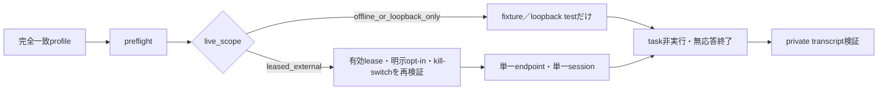

# ValleyRAT／PureRATエミュレーターの実装状況

## この文書の目的

ValleyRATとPureRATの防御的エミュレーターについて、現在実装されている範囲、利用可能な入口、外部通信の可否、未実装部分を一覧化します。ここでいう「ready」は、マルウェアの全機能を再現できるという意味ではありません。review済みprofileと固定上限に従い、最小frameを送受信して分類し、実端末操作や追加応答を行わず終了できることを指します。

## 現在の準備度

| family／系統 | 準備度 | 利用範囲 | 外部live | 主な未実装 |
|---|---|---|---|---|
| ValleyRAT N520 | `bounded_host_emulation` | 44-byte handshake、session鍵、認証frame、空command 1登録、最大16 command分類。offline fake-result判断はresult command `2`まで固定 | profileと有効な短期leaseがある場合だけ。fake resultのlive送信は禁止 | command 2のpayload serializer、ACK値、plugin／file転送 |
| ValleyRAT Winos | `bounded_host_emulation` | 固定15-byte `0xC9` heartbeat、最大64 byteの1 frame分類。loopback serverは`0xC9` statusと`0x06`登録への`0xCA` ACKだけを返す | 不可。`offline_or_loopback_only` | operation result serializer、stage要求 |
| ValleyRAT vvaS | `exact_bounded_probe`＋`header_only_loopback` | 固定`33 32 00`、14-byte header確認。loopbackでは明示flag時だけheaderを返し、stage bodyは0 byte | host emulatorとしては不可。個別承認のexact probe以外は通信しない | terminal stage、task channel、task result serializer |
| ValleyRAT Onyx terminal | `passive_loopback_sink` | numeric loopbackでHTTP request 1件を分類し、空bodyの204／400 ACKで終了 | 不可 | valid Onyx response、payload配信、task/result protocol |
| PureRAT／PureHVNC 4.4.1 | `bounded_offline_host_emulation` | 匿名固定`GClass4` registration、最大1 frame分類。plugin result型`4`まで固定したoffline判断を提供 | 不可。`offline_or_loopback_only` | command result型、plugin／command result payload serializer |

## C2検知との分離

通常のC2検知はhost emulatorから分離し、`analysis-framework/nmap/nmap_c2_detector.py`を正式入口とします。ValleyRATのWinos／vvaS／N520は`valleyrat-c2.nse`、PureRAT 4.4.1 direct-TLSは`purerat-direct-tls.nse`へ固定し、19 methodの対応は`analysis-framework/nmap/profiles.json`で管理します。Nmap NSEが未登録またはNmapを利用できない場合、host emulatorやPython direct probeへfallbackしません。

## synthetic behaviorの実装境界

synthetic behaviorは、wire byteを送るものとmetadataだけを返すものを分離しています。

| 系統 | loopbackで送信できるもの | metadataだけで送信しないもの |
|---|---|---|
| Winos | `C9 00` heartbeat状態、`CA` registration完了 | operation command result（未実装） |
| N520 | なし | result command `2`、outcome、送信禁止理由 |
| PureRAT | なし | plugin result discriminator `4`、command result未解決状態、outcome |
| vvaS | 14-byte synthetic stage headerだけ。stage bodyは0 byte | terminal task result |
| Onyx | HTTP 204／400の空ACKだけ | valid Onyx response、task result |

横断回帰テストは外部通信なしで実行できます。

```powershell
py -3.13 -B -m pytest -q `
  analysis-framework/tests/test_rat_synthetic_result_boundaries.py `
  analysis-framework/tests/test_valleyrat_winos_synthetic_response.py `
  analysis-framework/malware/purehvnc/tests/test_purerat_synthetic_result.py `
  emulators/valleyrat/tests/test_vvas_loopback_emulator.py `
  analysis-framework/tests/test_onyx_qt_emulator.py
```

ValleyRAT全体のoffline readinessは次のコマンドで確認できます。

```powershell
py -3.13 -B analysis-framework/malware/valleyrat/audit_emulation_readiness.py `
  --repository . `
  --check
```

`status=complete`はN520、Winos、vvaSの定義済み安全契約が揃っていることを示します。実C2が利用可能、leaseが有効、taskへ返信可能、という意味ではありません。

## 共通runnerでの利用フロー

N520、Winos、PureRATは`analysis-framework/common/run_defensive_rat_emulator.py`を共通入口にします。family adapterを直接起動しません。



まず通信なしのpreflightを実行します。

```powershell
py -3.13 -B analysis-framework/common/run_defensive_rat_emulator.py preflight `
  --profile-id <完全一致profile ID>
```

確認するfieldは`network_used=false`、`adapter_id`、`protocol_profile_id`、`registry_sha256`、`evidence_sha256`、`live_scope`、`live_enabled`です。`offline_or_loopback_only`で`live_enabled=false`なら正常であり、外部liveへ昇格してはいけません。

private transcriptを取得済みの場合は、通信せずhash chainを検証して公開要約を生成できます。

```powershell
py -3.13 -B analysis-framework/common/run_defensive_rat_emulator.py replay `
  --private-transcript-directory C:\analysis-private\session-001 `
  --public-output C:\analysis-public\session-001-summary.json
```

private transcript、raw frame、復号command、鍵、token、合成IDはGitへ追加しません。解析対象ごとに暗号化archiveへ分離し、repositoryのdatastore手順でS3へ保管します。

## profile ID一覧

| 用途 | profile ID | adapter | live scope |
|---|---|---|---|
| ValleyRAT N520 | `valleyrat-n520-host-d11e793-9999` | `valleyrat_n520_v1` | `leased_external` |
| ValleyRAT Winos | `valleyrat-winos-heartbeat-20260803-ljdnxz` | `valleyrat_winos_v1` | `offline_or_loopback_only` |
| PureRAT 4.4.1 | `purerat-441-d025a296-direct-tls10-empty-gclass4` | `purerat_direct_tls_v1` | `offline_or_loopback_only` |

profile ID、host、port、pinned IP、SNI、送信frame、上限はCLIから置き換えません。N520のpreflightは短期leaseも検証するため、lease期限切れなら通信せず失敗するのが正しい動作です。

## 完成度の読み方

- `handshake_confirmed`: transportとhandshakeが完全一致した。
- `registration_sent`: 固定の匿名または空registrationを送信した。
- `registration_accepted`: サーバー側が登録を受理した証拠がある。単なるsend成功とは異なる。
- `task_observed`: taskらしい1 frameを受信・分類した。
- `task_executed`: 常に`false`でなければならない。
- `synthetic_reply_sent`: operation resultについては常に`false`。Winos ACK、vvaS header-only、Onyx空HTTP ACKとは別fieldで扱う。
- `c2_confirmed`: loopback／offline結果では常に`false`。外部C2の証拠へ昇格しない。

## 関連文書

- [共通の防御的RATホストエミュレーター](RAT-C2-HOST-EMULATOR.md)
- [ValleyRATの利用方法と安全境界](../malware/valleyrat/docs/EMULATION.md)
- [PureRATの利用方法と安全境界](../malware/purehvnc/docs/EMULATION.md)
- [PureRAT direct-TLSの静的復元とmonitor条件](PURERAT-DIRECT-TLS-STATIC-RECOVERY.md)
