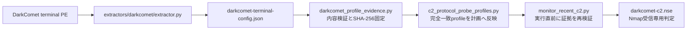

# DarkComet静的解析

カテゴリはRAT、通信はRC4で暗号化したcommand指向TCPです。本実装は検体を実行せず、静的解析で得た設定と通信処理を、抽出・証拠化・監視計画・受信専用判定まで一貫して扱います。

## 自動処理の流れ

抽出器は暗号化resourceを復号し、`NETDATA`のendpoint候補と静的に確認したprotocol情報を公開証拠JSONへ出力します。profile registryは証拠fileの存在だけでは有効化しません。次の条件をすべて照合し、証拠file自体のSHA-256を監視計画へ固定します。

- スキーマ、family、ルート検体SHA-256、終端検体SHA-256
- `config.netdata[N]` pointer、`endpoint_records`、host、port
- network RC4 keyのhex／base64、静的検証flag
- PWD非連結、resource復号鍵の非流用
- server-first平文`IDTYPE`、client送信なし

監視時は固定したSHA-256で同じ証拠を再検証します。証拠の削除、差し替え、path traversal、repository外へ解決されるsymlink、endpointやkeyの変更があれば、DNS解決やsocket生成より前に拒否します。未登録のDarkComet候補は`protocol_profile_required`としてDNS観測だけを許可し、TCP接続しません。

## network keyとresource復号鍵

今回の検体で通信に使うnetwork keyは10-byte ASCIIの`#KCMDDC5#-`です。PWDは連結しません。一方、設定resourceの復号鍵は`#KCMDDC5#-890`で、suffix `890`を追加する別の鍵です。resource復号鍵を通信profileへ流用すると、正しいcontroller応答でも復号に失敗するため、証拠validatorは両者の非同一を必須条件にしています。

既知vectorは次のとおりです。

| 平文 | RC4暗号文hex |
|---|---|
| `IDTYPE` | `9A4EA882ADFD` |
| `SERVER` | `804FAE8DB8EA` |
| `#KEEPALIVE#` | `F041B99EADF99494F0BB98` |

## C2判定

controllerは接続後にRC4暗号化した`IDTYPE`を先に送ります。外部targetの標準観測は`analysis-framework/nmap/nmap_c2_detector.py`から`darkcomet-c2.nse`だけを起動し、application dataを一切送信せず、次のどちらかだけを受理します。`darkcomet_server_first_probe.py`はoffline fixtureとloopback回帰の互換部品であり、標準active backendではありません。

- raw RC4暗号文：6 byte
- ASCII-hex RC4暗号文：12 byte（静的コードで確認した主形式）

受信は6／12 byte到達時のquiet timeoutで確定しません。EOFまたは単一の全体期限まで最大13 byteを観測し、13 byte目があれば超過として拒否します。復号平文が`IDTYPE`へ完全一致した場合だけC2稼働確度を`0.98`とします。不一致、部分、不正形式、超過、無応答、接続後の期限切れは到達性と分離した専用状態で記録し、C2稼働確度は`0.0`です。

標準monitorはPython detectorの`getaddrinfo`やsocketを呼びません。名前解決はNmap本体の範囲であり、NSEの単一期限は接続開始から受信終了までです。このため結果には`dns_timeout_bounded=false`と`deadline_scope=post_dns_connect_receive`を記録し、DNS時間をNSE期限へ含めたとは説明しません。Nmapが利用できない場合もPython direct probeへfallbackしません。

## 安全上の制約

- 検体や復元payloadを実行しない
- client application data、victim情報、check-in、commandを送信しない
- response内容、復号平文、RC4 keyを結果へ再掲しない
