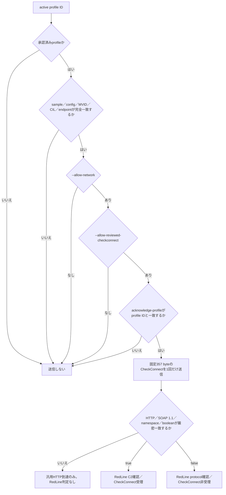

# RedLine Stealer 能動C2確認

## 結論

RedLine StealerのWCF `BasicHttpBinding`／SOAP 1.1 `CheckConnect`を、復元済み検体と完全一致する場合に限ってNmap NSEから能動送信できます。Python CLIはprofile検証、NSE引数file、Nmap XMLの公開用allowlist化だけを担当します。wire formatはloopback限定エミュレータで往復検証済みです。2026-08-09の過去観測はTCP接続前のtimeoutであり、C2の停止や非C2を意味しません。

対象profileは次の1件です。

- 検体SHA-256: `3f3ac0a31d28e9bbc85df54dd4300c9b15bf255b192fab15d94505ea1e528b02`
- endpoint: `http://192.144.32.84:16383/`
- 終端MVID: `b9bb7589-ca7d-4755-974e-86d58a25c8d8`
- 終端CIL semantic SHA-256: `3ef4c2b5a3acaf779ecc23f622df36d2db8db169fa7859a72832ba674d253a42`
- 設定canonical SHA-256: `99ce975eef7d10f152a6a3c0d8e9832905b06b73fa9d3d3551da29bd25a122b2`

## 判定フロー



## 送信内容

送信するoperationは、引数を持たない`CheckConnect`だけです。

- 送信method／path: `POST /`
- Content-Type: `text/xml; charset=utf-8`
- SOAPAction: `"http://tempuri.org/Endpoint/CheckConnect"`
- 要求本文: `{http://tempuri.org/}CheckConnect`
- 要求size: 357 byte
- 要求SHA-256: `dd8c02ce792cd8d4e9ce3e05c32ff19c8d1633d24312203b9ec5018645e45f33`

build ID、端末名、ユーザー名、OS、収集情報、実端末識別子は送信しません。`EnvironmentSettings`、`SetEnvironment`、`GetUpdates`、`VerifyUpdate`は呼び出しません。

## 安全境界

- CLIからhost、port、endpointを上書きできません。
- profileのIP pinと現在の名前解決結果が一致しなければ送信しません。
- 送信は1 connection、1 request、357 byteに限定します。
- timeoutは3秒、responseは4,096 byteまでです。
- redirectを追跡しません。
- 環境登録、task取得、task実行、payload取得を実装していません。
- raw responseは公開結果へ保存せず、sizeとSHA-256、strict parserの結果だけを記録します。
- `CheckConnectResult=false`はprotocol一致の証拠ですが、C2が当該時点で通常処理を受理した証拠とは区別します。

## 実行方法

既定動作はofflineで、Nmapを起動せず送信しません。

```powershell
python analysis-framework/malware/redlinestealer/active_probe.py --profile-id redline-3f3ac0a3-checkconnect-v1 --nmap C:\Tools\Nmap\nmap.exe
```

実endpointへの確認は、別途明示的に承認された監視作業でだけ、次の3条件を同時に指定します。

```powershell
python analysis-framework/malware/redlinestealer/active_probe.py --profile-id redline-3f3ac0a3-checkconnect-v1 --allow-network --allow-reviewed-checkconnect --acknowledge-profile redline-3f3ac0a3-checkconnect-v1 --nmap C:\Tools\Nmap\nmap.exe --output redline-checkconnect-observation.json
```

## 検証

通常の回帰テストでは外部C2へ接続せず、loopbackエミュレータで次を確認します。

```powershell
python -m pytest -q analysis-framework/malware/redlinestealer/tests/test_redline_active_probe.py
```

検証項目は、true／falseの厳密SOAP応答、3段階の送信ガード、IP pin、request／response上限、汎用HTTPの棄却、1 connection／1 request、task・payload非返却です。

## 2026-08-09の実endpoint観測

- profile: `redline-3f3ac0a3-checkconnect-v1`
- endpoint: `http://192.144.32.84:16383/`
- 結果: TCP接続前のtimeout
- 接続試行: 1回
- 接続確立: なし
- application request送信: なし（`request_count=0`）
- protocol応答: なし
- 判定: `unverified`。当該観測だけで停止・非C2とは判断しない

## 関連ファイル

- `active_profiles.json`: 検体・終端identity・config・endpoint・request bytesを固定したprofile
- `active_probe.py`: 送信前binding、三重許可、Nmap adapter呼び出し、応答判定
- `checkconnect_emulator.py`: loopback限定の1 connectionエミュレータ
- `reviewed_evidence_registry.json`: 静的configの独立承認record
- `tests/test_redline_active_probe.py`: 安全境界とprotocol往復の回帰テスト
