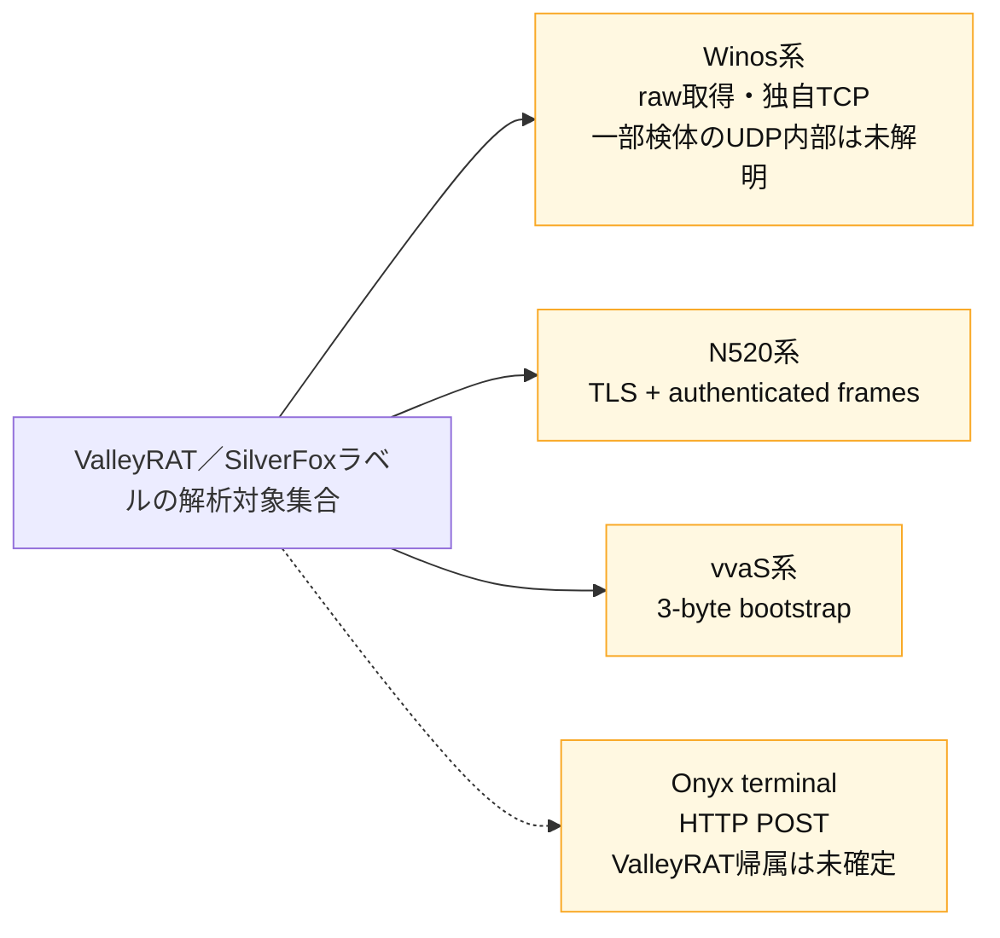
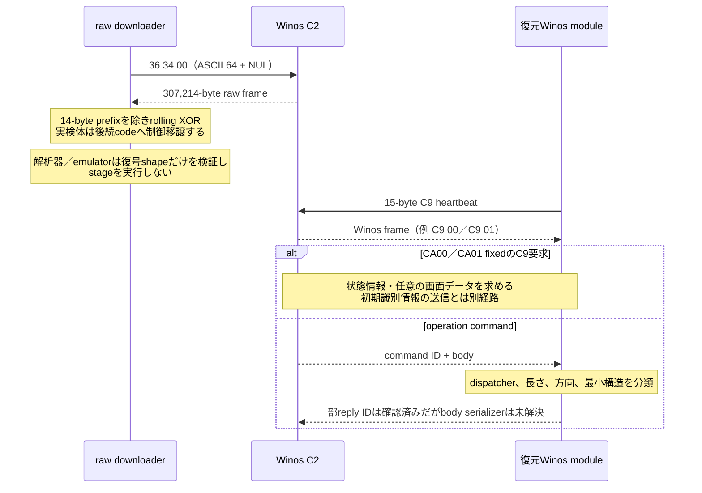
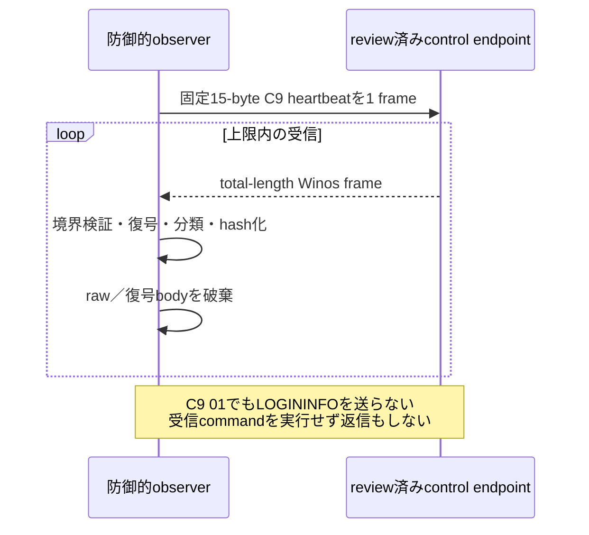
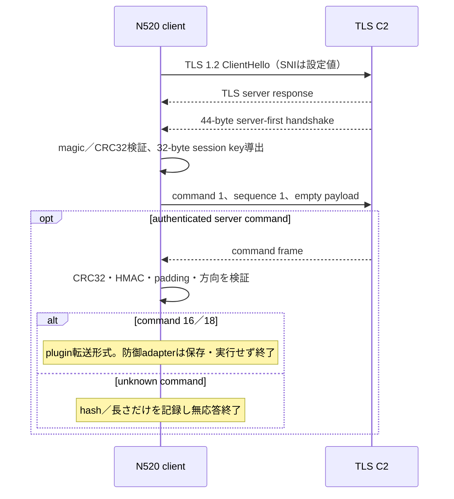
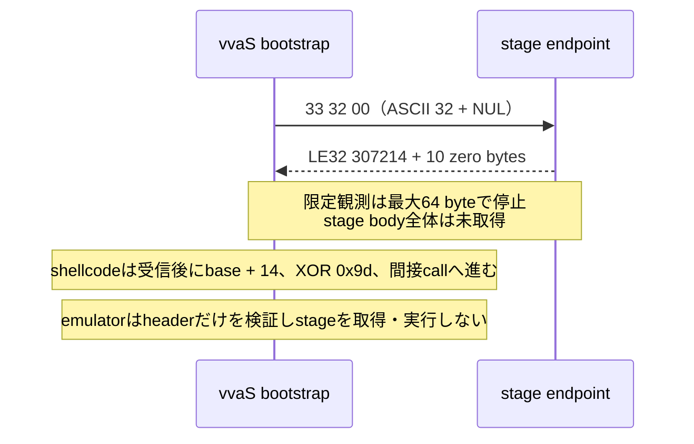
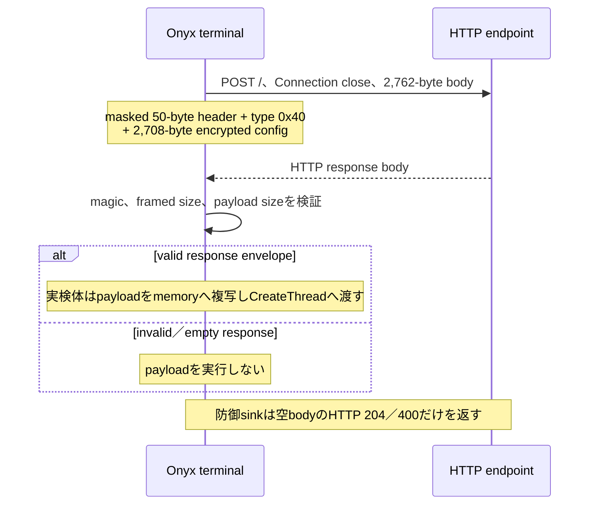

# ValleyRAT通信プロトコル解析とコード根拠

## 結論と適用範囲

確認済み事項と不足事項を検体・モジュール別に照合する[通信カバレッジ監査](PROTOCOL-COVERAGE.md)を追加しました。8件の解析プロファイルを8観点で管理しますが、製品の8バージョンや全通信の解明を意味しません。安全な試験の成功と実検体の通信仕様の確定は[オフライン観測・再生ガイド](OFFLINE-OBSERVATION-GUIDE.md)に従って分離します。

今回の解析では、`ValleyRAT`ラベルで扱われてきた検体群に単一の共通通信方式は確認できませんでした。少なくとも次の4系統を別の契約として扱う必要があります。

| 系統 | 通信の要約 | 証拠状態 |
|---|---|---|
| Winos | raw取得と独自TCP frame。CA01 fixedでは別のUDP接続分岐も存在 | TCP契約は既存根拠あり。UDP内部・全通信の網羅は未完了 |
| N520 | TLS 1.2上の44-byte server-first handshakeと、AES-CBC／HMAC-SHA256／CRC32で保護したcommand frame | handshakeとwire codecは確認済み。exact managed methodの公開記録は未完了 |
| vvaS | 平文`33 32 00`を送り、14-byte stage headerを受信するbootstrap | 復号shellcodeのlinear disassemblyと限定応答で確認済み。stage本体は未取得 |
| Onyx terminal | WinINetの`POST /`、固定2,762-byte body、妥当なresponse内のpayloadをthreadへ渡す | terminal codeはGhidraで確認済み。ただしValleyRAT terminalへの帰属は否定的で、live protocolは未確認 |

したがって、以下の図は一つの検体が4方式をfallbackすることを表しません。検体SHA-256、復元stage、program selector、cipher、方向を固定した相互に独立した解析結果です。実線はexact sample、復号artifact、PCAP、限定protocol応答のいずれかで直接確認した関係、点線は公開参照実装またはfamily帰属が未確定の関係です。

## Winos系

### 通信フロー

Winosには、固定長stageを取るraw downloaderと、復元後moduleが使う通常command sessionがあります。raw downloaderの`36 34 00`、legacy vvaSの`33 32 00`、MSOCF系の`39 39 00`は別契約であり、相互のaliasやfallbackではありません。

現在の防御的observerは、このうち固定`C9` heartbeatだけを送ります。`C9 01`やoperation commandを受けても、frameの長さ、SHA-256、command roleを記録して破棄し、登録、command実行、task reply、stage要求を行いません。

長期観測profileでは、接続ごとにheartbeatを1 frameだけ送り、最長8時間、最大256 frame、合計16,384 byteまで同じ接続を維持します。peer close、reset、接続拒否の場合だけ初回接続後に最大3回再接続するため、接続試行は合計最大4回です。再接続時もregistrationやoperation commandは追加送信しません。

### 通常frame

| offset | size | 内容 |
|---:|---:|---|
| `0x00` | 4 | little-endian `total_length`。4-byte length自身と10-byte headerを含む |
| `0x04` | 10 | session header。末尾`CA00`／`CA01`はvariant metadataであり、cipherを単独決定しない |
| `0x0e` | 可変 | 暗号化payload。復号後の先頭1 byteがcommand ID |

確認済みcipherは次の2方式です。

- `rolling_header_plus_0x36`: payload index 0には`header[0] + 0x36`、index 1以降には`header[(index - 1) mod 10] + 0x36`を8-bit加算した値をXORする。
- `fixed_xor_cc`: payloadの全byteを`0xCC`でXORする。

`FUN_180001f10`で確認したheartbeatは、全長`0x0f`、10-byte connection header、暗号化された1-byte command `0xC9`です。構築した15 byteは`FUN_180002890`へ渡されます。この証拠はheartbeat serializerだけを確定し、他のclient reply bodyを確定しません。

### raw downloader通信

| 項目 | 確認値 |
|---|---|
| client要求 | exact `36 34 00` |
| server raw全長 | exact 307,214 byte |
| prefix | 4-byte little-endian全長 + 10-byte material |
| 暗号化body | 307,200 byte |
| cipher | `rolling_header_plus_0x36` |
| 安全境界 | bodyのhashとshapeだけを記録し、保存・実行・制御移譲をしない |

`ConnectDownloadAndExecuteWinosStage`（selector `/Malware/ValleyRAT/20260810/31a3852f/nvml-stage-static.bin`、address `0x3a8`）では、`local_res8=0x3436`と末尾NULからwire上の`36 34 00`を復元しました。behavioral 1／2のoffline PCAP計4 sessionも同じrequestと307,214-byte responseに一致しています。

### command dispatcher解析

| profile | exact sample SHA-256 | selector／解析関数 | cipher・方向 | 主な確認範囲 |
|---|---|---|---|---|
| `winos-ca00-x86-4df8bda2` | `4df8bda2718afbd6ee42a96e0097d24592e451a1c6a05d9bffa8921c683733e2` | `/DailyAnalysis/20260825/ValleyRAT/4df8bda2/4df8bda2718afbd6ee42a96e0097d24592e451a1c6a05d9bffa8921c683733e2.bin`、`FUN_100108b6` | rolling、server→client | `00`〜`14`、`64/65`、`C9/CA` |
| `winos-ca01-x64-fixed-807361fe` | `807361fe1ff663ff3716a7e667e964f9d8fd15a20766bd2796bd46b1f67e168e` | `/DailyAnalysis/20260825/ValleyRAT/807361fe/807361fe1ff663ff3716a7e667e964f9d8fd15a20766bd2796bd46b1f67e168e.bin`、`FUN_18000f6a0` | fixed `0xCC`、server→client | `00`〜`13`、`64/65`、`C9/CA` |
| `winos-nvml-bootstrap-39b20658` | `39b206588c743913ce1235c398e7bcea37393afe16b1f5dc26428a659d2add60` | `/Malware/ValleyRAT/20260810/6469edd6/recovered/39b206588c743913ce1235c398e7bcea37393afe16b1f5dc26428a659d2add60.bin`、parser `FUN_180002bc0`、dispatcher `FUN_180008c40`、builder `FUN_180001f10` | rolling、server→client | module transfer `01/05`、module名要求`04`、heartbeat `C9` |
| `winos-nvml-main-024ab2a6` | `024ab2a62c91090e576557302c8aadd35ab77303bab4e4c7ba7964d3fccbbf2c` | `/Malware/ValleyRAT/20260810/6469edd6/recovered/024ab2a62c91090e576557302c8aadd35ab77303bab4e4c7ba7964d3fccbbf2c.bin`、parser `0x1800028d0`、dispatcher `FUN_180021ca0` | rolling、server→client | `00`〜`13`、desktop `59/5A`、delegated `64`〜`81`、`C9/CA` |
| `winos-nvml-remote-desktop-9ad36bf2` | `9ad36bf24222cc8591c72ea42beaf1b45db27699a67e359f05396b3108946353` | `/Malware/ValleyRAT/20260810/6469edd6/recovered/9ad36bf24222cc8591c72ea42beaf1b45db27699a67e359f05396b3108946353.bin`、builder `FUN_1800158c0`、parser `FUN_180015e50`、dispatcher `FUN_1800178f0` | rolling、双方向 | server `04`〜`14`,`C9`、client `00`〜`03`,`17`,`C9` |

CA00とCA01は同じcommand番号を一律に共有しません。たとえばCA00の`0B`はsecurity tray再起動、`0C`はevent log消去ですが、CA01の`0B`はevent log消去、`0C`はself restartです。各classifierはmodule descriptor `0xA44` byte、body offset `0xA45`、descriptor内size offset `0x208`などをvariant別に検証します。

NVML mainで確認した能力にはmodule転送、画面、file drop／実行、UTF-16 command line、event log消去、再起動・終了・電源操作、C2再設定、tunnel、desktop streamがあります。remote desktopでは画面frame、clipboard、geometry、bitmap formatをclient→server、capture・FPS・pixel mode・入力・表示・圧縮設定をserver→clientとして区別しています。これは検体の能力説明であり、emulatorがそれらを実行するという意味ではありません。

### registration情報

公開Winos実装からは、registrationが26個の固定長`TCHAR` fieldと末尾のWin32 `BOOL`を持つwide `LOGININFO`として復元できました。MSVC既定alignmentを仮定した参照layoutは4,688 byte、Winos frameへ包むと4,702 byteです。項目には内部／外部IP、network address、activity、computer／OS、CPU、disk／memory、GPU、foreground window、group、version、process、camera、chat client、AV、locale、monitor、system directory、hardware IDが含まれます。

ただしこれは公開参照実装のoffline fixtureです。exact repository sampleについて、この参照layoutとの完全一致や登録受理を証明したものではありません。2026-09-05にはCA01 fixedの初期識別情報送信関数を確認し、CA00／CA01 fixedのC9は別の状態・任意画面要求へ分類を修正しました。C9から参照LOGININFOへの遷移を仮定しません。[追加静的解析](STATIC-FOLLOWUP-20260905.md)を参照してください。[`winos_registration.py`](../winos_registration.py)は実端末情報を読まず、socket APIを持たず、external sendを常に拒否します。

## N520系

### 通信フロー

### 44-byte server-first handshake構造

| offset | size | 内容 |
|---:|---:|---|
| `0x00` | 4 | little-endian `session_id` |
| `0x04` | 4 | `session_id XOR ((((session_id >> 16) XOR (session_id & 0xffff)) OR 0xa5a50000))` |
| `0x08` | 32 | session key material。各byteを4-byte `session_id`の反復byteでXORしてsession keyを得る |
| `0x28` | 4 | bytes `0x00..0x27`に対するCRC32 |

### authenticated command frame構造

| 順序 | 内容 |
|---|---|
| outer header | `session_id:uint32le | declared:uint32le | sequence:uint32le`。`declared = encrypted_body_length + 8`、wire全長は`declared + 8` |
| encrypted body | `IV:16 | AES-CBC ciphertext | HMAC-SHA256:32`。HMAC対象は`IV + ciphertext` |
| outer trailer | preceding bytesに対する`CRC32:uint32le` |
| plaintext | `command:1 | payload | filler:0..15 | filler_length:1`をPKCS#7 paddingして暗号化 |

session keyの先頭16 byteをAES key、後半16 byteをHMAC keyとして使います。現行[`n520_protocol.py`](../../../common/n520_protocol.py)は32-byteのHMAC-SHA256 tag全体を検証します。command `1`はclient registration／heartbeat、`2`はclient result、`3`はstation identity、`17`はclient plugin request／execution、server command `16`／`18`はplugin bodyを含む転送形式として分類されています。

### コード解析の由来と制約

- exact sampleは`d11e793159f0da3c88a9ecebb8e5df88919843a1eeaaf71117377db58224a1ae`です。
- [`recover_n520_config.py`](../campaigns/single_pe/recover_n520_config.py)は.NET `GetConfigKey` methodのCILから配列長と`FieldRva` initializerを復元し、SHA-256で鍵を導出するAES-CBC設定文字列を静的復号しました。
- [`n520_protocol.py`](../../../common/n520_protocol.py)は上記handshake、key derivation、frame、AES-CBC、HMAC、CRC32、command bodyをpure codecとして固定し、[`test_n520_protocol.py`](../../../tests/test_n520_protocol.py)でround-tripと改変拒否を検証しています。
- 限定観測では44-byte handshakeのmagicとCRC32が一致し、空command `1`を1件送った後の20秒間にserver commandはありませんでした。
- 一方、caseの[`STATIC-LOGIC.md`](../../../../analysis-results/malware/valleyrat/versions/unknown/cases/d11e793159f0da3c88a9ecebb8e5df88919843a1eeaaf71117377db58224a1ae/STATIC-LOGIC.md)は`function_analysis_required`で、protocol codecに対応するexact managed method名、token、CIL本文、call graphを記録していません。したがってwire codecの再現性は確認済みですが、「どの検体methodのどの分岐から各offsetを得たか」という関数単位provenanceは未完了です。

この未完了部分を埋めるまでは、command `2`のpayload serializer、ACK値、追加sequence規則を推測せず、synthetic resultをwire送信しません。

## vvaS系

### 通信フロー

復号済みshellcode SHA-256は`b2586edb216bdb27ffbf5be5c091c94c62df8d87500ceacdc519e3016f7d7e2a`です。[`vvas-shellcode.asm`](../../../../analysis-results/malware/valleyrat/versions/unknown/cases/8bf54a76924ad62e3b5562826f0e491c4c498f166276b071c177b694762199f6/decoded-analysis/vvas-shellcode.asm)の次の命令列からprotocolを復元しました。

| offset | 命令の意味 | 得られたprotocol detail |
|---:|---|---|
| `0x1b0`〜`0x1c3` | stack上に`0x3233`とNULを置き、length 3でsend | request `33 32 00` |
| `0x20c` | 受信累積値を`0x4b00e`と比較 | 受信loopの比較値307,214 |
| `0x21d` | buffer baseへ`0x0e`を加算 | 14-byte prefixをskip |
| `0x224` | body byteを`0x9d`でXOR | stage復号key `0x9d` |
| `0x229` | XOR indexを`0x4b00e`と比較 | 復号loop上限307,214 |
| `0x231` | 変換後bufferを間接call | 実検体には受信codeの実行能力がある |

限定観測では先頭14 byteが`uint32le 307214 | 10 zero bytes`に一致しました。2026-09-05の保存asm再検証で、307,214は受信loopの総受信累積値の完全一致条件と確認しました。14-byte skip後の受信済みbodyは307,200 bytesですが、変換loopは307,214 bytesへ作用するため末尾14 bytesは受信範囲外・確保範囲内です。後段本体が未取得なので、その末尾の実効用途は未解明です。検体自身はこの受信loopでheaderの宣言値を検証せず、固定値を比較します。詳細と自動監査は[追加静的解析と実装境界](STATIC-FOLLOWUP-20260905.md)を参照してください。

## Onyx terminal系

OnyxはValleyRAT／SilverFox labelから調査を開始しましたが、N520、Winos、vvaSとのprotocol、config schema、構造marker、8関数opcode SHA-256が一致しません。以下は確認済みOnyx terminal componentの通信であり、ValleyRAT terminal一般の通信としては扱いません。

### request body構造

| offset | size | 内容 |
|---:|---:|---|
| `0x00` | `0x32` | `0x3a`でXORすると既知位置が固定値になるmasked header |
| `0x32` | 4 | little-endian type `0x40` |
| `0x36` | `0xa94` | 5-byte keyを用いるXOR-swap streamで変換した2,708-byte config |

復号configは`0x10c`-byte slotが4件並び、4件が同一の`host | uint16le port | UTF-16LE transport`を持つ場合だけ高確度とします。HTTP body全体は`0xaca`、すなわち2,762 byteです。

### response body構造

response headerは`0x36` byteです。offset `0x1e`のmagic `0x00013009`、offset `0x2e`のmagic `0x02072024`、offset `0x22`のframed size、offset `0x32`のpayload sizeを検証し、`framed_size = payload_size + 4`を要求します。payloadはoffset `0x36`から始まり、解析上限は16 MiB、末尾は最大16 byteのzero paddingだけを許可します。

### コード解析の由来

exact terminal shellcode SHA-256は`8582c2acf3d6b60dee15eb036da17186bdad9da146715172bc02c6b581643723`、Ghidra selectorは`/AdditionalAnalysis/20260811/Onyx4972/onyx-terminal-shellcode.bin`です。

| 関数 | 役割 | protocol detail |
|---|---|---|
| `EncryptOnyxConfigBuffer` (`0x3a0`) | request用config変換 | XOR-swap streamのrequest config境界 |
| `FindEmbeddedConfigMarker` (`0x404`) | marker・範囲検証 | terminal configの開始条件 |
| `PostOnyxHttpRequest` (`0x508`) | WinINet送受信 | `POST /`、request body、response受信 |
| `RunOnyxTerminalStage` (`0x844`) | 全体統括 | config復元、request構築、response検証後のpayload dispatch |

8関数すべてを明示selector付きGhidra MCPで逆コンパイルし、8関数間10 call edgeを記録しました。protocol fieldのoffline classifierは[`protocol.py`](../campaigns/onyx_qt_loader/protocol.py)、詳細な関数解析はcaseの[`STATIC-DEEP-DIVE.md`](../../../../analysis-results/malware/valleyrat/versions/unknown/cases/4972c57c77b67c080fca0e1f97e650894f7b60fb50d049ae9f43d83759fad701/STATIC-DEEP-DIVE.md)を正本とします。DNS解決とTCP/8080 openまでは確認しましたが、request bodyを外部へ送っていないためlive protocolは未確認です。

## 証拠対応表

| 得られた情報 | 主なコード解析 | 補強証拠 | 確度／未解決 |
|---|---|---|---|
| Winos frame境界とrolling XOR | `winos_protocol.py`、Ghidra parser群 | offline PCAP | 確認済み |
| Winos fixed `0xCC` variant | `FUN_18000f6a0`、`winos_ca01_contracts.py` | exact復元stage | 確認済み |
| Winos 15-byte `C9` heartbeat | `FUN_180001f10` → `FUN_180002890` | loopback／限定observer | heartbeatだけ確認済み |
| Winos raw downloader | `ConnectDownloadAndExecuteWinosStage` (`0x3a8`) | offline PCAP 4 session | 確認済み |
| Winos operation command IDs | 5 exact dispatcher profile | PCAPとcontract tests | ID、方向、長さは確認。多くのreply bodyは未解決 |
| Winos `LOGININFO` | 公開Winos sourceの`LOGININFO`／`sendLoginInfo`相当をoffline layout化 | 公開技術資料 | exact sampleには未束縛、外部送信禁止 |
| N520 config | .NET `GetConfigKey` CILと`FieldRva` initializer | 復号済みconfig metadata | 確認済み |
| N520 handshake／frame | `n520_protocol.py`のpure codec | 44-byte live handshake、round-trip／tamper tests | wire確認済み、exact managed method provenance未完了 |
| vvaS request／header／XOR | 復号shellcode `0x1b0`〜`0x231`のlinear disassembly | 14-byte prefixの限定応答 | header確認済み、full stage境界未解決 |
| Onyx HTTP request／response | Ghidra `0x3a0`、`0x508`、`0x844`と`protocol.py` | 静的復元config | offline確認済み、live未確認、ValleyRAT帰属なし |

## 安全上の境界

- 検体、復号stage、plugin、受信payloadは実行しません。
- Winos observerは固定`C9` heartbeat以外を送らず、`C9 01`でもregistrationを送信しません。
- N520は空command `1`以外を送らず、受信したpluginやcommandを保存・実行・返信しません。
- vvaSは固定3 byteだけを送る限定probeで、stageをdownloadしません。
- Onyxはloopback passive sinkだけを提供し、実検体がpayloadを実行し得るvalid responseを生成しません。
- TCP open、reset、timeout、HTTP statusだけではprotocol確認またはC2確定としません。

エミュレータの運用条件と現在の実装範囲は[防御的エミュレーション](EMULATION.md)、全family共通の初期data要件は[マルウェア外部通信の初期data要件](../../../docs/EXTERNAL-COMMUNICATION-DATA-REQUIREMENTS.md)を参照してください。
