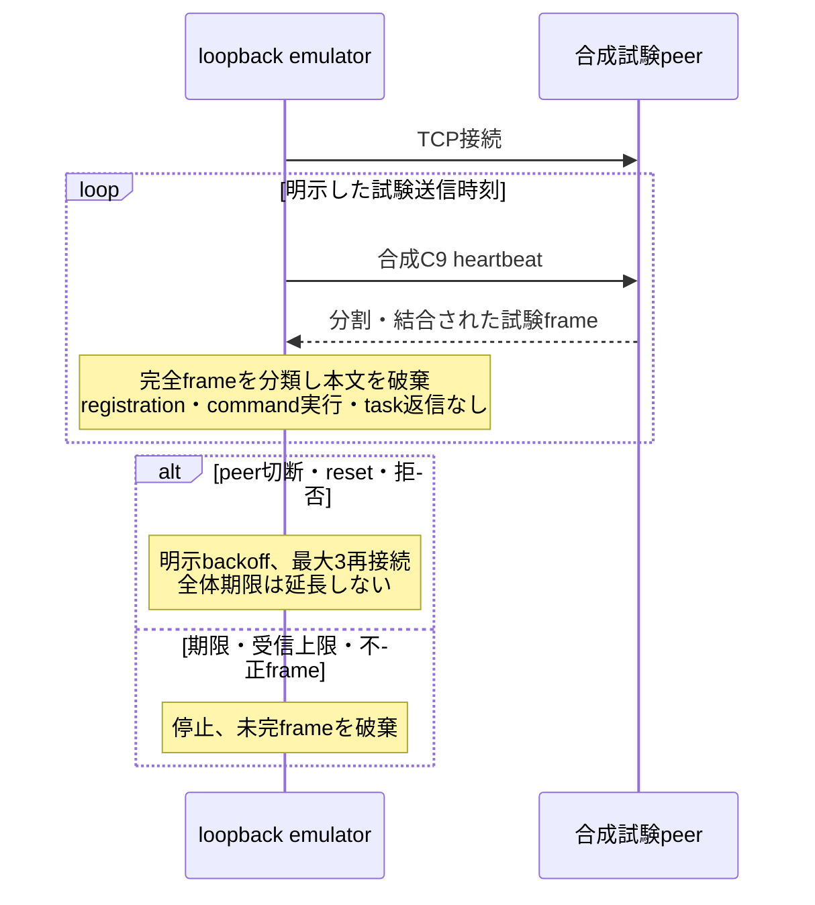

# ValleyRATの通信フロー・時間の検証

## 現在の到達点

2026-09-05、MalwareBazaarから未解析EXE 5件と配布IMG 1件を追加取得し、Kaliのnetwork無効Dockerで静的解析しました。[EXE群](../../../../analysis-results/collections/valleyrat-flow-20260905-five/STATIC-FOLLOWUP.md)と[IMG](../../../../analysis-results/collections/valleyrat-flow-20260905-img/STATIC-FOLLOWUP.md)は終端通信の解析待ちです。提供元ラベルは帰属の確定根拠にしていません。

今回追加した[`winos_flow_lab.py`](../winos_flow_lab.py)は、個別frameだけでなく、同一接続内の複数送信、送信間隔、分割受信、無通信待機、切断・再接続を試験するloopback専用emulatorです。**実検体の通信フロー・時間を完全に模倣した実装ではありません。** 既存の外部observerの送信回数・registration・leaseを変更していません。

## 実装した動作

| 項目 | 動作 | 根拠の扱い |
|---|---|---|
| variant | 既存registryのexact profile、sample hash、header suffix、cipherへ固定 | `ca01`だけでfixed XORとrolling XORを選ばない |
| 送信 | 合成headerの15-byte `C9`のみ | serializerと送信周期は別の証拠。登録・task resultは送信しない |
| 時刻 | 接続開始からの絶対offsetを指定 | 値は`synthetic_lab_policy_not_sample_derived`と出力 |
| 遅延 | 期限を過ぎた複数送信を連射せず、最新の1件だけを発行 | 省略件数、予定時刻、遅延msを記録する防御的試験policy |
| 受信 | TCP分割・結合を処理し、既存variant classifierへ渡して破棄 | 本文をprocess、shell、plugin、registry、filesystemへ渡さない |
| 部分frame | 最初のbyteからの期限で停止 | byteを少しずつ送るslow-dripでも期限を延長しない |
| 再接続 | peer EOF、reset、接続拒否等で初回＋最大3回 | 再接続を含む全体期限を延ばさない |
| 上限 | 最大8時間、接続ごとに256 frame／1 MiB／4096 read、単体64 KiB | malware由来の上限ではなく試験時の防御上限 |
| ログ | 接続、送信予定・実送信、受信chunk、frame分類、切断、再試行、終了 | 長さ・SHA-256・時刻だけ。受信本文・実端末情報は公開しない |

`FlowSession`はsocketと実時計を持たず、整数msの単調時計を注入します。`run_loopback`だけがsocketを作り、接続先は数値`127.0.0.1`固定です。任意host、DNS、外部接続optionはありません。未知commandも返信・実行せず、解析上限内で待機を続けます。登録完了を表すcommandが見えても、実際に登録を送った、または実C2に受理されたとは報告しません。



この図は追加した**試験実装**のフローです。malware固有の登録sequenceを証明する図ではありません。

## PCAPの時間情報の改善

[`winos_pcap.py`](../campaigns/signed_proxy_sideload/winos_pcap.py)の従来の`timestamp_epoch`は、frameの先頭byteが属するsegmentの時刻でした。分割や到着順逆転では、全体を処理できる時刻とは一致しません。互換fieldを保持して、各eventへ次を追加しました。

- `first_fragment_timestamp_epoch`: 当該frameを構成する採用segmentの最初の時刻
- `frame_complete_timestamp_epoch`: 全byteが揃う採用segmentの最も遅い時刻
- `fragment_span_seconds`: 上記2時刻の差
- `contributing_segment_count`と`timestamps_complete`

欠落・NaN・Infinityの時刻を0秒へ置換しません。同じsegment内の複数frameに架空の間隔を足さず、同一sequenceの再送を追加heartbeatへ数えません。TCP再構成で採用したbyteのcapture時刻であり、applicationの`Sleep`値やserver処理時間、正確なRTTを直接表しません。overlap競合、capture開始前の通信、非同期threadの因果関係は別途検証が必要です。

## 確認済みの試験と未解決事項

Kaliのnetwork無効Dockerで、新規試験と既存PCAP／orchestrator回帰の69テストが成功しました。同一loopback接続で3件のheartbeatを送り、registration challengeと未知commandを受けても返信・実行しないこと、接続拒否が合計4試行で止まることを検証しました。8時間上限は仮想時計で試験しており、8時間の実通信試験ではありません。

さらに既存host adapter・状態機械・variant・合成応答の59テストも成功し、合計128テストを確認しました。別途1秒の合成試験では、予定`0, 200, 450, 800 ms`に対し実送信は`0, 201, 450, 801 ms`で、受信2 frameを分類・破棄しました。peer側でも受信がC9 4件だけであることを照合しています。[試験記録](../config/evidence/flow-lab-20260905.json)は1回のloopback実測であり、malware由来の周期やリアルタイム精度保証ではありません。

未解決なのは、追加検体と終端Winos moduleとのbyte由来の対応、sample固有のregistration serializer・完了sequence、heartbeatのtimer条件・jitter、再接続とsession stateの保持条件です。loaderの削除再試行300 ms、サービス確認1秒などをheartbeat値に流用していません。既存終端3件の完全hashはMalwareBazaarで`hash_not_found`でした。保存済みprivate PCAP／終端成果物のアーカイブ1件は読み取り承認を取得しましたが、現環境で利用可能なIAM認証経路を確認できず、未取得です。認証なしの対象object確認はS3から`403`が返りました。

検体・復元payload・受信commandは実行していません。新規外部C2接続、配布URLからの後段取得、既存observerの置換も実施していません。取得済みraw検体・Ghidra project・逆コンパイル全文はKaliの非公開領域へ保持し、Gitへは入れていません。今回取得したraw成果物のS3保管は未実施であり、Kali上の保持とS3保管完了を区別します。

## 再実行

[専用Docker構成](../../../docker/valleyrat-protocol-lab/README.md)で試験できます。既存のKali loopback試験peerへ接続する場合は、同じ隔離container内で次を実行します。

```bash
python -B analysis-framework/malware/valleyrat/winos_flow_lab.py \
  --profile-id winos-ca01-x64-fixed-807361fe --port 45678 \
  --duration-ms 3000 --heartbeat-offsets-ms 0,1000,2000
```

このportにpeerがいなければ、最大3回の再接続後に終了します。CLIは各eventをJSONLで逐次出力します。指定例の1秒は合成試験値であり、今回の検体解析で確定したheartbeat周期ではありません。
