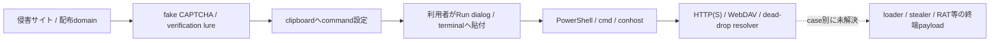

# ClickFix日次調査: 2026-07-30

## 結論

2026年7月30日時点の最新情報を最大50件へ正規化しました。ThreatFoxの本日観測を優先し、
明示指定の`tbhadvisors.com`とclickfix.proの最新行で補完しています。

- 解析対象: 50件
- ライブHTTP応答あり: 30件
- 終端binaryを上限内で観測: 0件
- HTTP 207 WebDAV Multi-Status観測: 6件
- Telegram resolverで次段token未復元: 1件
- JavaScript実行: 0件
- マルウェア実行: 0件
- [インフラ調査サマリー](INFRASTRUCTURE-SUMMARY.md)
- [Hatching Triage照合サマリー](TRIAGE-SUMMARY.md)

情報源の最新時刻と「本日観測」は別です。ClickFix Hunterとclickfix.proは取得時点で
7月29日以前が最新でしたが、ThreatFoxには2026-07-30の新規IOCがありました。

## 情報源別

| 情報源 | 件数 |
|---|---:|
| ClickFix Campaign Monitor（情報源） | 11 |
| ClickFix Hunter（情報源） | 1 |
| ThreatFox（情報源） | 38 |

## 観測した感染チェーン

ClickFixは手法であり、ClearFakeはWeb inject／配布clusterです。同じtagを持つだけで
終端malwareやactorを同一としません。

## command系列

| 系列 | 件数 |
|---|---:|
| `unverified` | 49 |
| `telegram_dead_drop_powershell` | 1 |

## 検知の要点

- RunMRUへの`powershell`、`mshta`、`rundll32`、`conhost`等と、`irm`／`iwr`／`iex`、
  `--headless`、`@SSL`、`/webdav`等を相関する。
- `powershell.exe`単独、domain単独、IP単独では検知しない。
- WebDAV系列は`conhost --headless`、`pushd`、UNC `@SSL`、`rundll32` export呼出しを組み合わせる。
- Telegram等の正規サービスはdead-drop resolverとして文脈に残すが、サービス全体をIOCにしない。

各caseの`rules/sigma.yml`に、case証跡へ対応するSigma候補を保存しています。

## 対象一覧

| domain | 情報源 | command系列 | ライブ | 結果 |
|---|---|---|---|---|
| `tbhadvisors.com` | `ClickFix Hunter` | `telegram_dead_drop_powershell` | 応答あり | [case](../../tbhadvisors.com/cases/20260730-clickfix-hunter-efdbd9a6673f/README.md) |
| `luahrq.snowssurfshack.com` | `ThreatFox` | `unverified` | 応答あり | [case](../../luahrq.snowssurfshack.com/cases/20260730-threatfox-1863887/README.md) |
| `snowssurfshack.com` | `ThreatFox` | `unverified` | 応答あり | [case](../../snowssurfshack.com/cases/20260730-threatfox-1863886/README.md) |
| `zmgwbau.smoothoutlawcoffee.com` | `ThreatFox` | `unverified` | 応答あり | [case](../../zmgwbau.smoothoutlawcoffee.com/cases/20260730-threatfox-1863885/README.md) |
| `n5u3jyf6.plumberservices.store` | `ThreatFox` | `unverified` | 応答あり | [case](../../n5u3jyf6.plumberservices.store/cases/20260730-threatfox-1863884/README.md) |
| `smoothoutlawcoffee.com` | `ThreatFox` | `unverified` | 応答あり | [case](../../smoothoutlawcoffee.com/cases/20260730-threatfox-1863883/README.md) |
| `gysymf.sarahelizabethphotoandfilm.com` | `ThreatFox` | `unverified` | 応答なし | [case](../../gysymf.sarahelizabethphotoandfilm.com/cases/20260730-threatfox-1863879/README.md) |
| `sarahelizabethphotoandfilm.com` | `ThreatFox` | `unverified` | 応答あり | [case](../../sarahelizabethphotoandfilm.com/cases/20260730-threatfox-1863878/README.md) |
| `wohinmn.smallshopsandwhatknot.com` | `ThreatFox` | `unverified` | 応答なし | [case](../../wohinmn.smallshopsandwhatknot.com/cases/20260730-threatfox-1863877/README.md) |
| `smallshopsandwhatknot.com` | `ThreatFox` | `unverified` | 応答あり | [case](../../smallshopsandwhatknot.com/cases/20260730-threatfox-1863876/README.md) |
| `zapas-xoga-cig.cc` | `ThreatFox` | `unverified` | 応答あり | [case](../../zapas-xoga-cig.cc/cases/20260730-threatfox-1863875/README.md) |
| `rhyawn.sandsautorepairmentor.com` | `ThreatFox` | `unverified` | 応答なし | [case](../../rhyawn.sandsautorepairmentor.com/cases/20260730-threatfox-1863874/README.md) |
| `sandsautorepairmentor.com` | `ThreatFox` | `unverified` | 応答あり | [case](../../sandsautorepairmentor.com/cases/20260730-threatfox-1863873/README.md) |
| `ouvavde.skillitacademy.com` | `ThreatFox` | `unverified` | 応答なし | [case](../../ouvavde.skillitacademy.com/cases/20260730-threatfox-1863868/README.md) |
| `skillitacademy.com` | `ThreatFox` | `unverified` | 応答あり | [case](../../skillitacademy.com/cases/20260730-threatfox-1863867/README.md) |
| `i48ybkyy.nakedlesbianskiss.com` | `ThreatFox` | `unverified` | 応答あり | [case](../../i48ybkyy.nakedlesbianskiss.com/cases/20260730-threatfox-1863866/README.md) |
| `23ida6x1.pizzadays.net` | `ThreatFox` | `unverified` | 応答なし | [case](../../23ida6x1.pizzadays.net/cases/20260730-threatfox-1863864/README.md) |
| `lprxjf.samanthadefalco.com` | `ThreatFox` | `unverified` | 応答なし | [case](../../lprxjf.samanthadefalco.com/cases/20260730-threatfox-1863862/README.md) |
| `samanthadefalco.com` | `ThreatFox` | `unverified` | 応答あり | [case](../../samanthadefalco.com/cases/20260730-threatfox-1863861/README.md) |
| `aahtioq.sketchetch.net` | `ThreatFox` | `unverified` | 応答なし | [case](../../aahtioq.sketchetch.net/cases/20260730-threatfox-1863860/README.md) |
| `sketchetch.net` | `ThreatFox` | `unverified` | 応答あり | [case](../../sketchetch.net/cases/20260730-threatfox-1863859/README.md) |
| `qbywphal.liberty-token.org` | `ThreatFox` | `unverified` | 応答あり | [case](../../qbywphal.liberty-token.org/cases/20260730-threatfox-1863855/README.md) |
| `udofiy.salpizzasewell.com` | `ThreatFox` | `unverified` | 応答なし | [case](../../udofiy.salpizzasewell.com/cases/20260730-threatfox-1863854/README.md) |
| `salpizzasewell.com` | `ThreatFox` | `unverified` | 応答あり | [case](../../salpizzasewell.com/cases/20260730-threatfox-1863853/README.md) |
| `frrnaly.sixstar-iptv.com` | `ThreatFox` | `unverified` | 応答なし | [case](../../frrnaly.sixstar-iptv.com/cases/20260730-threatfox-1863852/README.md) |
| `sixstar-iptv.com` | `ThreatFox` | `unverified` | 応答あり | [case](../../sixstar-iptv.com/cases/20260730-threatfox-1863851/README.md) |
| `ahohcm.sainidigirocket.com` | `ThreatFox` | `unverified` | 応答なし | [case](../../ahohcm.sainidigirocket.com/cases/20260730-threatfox-1863846/README.md) |
| `sainidigirocket.com` | `ThreatFox` | `unverified` | 応答あり | [case](../../sainidigirocket.com/cases/20260730-threatfox-1863845/README.md) |
| `caagwrk.simplyturfandgreenwall.com` | `ThreatFox` | `unverified` | 応答なし | [case](../../caagwrk.simplyturfandgreenwall.com/cases/20260730-threatfox-1863844/README.md) |
| `simplyturfandgreenwall.com` | `ThreatFox` | `unverified` | 応答あり | [case](../../simplyturfandgreenwall.com/cases/20260730-threatfox-1863843/README.md) |
| `2l7nxx4r.pinellascountyroofers.com` | `ThreatFox` | `unverified` | 応答なし | [case](../../2l7nxx4r.pinellascountyroofers.com/cases/20260730-threatfox-1863842/README.md) |
| `xhidxu.runmarine-services.com` | `ThreatFox` | `unverified` | 応答なし | [case](../../xhidxu.runmarine-services.com/cases/20260730-threatfox-1863841/README.md) |
| `runmarine-services.com` | `ThreatFox` | `unverified` | 応答あり | [case](../../runmarine-services.com/cases/20260730-threatfox-1863837/README.md) |
| `bypmobu.shopprincesshair.com` | `ThreatFox` | `unverified` | 応答なし | [case](../../bypmobu.shopprincesshair.com/cases/20260730-threatfox-1863836/README.md) |
| `shopprincesshair.com` | `ThreatFox` | `unverified` | 応答あり | [case](../../shopprincesshair.com/cases/20260730-threatfox-1863835/README.md) |
| `dfapbv.rugsofus.com` | `ThreatFox` | `unverified` | 応答なし | [case](../../dfapbv.rugsofus.com/cases/20260730-threatfox-1863834/README.md) |
| `hywjlgp.shopmagnoliaonmain.com` | `ThreatFox` | `unverified` | 応答なし | [case](../../hywjlgp.shopmagnoliaonmain.com/cases/20260730-threatfox-1863833/README.md) |
| `rugsofus.com` | `ThreatFox` | `unverified` | 応答あり | [case](../../rugsofus.com/cases/20260730-threatfox-1863832/README.md) |
| `shopmagnoliaonmain.com` | `ThreatFox` | `unverified` | 応答あり | [case](../../shopmagnoliaonmain.com/cases/20260730-threatfox-1863830/README.md) |
| `it-irrigation-control-network.garden` | `ClickFix Campaign Monitor` | `unverified` | 応答あり | [case](../../it-irrigation-control-network.garden/cases/20260730-clickfix-pro-b22c16f20a2e/README.md) |
| `pr7b8geo.simply-bpo.me` | `ClickFix Campaign Monitor` | `unverified` | 応答なし | [case](../../pr7b8geo.simply-bpo.me/cases/20260730-clickfix-pro-4dc947af600f/README.md) |
| `spamgym.asia` | `ClickFix Campaign Monitor` | `unverified` | 応答あり | [case](../../spamgym.asia/cases/20260730-clickfix-pro-d0d2355fb525/README.md) |
| `hl8gdae9.kkslot777.asia` | `ClickFix Campaign Monitor` | `unverified` | 応答なし | [case](../../hl8gdae9.kkslot777.asia/cases/20260730-clickfix-pro-34c1f7ed77a4/README.md) |
| `rct52dop.shop-lipogummy.com` | `ClickFix Campaign Monitor` | `unverified` | 応答なし | [case](../../rct52dop.shop-lipogummy.com/cases/20260730-clickfix-pro-b9ae066b2849/README.md) |
| `509ukk9c.enf90.vip` | `ClickFix Campaign Monitor` | `unverified` | 応答あり | [case](../../509ukk9c.enf90.vip/cases/20260730-clickfix-pro-1c03f398bbcf/README.md) |
| `8yajh9kt.en-us--tupitea.com` | `ClickFix Campaign Monitor` | `unverified` | 応答なし | [case](../../8yajh9kt.en-us--tupitea.com/cases/20260730-clickfix-pro-e3121f903611/README.md) |
| `0mx8cbge.fa1xbet.vip` | `ClickFix Campaign Monitor` | `unverified` | 応答あり | [case](../../0mx8cbge.fa1xbet.vip/cases/20260730-clickfix-pro-f65a07daf9af/README.md) |
| `i0wrocb4.bet90forward.win` | `ClickFix Campaign Monitor` | `unverified` | 応答あり | [case](../../i0wrocb4.bet90forward.win/cases/20260730-clickfix-pro-63b7177f03cd/README.md) |
| `sh6ze53a.bet90forward.win` | `ClickFix Campaign Monitor` | `unverified` | 応答あり | [case](../../sh6ze53a.bet90forward.win/cases/20260730-clickfix-pro-9496a20d4111/README.md) |
| `olptz5o4.jadoou.beauty` | `ClickFix Campaign Monitor` | `unverified` | 応答あり | [case](../../olptz5o4.jadoou.beauty/cases/20260730-clickfix-pro-1eb782d9e612/README.md) |

## OSINTによる背景

- [Microsoft: ClickFixの攻撃チェーンと検知](https://www.microsoft.com/en-us/security/blog/2025/08/21/think-before-you-clickfix-analyzing-the-clickfix-social-engineering-technique/)
- [Proofpoint: ClickFixの普及と配布マルウェア](https://www.proofpoint.com/us/blog/threat-insight/security-brief-clickfix-social-engineering-technique-floods-threat-landscape)
- [Unit 42: ClickFixの防御・ハンティング](https://unit42.paloaltonetworks.com/preventing-clickfix-attack-vector/)
- [ClickFix Hunter](https://clickfix.carsonww.com/domains/tbhadvisors.com)
- [ClickFix Campaign Monitor](https://clickfix.pro/)
- [ThreatFox clickfix](https://threatfox.abuse.ch/browse/tag/clickfix/)
- [ThreatFox clearfake](https://threatfox.abuse.ch/browse/tag/clearfake/)

## 制約

- ライブ確認はGET、最大2リダイレクト、landing 262144 bytes、
  stage 1048576 bytesに制限しました。
- JavaScript、clipboard操作、Windows command、取得物は実行していません。
- provider生応答と取得本文はGit管理外へ保存し、公開側には正規化結果だけを残しました。
- TLS証明書検証を無効にした限定観測を含むため、本文hashと時刻を証跡として併記しています。
- 収集ID: `clickfix-daily-20260730`
