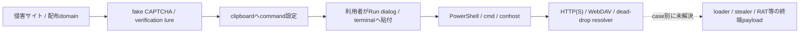

# ClickFix日次調査: 2026-08-01

## 結論

2026-08-01時点の最新情報を最大50件へ正規化しました。ThreatFoxの本日観測を優先し、
明示指定の`tbhadvisors.com`とclickfix.proの最新行で補完しています。

- 解析対象: 50件
- ライブHTTP応答あり: 30件
- 終端binaryを上限内で観測: 0件
- HTTP 207 WebDAV Multi-Status観測: 11件
- Telegram resolverで次段token未復元: 1件
- JavaScript実行: 0件
- マルウェア実行: 0件

情報源の最新時刻と「本日観測」は別です。ClickFix Hunterとclickfix.proは取得時点で
2026-08-01より前の観測を含み、ThreatFoxには2026-08-01の新規IOCがありました。

## 情報源別

| 情報源 | 件数 |
|---|---:|
| ClickFix Campaign Monitor（情報源） | 42 |
| ClickFix Hunter（情報源） | 1 |
| ThreatFox（情報源） | 7 |

## 観測した感染チェーン

ClickFixは手法であり、ClearFakeはWeb inject／配布clusterです。同じtagを持つだけで
終端malwareやactorを同一としません。

## command系列

| 系列 | 件数 |
|---|---:|
| `unverified` | 49 |
| `telegram_dead_drop_powershell` | 1 |

## 検知の要点

- RunMRUへの`powershell`、`mshta`、`rundll32`、`conhost`等と、`irm`／`iwr`／`iex`、
  `--headless`、`@SSL`、`/webdav`等を相関する。
- `powershell.exe`単独、domain単独、IP単独では検知しない。
- WebDAV系列は`conhost --headless`、`pushd`、UNC `@SSL`、`rundll32` export呼出しを組み合わせる。
- Telegram等の正規サービスはdead-drop resolverとして文脈に残すが、サービス全体をIOCにしない。

各caseの`rules/sigma.yml`に、case証跡へ対応するSigma候補を保存しています。

## 対象一覧

| domain | 情報源 | command系列 | ライブ | 結果 |
|---|---|---|---|---|
| `tbhadvisors.com` | `ClickFix Hunter` | `telegram_dead_drop_powershell` | 応答あり | [case](../../tbhadvisors.com/cases/20260801-clickfix-hunter-efdbd9a6673f/README.md) |
| `fitfirst.net` | `ThreatFox` | `unverified` | 応答あり | [case](../../fitfirst.net/cases/20260801-threatfox-1866422/README.md) |
| `zpvedf.franklintowing.net` | `ThreatFox` | `unverified` | 応答あり | [case](../../zpvedf.franklintowing.net/cases/20260801-threatfox-1866421/README.md) |
| `franklintowing.net` | `ThreatFox` | `unverified` | 応答あり | [case](../../franklintowing.net/cases/20260801-threatfox-1866420/README.md) |
| `72mv6y0m.twinglassca.com` | `ThreatFox` | `unverified` | 応答あり | [case](../../72mv6y0m.twinglassca.com/cases/20260801-threatfox-1866413/README.md) |
| `ycazjth.fishersace.com` | `ThreatFox` | `unverified` | 応答なし | [case](../../ycazjth.fishersace.com/cases/20260801-threatfox-1866412/README.md) |
| `fishersace.com` | `ThreatFox` | `unverified` | 応答あり | [case](../../fishersace.com/cases/20260801-threatfox-1866411/README.md) |
| `cpnisnik.bearriverchiropractic.com` | `ThreatFox` | `unverified` | 応答あり | [case](../../cpnisnik.bearriverchiropractic.com/cases/20260801-threatfox-1866410/README.md) |
| `brerohht.cocoricobeachbar.com` | `ClickFix Campaign Monitor` | `unverified` | 応答なし | [case](../../brerohht.cocoricobeachbar.com/cases/20260801-clickfix-pro-cf130434cbb2/README.md) |
| `emsj32em.roundtheclockcare.net` | `ClickFix Campaign Monitor` | `unverified` | 応答なし | [case](../../emsj32em.roundtheclockcare.net/cases/20260801-clickfix-pro-1d5741ff12fd/README.md) |
| `vj7eaayr.fa1xbet.vip` | `ClickFix Campaign Monitor` | `unverified` | 応答あり | [case](../../vj7eaayr.fa1xbet.vip/cases/20260801-clickfix-pro-9b3058fdb931/README.md) |
| `spamgym.asia` | `ClickFix Campaign Monitor` | `unverified` | 応答あり | [case](../../spamgym.asia/cases/20260801-clickfix-pro-4644b65909a5/README.md) |
| `project-jetbrk03429.pages.dev` | `ClickFix Campaign Monitor` | `unverified` | 応答あり | [case](../../project-jetbrk03429.pages.dev/cases/20260801-clickfix-pro-081e64cf6799/README.md) |
| `vn3oxoji.readthisintro.xyz` | `ClickFix Campaign Monitor` | `unverified` | 応答あり | [case](../../vn3oxoji.readthisintro.xyz/cases/20260801-clickfix-pro-4ef402106c9a/README.md) |
| `it-irrigation-control-network.garden` | `ClickFix Campaign Monitor` | `unverified` | 応答あり | [case](../../it-irrigation-control-network.garden/cases/20260801-clickfix-pro-b22c16f20a2e/README.md) |
| `pr7b8geo.simply-bpo.me` | `ClickFix Campaign Monitor` | `unverified` | 応答なし | [case](../../pr7b8geo.simply-bpo.me/cases/20260801-clickfix-pro-4dc947af600f/README.md) |
| `hl8gdae9.kkslot777.asia` | `ClickFix Campaign Monitor` | `unverified` | 応答なし | [case](../../hl8gdae9.kkslot777.asia/cases/20260801-clickfix-pro-34c1f7ed77a4/README.md) |
| `rct52dop.shop-lipogummy.com` | `ClickFix Campaign Monitor` | `unverified` | 応答なし | [case](../../rct52dop.shop-lipogummy.com/cases/20260801-clickfix-pro-b9ae066b2849/README.md) |
| `509ukk9c.enf90.vip` | `ClickFix Campaign Monitor` | `unverified` | 応答あり | [case](../../509ukk9c.enf90.vip/cases/20260801-clickfix-pro-1c03f398bbcf/README.md) |
| `8yajh9kt.en-us--tupitea.com` | `ClickFix Campaign Monitor` | `unverified` | 応答なし | [case](../../8yajh9kt.en-us--tupitea.com/cases/20260801-clickfix-pro-e3121f903611/README.md) |
| `0mx8cbge.fa1xbet.vip` | `ClickFix Campaign Monitor` | `unverified` | 応答あり | [case](../../0mx8cbge.fa1xbet.vip/cases/20260801-clickfix-pro-f65a07daf9af/README.md) |
| `i0wrocb4.bet90forward.win` | `ClickFix Campaign Monitor` | `unverified` | 応答あり | [case](../../i0wrocb4.bet90forward.win/cases/20260801-clickfix-pro-63b7177f03cd/README.md) |
| `sh6ze53a.bet90forward.win` | `ClickFix Campaign Monitor` | `unverified` | 応答あり | [case](../../sh6ze53a.bet90forward.win/cases/20260801-clickfix-pro-9496a20d4111/README.md) |
| `olptz5o4.jadoou.beauty` | `ClickFix Campaign Monitor` | `unverified` | 応答あり | [case](../../olptz5o4.jadoou.beauty/cases/20260801-clickfix-pro-1eb782d9e612/README.md) |
| `b7tibc5u.luxerabet1000.com` | `ClickFix Campaign Monitor` | `unverified` | 応答あり | [case](../../b7tibc5u.luxerabet1000.com/cases/20260801-clickfix-pro-4b352c2a4ded/README.md) |
| `iiamtrbo.liketudong.biz` | `ClickFix Campaign Monitor` | `unverified` | 応答あり | [case](../../iiamtrbo.liketudong.biz/cases/20260801-clickfix-pro-58c442057afc/README.md) |
| `4dfx0u7r.stgsolar.hu` | `ClickFix Campaign Monitor` | `unverified` | 応答あり | [case](../../4dfx0u7r.stgsolar.hu/cases/20260801-clickfix-pro-87cc85a6e820/README.md) |
| `rwxe9b0g.riherino.com` | `ClickFix Campaign Monitor` | `unverified` | 応答あり | [case](../../rwxe9b0g.riherino.com/cases/20260801-clickfix-pro-edead9fa1e9a/README.md) |
| `5ufm19dl.pdfbama.com` | `ClickFix Campaign Monitor` | `unverified` | 応答なし | [case](../../5ufm19dl.pdfbama.com/cases/20260801-clickfix-pro-3051662a57fa/README.md) |
| `gac8up0t.thetokestudio.com` | `ClickFix Campaign Monitor` | `unverified` | 応答なし | [case](../../gac8up0t.thetokestudio.com/cases/20260801-clickfix-pro-7bfc176c9c0f/README.md) |
| `xt19c0ua.casinomhub.bet` | `ClickFix Campaign Monitor` | `unverified` | 応答あり | [case](../../xt19c0ua.casinomhub.bet/cases/20260801-clickfix-pro-fb008c99a0ad/README.md) |
| `bjf54ffm.behtarin-site-shartbandi.com` | `ClickFix Campaign Monitor` | `unverified` | 応答なし | [case](../../bjf54ffm.behtarin-site-shartbandi.com/cases/20260801-clickfix-pro-ef77ae9762d8/README.md) |
| `qhy0wolx.casinomhub.bet` | `ClickFix Campaign Monitor` | `unverified` | 応答あり | [case](../../qhy0wolx.casinomhub.bet/cases/20260801-clickfix-pro-3eddd67a8d9d/README.md) |
| `7g5swyfn.bazipoop.com` | `ClickFix Campaign Monitor` | `unverified` | 応答あり | [case](../../7g5swyfn.bazipoop.com/cases/20260801-clickfix-pro-547a6a1d2f21/README.md) |
| `b53jdkck.photoshopvn.net` | `ClickFix Campaign Monitor` | `unverified` | 応答あり | [case](../../b53jdkck.photoshopvn.net/cases/20260801-clickfix-pro-288e9d499336/README.md) |
| `sax166rh.funkboi.com` | `ClickFix Campaign Monitor` | `unverified` | 応答あり | [case](../../sax166rh.funkboi.com/cases/20260801-clickfix-pro-d849de1bf3dd/README.md) |
| `tafhu17n.nextbahis.blog` | `ClickFix Campaign Monitor` | `unverified` | 応答なし | [case](../../tafhu17n.nextbahis.blog/cases/20260801-clickfix-pro-ab4b3587dd98/README.md) |
| `fvidq4p8.kaltourusa.com` | `ClickFix Campaign Monitor` | `unverified` | 応答なし | [case](../../fvidq4p8.kaltourusa.com/cases/20260801-clickfix-pro-286a3a305f2f/README.md) |
| `3cqx4k4v.kaltourusa.com` | `ClickFix Campaign Monitor` | `unverified` | 応答なし | [case](../../3cqx4k4v.kaltourusa.com/cases/20260801-clickfix-pro-0f75e42b02a6/README.md) |
| `q486u4hr.kaltourusa.com` | `ClickFix Campaign Monitor` | `unverified` | 応答なし | [case](../../q486u4hr.kaltourusa.com/cases/20260801-clickfix-pro-f3634936efe2/README.md) |
| `tld44yiu.jennyrussianbluepalace.com` | `ClickFix Campaign Monitor` | `unverified` | 応答なし | [case](../../tld44yiu.jennyrussianbluepalace.com/cases/20260801-clickfix-pro-3e4ef13e2a6c/README.md) |
| `mlmaatvd.behtarin-site-shartbandi.com` | `ClickFix Campaign Monitor` | `unverified` | 応答なし | [case](../../mlmaatvd.behtarin-site-shartbandi.com/cases/20260801-clickfix-pro-642bc43f84b0/README.md) |
| `hdz7omr1.nextbahis.blog` | `ClickFix Campaign Monitor` | `unverified` | 応答なし | [case](../../hdz7omr1.nextbahis.blog/cases/20260801-clickfix-pro-df378c3ffc03/README.md) |
| `p43qsij4.nextbahis.one` | `ClickFix Campaign Monitor` | `unverified` | 応答なし | [case](../../p43qsij4.nextbahis.one/cases/20260801-clickfix-pro-f0025103e835/README.md) |
| `impur-treacheryperepelitsa.wiki` | `ClickFix Campaign Monitor` | `unverified` | 応答あり | [case](../../impur-treacheryperepelitsa.wiki/cases/20260801-clickfix-pro-3e0864c324be/README.md) |
| `gardenworkflowhub.garden` | `ClickFix Campaign Monitor` | `unverified` | 応答あり | [case](../../gardenworkflowhub.garden/cases/20260801-clickfix-pro-7d2b6e8733e2/README.md) |
| `subterranean-mineral-map.garden` | `ClickFix Campaign Monitor` | `unverified` | 応答あり | [case](../../subterranean-mineral-map.garden/cases/20260801-clickfix-pro-3f053cebc8da/README.md) |
| `g1wgxqj5.nextbahis.one` | `ClickFix Campaign Monitor` | `unverified` | 応答なし | [case](../../g1wgxqj5.nextbahis.one/cases/20260801-clickfix-pro-02d19a627bf0/README.md) |
| `cr9i8up3.stgsolar.hu` | `ClickFix Campaign Monitor` | `unverified` | 応答あり | [case](../../cr9i8up3.stgsolar.hu/cases/20260801-clickfix-pro-5785efaf31a2/README.md) |
| `g9epkl53.site-asli-bedon-filter-1xbet.com` | `ClickFix Campaign Monitor` | `unverified` | 応答なし | [case](../../g9epkl53.site-asli-bedon-filter-1xbet.com/cases/20260801-clickfix-pro-0ca12f966de0/README.md) |

## OSINTによる背景

- [Microsoft: ClickFixの攻撃チェーンと検知](https://www.microsoft.com/en-us/security/blog/2025/08/21/think-before-you-clickfix-analyzing-the-clickfix-social-engineering-technique/)
- [Proofpoint: ClickFixの普及と配布マルウェア](https://www.proofpoint.com/us/blog/threat-insight/security-brief-clickfix-social-engineering-technique-floods-threat-landscape)
- [Unit 42: ClickFixの防御・ハンティング](https://unit42.paloaltonetworks.com/preventing-clickfix-attack-vector/)
- [ClickFix Hunter](https://clickfix.carsonww.com/domains/tbhadvisors.com)
- [ClickFix Campaign Monitor](https://clickfix.pro/)
- [ThreatFox clickfix](https://threatfox.abuse.ch/browse/tag/clickfix/)
- [ThreatFox clearfake](https://threatfox.abuse.ch/browse/tag/clearfake/)

## 制約

- ライブ確認はGET、最大2リダイレクト、landing 262144 bytes、
  stage 1048576 bytesに制限しました。
- JavaScript、clipboard操作、Windows command、取得物は実行していません。
- provider生応答と取得本文はGit管理外へ保存し、公開側には正規化結果だけを残しました。
- TLS証明書検証を無効にした限定観測を含むため、本文hashと時刻を証跡として併記しています。
- 収集ID: `clickfix-daily-20260801`
