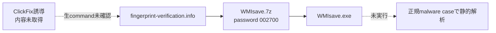

# ClickFix配信チェーン

| phase | 証跡 | 状態 |
|---|---|---|
| 誘導 | ClickFix由来との提供情報 | provider context。画面・commandは未取得 |
| 配布 | Zone.Identifierの完全URL | confirmed |
| archive | `WMIsave.7z`、password `002700` | confirmed、未実行 |
| payload | `WMIsave.exe`完全SHA-256 | confirmed、未実行 |
| 後段動作 | canonical malware case | 静的解析。動的観測ではない |
