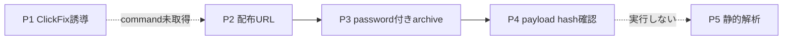
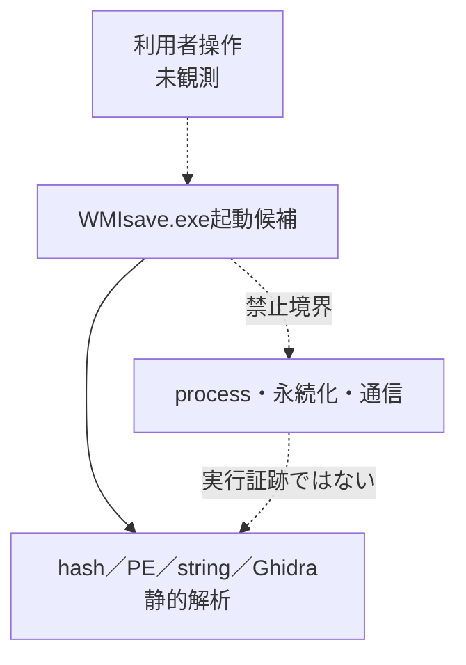
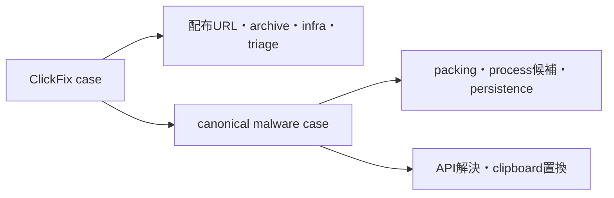

# ClickFix配信ロジック

## 配信フロー

## 実行境界

## 成果物の分離

実線は確認済み関係、点線は未観測または禁止した実行境界を表す。ClickFix側では配布関係だけを
正本とし、binary機能を複製しない。生commandが取得されていないため、ClickFixで典型的な
`mshta`、`powershell`、`curl`等を本caseの初段commandとして断定しない。
