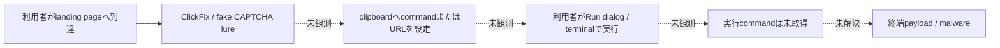
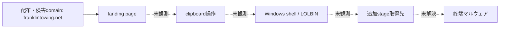
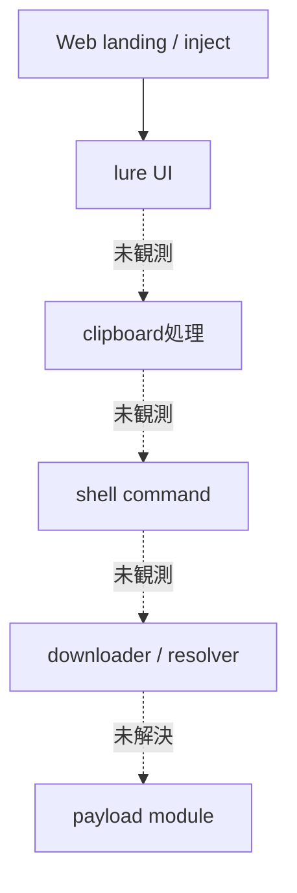

# 全体ロジック

## 実行フロー

実線は情報源またはライブHTMLで確認した関係、点線はこのcaseで未観測の関係です。

## 感染チェーン

## モジュール関係

## 比較プロファイル

| 軸 | 本case |
|---|---|
| 配布文脈 | `ThreatFox`で`franklintowing.net`を観測 |
| lure | `ClearFake, clearfake` |
| clipboard | `unverified` |
| command系列 | `unverified` |
| 終端payload | `未取得` |
| ライブ状態 | `HTTP応答を観測: 206` |

## 他caseとの比較

同一domain、単一tag、単一IPだけではcampaign同一性を判定しません。command系列とstage構造の
2軸以上が一致した場合に限り、同一cluster候補として上位索引で扱います。
