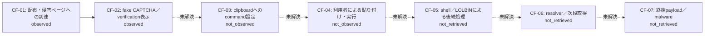

# 感染チェーン

## 到達状況

- 結果: `CF-03`で停止
- 終端payloadまで完了: `no`
- 次の解析: 実ブラウザでcopy操作とclipboard interceptionを再試行する。

## 段階図

実線は観測、情報源報告、または静的復元で支持されたedgeです。点線は未観測・未取得です。
利用者がcommandを実行した事実は、このcase固有のsandbox証跡がない限り観測済みとしません。

## 段階別根拠

| Phase | 処理 | 状態 | 確度 | 根拠 |
|---|---|---|---|---|
| `CF-01` | 配布・侵害ページへの到達 | `observed` | `high` | HTTP応答を確認: [301] |
| `CF-02` | fake CAPTCHA／verification表示 | `observed` | `medium` | ライブ本文またはブラウザDOMでlure markerを確認 |
| `CF-03` | clipboardへのcommand設定 | `not_observed` | `high` | clipboard書き込み値を確認できず |
| `CF-04` | 利用者による貼り付け・実行 | `not_observed` | `unresolved` | 安全上再現しておらず、sandbox等の実行証跡もこの工程では未統合 |
| `CF-05` | shell／LOLBINによる後続処理 | `not_retrieved` | `unresolved` | 実行commandを取得できず |
| `CF-06` | resolver／次段取得 | `not_retrieved` | `medium` | resolverまたは次段取得先を復元できず |
| `CF-07` | 終端payload／malware | `not_retrieved` | `high` | 終端payloadを取得できず |

## プロセスチェーン

未確認

## 復元した次段URL

- 次段URLは未復元です。

## 判定上の注意

- ClickFix／ClearFake tagだけで終端malware、campaign、actorを補完しません。
- landing、payload取得先、dead-drop resolver、終端C2を役割別に扱います。
- ペイロード未取得でも、到達済みphaseと停止位置を残し、次回調査へ引き継ぎます。
