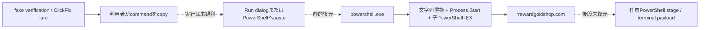

# 感染チェーン

| phase | 内容 | 状態 |
|---|---|---|
| lure | fake verification／browser challenge | command文面から推定 |
| clipboard | pt2として原文取得 | 確認済み |
| user execution | paste／Enter | 未観測・未実行 |
| shell | 既存powershell.exe → System.Diagnostics.Process.Start → 子powershell.exe → 同一子process内でHTTP応答をIEX評価 | commandから静的復元 |
| stage retrieval | https://rrewardgoldshop.com/q | command原文で確認 |
| current retrieval | blocked_no_public_dns | analyst probeで観測 |
| terminal payload | malware family／hash／最終command | 未取得 |
