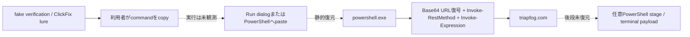

# 感染チェーン

| phase | 内容 | 状態 |
|---|---|---|
| lure | fake verification／browser challenge | command文面から推定 |
| clipboard | pt10として原文取得 | 確認済み |
| user execution | paste／Enter | 未観測・未実行 |
| shell | 既存powershell.exeへ貼り付け → Confirm-SecuritySession関数 → Base64 URL復号 → 同一powershell.exe内でHTTP応答をIEX評価 | commandから静的復元 |
| stage retrieval | Base64:aHR0cHM6Ly90cmlhcGZvZy5jb20vc2VjdXJpdHkvYzhwcHdveWU1MA== | command原文で確認 |
| current retrieval | http_403 | analyst probeで観測 |
| terminal payload | malware family／hash／最終command | 未取得 |
