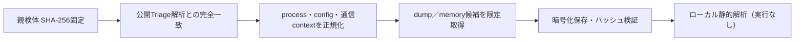

# Triage公開解析・後段取得証跡

## 完全ハッシュ一致

- [260805-r1h4jsak6s](https://tria.ge/260805-r1h4jsak6s): ファミリー候補 `animateclipper, sectoprat`、評価score `10`

## プロセス・通信

- 観測process: `Explorer.EXE, chrome.exe, cmd.exe, dllhost.exe, elevation_service.exe, explorer.exe, java.exe, msbuild.exe, msedge.exe, psl.exe, rundll32.exe`
- raw commandは保存せず、command SHA-256と処理patternだけをJSONへ保持しています。
- sandbox background trafficは`context_only`であり、C2へ自動昇格しません。

- `bsc.rpc.blxrbdn.com`（sandbox config候補）

## 二段目成果物

- `f658500396dfa44b8a7887a3c7ec47de1a6faf3d86769031ab221039a15d8cbc` / `memory_image` / 262144 bytes / 親と同一: `false` / 静的解析: `partial`

## 判定境界

Triage由来のfamily、process、config、通信は外部sandbox証跡です。config extractorが返したendpointはC2候補として扱えますが、
静的設定復元またはprocess帰属とprotocol応答が揃うまでは確認済みC2とはしません。取得成果物と検体は実行していません。
