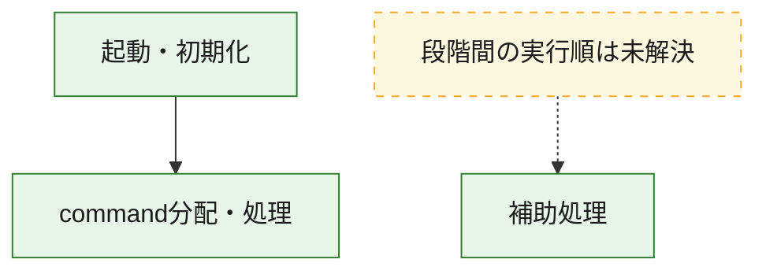
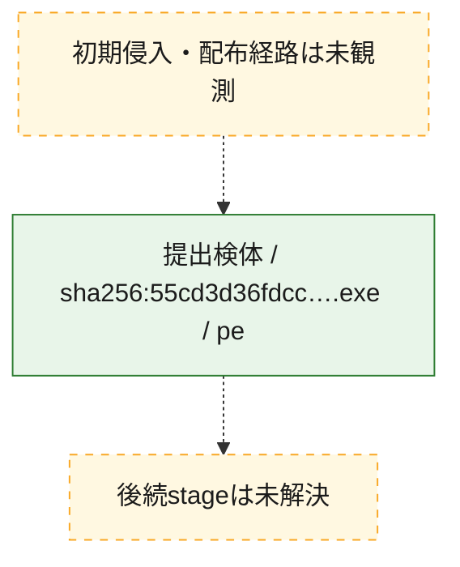
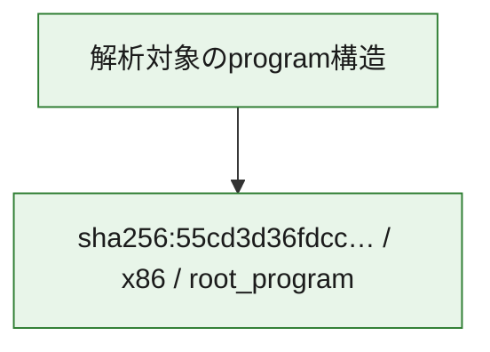

# 全体ロジック：55cd3d36fdcc58016a64398357b2c9724a060da9f0d09266e537a61ec9552e4f

代表関数の静的証跡から、起動・初期化、command分配・処理の処理群を確認しました。

## 読み方

- phaseの掲載順は解析上の整理順です。observed_call_edgesがない段階間の実行順を断定しません。
- 図の実線は静的に観測した関係、点線と黄色のノードは未観測・未解決の関係を示します。
- 図は静的な要約であり、動的実行を再現するものではありません。
- 詳細な関数解説とfingerprintは[STATIC-LOGIC.md](STATIC-LOGIC.md)を参照してください。

## 静的可視化

### 実行フロー

### 感染チェーン

### モジュール関係

## 処理段階

### 1. 起動・初期化

entry pointから初期化と後続処理への移行を確認します。
確度: `confirmed_static_function_evidence`

- `55cd3d36fdcc58016a64398357b2c9724a060da9f0d09266e537a61ec9552e4f:ghidra:14000cac0` — 初期化と主要処理への分岐を行う入口関数です。 状態: `succeeded`、選定理由: `entry_point`, `meaningful_symbol_name`, `reviewed_call_centrality:22`, `role:entrypoint`

### 2. command分配・処理

受信commandやtaskの解釈、分配、個別handlerへの移行を確認します。
確度: `confirmed_static_function_evidence_with_limits`

- `55cd3d36fdcc58016a64398357b2c9724a060da9f0d09266e537a61ec9552e4f:ghidra:1400197e0` — commandの解釈、分配、または個別処理を担当する関数です。 状態: `limited_bad_instruction_or_flow`、選定理由: `meaningful_symbol_name`, `reviewed_call_centrality:1`, `role:command_dispatch_or_handler`

### 3. 補助処理

主要処理を支える一般内部関数またはlibrary処理を確認します。
確度: `confirmed_static_function_evidence_with_limits`

- `55cd3d36fdcc58016a64398357b2c9724a060da9f0d09266e537a61ec9552e4f:ghidra:1400011b0` — 検体内部の一般処理を実装する関数です。 状態: `succeeded`、選定理由: `context_representative`, `reviewed_call_centrality:1`
- `55cd3d36fdcc58016a64398357b2c9724a060da9f0d09266e537a61ec9552e4f:ghidra:140001210` — 検体内部の一般処理を実装する関数です。 状態: `succeeded`、選定理由: `context_representative`, `reviewed_call_centrality:1`
- `55cd3d36fdcc58016a64398357b2c9724a060da9f0d09266e537a61ec9552e4f:ghidra:140001250` — 検体内部の一般処理を実装する関数です。 状態: `succeeded`、選定理由: `context_representative`, `reviewed_call_centrality:2`
- `55cd3d36fdcc58016a64398357b2c9724a060da9f0d09266e537a61ec9552e4f:ghidra:1400012c0` — 検体内部の一般処理を実装する関数です。 状態: `succeeded`、選定理由: `context_representative`, `reviewed_call_centrality:3`
- `55cd3d36fdcc58016a64398357b2c9724a060da9f0d09266e537a61ec9552e4f:ghidra:140001300` — 検体内部の一般処理を実装する関数です。 状態: `succeeded`、選定理由: `context_representative`
- `55cd3d36fdcc58016a64398357b2c9724a060da9f0d09266e537a61ec9552e4f:ghidra:1400013e0` — 検体内部の一般処理を実装する関数です。 状態: `succeeded`、選定理由: `context_representative`, `reviewed_call_centrality:8`
- `55cd3d36fdcc58016a64398357b2c9724a060da9f0d09266e537a61ec9552e4f:ghidra:140001490` — 検体内部の一般処理を実装する関数です。 状態: `succeeded`、選定理由: `context_representative`, `reviewed_call_centrality:2`
- `55cd3d36fdcc58016a64398357b2c9724a060da9f0d09266e537a61ec9552e4f:ghidra:1400016c0` — 検体内部の一般処理を実装する関数です。 状態: `limited_bad_instruction_or_flow`、選定理由: `context_representative`, `reviewed_call_centrality:6`
- `55cd3d36fdcc58016a64398357b2c9724a060da9f0d09266e537a61ec9552e4f:ghidra:140001830` — 検体内部の一般処理を実装する関数です。 状態: `succeeded`、選定理由: `context_representative`, `reviewed_call_centrality:2`
- `55cd3d36fdcc58016a64398357b2c9724a060da9f0d09266e537a61ec9552e4f:ghidra:1400018c0` — 検体内部の一般処理を実装する関数です。 状態: `limited_bad_instruction_or_flow`、選定理由: `context_representative`, `reviewed_call_centrality:5`
- `55cd3d36fdcc58016a64398357b2c9724a060da9f0d09266e537a61ec9552e4f:ghidra:140005220` — 検体内部の一般処理を実装する関数です。 状態: `succeeded`、選定理由: `context_representative`, `reviewed_call_centrality:2`
- `55cd3d36fdcc58016a64398357b2c9724a060da9f0d09266e537a61ec9552e4f:ghidra:140005260` — 検体内部の一般処理を実装する関数です。 状態: `succeeded`、選定理由: `context_representative`, `reviewed_call_centrality:1`
- `55cd3d36fdcc58016a64398357b2c9724a060da9f0d09266e537a61ec9552e4f:ghidra:1400052e0` — 検体内部の一般処理を実装する関数です。 状態: `succeeded`、選定理由: `context_representative`, `reviewed_call_centrality:2`
- `55cd3d36fdcc58016a64398357b2c9724a060da9f0d09266e537a61ec9552e4f:ghidra:140005380` — 検体内部の一般処理を実装する関数です。 状態: `succeeded`、選定理由: `context_representative`, `reviewed_call_centrality:15`
- `55cd3d36fdcc58016a64398357b2c9724a060da9f0d09266e537a61ec9552e4f:ghidra:1400058c0` — 検体内部の一般処理を実装する関数です。 状態: `limited_bad_instruction_or_flow`、選定理由: `context_representative`, `reviewed_call_centrality:7`
- `55cd3d36fdcc58016a64398357b2c9724a060da9f0d09266e537a61ec9552e4f:ghidra:140005930` — 検体内部の一般処理を実装する関数です。 状態: `succeeded`、選定理由: `context_representative`, `reviewed_call_centrality:5`
- `55cd3d36fdcc58016a64398357b2c9724a060da9f0d09266e537a61ec9552e4f:ghidra:1400059a0` — 検体内部の一般処理を実装する関数です。 状態: `succeeded`、選定理由: `context_representative`, `reviewed_call_centrality:4`
- `55cd3d36fdcc58016a64398357b2c9724a060da9f0d09266e537a61ec9552e4f:ghidra:140005a00` — 検体内部の一般処理を実装する関数です。 状態: `succeeded`、選定理由: `context_representative`, `reviewed_call_centrality:2`
- `55cd3d36fdcc58016a64398357b2c9724a060da9f0d09266e537a61ec9552e4f:ghidra:140005a20` — 検体内部の一般処理を実装する関数です。 状態: `succeeded`、選定理由: `context_representative`, `reviewed_call_centrality:6`
- `55cd3d36fdcc58016a64398357b2c9724a060da9f0d09266e537a61ec9552e4f:ghidra:140005b00` — 検体内部の一般処理を実装する関数です。 状態: `succeeded`、選定理由: `context_representative`, `reviewed_call_centrality:2`
- `55cd3d36fdcc58016a64398357b2c9724a060da9f0d09266e537a61ec9552e4f:ghidra:140005ce0` — 検体内部の一般処理を実装する関数です。 状態: `succeeded`、選定理由: `context_representative`, `reviewed_call_centrality:4`
- `55cd3d36fdcc58016a64398357b2c9724a060da9f0d09266e537a61ec9552e4f:ghidra:140005e90` — 検体内部の一般処理を実装する関数です。 状態: `succeeded`、選定理由: `context_representative`, `reviewed_call_centrality:1`
- `55cd3d36fdcc58016a64398357b2c9724a060da9f0d09266e537a61ec9552e4f:ghidra:140005f40` — 検体内部の一般処理を実装する関数です。 状態: `succeeded`、選定理由: `context_representative`, `reviewed_call_centrality:7`
- `55cd3d36fdcc58016a64398357b2c9724a060da9f0d09266e537a61ec9552e4f:ghidra:140006140` — 検体内部の一般処理を実装する関数です。 状態: `succeeded`、選定理由: `context_representative`, `reviewed_call_centrality:2`
- `55cd3d36fdcc58016a64398357b2c9724a060da9f0d09266e537a61ec9552e4f:ghidra:140006220` — 検体内部の一般処理を実装する関数です。 状態: `succeeded`、選定理由: `context_representative`
- `55cd3d36fdcc58016a64398357b2c9724a060da9f0d09266e537a61ec9552e4f:ghidra:140006480` — 検体内部の一般処理を実装する関数です。 状態: `limited_bad_instruction_or_flow`、選定理由: `context_representative`, `reviewed_call_centrality:1`
- `55cd3d36fdcc58016a64398357b2c9724a060da9f0d09266e537a61ec9552e4f:ghidra:1400067d0` — 検体内部の一般処理を実装する関数です。 状態: `succeeded`、選定理由: `context_representative`, `reviewed_call_centrality:3`
- `55cd3d36fdcc58016a64398357b2c9724a060da9f0d09266e537a61ec9552e4f:ghidra:140006cf0` — 検体内部の一般処理を実装する関数です。 状態: `succeeded`、選定理由: `context_representative`, `reviewed_call_centrality:2`
- `55cd3d36fdcc58016a64398357b2c9724a060da9f0d09266e537a61ec9552e4f:ghidra:140008ec0` — compiler生成処理または汎用library処理とみられる関数です。 状態: `succeeded`、選定理由: `entry_point`, `meaningful_symbol_name`, `reviewed_call_centrality:2`
- `55cd3d36fdcc58016a64398357b2c9724a060da9f0d09266e537a61ec9552e4f:ghidra:14000d0f0` — 検体内部の一般処理を実装する関数です。 状態: `succeeded`、選定理由: `meaningful_symbol_name`

## 観測したcall関係

- `55cd3d36fdcc58016a64398357b2c9724a060da9f0d09266e537a61ec9552e4f:ghidra:1400011b0` → `55cd3d36fdcc58016a64398357b2c9724a060da9f0d09266e537a61ec9552e4f:ghidra:140001490` （`support` → `support`）
- `55cd3d36fdcc58016a64398357b2c9724a060da9f0d09266e537a61ec9552e4f:ghidra:140001210` → `55cd3d36fdcc58016a64398357b2c9724a060da9f0d09266e537a61ec9552e4f:ghidra:140005220` （`support` → `support`）
- `55cd3d36fdcc58016a64398357b2c9724a060da9f0d09266e537a61ec9552e4f:ghidra:140001250` → `55cd3d36fdcc58016a64398357b2c9724a060da9f0d09266e537a61ec9552e4f:ghidra:1400067d0` （`support` → `support`）
- `55cd3d36fdcc58016a64398357b2c9724a060da9f0d09266e537a61ec9552e4f:ghidra:1400052e0` → `55cd3d36fdcc58016a64398357b2c9724a060da9f0d09266e537a61ec9552e4f:ghidra:1400067d0` （`support` → `support`）
- `55cd3d36fdcc58016a64398357b2c9724a060da9f0d09266e537a61ec9552e4f:ghidra:1400058c0` → `55cd3d36fdcc58016a64398357b2c9724a060da9f0d09266e537a61ec9552e4f:ghidra:1400016c0` （`support` → `support`）
- `55cd3d36fdcc58016a64398357b2c9724a060da9f0d09266e537a61ec9552e4f:ghidra:140005a20` → `55cd3d36fdcc58016a64398357b2c9724a060da9f0d09266e537a61ec9552e4f:ghidra:1400058c0` （`support` → `support`）
- `55cd3d36fdcc58016a64398357b2c9724a060da9f0d09266e537a61ec9552e4f:ghidra:140006cf0` → `55cd3d36fdcc58016a64398357b2c9724a060da9f0d09266e537a61ec9552e4f:ghidra:1400012c0` （`support` → `support`）
- `55cd3d36fdcc58016a64398357b2c9724a060da9f0d09266e537a61ec9552e4f:ghidra:140008ec0` → `55cd3d36fdcc58016a64398357b2c9724a060da9f0d09266e537a61ec9552e4f:ghidra:1400016c0` （`support` → `support`）
- `55cd3d36fdcc58016a64398357b2c9724a060da9f0d09266e537a61ec9552e4f:ghidra:14000cac0` → `55cd3d36fdcc58016a64398357b2c9724a060da9f0d09266e537a61ec9552e4f:ghidra:1400197e0` （`startup` → `dispatch`）
- `ghidra-function:00db27757be229ce2676402f` → `ghidra-function:d25f7bfc03a1b0ecf9d947e5` （`unclassified` → `unclassified`）
- `ghidra-function:037d8b1b47c5dac399c62c34` → `ghidra-external:007ca7089a7f1896ebae9235` （`unclassified` → `unclassified`）
- `ghidra-function:037d8b1b47c5dac399c62c34` → `ghidra-external:227269277af63282d34631d5` （`unclassified` → `unclassified`）
- `ghidra-function:037d8b1b47c5dac399c62c34` → `ghidra-external:2474d672646a19ef690585db` （`unclassified` → `unclassified`）
- `ghidra-function:037d8b1b47c5dac399c62c34` → `ghidra-external:4f6f6e760f95daf886376e1e` （`unclassified` → `unclassified`）
- `ghidra-function:037d8b1b47c5dac399c62c34` → `ghidra-external:725ab4ff3d89e7c9a20681a4` （`unclassified` → `unclassified`）
- `ghidra-function:037d8b1b47c5dac399c62c34` → `ghidra-external:a20c10c62b1d89ee096002b9` （`unclassified` → `unclassified`）
- `ghidra-function:037d8b1b47c5dac399c62c34` → `ghidra-external:ee75e53acf191aae0b1d94ac` （`unclassified` → `unclassified`）
- `ghidra-function:037d8b1b47c5dac399c62c34` → `ghidra-external:f92cc93004444bce6f43b858` （`unclassified` → `unclassified`）
- `ghidra-function:037d8b1b47c5dac399c62c34` → `ghidra-external:fe65a3f42f42c124d7432264` （`unclassified` → `unclassified`）
- `ghidra-function:037d8b1b47c5dac399c62c34` → `ghidra-function:0dc243a8a3a413142ade1f11` （`unclassified` → `unclassified`）
- `ghidra-function:037d8b1b47c5dac399c62c34` → `ghidra-function:4d3d16bce3a26826b224d3ef` （`unclassified` → `unclassified`）
- `ghidra-function:037d8b1b47c5dac399c62c34` → `ghidra-function:54379d0c01275f512f03f6e7` （`unclassified` → `unclassified`）
- `ghidra-function:037d8b1b47c5dac399c62c34` → `ghidra-function:673dd2a387d5c15b763322a1` （`unclassified` → `unclassified`）
- `ghidra-function:037d8b1b47c5dac399c62c34` → `ghidra-function:898a8bede2f97c1bfa10b6f7` （`unclassified` → `unclassified`）
- `ghidra-function:037d8b1b47c5dac399c62c34` → `ghidra-function:9504c53a6f0e0ce72a608eb9` （`unclassified` → `unclassified`）
- `ghidra-function:037d8b1b47c5dac399c62c34` → `ghidra-function:966d8fb27d6ab5109a94e6c3` （`unclassified` → `unclassified`）
- `ghidra-function:037d8b1b47c5dac399c62c34` → `ghidra-function:a15a74ce6fb8ded52a830f5d` （`unclassified` → `unclassified`）
- `ghidra-function:037d8b1b47c5dac399c62c34` → `ghidra-function:b6544ca5416c9e7e77bd0de4` （`unclassified` → `unclassified`）
- `ghidra-function:037d8b1b47c5dac399c62c34` → `ghidra-function:c3839797503e33251c078f76` （`unclassified` → `unclassified`）
- `ghidra-function:037d8b1b47c5dac399c62c34` → `ghidra-function:cd6091b0d992ae5b0f394f12` （`unclassified` → `unclassified`）
- `ghidra-function:037d8b1b47c5dac399c62c34` → `ghidra-function:ed095b3d5296d1ccd54561f5` （`unclassified` → `unclassified`）
- `ghidra-function:037d8b1b47c5dac399c62c34` → `ghidra-function:f810adf582e2edd3d032fcc4` （`unclassified` → `unclassified`）
- `ghidra-function:0f31599af18af3b637e902b3` → `ghidra-external:38615e2a4e3d843d13b98f37` （`unclassified` → `unclassified`）
- `ghidra-function:0f31599af18af3b637e902b3` → `ghidra-external:86ef0985dbb7aacee16ae6b7` （`unclassified` → `unclassified`）
- `ghidra-function:0f31599af18af3b637e902b3` → `ghidra-external:cabd64fb93bd64ed69551d6c` （`unclassified` → `unclassified`）
- `ghidra-function:0f31599af18af3b637e902b3` → `ghidra-function:d83fabc91950d132dee84a19` （`unclassified` → `unclassified`）
- `ghidra-function:12f11673b051e2d7cb4e257d` → `ghidra-function:0a6fb81edda14f188eb12798` （`unclassified` → `unclassified`）
- `ghidra-function:12f11673b051e2d7cb4e257d` → `ghidra-function:51e23bbe7562bfc2fd977436` （`unclassified` → `unclassified`）
- `ghidra-function:1590ceb2ed743a60848c3930` → `ghidra-external:19dab5a3af198ba5ad19ef65` （`unclassified` → `unclassified`）
- `ghidra-function:1590ceb2ed743a60848c3930` → `ghidra-external:668a73e38a250a5054612b57` （`unclassified` → `unclassified`）
- `ghidra-function:1590ceb2ed743a60848c3930` → `ghidra-function:65fac702d90b42bb1f93f55f` （`unclassified` → `unclassified`）
- `ghidra-function:1590ceb2ed743a60848c3930` → `ghidra-function:80c1a9bed2212a5d1a3d055b` （`unclassified` → `unclassified`）
- `ghidra-function:1590ceb2ed743a60848c3930` → `ghidra-function:a47a96759654c4fb59fcffb9` （`unclassified` → `unclassified`）
- `ghidra-function:194f96a7b4dbf8f0c7c1a54f` → `ghidra-external:18819ab4868139fa87427fb7` （`unclassified` → `unclassified`）
- `ghidra-function:194f96a7b4dbf8f0c7c1a54f` → `ghidra-external:19dab5a3af198ba5ad19ef65` （`unclassified` → `unclassified`）
- `ghidra-function:194f96a7b4dbf8f0c7c1a54f` → `ghidra-external:300e25bfaff8223a56a6c593` （`unclassified` → `unclassified`）
- `ghidra-function:194f96a7b4dbf8f0c7c1a54f` → `ghidra-external:38615e2a4e3d843d13b98f37` （`unclassified` → `unclassified`）
- `ghidra-function:194f96a7b4dbf8f0c7c1a54f` → `ghidra-external:8516aaeb12171b242cd36a90` （`unclassified` → `unclassified`）
- `ghidra-function:194f96a7b4dbf8f0c7c1a54f` → `ghidra-external:d719da97bf8b66ad79c5f849` （`unclassified` → `unclassified`）
- `ghidra-function:194f96a7b4dbf8f0c7c1a54f` → `ghidra-function:28eeb43e0a7a91344ad9a812` （`unclassified` → `unclassified`）
- `ghidra-function:194f96a7b4dbf8f0c7c1a54f` → `ghidra-function:5a41cc3b431779029a42d51f` （`unclassified` → `unclassified`）
- `ghidra-function:194f96a7b4dbf8f0c7c1a54f` → `ghidra-function:6a40f106152e37dfb19ed9b3` （`unclassified` → `unclassified`）
- `ghidra-function:194f96a7b4dbf8f0c7c1a54f` → `ghidra-function:b1016404c722a10ab4b98f73` （`unclassified` → `unclassified`）
- `ghidra-function:194f96a7b4dbf8f0c7c1a54f` → `ghidra-function:b1615bc6839f4e1afb1aedcf` （`unclassified` → `unclassified`）
- `ghidra-function:1d397a66c5bc2eb6e5f07021` → `ghidra-external:19dab5a3af198ba5ad19ef65` （`unclassified` → `unclassified`）
- `ghidra-function:1d397a66c5bc2eb6e5f07021` → `ghidra-external:25d3e1a7fa5b2f89d929bd4a` （`unclassified` → `unclassified`）
- `ghidra-function:1d397a66c5bc2eb6e5f07021` → `ghidra-external:38615e2a4e3d843d13b98f37` （`unclassified` → `unclassified`）
- `ghidra-function:1d397a66c5bc2eb6e5f07021` → `ghidra-external:6720d94d730a1a61f00f5a95` （`unclassified` → `unclassified`）
- `ghidra-function:1d397a66c5bc2eb6e5f07021` → `ghidra-external:86ef0985dbb7aacee16ae6b7` （`unclassified` → `unclassified`）
- `ghidra-function:1d397a66c5bc2eb6e5f07021` → `ghidra-function:5999f677b7308b20c5c75e6d` （`unclassified` → `unclassified`）
- `ghidra-function:1d397a66c5bc2eb6e5f07021` → `ghidra-function:8655b58ac7ade9ae3591fad2` （`unclassified` → `unclassified`）
- `ghidra-function:2e04e3676f23bd11ad507095` → `ghidra-external:19dab5a3af198ba5ad19ef65` （`unclassified` → `unclassified`）
- `ghidra-function:3e75313cbcd34fa01c2e3f44` → `ghidra-external:19dab5a3af198ba5ad19ef65` （`unclassified` → `unclassified`）
- `ghidra-function:43ca8b5428026d92abc2c559` → `ghidra-function:e59f7374544600b0ecb2cd36` （`unclassified` → `unclassified`）
- `ghidra-function:80631386a8a4bd9e2513484c` → `ghidra-function:a526fcf7357232932c1436c3` （`unclassified` → `unclassified`）
- `ghidra-function:80631386a8a4bd9e2513484c` → `ghidra-function:cc619f9ab44dade0c67638f9` （`unclassified` → `unclassified`）
- `ghidra-function:8bf092441f9bdfcdc39995d7` → `ghidra-external:80e6306afed7dcfb27e93b33` （`unclassified` → `unclassified`）
- `ghidra-function:94bbea595f2de2e9a56e67b9` → `ghidra-external:19dab5a3af198ba5ad19ef65` （`unclassified` → `unclassified`）
- `ghidra-function:94bbea595f2de2e9a56e67b9` → `ghidra-function:8bf092441f9bdfcdc39995d7` （`unclassified` → `unclassified`）
- `ghidra-function:9572f3570e442a3a0d26e084` → `ghidra-function:074fae4683546bf01a525a9c` （`unclassified` → `unclassified`）
- `ghidra-function:9714d062926546f919d6bf19` → `ghidra-external:5daa8ede9215a07f58780763` （`unclassified` → `unclassified`）
- `ghidra-function:9714d062926546f919d6bf19` → `ghidra-function:5999f677b7308b20c5c75e6d` （`unclassified` → `unclassified`）
- `ghidra-function:9c9c7a28e2edb7d37123c61c` → `ghidra-external:41578d39a9a7c1add10ae28e` （`unclassified` → `unclassified`）
- `ghidra-function:9c9c7a28e2edb7d37123c61c` → `ghidra-function:9714d062926546f919d6bf19` （`unclassified` → `unclassified`）
- `ghidra-function:a64ce0598c21265cdec28a19` → `ghidra-external:19dab5a3af198ba5ad19ef65` （`unclassified` → `unclassified`）
- `ghidra-function:a64ce0598c21265cdec28a19` → `ghidra-function:5937c5b1746d534c1b1e2d1d` （`unclassified` → `unclassified`）
- `ghidra-function:a64ce0598c21265cdec28a19` → `ghidra-function:5d5a30f5dcb41df55439d027` （`unclassified` → `unclassified`）
- `ghidra-function:a64ce0598c21265cdec28a19` → `ghidra-function:62f46b0c87de58baa29b7f21` （`unclassified` → `unclassified`）
- `ghidra-function:a64ce0598c21265cdec28a19` → `ghidra-function:cddec93f6dd5310f33cfaf45` （`unclassified` → `unclassified`）
- `ghidra-function:a7e75bcd2c9121c4ea6fff05` → `ghidra-function:2e04e3676f23bd11ad507095` （`unclassified` → `unclassified`）
- `ghidra-function:a8f96943c027444801a13e7c` → `ghidra-function:a2e0ff40e0566345f79a2bf5` （`unclassified` → `unclassified`）
- `ghidra-function:a8f96943c027444801a13e7c` → `ghidra-function:c552b31024714a1cd9c5af9e` （`unclassified` → `unclassified`）
- `ghidra-function:aa024cd48c7a88e22efdd12d` → `ghidra-external:19dab5a3af198ba5ad19ef65` （`unclassified` → `unclassified`）
- `ghidra-function:aa024cd48c7a88e22efdd12d` → `ghidra-function:a8f96943c027444801a13e7c` （`unclassified` → `unclassified`）
- `ghidra-function:b1d61d166c4497ad9d67fa98` → `ghidra-external:01d60a6b03d58e5f90b0c6b1` （`unclassified` → `unclassified`）
- `ghidra-function:b200b8f48338ec750f09017b` → `ghidra-external:19dab5a3af198ba5ad19ef65` （`unclassified` → `unclassified`）
- `ghidra-function:b200b8f48338ec750f09017b` → `ghidra-external:3c22135ea07096ddcecbae41` （`unclassified` → `unclassified`）
- `ghidra-function:b200b8f48338ec750f09017b` → `ghidra-external:d7365a0769bbf1f8cca01785` （`unclassified` → `unclassified`）
- `ghidra-function:b200b8f48338ec750f09017b` → `ghidra-function:5d5a30f5dcb41df55439d027` （`unclassified` → `unclassified`）
- `ghidra-function:b5428071b7eb8f73ee937df0` → `ghidra-function:d889bc047ce445d152e9d02e` （`unclassified` → `unclassified`）
- `ghidra-function:cddec93f6dd5310f33cfaf45` → `ghidra-external:14c6284fe1b88c1043d22689` （`unclassified` → `unclassified`）
- `ghidra-function:cddec93f6dd5310f33cfaf45` → `ghidra-function:a2e0ff40e0566345f79a2bf5` （`unclassified` → `unclassified`）
- `ghidra-function:cddec93f6dd5310f33cfaf45` → `ghidra-function:a8f96943c027444801a13e7c` （`unclassified` → `unclassified`）
- `ghidra-function:cddec93f6dd5310f33cfaf45` → `ghidra-function:c552b31024714a1cd9c5af9e` （`unclassified` → `unclassified`）
- `ghidra-function:d889bc047ce445d152e9d02e` → `ghidra-function:313fbe95b2b651e42d611c3f` （`unclassified` → `unclassified`）
- `ghidra-function:da44657d080c7816b9e06b03` → `ghidra-external:19dab5a3af198ba5ad19ef65` （`unclassified` → `unclassified`）
- `ghidra-function:da44657d080c7816b9e06b03` → `ghidra-function:1365a861d3b56c05974a6218` （`unclassified` → `unclassified`）
- `ghidra-function:da44657d080c7816b9e06b03` → `ghidra-function:fd4e7e8b510023b714d3eeaa` （`unclassified` → `unclassified`）
- `ghidra-function:e4252422365e5f04251b1e5e` → `ghidra-external:19dab5a3af198ba5ad19ef65` （`unclassified` → `unclassified`）
- `ghidra-function:e4252422365e5f04251b1e5e` → `ghidra-function:8bf092441f9bdfcdc39995d7` （`unclassified` → `unclassified`）
- `ghidra-function:ed7cb5765f56678df2870204` → `ghidra-function:313fbe95b2b651e42d611c3f` （`unclassified` → `unclassified`）
- `ghidra-function:ed7cb5765f56678df2870204` → `ghidra-function:b1016404c722a10ab4b98f73` （`unclassified` → `unclassified`）

## 解析範囲と制約

- 選定外関数は全体inventoryへ残しますが、関数本体の個別解説対象にはしていません。
- indirect call、難読化、packer、VM、壊れたcontrol flowによりcall関係が欠落する場合があります。
- 文書は静的解析に基づき、検体実行や外部通信による動的確認は行っていません。
