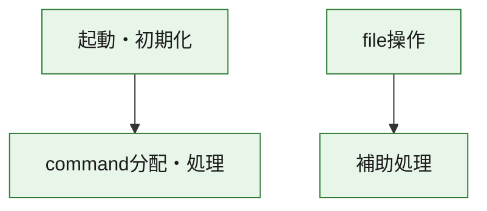
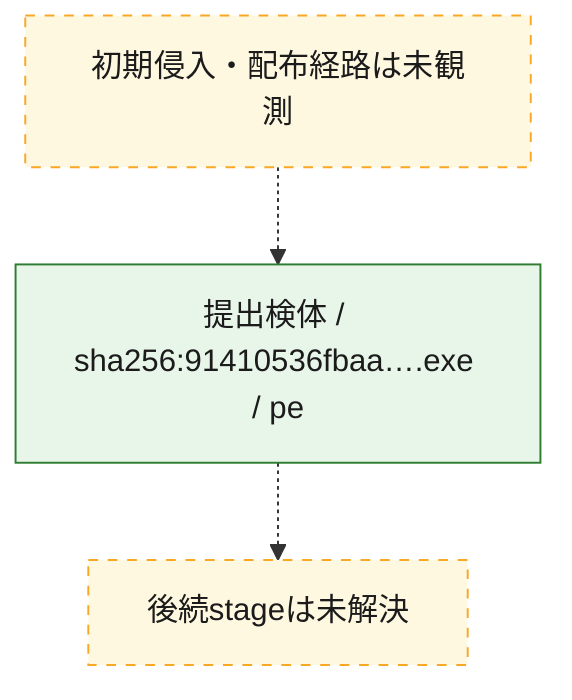
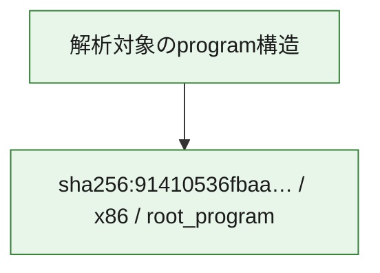

# 全体ロジック：91410536fbaa9a8d9e9e13f3019e70ce93cae0f13ed8ef68f4234fa7a2b09f56

代表関数の静的証跡から、起動・初期化、command分配・処理、file操作の処理群を確認しました。

## 読み方

- phaseの掲載順は解析上の整理順です。observed_call_edgesがない段階間の実行順を断定しません。
- 図の実線は静的に観測した関係、点線と黄色のノードは未観測・未解決の関係を示します。
- 図は静的な要約であり、動的実行を再現するものではありません。
- 詳細な関数解説とfingerprintは[STATIC-LOGIC.md](STATIC-LOGIC.md)を参照してください。

## 静的可視化

### 実行フロー

### 感染チェーン

### モジュール関係

## 処理段階

### 1. 起動・初期化

entry pointから初期化と後続処理への移行を確認します。
確度: `confirmed_static_function_evidence`

- `91410536fbaa9a8d9e9e13f3019e70ce93cae0f13ed8ef68f4234fa7a2b09f56:ghidra:14000bad0` — 初期化と主要処理への分岐を行う入口関数です。 状態: `succeeded`、選定理由: `entry_point`, `meaningful_symbol_name`, `reviewed_call_centrality:22`, `role:entrypoint`

### 2. command分配・処理

受信commandやtaskの解釈、分配、個別handlerへの移行を確認します。
確度: `confirmed_static_function_evidence_with_limits`

- `91410536fbaa9a8d9e9e13f3019e70ce93cae0f13ed8ef68f4234fa7a2b09f56:ghidra:1400187f0` — commandの解釈、分配、または個別処理を担当する関数です。 状態: `limited_bad_instruction_or_flow`、選定理由: `meaningful_symbol_name`, `reviewed_call_centrality:1`, `role:command_dispatch_or_handler`

### 3. file操作

fileやdirectoryの作成、読書き、削除を確認します。
確度: `confirmed_static_function_evidence`

- `91410536fbaa9a8d9e9e13f3019e70ce93cae0f13ed8ef68f4234fa7a2b09f56:ghidra:1400067b0` — fileまたはdirectoryの読書き・管理に関係する関数です。 状態: `succeeded`、選定理由: `context_representative`, `reviewed_call_centrality:21`, `role:file_operation`

### 4. 補助処理

主要処理を支える一般内部関数またはlibrary処理を確認します。
確度: `confirmed_static_function_evidence_with_limits`

- `91410536fbaa9a8d9e9e13f3019e70ce93cae0f13ed8ef68f4234fa7a2b09f56:ghidra:140001000` — 検体内部の一般処理を実装する関数です。 状態: `limited_bad_instruction_or_flow`、選定理由: `context_representative`, `reviewed_call_centrality:4`
- `91410536fbaa9a8d9e9e13f3019e70ce93cae0f13ed8ef68f4234fa7a2b09f56:ghidra:140001080` — 検体内部の一般処理を実装する関数です。 状態: `succeeded`、選定理由: `context_representative`, `reviewed_call_centrality:1`
- `91410536fbaa9a8d9e9e13f3019e70ce93cae0f13ed8ef68f4234fa7a2b09f56:ghidra:1400012c0` — 検体内部の一般処理を実装する関数です。 状態: `succeeded`、選定理由: `context_representative`, `reviewed_call_centrality:5`
- `91410536fbaa9a8d9e9e13f3019e70ce93cae0f13ed8ef68f4234fa7a2b09f56:ghidra:140001340` — 検体内部の一般処理を実装する関数です。 状態: `limited_bad_instruction_or_flow`、選定理由: `context_representative`, `reviewed_call_centrality:5`
- `91410536fbaa9a8d9e9e13f3019e70ce93cae0f13ed8ef68f4234fa7a2b09f56:ghidra:1400047a0` — 検体内部の一般処理を実装する関数です。 状態: `succeeded`、選定理由: `context_representative`, `reviewed_call_centrality:2`
- `91410536fbaa9a8d9e9e13f3019e70ce93cae0f13ed8ef68f4234fa7a2b09f56:ghidra:140004880` — 検体内部の一般処理を実装する関数です。 状態: `succeeded`、選定理由: `context_representative`, `reviewed_call_centrality:4`
- `91410536fbaa9a8d9e9e13f3019e70ce93cae0f13ed8ef68f4234fa7a2b09f56:ghidra:1400048c0` — 検体内部の一般処理を実装する関数です。 状態: `limited_bad_instruction_or_flow`、選定理由: `context_representative`, `reviewed_call_centrality:1`
- `91410536fbaa9a8d9e9e13f3019e70ce93cae0f13ed8ef68f4234fa7a2b09f56:ghidra:140005100` — 検体内部の一般処理を実装する関数です。 状態: `succeeded`、選定理由: `context_representative`, `reviewed_call_centrality:1`
- `91410536fbaa9a8d9e9e13f3019e70ce93cae0f13ed8ef68f4234fa7a2b09f56:ghidra:140005150` — 検体内部の一般処理を実装する関数です。 状態: `succeeded`、選定理由: `context_representative`, `reviewed_call_centrality:2`
- `91410536fbaa9a8d9e9e13f3019e70ce93cae0f13ed8ef68f4234fa7a2b09f56:ghidra:1400051c0` — 検体内部の一般処理を実装する関数です。 状態: `limited_bad_instruction_or_flow`、選定理由: `context_representative`, `reviewed_call_centrality:8`
- `91410536fbaa9a8d9e9e13f3019e70ce93cae0f13ed8ef68f4234fa7a2b09f56:ghidra:140005220` — 検体内部の一般処理を実装する関数です。 状態: `succeeded`、選定理由: `context_representative`, `reviewed_call_centrality:4`
- `91410536fbaa9a8d9e9e13f3019e70ce93cae0f13ed8ef68f4234fa7a2b09f56:ghidra:140005280` — 検体内部の一般処理を実装する関数です。 状態: `limited_bad_instruction_or_flow`、選定理由: `context_representative`, `reviewed_call_centrality:1`
- `91410536fbaa9a8d9e9e13f3019e70ce93cae0f13ed8ef68f4234fa7a2b09f56:ghidra:140005380` — 検体内部の一般処理を実装する関数です。 状態: `succeeded`、選定理由: `context_representative`, `reviewed_call_centrality:2`
- `91410536fbaa9a8d9e9e13f3019e70ce93cae0f13ed8ef68f4234fa7a2b09f56:ghidra:1400053e0` — 検体内部の一般処理を実装する関数です。 状態: `limited_bad_instruction_or_flow`、選定理由: `context_representative`, `reviewed_call_centrality:7`
- `91410536fbaa9a8d9e9e13f3019e70ce93cae0f13ed8ef68f4234fa7a2b09f56:ghidra:140005480` — 検体内部の一般処理を実装する関数です。 状態: `limited_bad_instruction_or_flow`、選定理由: `context_representative`, `reviewed_call_centrality:5`
- `91410536fbaa9a8d9e9e13f3019e70ce93cae0f13ed8ef68f4234fa7a2b09f56:ghidra:140005500` — 検体内部の一般処理を実装する関数です。 状態: `limited_bad_instruction_or_flow`、選定理由: `context_representative`, `reviewed_call_centrality:3`
- `91410536fbaa9a8d9e9e13f3019e70ce93cae0f13ed8ef68f4234fa7a2b09f56:ghidra:1400057e0` — 検体内部の一般処理を実装する関数です。 状態: `succeeded`、選定理由: `context_representative`, `reviewed_call_centrality:6`
- `91410536fbaa9a8d9e9e13f3019e70ce93cae0f13ed8ef68f4234fa7a2b09f56:ghidra:1400058b0` — 検体内部の一般処理を実装する関数です。 状態: `limited_bad_instruction_or_flow`、選定理由: `context_representative`, `reviewed_call_centrality:9`
- `91410536fbaa9a8d9e9e13f3019e70ce93cae0f13ed8ef68f4234fa7a2b09f56:ghidra:140005b90` — 検体内部の一般処理を実装する関数です。 状態: `succeeded`、選定理由: `context_representative`, `reviewed_call_centrality:2`
- `91410536fbaa9a8d9e9e13f3019e70ce93cae0f13ed8ef68f4234fa7a2b09f56:ghidra:140005bc0` — 検体内部の一般処理を実装する関数です。 状態: `succeeded`、選定理由: `context_representative`
- `91410536fbaa9a8d9e9e13f3019e70ce93cae0f13ed8ef68f4234fa7a2b09f56:ghidra:140005c10` — 検体内部の一般処理を実装する関数です。 状態: `limited_bad_instruction_or_flow`、選定理由: `context_representative`, `reviewed_call_centrality:6`
- `91410536fbaa9a8d9e9e13f3019e70ce93cae0f13ed8ef68f4234fa7a2b09f56:ghidra:140005f60` — 検体内部の一般処理を実装する関数です。 状態: `limited_bad_instruction_or_flow`、選定理由: `context_representative`, `reviewed_call_centrality:4`
- `91410536fbaa9a8d9e9e13f3019e70ce93cae0f13ed8ef68f4234fa7a2b09f56:ghidra:140005fd0` — compiler生成処理または汎用library処理とみられる関数です。 状態: `succeeded`、選定理由: `entry_point`, `meaningful_symbol_name`, `reviewed_call_centrality:2`
- `91410536fbaa9a8d9e9e13f3019e70ce93cae0f13ed8ef68f4234fa7a2b09f56:ghidra:140006190` — 検体内部の一般処理を実装する関数です。 状態: `succeeded`、選定理由: `context_representative`, `reviewed_call_centrality:3`
- `91410536fbaa9a8d9e9e13f3019e70ce93cae0f13ed8ef68f4234fa7a2b09f56:ghidra:140006640` — 検体内部の一般処理を実装する関数です。 状態: `succeeded`、選定理由: `context_representative`
- `91410536fbaa9a8d9e9e13f3019e70ce93cae0f13ed8ef68f4234fa7a2b09f56:ghidra:1400070c0` — 検体内部の一般処理を実装する関数です。 状態: `limited_bad_instruction_or_flow`、選定理由: `context_representative`, `reviewed_call_centrality:5`
- `91410536fbaa9a8d9e9e13f3019e70ce93cae0f13ed8ef68f4234fa7a2b09f56:ghidra:140007e60` — 検体内部の一般処理を実装する関数です。 状態: `succeeded`、選定理由: `context_representative`, `reviewed_call_centrality:2`
- `91410536fbaa9a8d9e9e13f3019e70ce93cae0f13ed8ef68f4234fa7a2b09f56:ghidra:140007ec0` — 検体内部の一般処理を実装する関数です。 状態: `succeeded`、選定理由: `context_representative`, `reviewed_call_centrality:1`
- `91410536fbaa9a8d9e9e13f3019e70ce93cae0f13ed8ef68f4234fa7a2b09f56:ghidra:14000c100` — 検体内部の一般処理を実装する関数です。 状態: `succeeded`、選定理由: `meaningful_symbol_name`

## 観測したcall関係

- `91410536fbaa9a8d9e9e13f3019e70ce93cae0f13ed8ef68f4234fa7a2b09f56:ghidra:1400053e0` → `91410536fbaa9a8d9e9e13f3019e70ce93cae0f13ed8ef68f4234fa7a2b09f56:ghidra:140005c10` （`support` → `support`）
- `91410536fbaa9a8d9e9e13f3019e70ce93cae0f13ed8ef68f4234fa7a2b09f56:ghidra:140005c10` → `91410536fbaa9a8d9e9e13f3019e70ce93cae0f13ed8ef68f4234fa7a2b09f56:ghidra:140005480` （`support` → `support`）
- `91410536fbaa9a8d9e9e13f3019e70ce93cae0f13ed8ef68f4234fa7a2b09f56:ghidra:1400067b0` → `91410536fbaa9a8d9e9e13f3019e70ce93cae0f13ed8ef68f4234fa7a2b09f56:ghidra:140007e60` （`file_activity` → `support`）
- `91410536fbaa9a8d9e9e13f3019e70ce93cae0f13ed8ef68f4234fa7a2b09f56:ghidra:14000bad0` → `91410536fbaa9a8d9e9e13f3019e70ce93cae0f13ed8ef68f4234fa7a2b09f56:ghidra:1400187f0` （`startup` → `dispatch`）
- `ghidra-function:21cff34e1478731cf3b19b2c` → `ghidra-external:2364b9d39f3ee33fb7c2a26b` （`unclassified` → `unclassified`）
- `ghidra-function:21cff34e1478731cf3b19b2c` → `ghidra-external:2fb0e645aefd690849463a55` （`unclassified` → `unclassified`）
- `ghidra-function:21cff34e1478731cf3b19b2c` → `ghidra-external:8fbd6e5258a83290ef3114b1` （`unclassified` → `unclassified`）
- `ghidra-function:21cff34e1478731cf3b19b2c` → `ghidra-external:934a50d9784625aa9be81cde` （`unclassified` → `unclassified`）
- `ghidra-function:21cff34e1478731cf3b19b2c` → `ghidra-external:9d8778d7e96475469789db1b` （`unclassified` → `unclassified`）
- `ghidra-function:21cff34e1478731cf3b19b2c` → `ghidra-external:ab8bffd45721c05ddd3fe77b` （`unclassified` → `unclassified`）
- `ghidra-function:21cff34e1478731cf3b19b2c` → `ghidra-external:b1bdbfc983b27fb3fc19d18a` （`unclassified` → `unclassified`）
- `ghidra-function:21cff34e1478731cf3b19b2c` → `ghidra-external:b6259ba78354fafae729df76` （`unclassified` → `unclassified`）
- `ghidra-function:21cff34e1478731cf3b19b2c` → `ghidra-external:f4332a4505b4ea2d10dc16eb` （`unclassified` → `unclassified`）
- `ghidra-function:21cff34e1478731cf3b19b2c` → `ghidra-function:119c3840bb2fcf46e2c7ff0d` （`unclassified` → `unclassified`）
- `ghidra-function:21cff34e1478731cf3b19b2c` → `ghidra-function:30e2d8cbf6cd5dcbe780fbd5` （`unclassified` → `unclassified`）
- `ghidra-function:21cff34e1478731cf3b19b2c` → `ghidra-function:42a62f9e83df76b29edaebfc` （`unclassified` → `unclassified`）
- `ghidra-function:21cff34e1478731cf3b19b2c` → `ghidra-function:42e000001cd4455a320a9c5f` （`unclassified` → `unclassified`）
- `ghidra-function:21cff34e1478731cf3b19b2c` → `ghidra-function:5619f0e027b309833e893393` （`unclassified` → `unclassified`）
- `ghidra-function:21cff34e1478731cf3b19b2c` → `ghidra-function:900124040ccdedd2d6c0b0ae` （`unclassified` → `unclassified`）
- `ghidra-function:21cff34e1478731cf3b19b2c` → `ghidra-function:a37da44327418ba2348eee79` （`unclassified` → `unclassified`）
- `ghidra-function:21cff34e1478731cf3b19b2c` → `ghidra-function:c59366443a2253480366c3a7` （`unclassified` → `unclassified`）
- `ghidra-function:21cff34e1478731cf3b19b2c` → `ghidra-function:cd40cf046674d17a34837bbe` （`unclassified` → `unclassified`）
- `ghidra-function:21cff34e1478731cf3b19b2c` → `ghidra-function:db81e833f0029777d15c3682` （`unclassified` → `unclassified`）
- `ghidra-function:21cff34e1478731cf3b19b2c` → `ghidra-function:de955e85c4afa76b2f0f7533` （`unclassified` → `unclassified`）
- `ghidra-function:21cff34e1478731cf3b19b2c` → `ghidra-function:f2ba1e860365658e057ca476` （`unclassified` → `unclassified`）
- `ghidra-function:21cff34e1478731cf3b19b2c` → `ghidra-function:fc7be8c80d2ba0a529adafe5` （`unclassified` → `unclassified`）
- `ghidra-function:22c805458a7515d8359ae646` → `ghidra-external:0b44ac92d059587ab0c18399` （`unclassified` → `unclassified`）
- `ghidra-function:22c805458a7515d8359ae646` → `ghidra-function:03273ec194f9d19bb00bcf32` （`unclassified` → `unclassified`）
- `ghidra-function:34436cc9c2d7e5b94ba71aeb` → `ghidra-external:0b44ac92d059587ab0c18399` （`unclassified` → `unclassified`）
- `ghidra-function:34436cc9c2d7e5b94ba71aeb` → `ghidra-external:8354b02a4f37a8c483476673` （`unclassified` → `unclassified`）
- `ghidra-function:34436cc9c2d7e5b94ba71aeb` → `ghidra-external:8ea938ba759c8129f62530e9` （`unclassified` → `unclassified`）
- `ghidra-function:34436cc9c2d7e5b94ba71aeb` → `ghidra-external:91b14904e226a24b6d883d2f` （`unclassified` → `unclassified`）
- `ghidra-function:34436cc9c2d7e5b94ba71aeb` → `ghidra-external:ab8bffd45721c05ddd3fe77b` （`unclassified` → `unclassified`）
- `ghidra-function:34436cc9c2d7e5b94ba71aeb` → `ghidra-external:adef739767cd454632be807d` （`unclassified` → `unclassified`）
- `ghidra-function:34436cc9c2d7e5b94ba71aeb` → `ghidra-external:c385f5403b56457bb5c7660b` （`unclassified` → `unclassified`）
- `ghidra-function:34436cc9c2d7e5b94ba71aeb` → `ghidra-external:cc95c0d978cfad1dbd7d19f8` （`unclassified` → `unclassified`）
- `ghidra-function:34436cc9c2d7e5b94ba71aeb` → `ghidra-external:dca61aa9c7250fabff1afd88` （`unclassified` → `unclassified`）
- `ghidra-function:3a3f496f46dd164d93cf0e9d` → `ghidra-function:11888b0673cfb8fe52a4158b` （`unclassified` → `unclassified`）
- `ghidra-function:3a3f496f46dd164d93cf0e9d` → `ghidra-function:9b78c9c0040dd18f6503d705` （`unclassified` → `unclassified`）
- `ghidra-function:3a3f496f46dd164d93cf0e9d` → `ghidra-function:9d24f729372931572c6cd29c` （`unclassified` → `unclassified`）
- `ghidra-function:3a3f496f46dd164d93cf0e9d` → `ghidra-function:b3b7e424ed95a1656d3c3d31` （`unclassified` → `unclassified`）
- `ghidra-function:3a3f496f46dd164d93cf0e9d` → `ghidra-function:f45c022d4c7b6eca949fd085` （`unclassified` → `unclassified`）
- `ghidra-function:402905224c324aa175044bc7` → `ghidra-external:91b14904e226a24b6d883d2f` （`unclassified` → `unclassified`）
- `ghidra-function:402905224c324aa175044bc7` → `ghidra-external:c385f5403b56457bb5c7660b` （`unclassified` → `unclassified`）
- `ghidra-function:402905224c324aa175044bc7` → `ghidra-external:dfb0a527d5a8150883524033` （`unclassified` → `unclassified`）
- `ghidra-function:402905224c324aa175044bc7` → `ghidra-function:7ec644b2879011b74ef9501f` （`unclassified` → `unclassified`）
- `ghidra-function:4cb1b8b80d8ff412459ba493` → `ghidra-external:8354b02a4f37a8c483476673` （`unclassified` → `unclassified`）
- `ghidra-function:4cb1b8b80d8ff412459ba493` → `ghidra-external:91b14904e226a24b6d883d2f` （`unclassified` → `unclassified`）
- `ghidra-function:4cb1b8b80d8ff412459ba493` → `ghidra-external:c385f5403b56457bb5c7660b` （`unclassified` → `unclassified`）
- `ghidra-function:4cb1b8b80d8ff412459ba493` → `ghidra-function:05ead6ef8e63747224086dcc` （`unclassified` → `unclassified`）
- `ghidra-function:4cb1b8b80d8ff412459ba493` → `ghidra-function:9d24f729372931572c6cd29c` （`unclassified` → `unclassified`）
- `ghidra-function:4cb1b8b80d8ff412459ba493` → `ghidra-function:b3b7e424ed95a1656d3c3d31` （`unclassified` → `unclassified`）
- `ghidra-function:5998d75bd7625f4a63ea935b` → `ghidra-external:0b44ac92d059587ab0c18399` （`unclassified` → `unclassified`）
- `ghidra-function:616cc62977b3f200da85229f` → `ghidra-external:0b44ac92d059587ab0c18399` （`unclassified` → `unclassified`）
- `ghidra-function:62b5e7e4087c8ce9c9875a06` → `ghidra-function:a00a739d66630b31c2916f42` （`unclassified` → `unclassified`）
- `ghidra-function:62b5e7e4087c8ce9c9875a06` → `ghidra-function:dcfe18aaf0348591f4b683f7` （`unclassified` → `unclassified`）
- `ghidra-function:7100ae1a9ebe45e91c36bc18` → `ghidra-external:6827c0c23616757ec644673b` （`unclassified` → `unclassified`）
- `ghidra-function:7100ae1a9ebe45e91c36bc18` → `ghidra-external:874aed6f1bd256161e3c7c07` （`unclassified` → `unclassified`）
- `ghidra-function:7100ae1a9ebe45e91c36bc18` → `ghidra-external:9591454dd08131a197b6a1cd` （`unclassified` → `unclassified`）
- `ghidra-function:7100ae1a9ebe45e91c36bc18` → `ghidra-function:3f63516b7353eeec7b44b167` （`unclassified` → `unclassified`）
- `ghidra-function:797ae00feed20dee4a6a98a2` → `ghidra-function:7ec644b2879011b74ef9501f` （`unclassified` → `unclassified`）
- `ghidra-function:797ae00feed20dee4a6a98a2` → `ghidra-function:c5c311703b0dc74e4e6fdd0e` （`unclassified` → `unclassified`）
- `ghidra-function:7fe29c32308610e19d879d4a` → `ghidra-function:7b441387c317426555a7b7de` （`unclassified` → `unclassified`）
- `ghidra-function:7fe29c32308610e19d879d4a` → `ghidra-function:9d24f729372931572c6cd29c` （`unclassified` → `unclassified`）
- `ghidra-function:8a3855fb0f873da3552c67d3` → `ghidra-external:0b44ac92d059587ab0c18399` （`unclassified` → `unclassified`）
- `ghidra-function:8a3855fb0f873da3552c67d3` → `ghidra-function:03273ec194f9d19bb00bcf32` （`unclassified` → `unclassified`）
- `ghidra-function:8a4801e106091a69de0bfad8` → `ghidra-external:0b44ac92d059587ab0c18399` （`unclassified` → `unclassified`）
- `ghidra-function:8a4801e106091a69de0bfad8` → `ghidra-external:670cfcc119c174c9de1d854f` （`unclassified` → `unclassified`）
- `ghidra-function:8a4801e106091a69de0bfad8` → `ghidra-external:78b80d1526225a4a82de95b8` （`unclassified` → `unclassified`）
- `ghidra-function:8a4801e106091a69de0bfad8` → `ghidra-external:874aed6f1bd256161e3c7c07` （`unclassified` → `unclassified`）
- `ghidra-function:8a4801e106091a69de0bfad8` → `ghidra-external:9591454dd08131a197b6a1cd` （`unclassified` → `unclassified`）
- `ghidra-function:8a4801e106091a69de0bfad8` → `ghidra-external:c0057f6582e7990f9e433b01` （`unclassified` → `unclassified`）
- `ghidra-function:8a4801e106091a69de0bfad8` → `ghidra-external:edd143adf0d65b8a7969587d` （`unclassified` → `unclassified`）
- `ghidra-function:8a4801e106091a69de0bfad8` → `ghidra-external:f96b1e0de100f0edc7224a57` （`unclassified` → `unclassified`）
- `ghidra-function:8a4801e106091a69de0bfad8` → `ghidra-function:03d4176c5917174ec1dc0ec2` （`unclassified` → `unclassified`）
- `ghidra-function:8a4801e106091a69de0bfad8` → `ghidra-function:047fbe990581e141c44dcd2a` （`unclassified` → `unclassified`）
- `ghidra-function:8a4801e106091a69de0bfad8` → `ghidra-function:5f21125340001b81ca83d055` （`unclassified` → `unclassified`）
- `ghidra-function:8a4801e106091a69de0bfad8` → `ghidra-function:616cc62977b3f200da85229f` （`unclassified` → `unclassified`）
- `ghidra-function:8a4801e106091a69de0bfad8` → `ghidra-function:a639ab32f7962219c911d9cd` （`unclassified` → `unclassified`）
- `ghidra-function:8a4801e106091a69de0bfad8` → `ghidra-function:ad921647c9d1c05ca7946bff` （`unclassified` → `unclassified`）
- `ghidra-function:8a4801e106091a69de0bfad8` → `ghidra-function:dcfe18aaf0348591f4b683f7` （`unclassified` → `unclassified`）
- `ghidra-function:8b2635f1b809bebd50be4ff9` → `ghidra-external:b330c0581dc93973f8c04fa8` （`unclassified` → `unclassified`）
- `ghidra-function:a3c6e0b6f1f5cba3b4e39654` → `ghidra-external:5370deba270b17ae9cc81409` （`unclassified` → `unclassified`）
- `ghidra-function:accc3be18ce3d3be62466f86` → `ghidra-function:03d4176c5917174ec1dc0ec2` （`unclassified` → `unclassified`）
- `ghidra-function:b11d1a3ffc0b70e027acf0bc` → `ghidra-external:1a02faad8dc97aa6ee05a6d7` （`unclassified` → `unclassified`）
- `ghidra-function:b11d1a3ffc0b70e027acf0bc` → `ghidra-external:65ecf6ac59474f94487e1fac` （`unclassified` → `unclassified`）
- `ghidra-function:b11d1a3ffc0b70e027acf0bc` → `ghidra-external:ab8bffd45721c05ddd3fe77b` （`unclassified` → `unclassified`）
- `ghidra-function:baea3b72c8bd399039a288a5` → `ghidra-external:0b44ac92d059587ab0c18399` （`unclassified` → `unclassified`）
- `ghidra-function:c23273f50c8c278494284e33` → `ghidra-external:0b44ac92d059587ab0c18399` （`unclassified` → `unclassified`）
- `ghidra-function:c23273f50c8c278494284e33` → `ghidra-function:b3b7e424ed95a1656d3c3d31` （`unclassified` → `unclassified`）
- `ghidra-function:c58085d7e0cea7791521bb3f` → `ghidra-function:a5903ef15993e66e013cda41` （`unclassified` → `unclassified`）
- `ghidra-function:c66eb718f20836e1acbe82ae` → `ghidra-external:d24d72940bc21e29b9a76645` （`unclassified` → `unclassified`）
- `ghidra-function:c66eb718f20836e1acbe82ae` → `ghidra-function:0e7ef6ba0c52e8a24f115d67` （`unclassified` → `unclassified`）
- `ghidra-function:d82c1b6025d5480e0a0afafd` → `ghidra-external:0b44ac92d059587ab0c18399` （`unclassified` → `unclassified`）
- `ghidra-function:d82c1b6025d5480e0a0afafd` → `ghidra-external:91b14904e226a24b6d883d2f` （`unclassified` → `unclassified`）
- `ghidra-function:d82c1b6025d5480e0a0afafd` → `ghidra-external:c385f5403b56457bb5c7660b` （`unclassified` → `unclassified`）
- `ghidra-function:d82c1b6025d5480e0a0afafd` → `ghidra-function:a639ab32f7962219c911d9cd` （`unclassified` → `unclassified`）
- `ghidra-function:e352b0e1de764778a11bd65d` → `ghidra-external:0b44ac92d059587ab0c18399` （`unclassified` → `unclassified`）
- `ghidra-function:e352b0e1de764778a11bd65d` → `ghidra-function:515969caeae126d16e3d6fcf` （`unclassified` → `unclassified`）
- `ghidra-function:e352b0e1de764778a11bd65d` → `ghidra-function:a639ab32f7962219c911d9cd` （`unclassified` → `unclassified`）
- `ghidra-function:e352b0e1de764778a11bd65d` → `ghidra-function:adf2341ba92973f95390b3fc` （`unclassified` → `unclassified`）
- `ghidra-function:e352b0e1de764778a11bd65d` → `ghidra-function:faba7ee219db4d923228d870` （`unclassified` → `unclassified`）
- `ghidra-function:ea9ac8cd547ebf912021b946` → `ghidra-external:e9a8392facdc88c034ffeb85` （`unclassified` → `unclassified`）
- `ghidra-function:ea9ac8cd547ebf912021b946` → `ghidra-function:9b78c9c0040dd18f6503d705` （`unclassified` → `unclassified`）
- `ghidra-function:ee31bbfaa645b44f9b0637ae` → `ghidra-function:7ec644b2879011b74ef9501f` （`unclassified` → `unclassified`）
- `ghidra-function:ee31bbfaa645b44f9b0637ae` → `ghidra-function:c5c311703b0dc74e4e6fdd0e` （`unclassified` → `unclassified`）
- `ghidra-function:f12a6434547371005ef0a140` → `ghidra-function:7ec644b2879011b74ef9501f` （`unclassified` → `unclassified`）
- `ghidra-function:f12a6434547371005ef0a140` → `ghidra-function:c5c311703b0dc74e4e6fdd0e` （`unclassified` → `unclassified`）
- `ghidra-function:f45c022d4c7b6eca949fd085` → `ghidra-function:7b441387c317426555a7b7de` （`unclassified` → `unclassified`）
- `ghidra-function:f45c022d4c7b6eca949fd085` → `ghidra-function:7fe29c32308610e19d879d4a` （`unclassified` → `unclassified`）
- `ghidra-function:f45c022d4c7b6eca949fd085` → `ghidra-function:9d24f729372931572c6cd29c` （`unclassified` → `unclassified`）

## 解析範囲と制約

- 選定外関数は全体inventoryへ残しますが、関数本体の個別解説対象にはしていません。
- indirect call、難読化、packer、VM、壊れたcontrol flowによりcall関係が欠落する場合があります。
- 文書は静的解析に基づき、検体実行や外部通信による動的確認は行っていません。
