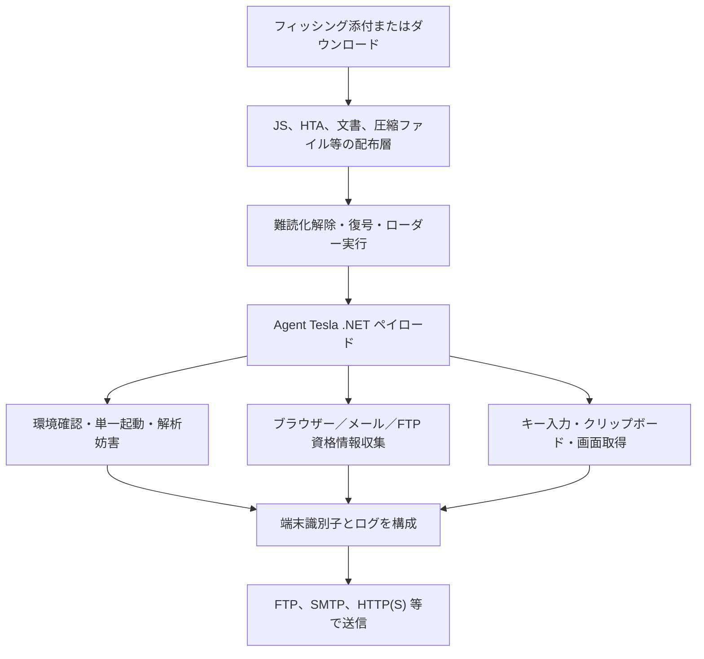
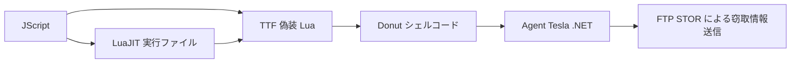

# Agent Tesla 技術解析

## 全体像

Agent Tesla は Windows 上で動作する .NET 系の情報窃取マルウェアです。配布形式はキャンペーンごとに異なりますが、最終ペイロードはブラウザー、メールクライアント、FTP クライアント等の保存資格情報、キー入力、クリップボード、スクリーンショット、端末情報を収集し、FTP、SMTP、HTTP(S) 等で送信します。

このリポジトリでは、配布ローダーと最終ペイロードを分離して記録します。同じ Agent Tesla 本体でもローダーが異なることがあり、同じローダーでも設定や運用者が異なる可能性があるためです。C2 の共有だけで同一アクターまたは同一キャンペーンとは断定しません。

## 一般的な処理構造

## 2026年7月に確認した主な配布世代

### JS・AES・メモリ内 .NET

大規模な JavaScript から PowerShell や AES 復号処理を組み立て、復元した .NET ペイロードをメモリ内で起動する系列です。Unicode マーカー除去、文字列反転、画像偽装ステージ、`fromCharCode`／`eval` 等の亜種があります。

### JS・LuaJIT・Donut・FTP 系列

[日本語の請求書メールを装ったケース](versions/2026-07-js-luajit-donut-ftp/cases/3f09145757282e6a59cd69319ac3b9da3265022a1d4f92a1646f8ddbaad89333/README.md)では、巨大な命令表をデコイとして含む JScript が、LuaJIT 実行ファイルを偽装した PIF と Lua スクリプトを偽装した TTF を生成します。Lua は置換表、文字列反転、Base64、PolyRot を組み合わせて Donut シェルコードを復元し、最終 Agent Tesla .NET ペイロードをメモリ内でロードします。

## 静的解析で重視する関数群

- 起動統括：単一起動、解析妨害、収集スレッド、送信処理の順序を確認します。
- 設定復号：C2、ポート、通信方式、機能フラグを復元し、資格情報は公開成果物から除外します。
- 資格情報収集：対象アプリケーション、保存場所、復号 API、例外処理を記録します。
- キーロガー：低レベルキーボード API、前景ウィンドウ、クリップボード、ログ形式を確認します。
- 画面取得：対象画面、画像形式、ファイル命名、周期を確認します。
- 送信処理：FTP の `STOR`、SMTP 添付、HTTP POST 等のプロトコルとファイル削除順序を確認します。
- 解析妨害：デバッガ、仮想環境、Sandboxie 系 DLL、時間差判定、外部 IP 確認を記録します。

## 自動解析

標準の復元器は `analysis-framework/malware/agenttesla/agenttesla_recover.py` です。JS・LuaJIT・Donut 系列は `agenttesla_luajit_chain.py` を使用し、外側 JS から最終 .NET の公開可能な設定まで一括処理します。復元バイナリの既定保存は行わず、SHA-256、サイズ、変換経路、秘匿済み設定を結果として残します。

設定抽出が失敗した場合は、既知 IOC だけで成功扱いにせず、復元停止層と不足資料を明示します。外部サンドボックス由来の設定とローカル静的復元結果も区別します。

## C2確認の方針

C2 の稼働確認は、明示的なネットワーク許可がある場合に限り実施します。FTP では DNS 解決、TCP 接続、公開バナー、`FEAT`、`QUIT` までに限定し、認証、ディレクトリ列挙、アップロードは行いません。サービスが応答した事実は Agent Tesla C2 の確証ではなく、静的設定、PCAP、時刻、公開インフラ情報と分離して評価します。

## 検知上の注意

- FTP、SMTP、PowerShell、LuaJIT は正規利用もあるため、単独条件で悪性判定しません。
- 配布層の特徴、復元された PE 構造、Agent Tesla の収集ロジック、送信先設定を組み合わせます。
- IP アドレスは共有ホスティングや再割当の影響を受けるため、観測日時を伴わない恒久 IOC として扱いません。
- 資格情報、検体、メモリダンプ、PCAP は公開リポジトリへ保存しません。

## 関連資料

- [ファミリー概要](README.md)
- [公開情報](OSINT.md)
- [版・検体一覧](VERSIONS.md)
- [検出ルール](rules/)
