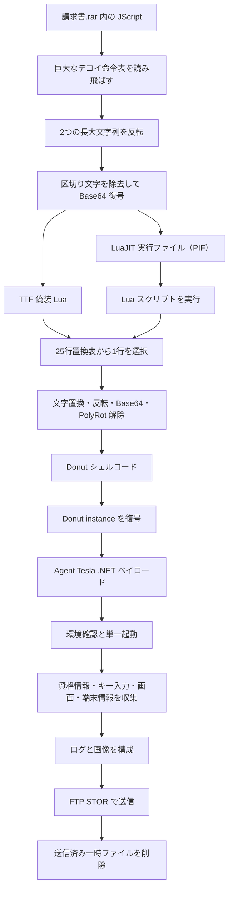
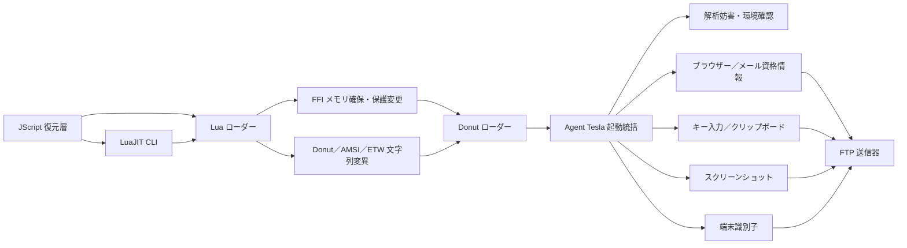

# 全体ロジック

## 実行フロー

## モジュール関係

## 解析上の境界

- JScript、PIF、Lua、Donut、最終 .NET の各層は SHA-256 とサイズで独立して記録しています。
- PIF は Agent Tesla 本体ではなく、TTF 偽装 Lua を実行する LuaJIT 2.1.0-beta3 系ランタイムです。
- Lua は Donut の痕跡を実行前後に変異させますが、最終 .NET の収集・送信ロジックとは別の解析妨害層です。
- FTP 応答はサービス稼働の観測であり、Agent Tesla 運用者の特定や窃取情報受信の成功を意味しません。
- 資格情報は復元できましたが、公開成果物には存在有無だけを残しています。
