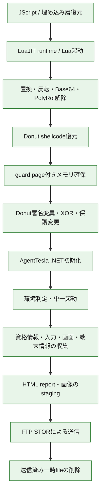
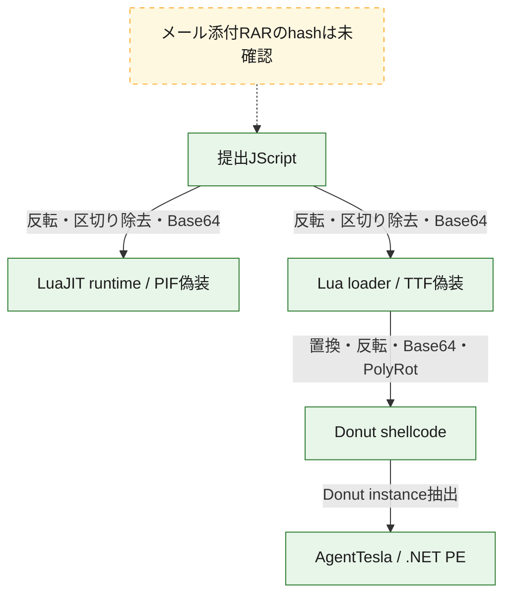
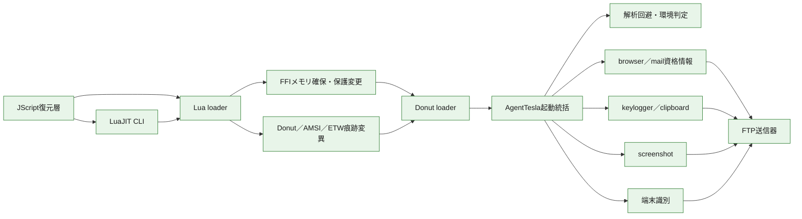

# 全体ロジック

## 静的可視化

### 実行フロー

### 感染チェーン

### モジュール関係

## 比較プロファイル

| 比較軸 | このcaseの正規化値 |
|---|---|
| 実行段階 | `script_execution`、`payload_decoding`、`process_memory`、`loader_execution`、`defense_evasion`、`credential_collection`、`input_capture`、`host_discovery`、`staging`、`exfiltration`、`cleanup` |
| 感染・復元層 | JavaScript → LuaJIT実行環境、JavaScript → Luaローダー、Lua → Donut、Donut → .NET PE |
| モジュール構成 | root script、recovered runtime、recovered loader、memory loader、final payload |
| 機能・挙動 | Base64、XOR、.NET、FTP |
| 代表関数の役割 | ローダー、復号器、メモリローダー、解析回避、資格情報収集、入力取得、端末情報取得、FTP情報送信 |
| コードfingerprint | 正規化SHA-256は記録済み。semantic token件数がないため、横断コード比較には未採用 |

## 他ケースとの比較

全1,279 caseのうち、比較に必要な独立軸を2つ以上持つ418 caseと照合しました。このcaseは5軸を持ちますが、現在の索引ではscore 0.34以上かつ2つ以上の独立軸が一致する候補はありませんでした。

- 同じAgentTeslaというfamily名だけでは類似根拠にしていません。
- .NET、FTP、Base64などの単独一致も候補から除外しています。
- 既存AgentTesla caseの多くは、今回と同じ粒度の復元層、module関係、代表関数roleが未整備です。候補なしは「非類似の確定」ではなく、比較証跡不足を含みます。
- 比較結果の正本は[感染チェーン・全体ロジック類似性索引](../../../../../../catalog/LOGIC-SIMILARITY.md)です。
- 類似候補が得られても、campaignまたはactorの同一性は自動確定しません。

## 解析上の境界

- JScript、PIF、Lua、Donut、最終.NETの各層はSHA-256とサイズで独立して記録しています。
- PIFはAgentTesla本体ではなく、TTF偽装Luaを実行するLuaJIT 2.1.0-beta3系実行環境です。
- LuaはDonutの痕跡を実行前後に変異させますが、最終.NETの収集・送信ロジックとは別の解析回避層です。
- FTP応答はservice稼働の観測であり、AgentTesla運用者の特定や窃取情報受信の成功を意味しません。
- 資格情報は復元できましたが、公開成果物には存在有無だけを残しています。
