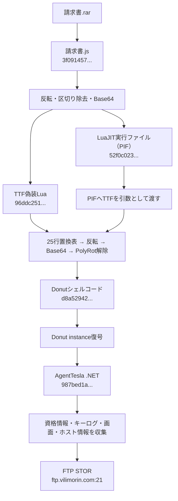
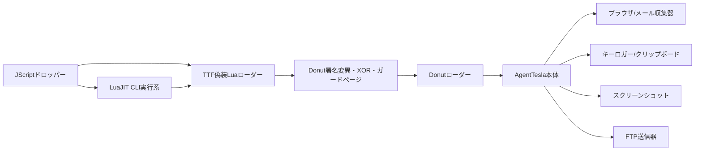

# 日本語マルスパム経由AgentTesla解析

- 件名: `Re: 請求書`
- 添付: `請求書.rar` → `請求書.js`
- 提出JS SHA-256: `3f09145757282e6a59cd69319ac3b9da3265022a1d4f92a1646f8ddbaad89333`
- 観測日: 2026-07-29
- 管理キー: `2026-07-js-luajit-donut-ftp`
- 解析状態: 最終AgentTesla .NET PEと公開安全な設定まで静的復元済み

## 結論

この検体は、巨大な命令表をデコイとして含むJScriptドロッパーです。2つの埋め込み文字列を反転し、区切り文字を除いてBase64復号すると、LuaJIT実行ファイルを偽装したPIFと、Luaスクリプトを偽装したTTFが得られます。Luaは25行の置換表、反転、Base64、PolyRotを経てDonutシェルコードを復元し、最終的にAgentTeslaの.NET PEをメモリ内で実行します。

最終PEはブラウザ・メールクライアントの資格情報、キーログ、クリップボード、スクリーンショット、ホスト情報を収集し、FTPの`STOR`で送信する実装です。FTP資格情報は復元できましたが、リポジトリには保存していません。

## 実行・感染チェーン

## モジュール関係

## 復元層

| 役割 | SHA-256 | サイズ |
|---|---|---:|
| 提出JScript | `3f09145757282e6a59cd69319ac3b9da3265022a1d4f92a1646f8ddbaad89333` | 3,904,391 |
| LuaJIT実行ファイル（PIF） | `52f0c0230b580e2fdf53a378b5c6d0db9829af900dae43e0df8f18635cd9f0c1` | 478,811 |
| TTF偽装Lua | `96ddc2518fe7e0b1ca312e5c456dca7a254125ce1f8e0d04c63d678806b48f65` | 493,720 |
| Donutシェルコード | `d8a52942d2a4bae0cd325755f673d191681ab966be156da03a3f8cc9eaabe022` | 276,555 |
| AgentTesla .NET | `987bed1a8e0a44a6a34d3193cbb1f782c45d51419a317e55f086d8de0748d018` | 245,248 |

## 静的解析の要点

### JScript層

`FDAWE`は文字列を反転します。その後、`? ! ~ 空白 \` # $ % ^ & * >`を段階的に削除し、Base64として復号します。1つ目はTTF偽装Lua、難読化文字列表の実行時インデックス`0x173`にある2つ目はPIFへ一致しました。復元ハッシュはTriageが観測したファイルと完全一致します。

### PIF層

Ghidra MCPで`/Targeted/20260729/AgentTesla-Invoice/CFOIBUEZCZDYFFBN.PIF.quarantine.bin`を明示指定して確認しました。`0x00401fe0`はLuaJITのCLI引数・スクリプト実行処理、`0x00460f20`はLua state初期化と保護呼び出し、`0x00401510`はCRT起動処理です。単体でAgentTesla機能を持つのではなく、改名されたLuaJIT 2.1.0-beta3実行系としてTTF偽装Luaを動かします。

### TTF偽装LuaとDonut

先頭`|G`の`G`は25行中17行目を選びます。選択行の`-[]{};:?,.`を`ABCDEFabcd`へ置換し、反転、Base64、PolyRot解除を行うとDonutシェルコードになります。Luaは`NtAllocateVirtualMemory`、`RtlMoveMemory`、`NtProtectVirtualMemory`を使い、実行前後にDonut stub、AMSI、ETW、WinINetなどのパターンをNOP・INT3・ランダム英字で変異させます。CRC32確認とガードページも含みます。

### AgentTesla本体

代表的な処理は[静的ロジック詳細](STATIC-LOGIC.md)に分離しました。主な機能は次のとおりです。

- ブラウザと多数のメールクライアントから保存資格情報を収集
- Outlookプロファイル、外部IP、CPU・OS・RAM・ユーザー情報を収集
- キー入力、前景ウィンドウ名、クリップボードを記録
- プライマリ画面をJPEGで取得
- `KL_<computer>_<timestamp>.html`と`SC_<computer>_<timestamp>.jpeg`を作成
- FTP `STOR`で送信後、ローカルの一時ログを削除
- デバッガ、Sandboxie系DLL、VMware、VirtualBoxなどを確認

## C2とPCAP

静的設定は`ftp.vilimorin.com:21`です。Triageの2026-07-29付PCAP 2本には、このホストのDNS問い合わせ、TCP/21接続、FTPコマンドはありませんでした。したがって、サンドボックス実行でC2送信が成功したとは評価していません。

2026-07-29 14:45 UTCの最小確認では`66.29.137.55`へ解決し、TCP接続、FTP `220` banner、`211` FEAT、`221` QUITを確認しました。認証・ファイル送信は行っていません。一般的なFTPサービス応答だけなので、これ自体はAgentTesla C2の確証ではありません。詳細は[通信分析](NETWORK-ANALYSIS.md)を参照してください。

## 検知と自動解析

- 一括解析: `analysis-framework/malware/agenttesla/agenttesla_luajit_chain.py`
- 自動ハンドラ: `analysis-framework/malware/agenttesla/extract_config.py`
- JS復元: `unpackers/javascript_reverse_base64.py`
- LuaJIT/PolyRot復元: `unpackers/luajit_polyrot_structural.py`
- C2最小確認: `analysis-framework/malware/agenttesla/c2_detector.py`
- 挙動・検体特徴: [BEHAVIOR-FEATURES.md](BEHAVIOR-FEATURES.md)
- C2ハント情報: [C2-HUNT.md](C2-HUNT.md)
- YARA、Sigma、ネットワークルール: [ファミリールール](../../../../rules/)

## 根拠

- [元投稿](https://x.com/bomccss/status/2082422024287498475)
- [Hatching Triage解析 260729-jh2h6sbp8x](https://tria.ge/260729-jh2h6sbp8x)
- [AgentTeslaファミリー概要](../../../../README.md)

## 制約

- 検体、復元PIF、Lua、Donut、最終PEはローカルで実行していません。
- 外側RARそのものは取得できず、Triageへ提出されたJScriptを起点に解析しました。
- `AgentTeslaV5`はTriage抽出ルール名であり、ビルダーの正確な製品バージョンを独立確認したものではありません。
- FTP資格情報、復元バイナリ、メモリダンプ、PCAPはリポジトリに含めていません。
