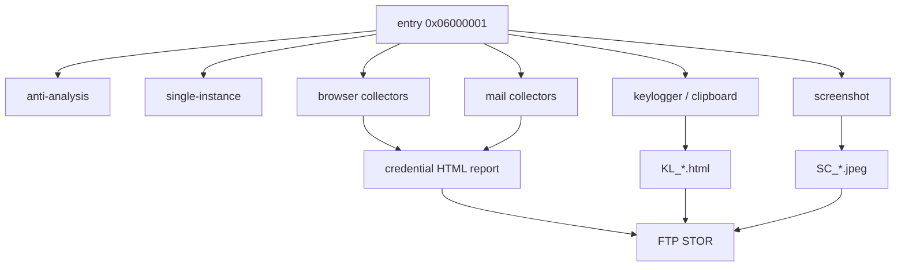

# 特徴的関数と全体ロジック

全545 managed methodを逐語的に並べる代わりに、コード類似性と次回解析へ再利用しやすい16個の特徴的処理を記録しました。機械可読な詳細と正規化fingerprintは[static-logic.json](static-logic.json)にあります。

## 層ごとの役割

| 層 | 関数・位置 | 役割 |
|---|---|---|
| JScript | `FDAWE` | 巨大文字列の反転。呼び出し側が区切り除去とBase64復号を実施 |
| PIF | `0x00401fe0` | LuaJIT CLIの引数処理とスクリプト実行 |
| Lua | `HOUWIP` | `|G`で25行置換表を選び、置換後に反転 |
| Lua | `HOUWIPPP` | PolyRot先頭マーカーから印字可能ASCIIの回転を解除 |
| Lua | `HOUWIOYHHH` | Donut stub、AMSI、ETW、WinINetなどのメモリ署名を変異 |
| Lua | top-level memory chain | XOR保管、ガードページ、コピー、CRC、保護変更、関数ポインタ呼び出し |
| .NET | `0x06000001` | TLS設定、証明書callback、AgentTesla初期化 |
| .NET | `T4Au29ea.N3Z9` | デバッガ、Sandboxie系DLL、VMware、VirtualBoxなどを確認 |
| .NET | `CdF0tHpUPHn.EcXJPSf30.of0po` | 多数のブラウザcollectorを登録 |
| .NET | `l6PWEVlPap.7lTsz3C7.H5y` | 多数のメールクライアントcollectorを登録 |
| .NET | `7Q9fP5BF.2CUon.JcSpTf` / `Rks5EB9` | キー入力、前景window、clipboardをHTMLログ化 |
| .NET | screenshot処理 | 画面をJPEG化し`SC_...jpeg`として送信 |
| .NET | keylog report処理 | `log.tmp`を`KL_...html`へ整形し送信後削除 |
| .NET | `HeErxv4aW.eEbai.J395E1` | `FtpWebRequest`と`STOR`による送信 |
| .NET | HardwareIdentifier | baseboard、CPU、MACをMD5化してhost IDを生成 |
| .NET | `9xBv1dYJy.yFP1gm.eibQkIkB6P` | 重複プロセスを見つけて終了 |

## Luaローダーの特徴

このローダーは単なるBase64 wrapperではありません。次の順序がコード類似性の有力な識別点です。

1. `|0`から`|O`の2文字headerで25行表を選択
2. 10文字の記号alphabetを`ABCDEFabcd`へ置換
3. 文字列を反転
4. Base64復号
5. 先頭1バイトのPolyRot markerでASCII回転を解除
6. 8バイト鍵でXOR保管
7. Donut関連パターンを実行前後に変異
8. CRC32とページ保護を確認して関数ポインタ呼び出し

この組み合わせは、変数名や最終payload hashが変わっても追跡できます。今回の自動復元器は変数名・検体hashではなく、25行×10文字表、header、復号後Donut構造を検証します。

## AgentTesla本体の処理

最終PEには148 types、620 methodsがあり、545 methodsにbodyがあります。静的CIL解析では39,819 instructions、4,696 calls、1,093 `ldstr`を確認しました。8個のswitchがあるものの、既知protector markerはなく、control-flow flatteningは低確度のため断定していません。

## Ghidra MCPの確認範囲

PIFはプログラム選択子`/Targeted/20260729/AgentTesla-Invoice/CFOIBUEZCZDYFFBN.PIF.quarantine.bin`を明示して解析しました。

- `0x00401510`: security cookie初期化とCRT startup
- `0x00460f20`: Lua state初期化とprotected call wrapper
- `0x00401fe0`: LuaJIT CLI optionとscript runner
- TLS callback: `0x0045df30`、`0x0045df60`

PIFは悪性機能本体ではなく、改名・再梱包されたLuaJIT実行系です。悪性の復号・メモリ実行ロジックは引数のTTF偽装Luaにあります。

## 制約

- 生の逆コンパイル本文は公開していません。
- 資格情報、復元バイナリ、メモリダンプは含めていません。
- 関数名は難読化されているため、原名と役割名の両方で追跡してください。
