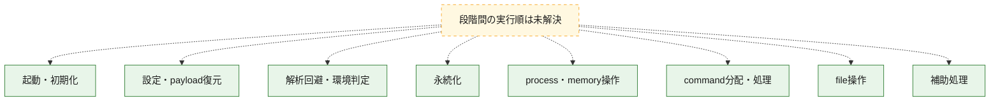
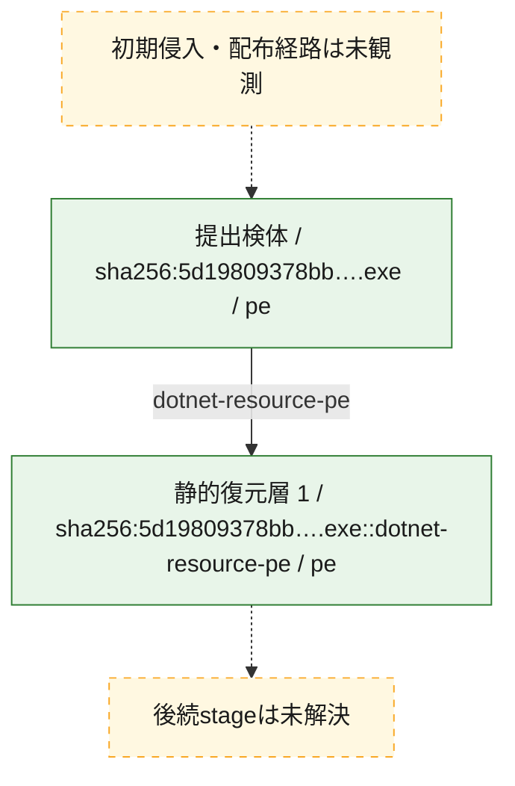
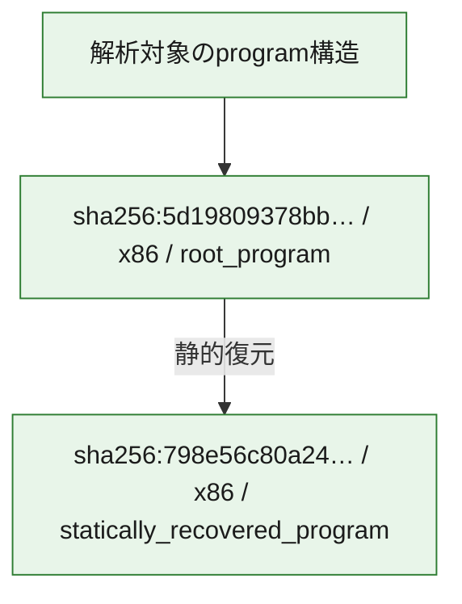

# 全体ロジック：5d19809378bb97702fe78e564fa7be5f01d813df7398eaa8f6721e7c1b9ab1aa

代表関数の静的証跡から、起動・初期化、設定・payload復元、解析回避・環境判定、永続化、process・memory操作、command分配・処理、file操作の処理群を確認しました。

## 読み方

- phaseの掲載順は解析上の整理順です。observed_call_edgesがない段階間の実行順を断定しません。
- 図の実線は静的に観測した関係、点線と黄色のノードは未観測・未解決の関係を示します。
- 図は静的な要約であり、動的実行を再現するものではありません。
- 詳細な関数解説とfingerprintは[STATIC-LOGIC.md](STATIC-LOGIC.md)を参照してください。

## 静的可視化

### 実行フロー

### 感染チェーン

### モジュール関係

## 処理段階

### 1. 起動・初期化

entry pointから初期化と後続処理への移行を確認します。
確度: `confirmed_static_function_evidence`

- `5d19809378bb97702fe78e564fa7be5f01d813df7398eaa8f6721e7c1b9ab1aa:cil:0x06000156` — 初期化と主要処理への分岐を行う入口関数です。 状態: `succeeded`、選定理由: `entry_point`, `large_function:instructions=620`, `reviewed_call_centrality:160`
- `5d19809378bb97702fe78e564fa7be5f01d813df7398eaa8f6721e7c1b9ab1aa:cil:0x06000159` — 初期化と主要処理への分岐を行う入口関数です。 状態: `succeeded`、選定理由: `entry_point`
- `5d19809378bb97702fe78e564fa7be5f01d813df7398eaa8f6721e7c1b9ab1aa:cil:0x0600015a` — 初期化と主要処理への分岐を行う入口関数です。 状態: `succeeded`、選定理由: `entry_point`, `reviewed_call_centrality:2`
- `5d19809378bb97702fe78e564fa7be5f01d813df7398eaa8f6721e7c1b9ab1aa:cil:0x0600015c` — 初期化と主要処理への分岐を行う入口関数です。 状態: `succeeded`、選定理由: `entry_point`, `reviewed_call_centrality:2`
- `5d19809378bb97702fe78e564fa7be5f01d813df7398eaa8f6721e7c1b9ab1aa:cil:0x0600015d` — 初期化と主要処理への分岐を行う入口関数です。 状態: `succeeded`、選定理由: `entry_point`, `reviewed_call_centrality:2`

### 2. 設定・payload復元

設定、resource、payload、暗号化データの復元・変換を確認します。
確度: `confirmed_static_function_evidence`

- `798e56c80a24ab20e6411aa11ce3b5c0419920b8bd5eff91424209b55abafc6d:cil:0x06000003` — 設定、resource、payloadなどの解析・変換を行う関数です。 状態: `succeeded`、選定理由: `reviewed_call_centrality:4`, `role:config_or_data_transform`, `small_program_complete_context`
- `798e56c80a24ab20e6411aa11ce3b5c0419920b8bd5eff91424209b55abafc6d:cil:0x06000004` — 設定、resource、payloadなどの解析・変換を行う関数です。 状態: `succeeded`、選定理由: `large_function:instructions=181`, `reviewed_call_centrality:42`, `role:config_or_data_transform`, `small_program_complete_context`
- `798e56c80a24ab20e6411aa11ce3b5c0419920b8bd5eff91424209b55abafc6d:cil:0x06000005` — 暗号、hash、encoding、または復号処理に関係する関数です。 状態: `succeeded`、選定理由: `reviewed_call_centrality:18`, `role:cryptographic_transform`, `small_program_complete_context`
- `798e56c80a24ab20e6411aa11ce3b5c0419920b8bd5eff91424209b55abafc6d:cil:0x0600000a` — 暗号、hash、encoding、または復号処理に関係する関数です。 状態: `succeeded`、選定理由: `large_function:instructions=70`, `role:cryptographic_transform`, `small_program_complete_context`
- `798e56c80a24ab20e6411aa11ce3b5c0419920b8bd5eff91424209b55abafc6d:cil:0x0600000c` — 暗号、hash、encoding、または復号処理に関係する関数です。 状態: `succeeded`、選定理由: `large_function:instructions=250`, `reviewed_call_centrality:4`, `role:cryptographic_transform`, `small_program_complete_context`
- `798e56c80a24ab20e6411aa11ce3b5c0419920b8bd5eff91424209b55abafc6d:cil:0x0600000e` — 暗号、hash、encoding、または復号処理に関係する関数です。 状態: `succeeded`、選定理由: `reviewed_call_centrality:4`, `role:cryptographic_transform`, `small_program_complete_context`
- `798e56c80a24ab20e6411aa11ce3b5c0419920b8bd5eff91424209b55abafc6d:cil:0x0600000f` — 暗号、hash、encoding、または復号処理に関係する関数です。 状態: `succeeded`、選定理由: `reviewed_call_centrality:4`, `role:cryptographic_transform`, `small_program_complete_context`
- `798e56c80a24ab20e6411aa11ce3b5c0419920b8bd5eff91424209b55abafc6d:cil:0x06000010` — 暗号、hash、encoding、または復号処理に関係する関数です。 状態: `succeeded`、選定理由: `reviewed_call_centrality:2`, `role:cryptographic_transform`, `small_program_complete_context`
- `5d19809378bb97702fe78e564fa7be5f01d813df7398eaa8f6721e7c1b9ab1aa:cil:0x06000046` — 設定、resource、payloadなどの解析・変換を行う関数です。 状態: `succeeded`、選定理由: `large_function:instructions=206`, `reviewed_call_centrality:52`, `role:config_or_data_transform`
- `5d19809378bb97702fe78e564fa7be5f01d813df7398eaa8f6721e7c1b9ab1aa:cil:0x0600032d` — 設定、resource、payloadなどの解析・変換を行う関数です。 状態: `succeeded`、選定理由: `large_function:instructions=368`, `reviewed_call_centrality:40`, `role:config_or_data_transform`
- `5d19809378bb97702fe78e564fa7be5f01d813df7398eaa8f6721e7c1b9ab1aa:cil:0x06000339` — 設定、resource、payloadなどの解析・変換を行う関数です。 状態: `succeeded`、選定理由: `large_function:instructions=165`, `reviewed_call_centrality:28`, `role:config_or_data_transform`
- `5d19809378bb97702fe78e564fa7be5f01d813df7398eaa8f6721e7c1b9ab1aa:cil:0x060003d2` — 暗号、hash、encoding、または復号処理に関係する関数です。 状態: `succeeded`、選定理由: `large_function:instructions=86`, `reviewed_call_centrality:28`, `role:cryptographic_transform`
- `5d19809378bb97702fe78e564fa7be5f01d813df7398eaa8f6721e7c1b9ab1aa:cil:0x060005bd` — 設定、resource、payloadなどの解析・変換を行う関数です。 状態: `succeeded`、選定理由: `large_function:instructions=155`, `reviewed_call_centrality:24`, `role:config_or_data_transform`
- `5d19809378bb97702fe78e564fa7be5f01d813df7398eaa8f6721e7c1b9ab1aa:cil:0x06000675` — 暗号、hash、encoding、または復号処理に関係する関数です。 状態: `succeeded`、選定理由: `large_function:instructions=188`, `reviewed_call_centrality:46`, `role:cryptographic_transform`
- `5d19809378bb97702fe78e564fa7be5f01d813df7398eaa8f6721e7c1b9ab1aa:cil:0x06000679` — 暗号、hash、encoding、または復号処理に関係する関数です。 状態: `succeeded`、選定理由: `large_function:instructions=65`, `reviewed_call_centrality:38`, `role:cryptographic_transform`
- `5d19809378bb97702fe78e564fa7be5f01d813df7398eaa8f6721e7c1b9ab1aa:cil:0x0600082a` — 設定、resource、payloadなどの解析・変換を行う関数です。 状態: `succeeded`、選定理由: `large_function:instructions=167`, `reviewed_call_centrality:26`, `role:config_or_data_transform`

### 3. 解析回避・環境判定

debugger、sandbox、仮想環境、時間差などの判定を確認します。
確度: `confirmed_static_function_evidence`

- `5d19809378bb97702fe78e564fa7be5f01d813df7398eaa8f6721e7c1b9ab1aa:cil:0x060002ae` — debugger、仮想環境、sandbox、または時間差の確認に関係する関数です。 状態: `succeeded`、選定理由: `large_function:instructions=183`, `reviewed_call_centrality:52`, `role:anti_analysis`
- `5d19809378bb97702fe78e564fa7be5f01d813df7398eaa8f6721e7c1b9ab1aa:cil:0x06000321` — debugger、仮想環境、sandbox、または時間差の確認に関係する関数です。 状態: `succeeded`、選定理由: `large_function:instructions=161`, `reviewed_call_centrality:30`, `role:anti_analysis`
- `5d19809378bb97702fe78e564fa7be5f01d813df7398eaa8f6721e7c1b9ab1aa:cil:0x06000344` — debugger、仮想環境、sandbox、または時間差の確認に関係する関数です。 状態: `succeeded`、選定理由: `large_function:instructions=115`, `reviewed_call_centrality:32`, `role:anti_analysis`
- `5d19809378bb97702fe78e564fa7be5f01d813df7398eaa8f6721e7c1b9ab1aa:cil:0x06000347` — debugger、仮想環境、sandbox、または時間差の確認に関係する関数です。 状態: `succeeded`、選定理由: `large_function:instructions=125`, `reviewed_call_centrality:36`, `role:anti_analysis`
- `5d19809378bb97702fe78e564fa7be5f01d813df7398eaa8f6721e7c1b9ab1aa:cil:0x060003cd` — debugger、仮想環境、sandbox、または時間差の確認に関係する関数です。 状態: `succeeded`、選定理由: `large_function:instructions=99`, `reviewed_call_centrality:32`, `role:anti_analysis`
- `5d19809378bb97702fe78e564fa7be5f01d813df7398eaa8f6721e7c1b9ab1aa:cil:0x06000732` — debugger、仮想環境、sandbox、または時間差の確認に関係する関数です。 状態: `succeeded`、選定理由: `large_function:instructions=81`, `reviewed_call_centrality:26`, `role:anti_analysis`
- `5d19809378bb97702fe78e564fa7be5f01d813df7398eaa8f6721e7c1b9ab1aa:cil:0x06000735` — debugger、仮想環境、sandbox、または時間差の確認に関係する関数です。 状態: `succeeded`、選定理由: `large_function:instructions=90`, `reviewed_call_centrality:34`, `role:anti_analysis`
- `5d19809378bb97702fe78e564fa7be5f01d813df7398eaa8f6721e7c1b9ab1aa:cil:0x06000871` — debugger、仮想環境、sandbox、または時間差の確認に関係する関数です。 状態: `succeeded`、選定理由: `large_function:instructions=105`, `reviewed_call_centrality:40`, `role:anti_analysis`

### 4. 永続化

自動起動や永続化に関係する設定変更を確認します。
確度: `confirmed_static_function_evidence`

- `798e56c80a24ab20e6411aa11ce3b5c0419920b8bd5eff91424209b55abafc6d:cil:0x06000002` — 自動起動または永続化に関係する処理を含む関数です。 状態: `succeeded`、選定理由: `reviewed_call_centrality:2`, `role:persistence`, `small_program_complete_context`
- `798e56c80a24ab20e6411aa11ce3b5c0419920b8bd5eff91424209b55abafc6d:cil:0x0600000d` — 自動起動または永続化に関係する処理を含む関数です。 状態: `succeeded`、選定理由: `reviewed_call_centrality:4`, `role:persistence`, `small_program_complete_context`
- `5d19809378bb97702fe78e564fa7be5f01d813df7398eaa8f6721e7c1b9ab1aa:cil:0x06000827` — 自動起動または永続化に関係する処理を含む関数です。 状態: `succeeded`、選定理由: `reviewed_call_centrality:26`, `role:persistence`

### 5. process・memory操作

process、thread、module、memory操作と実行移行を確認します。
確度: `confirmed_static_function_evidence`

- `5d19809378bb97702fe78e564fa7be5f01d813df7398eaa8f6721e7c1b9ab1aa:cil:0x06000176` — process、thread、module、またはmemory操作に関係する関数です。 状態: `succeeded`、選定理由: `large_function:instructions=99`, `reviewed_call_centrality:40`, `role:process_or_memory_operation`

### 6. command分配・処理

受信commandやtaskの解釈、分配、個別handlerへの移行を確認します。
確度: `confirmed_static_function_evidence`

- `5d19809378bb97702fe78e564fa7be5f01d813df7398eaa8f6721e7c1b9ab1aa:cil:0x06000120` — commandの解釈、分配、または個別処理を担当する関数です。 状態: `succeeded`、選定理由: `large_function:instructions=281`, `reviewed_call_centrality:54`, `role:command_dispatch_or_handler`
- `5d19809378bb97702fe78e564fa7be5f01d813df7398eaa8f6721e7c1b9ab1aa:cil:0x06000770` — commandの解釈、分配、または個別処理を担当する関数です。 状態: `succeeded`、選定理由: `large_function:instructions=460`, `reviewed_call_centrality:62`, `role:command_dispatch_or_handler`
- `5d19809378bb97702fe78e564fa7be5f01d813df7398eaa8f6721e7c1b9ab1aa:cil:0x06000783` — commandの解釈、分配、または個別処理を担当する関数です。 状態: `succeeded`、選定理由: `large_function:instructions=249`, `reviewed_call_centrality:26`, `role:command_dispatch_or_handler`

### 7. file操作

fileやdirectoryの作成、読書き、削除を確認します。
確度: `confirmed_static_function_evidence`

- `798e56c80a24ab20e6411aa11ce3b5c0419920b8bd5eff91424209b55abafc6d:cil:0x06000006` — fileまたはdirectoryの読書き・管理に関係する関数です。 状態: `succeeded`、選定理由: `large_function:instructions=121`, `reviewed_call_centrality:6`, `role:file_operation`, `small_program_complete_context`
- `798e56c80a24ab20e6411aa11ce3b5c0419920b8bd5eff91424209b55abafc6d:cil:0x06000008` — fileまたはdirectoryの読書き・管理に関係する関数です。 状態: `succeeded`、選定理由: `reviewed_call_centrality:10`, `role:file_operation`, `small_program_complete_context`
- `5d19809378bb97702fe78e564fa7be5f01d813df7398eaa8f6721e7c1b9ab1aa:cil:0x06000376` — fileまたはdirectoryの読書き・管理に関係する関数です。 状態: `succeeded`、選定理由: `large_function:instructions=73`, `reviewed_call_centrality:32`, `role:file_operation`
- `5d19809378bb97702fe78e564fa7be5f01d813df7398eaa8f6721e7c1b9ab1aa:cil:0x06000378` — fileまたはdirectoryの読書き・管理に関係する関数です。 状態: `succeeded`、選定理由: `large_function:instructions=66`, `reviewed_call_centrality:32`, `role:file_operation`
- `5d19809378bb97702fe78e564fa7be5f01d813df7398eaa8f6721e7c1b9ab1aa:cil:0x060003c3` — fileまたはdirectoryの読書き・管理に関係する関数です。 状態: `succeeded`、選定理由: `large_function:instructions=265`, `reviewed_call_centrality:62`, `role:file_operation`
- `5d19809378bb97702fe78e564fa7be5f01d813df7398eaa8f6721e7c1b9ab1aa:cil:0x06000423` — fileまたはdirectoryの読書き・管理に関係する関数です。 状態: `succeeded`、選定理由: `reviewed_call_centrality:30`, `role:file_operation`
- `5d19809378bb97702fe78e564fa7be5f01d813df7398eaa8f6721e7c1b9ab1aa:cil:0x06000709` — fileまたはdirectoryの読書き・管理に関係する関数です。 状態: `succeeded`、選定理由: `large_function:instructions=69`, `reviewed_call_centrality:30`, `role:file_operation`

### 8. 補助処理

主要処理を支える一般内部関数またはlibrary処理を確認します。
確度: `confirmed_static_function_evidence`

- `798e56c80a24ab20e6411aa11ce3b5c0419920b8bd5eff91424209b55abafc6d:cil:0x06000001` — 検体内部の一般処理を実装する関数です。 状態: `succeeded`、選定理由: `reviewed_call_centrality:2`, `small_program_complete_context`
- `798e56c80a24ab20e6411aa11ce3b5c0419920b8bd5eff91424209b55abafc6d:cil:0x06000007` — 検体内部の一般処理を実装する関数です。 状態: `succeeded`、選定理由: `large_function:instructions=141`, `reviewed_call_centrality:14`, `small_program_complete_context`
- `798e56c80a24ab20e6411aa11ce3b5c0419920b8bd5eff91424209b55abafc6d:cil:0x06000009` — 検体内部の一般処理を実装する関数です。 状態: `succeeded`、選定理由: `large_function:instructions=210`, `reviewed_call_centrality:2`, `small_program_complete_context`
- `798e56c80a24ab20e6411aa11ce3b5c0419920b8bd5eff91424209b55abafc6d:cil:0x0600000b` — 検体内部の一般処理を実装する関数です。 状態: `succeeded`、選定理由: `context_representative`, `small_program_complete_context`
- `5d19809378bb97702fe78e564fa7be5f01d813df7398eaa8f6721e7c1b9ab1aa:cil:0x060002ed` — 検体内部の一般処理を実装する関数です。 状態: `succeeded`、選定理由: `large_function:instructions=699`, `reviewed_call_centrality:62`

## 観測したcall関係

- 代表関数間で直接解決できた呼出関係はありません。

## 解析範囲と制約

- 選定外関数は全体inventoryへ残しますが、関数本体の個別解説対象にはしていません。
- indirect call、難読化、packer、VM、壊れたcontrol flowによりcall関係が欠落する場合があります。
- 文書は静的解析に基づき、検体実行や外部通信による動的確認は行っていません。
