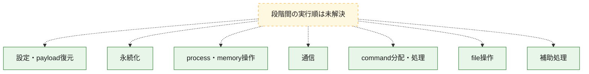
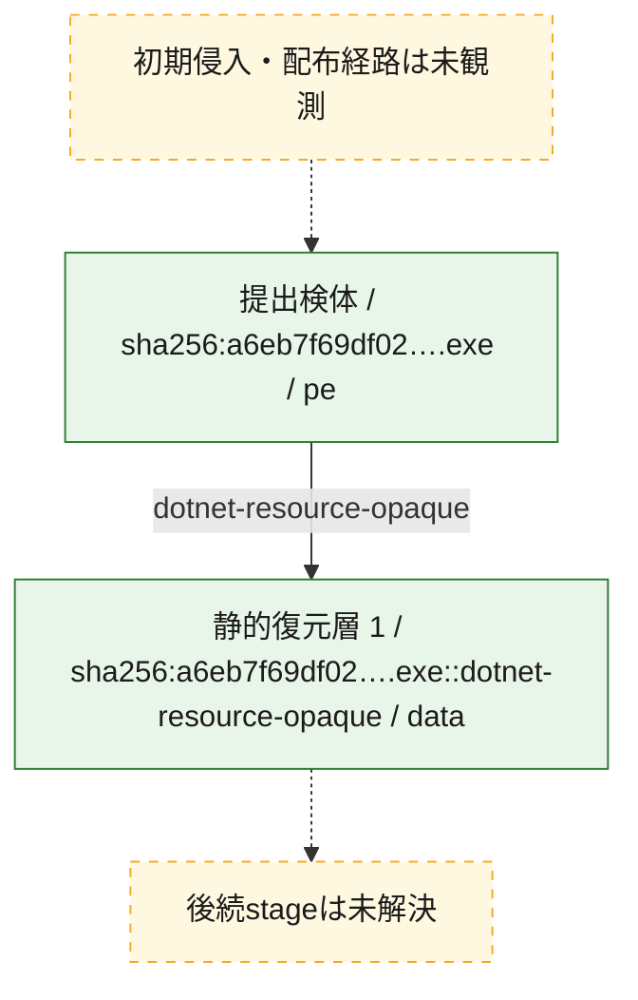
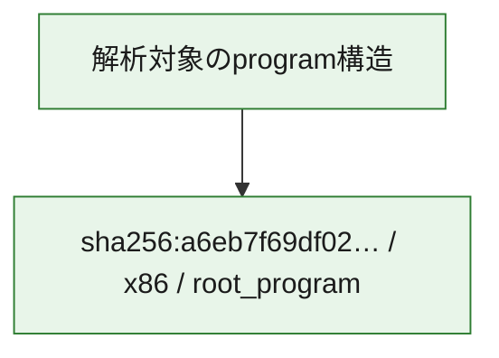

# 全体ロジック：a6eb7f69df025bf0229d9d3a9754cf687e8165978fd2fcf3accd30c6afa67562

代表関数の静的証跡から、設定・payload復元、永続化、process・memory操作、通信、command分配・処理、file操作の処理群を確認しました。

## 読み方

- phaseの掲載順は解析上の整理順です。observed_call_edgesがない段階間の実行順を断定しません。
- 図の実線は静的に観測した関係、点線と黄色のノードは未観測・未解決の関係を示します。
- 図は静的な要約であり、動的実行を再現するものではありません。
- 詳細な関数解説とfingerprintは[STATIC-LOGIC.md](STATIC-LOGIC.md)を参照してください。

## 静的可視化

### 実行フロー

### 感染チェーン

### モジュール関係

## 処理段階

### 1. 設定・payload復元

設定、resource、payload、暗号化データの復元・変換を確認します。
確度: `confirmed_static_function_evidence`

- `a6eb7f69df025bf0229d9d3a9754cf687e8165978fd2fcf3accd30c6afa67562:cil:0x06000dd4` — 暗号、hash、encoding、または復号処理に関係する関数です。 状態: `succeeded`、選定理由: `large_function:instructions=447`, `reviewed_call_centrality:102`, `role:cryptographic_transform`
- `a6eb7f69df025bf0229d9d3a9754cf687e8165978fd2fcf3accd30c6afa67562:cil:0x06001194` — 設定、resource、payloadなどの解析・変換を行う関数です。 状態: `succeeded`、選定理由: `large_function:instructions=581`, `reviewed_call_centrality:262`, `role:config_or_data_transform`
- `a6eb7f69df025bf0229d9d3a9754cf687e8165978fd2fcf3accd30c6afa67562:cil:0x060011a0` — 暗号、hash、encoding、または復号処理に関係する関数です。 状態: `succeeded`、選定理由: `large_function:instructions=205`, `reviewed_call_centrality:126`, `role:cryptographic_transform`
- `a6eb7f69df025bf0229d9d3a9754cf687e8165978fd2fcf3accd30c6afa67562:cil:0x0600163c` — 設定、resource、payloadなどの解析・変換を行う関数です。 状態: `succeeded`、選定理由: `large_function:instructions=287`, `reviewed_call_centrality:148`, `role:config_or_data_transform`
- `a6eb7f69df025bf0229d9d3a9754cf687e8165978fd2fcf3accd30c6afa67562:cil:0x06001bab` — 設定、resource、payloadなどの解析・変換を行う関数です。 状態: `succeeded`、選定理由: `large_function:instructions=210`, `reviewed_call_centrality:70`, `role:config_or_data_transform`

### 2. 永続化

自動起動や永続化に関係する設定変更を確認します。
確度: `confirmed_static_function_evidence`

- `a6eb7f69df025bf0229d9d3a9754cf687e8165978fd2fcf3accd30c6afa67562:cil:0x060011a5` — 自動起動または永続化に関係する処理を含む関数です。 状態: `succeeded`、選定理由: `large_function:instructions=132`, `reviewed_call_centrality:68`, `role:persistence`

### 3. process・memory操作

process、thread、module、memory操作と実行移行を確認します。
確度: `confirmed_static_function_evidence`

- `a6eb7f69df025bf0229d9d3a9754cf687e8165978fd2fcf3accd30c6afa67562:cil:0x06000ebf` — process、thread、module、またはmemory操作に関係する関数です。 状態: `succeeded`、選定理由: `large_function:instructions=261`, `reviewed_call_centrality:172`, `role:process_or_memory_operation`
- `a6eb7f69df025bf0229d9d3a9754cf687e8165978fd2fcf3accd30c6afa67562:cil:0x06001192` — process、thread、module、またはmemory操作に関係する関数です。 状態: `succeeded`、選定理由: `large_function:instructions=272`, `reviewed_call_centrality:48`, `role:process_or_memory_operation`
- `a6eb7f69df025bf0229d9d3a9754cf687e8165978fd2fcf3accd30c6afa67562:cil:0x06001197` — process、thread、module、またはmemory操作に関係する関数です。 状態: `succeeded`、選定理由: `large_function:instructions=128`, `reviewed_call_centrality:68`, `role:process_or_memory_operation`
- `a6eb7f69df025bf0229d9d3a9754cf687e8165978fd2fcf3accd30c6afa67562:cil:0x06001198` — process、thread、module、またはmemory操作に関係する関数です。 状態: `succeeded`、選定理由: `large_function:instructions=605`, `reviewed_call_centrality:272`, `role:process_or_memory_operation`
- `a6eb7f69df025bf0229d9d3a9754cf687e8165978fd2fcf3accd30c6afa67562:cil:0x0600163d` — process、thread、module、またはmemory操作に関係する関数です。 状態: `succeeded`、選定理由: `large_function:instructions=182`, `reviewed_call_centrality:88`, `role:process_or_memory_operation`

### 4. 通信

通信初期化、endpoint処理、送受信の役割を確認します。
確度: `confirmed_static_function_evidence`

- `a6eb7f69df025bf0229d9d3a9754cf687e8165978fd2fcf3accd30c6afa67562:cil:0x06000dd5` — 通信初期化、送受信、またはendpoint処理に関係する関数です。 状態: `succeeded`、選定理由: `large_function:instructions=185`, `reviewed_call_centrality:122`, `role:network_communication`
- `a6eb7f69df025bf0229d9d3a9754cf687e8165978fd2fcf3accd30c6afa67562:cil:0x06000e41` — 通信初期化、送受信、またはendpoint処理に関係する関数です。 状態: `succeeded`、選定理由: `large_function:instructions=309`, `reviewed_call_centrality:178`, `role:network_communication`
- `a6eb7f69df025bf0229d9d3a9754cf687e8165978fd2fcf3accd30c6afa67562:cil:0x06000f65` — 通信初期化、送受信、またはendpoint処理に関係する関数です。 状態: `succeeded`、選定理由: `large_function:instructions=214`, `reviewed_call_centrality:112`, `role:network_communication`
- `a6eb7f69df025bf0229d9d3a9754cf687e8165978fd2fcf3accd30c6afa67562:cil:0x06000f67` — 通信初期化、送受信、またはendpoint処理に関係する関数です。 状態: `succeeded`、選定理由: `large_function:instructions=139`, `reviewed_call_centrality:70`, `role:network_communication`
- `a6eb7f69df025bf0229d9d3a9754cf687e8165978fd2fcf3accd30c6afa67562:cil:0x060014eb` — 通信初期化、送受信、またはendpoint処理に関係する関数です。 状態: `succeeded`、選定理由: `large_function:instructions=128`, `reviewed_call_centrality:66`, `role:network_communication`
- `a6eb7f69df025bf0229d9d3a9754cf687e8165978fd2fcf3accd30c6afa67562:cil:0x060015f2` — 通信初期化、送受信、またはendpoint処理に関係する関数です。 状態: `succeeded`、選定理由: `large_function:instructions=157`, `reviewed_call_centrality:104`, `role:network_communication`
- `a6eb7f69df025bf0229d9d3a9754cf687e8165978fd2fcf3accd30c6afa67562:cil:0x0600190e` — 通信初期化、送受信、またはendpoint処理に関係する関数です。 状態: `succeeded`、選定理由: `large_function:instructions=307`, `reviewed_call_centrality:186`, `role:network_communication`
- `a6eb7f69df025bf0229d9d3a9754cf687e8165978fd2fcf3accd30c6afa67562:cil:0x0600199f` — 通信初期化、送受信、またはendpoint処理に関係する関数です。 状態: `succeeded`、選定理由: `large_function:instructions=238`, `reviewed_call_centrality:52`, `role:network_communication`

### 5. command分配・処理

受信commandやtaskの解釈、分配、個別handlerへの移行を確認します。
確度: `confirmed_static_function_evidence`

- `a6eb7f69df025bf0229d9d3a9754cf687e8165978fd2fcf3accd30c6afa67562:cil:0x06000f72` — commandの解釈、分配、または個別処理を担当する関数です。 状態: `succeeded`、選定理由: `large_function:instructions=724`, `reviewed_call_centrality:422`, `role:command_dispatch_or_handler`
- `a6eb7f69df025bf0229d9d3a9754cf687e8165978fd2fcf3accd30c6afa67562:cil:0x06001195` — commandの解釈、分配、または個別処理を担当する関数です。 状態: `succeeded`、選定理由: `large_function:instructions=260`, `reviewed_call_centrality:102`, `role:command_dispatch_or_handler`
- `a6eb7f69df025bf0229d9d3a9754cf687e8165978fd2fcf3accd30c6afa67562:cil:0x06001199` — commandの解釈、分配、または個別処理を担当する関数です。 状態: `succeeded`、選定理由: `large_function:instructions=141`, `reviewed_call_centrality:100`, `role:command_dispatch_or_handler`
- `a6eb7f69df025bf0229d9d3a9754cf687e8165978fd2fcf3accd30c6afa67562:cil:0x0600119b` — commandの解釈、分配、または個別処理を担当する関数です。 状態: `succeeded`、選定理由: `large_function:instructions=162`, `reviewed_call_centrality:112`, `role:command_dispatch_or_handler`
- `a6eb7f69df025bf0229d9d3a9754cf687e8165978fd2fcf3accd30c6afa67562:cil:0x060011b0` — commandの解釈、分配、または個別処理を担当する関数です。 状態: `succeeded`、選定理由: `large_function:instructions=119`, `reviewed_call_centrality:100`, `role:command_dispatch_or_handler`
- `a6eb7f69df025bf0229d9d3a9754cf687e8165978fd2fcf3accd30c6afa67562:cil:0x060011b3` — commandの解釈、分配、または個別処理を担当する関数です。 状態: `succeeded`、選定理由: `large_function:instructions=130`, `reviewed_call_centrality:78`, `role:command_dispatch_or_handler`
- `a6eb7f69df025bf0229d9d3a9754cf687e8165978fd2fcf3accd30c6afa67562:cil:0x06001ca5` — commandの解釈、分配、または個別処理を担当する関数です。 状態: `succeeded`、選定理由: `large_function:instructions=441`, `reviewed_call_centrality:206`, `role:command_dispatch_or_handler`

### 6. file操作

fileやdirectoryの作成、読書き、削除を確認します。
確度: `confirmed_static_function_evidence`

- `a6eb7f69df025bf0229d9d3a9754cf687e8165978fd2fcf3accd30c6afa67562:cil:0x06000d9d` — fileまたはdirectoryの読書き・管理に関係する関数です。 状態: `succeeded`、選定理由: `large_function:instructions=136`, `reviewed_call_centrality:60`, `role:file_operation`
- `a6eb7f69df025bf0229d9d3a9754cf687e8165978fd2fcf3accd30c6afa67562:cil:0x06000d9e` — fileまたはdirectoryの読書き・管理に関係する関数です。 状態: `succeeded`、選定理由: `large_function:instructions=204`, `reviewed_call_centrality:82`, `role:file_operation`
- `a6eb7f69df025bf0229d9d3a9754cf687e8165978fd2fcf3accd30c6afa67562:cil:0x060011a2` — fileまたはdirectoryの読書き・管理に関係する関数です。 状態: `succeeded`、選定理由: `large_function:instructions=216`, `reviewed_call_centrality:108`, `role:file_operation`
- `a6eb7f69df025bf0229d9d3a9754cf687e8165978fd2fcf3accd30c6afa67562:cil:0x060011aa` — fileまたはdirectoryの読書き・管理に関係する関数です。 状態: `succeeded`、選定理由: `large_function:instructions=296`, `reviewed_call_centrality:132`, `role:file_operation`
- `a6eb7f69df025bf0229d9d3a9754cf687e8165978fd2fcf3accd30c6afa67562:cil:0x060014e9` — fileまたはdirectoryの読書き・管理に関係する関数です。 状態: `succeeded`、選定理由: `large_function:instructions=149`, `reviewed_call_centrality:56`, `role:file_operation`

### 7. 補助処理

主要処理を支える一般内部関数またはlibrary処理を確認します。
確度: `confirmed_static_function_evidence`

- `a6eb7f69df025bf0229d9d3a9754cf687e8165978fd2fcf3accd30c6afa67562:cil:0x060014ea` — 検体内部の一般処理を実装する関数です。 状態: `succeeded`、選定理由: `large_function:instructions=434`, `reviewed_call_centrality:248`

## 観測したcall関係

- 代表関数間で直接解決できた呼出関係はありません。

## 解析範囲と制約

- 選定外関数は全体inventoryへ残しますが、関数本体の個別解説対象にはしていません。
- indirect call、難読化、packer、VM、壊れたcontrol flowによりcall関係が欠落する場合があります。
- 文書は静的解析に基づき、検体実行や外部通信による動的確認は行っていません。
