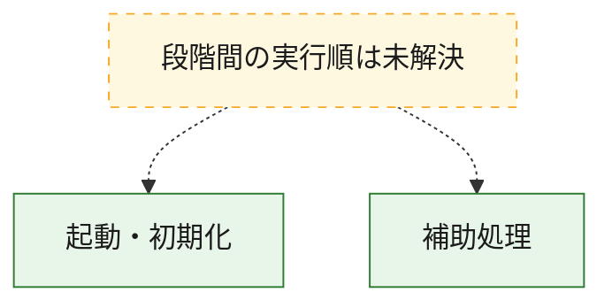
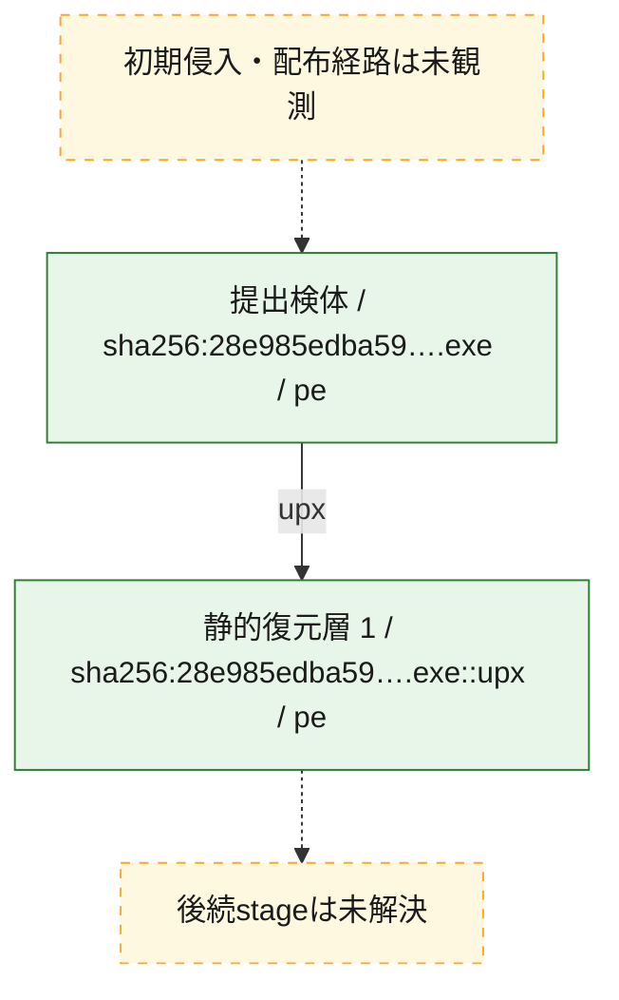
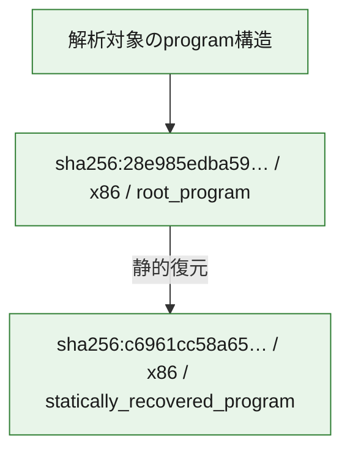

# 全体ロジック：28e985edba59127261da83fe963b0a3674d9007840acd8db505fec6ac455c987

代表関数の静的証跡から、起動・初期化の処理群を確認しました。

## 読み方

- phaseの掲載順は解析上の整理順です。observed_call_edgesがない段階間の実行順を断定しません。
- 図の実線は静的に観測した関係、点線と黄色のノードは未観測・未解決の関係を示します。
- 図は静的な要約であり、動的実行を再現するものではありません。
- 詳細な関数解説とfingerprintは[STATIC-LOGIC.md](STATIC-LOGIC.md)を参照してください。

## 静的可視化

### 実行フロー

### 感染チェーン

### モジュール関係

## 処理段階

### 1. 起動・初期化

entry pointから初期化と後続処理への移行を確認します。
確度: `confirmed_static_function_evidence_with_limits`

- `28e985edba59127261da83fe963b0a3674d9007840acd8db505fec6ac455c987:ghidra:00473b10` — 初期化と主要処理への分岐を行う入口関数です。 状態: `limited_bad_instruction_or_flow`、選定理由: `entry_point`, `large_function:instructions=210`, `meaningful_symbol_name`, `reviewed_call_centrality:16`, `role:entrypoint`, `small_program_complete_context`

### 2. 補助処理

主要処理を支える一般内部関数またはlibrary処理を確認します。
確度: `confirmed_static_function_evidence`

- `c6961cc58a656d384f2912ed9bf87e359ef81459b99c68247ff0df31a1d0c44a:ghidra:0040d0d0` — 検体内部の一般処理を実装する関数です。 状態: `succeeded`、選定理由: `meaningful_symbol_name`, `small_program_complete_context`

## 観測したcall関係

- `ghidra-function:562f7bc18454c5936ce57575` → `ghidra-external:0c0aa5d9b5008bd0c177c86f` （`unclassified` → `unclassified`）
- `ghidra-function:562f7bc18454c5936ce57575` → `ghidra-external:22e334accbc915c972e3fe5e` （`unclassified` → `unclassified`）
- `ghidra-function:562f7bc18454c5936ce57575` → `ghidra-external:28d647ef5c893e916a6dad7b` （`unclassified` → `unclassified`）
- `ghidra-function:562f7bc18454c5936ce57575` → `ghidra-external:3641706a2a7d0b277c48628d` （`unclassified` → `unclassified`）
- `ghidra-function:562f7bc18454c5936ce57575` → `ghidra-external:624fcc07cf437ddcdd977a53` （`unclassified` → `unclassified`）
- `ghidra-function:562f7bc18454c5936ce57575` → `ghidra-external:66117971488ae83344b210ac` （`unclassified` → `unclassified`）
- `ghidra-function:562f7bc18454c5936ce57575` → `ghidra-external:66f03773bcaf718005ea5c39` （`unclassified` → `unclassified`）
- `ghidra-function:562f7bc18454c5936ce57575` → `ghidra-external:f1b9152d019a20db1e4f2026` （`unclassified` → `unclassified`）
- `ghidra-function:562f7bc18454c5936ce57575` → `ghidra-function:3ecf9922a2995659387b262a` （`unclassified` → `unclassified`）
- `ghidra-function:562f7bc18454c5936ce57575` → `ghidra-function:c992542b03026402fec483bd` （`unclassified` → `unclassified`）
- `ghidra-function:562f7bc18454c5936ce57575` → `ghidra-function:f1e4576f3f67895f4850c45a` （`unclassified` → `unclassified`）
- `ghidra-function:562f7bc18454c5936ce57575` → `ghidra-function:f304cd6b6abea2ae885ec08c` （`unclassified` → `unclassified`）

## 解析範囲と制約

- 選定外関数は全体inventoryへ残しますが、関数本体の個別解説対象にはしていません。
- indirect call、難読化、packer、VM、壊れたcontrol flowによりcall関係が欠落する場合があります。
- 文書は静的解析に基づき、検体実行や外部通信による動的確認は行っていません。
