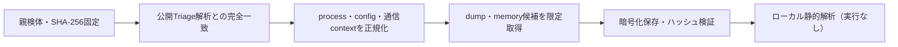

# Triage公開解析・後段取得証跡

## 完全ハッシュ一致

- [260814-v87nnayajh](https://tria.ge/260814-v87nnayajh): ファミリー候補 `未確定`、評価score `None`

## プロセス・通信

- 観測process: `取得できず`
- raw commandは保存せず、command SHA-256と処理patternだけをJSONへ保持します。
- sandbox background trafficは`context_only`であり、C2へ自動昇格しません。

- 取得できませんでした。

## 後段取得物

- `a7d943ed94faedaef4dc0303516634e5ea38f75844b5fc39e79f1cfe9a1f79e9` / `memory_image` / 114688 bytes / 親と同一: `false` / 静的解析: `partial`
- `366a3b17d5febe6c588119bdff6fa76473c9b4757d28331943b510b50cfe4e58` / `memory_image` / 65536 bytes / 親と同一: `false` / 静的解析: `partial`
- `612b07df5c60d6871917ba67b22e82921c734a781e3087f14d7b28bc91dfa082` / `memory_image` / 65536 bytes / 親と同一: `false` / 静的解析: `partial`
- `bc0633ccd1469a6082711cb402f8f43e05869ff046931f3031871a883260a9a6` / `memory_image` / 4096 bytes / 親と同一: `false` / 静的解析: `partial`
- `fb6e865294bd5e59fa32741d8863f754e77b89ece9dfb8af824f78deb0c6a688` / `memory_image` / 10108928 bytes / 親と同一: `false` / 静的解析: `partial`
- `28f640b53689ac6453fde9c4e296fc92a90937ae28b538a400b7cf372efb5caf` / `memory_image` / 10108928 bytes / 親と同一: `false` / 静的解析: `partial`

## 判定境界

Triage由来のfamily、process、config、通信は外部sandbox証跡です。Config extractorが返したendpointはC2候補として扱いますが、静的設定復元またはprocess帰属とprotocol応答が揃うまでは確認済みC2とはしません。取得成果物と検体は実行していません。
