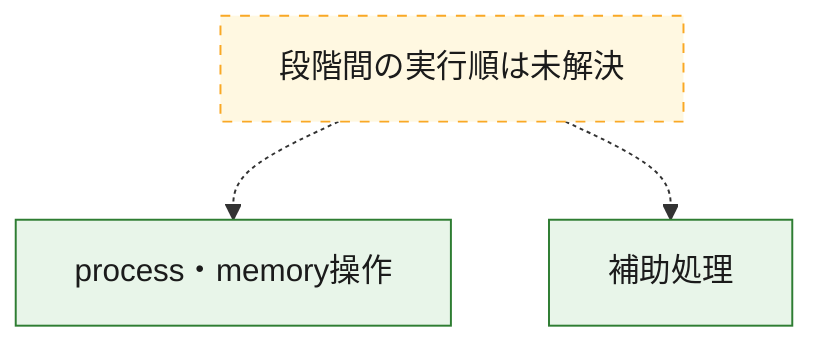
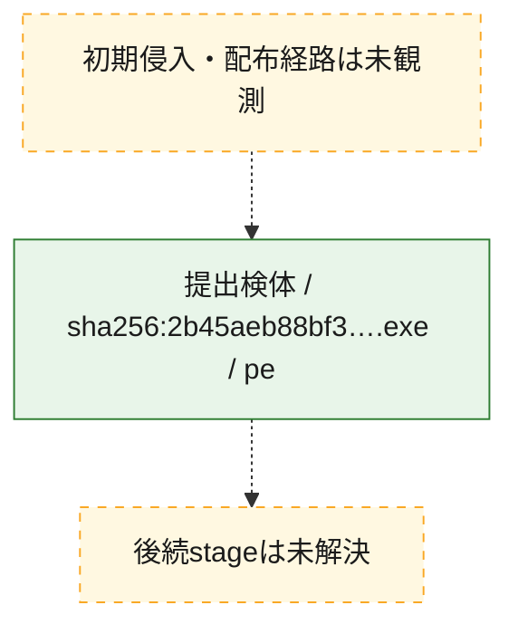
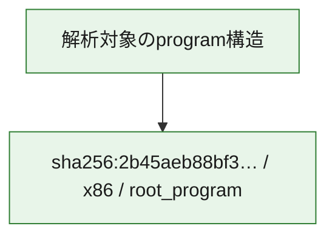

# 全体ロジック：2b45aeb88bf38dd8dfbb13390c5b0f5efd6a298a6f967ac773cf47b2489ee5ab

代表関数の静的証跡から、process・memory操作の処理群を確認しました。

## 読み方

- phaseの掲載順は解析上の整理順です。observed_call_edgesがない段階間の実行順を断定しません。
- 図の実線は静的に観測した関係、点線と黄色のノードは未観測・未解決の関係を示します。
- 図は静的な要約であり、動的実行を再現するものではありません。
- 詳細な関数解説とfingerprintは[STATIC-LOGIC.md](STATIC-LOGIC.md)を参照してください。

## 静的可視化

### 実行フロー

### 感染チェーン

### モジュール関係

## 処理段階

### 1. process・memory操作

process、thread、module、memory操作と実行移行を確認します。
確度: `confirmed_static_function_evidence`

- `2b45aeb88bf38dd8dfbb13390c5b0f5efd6a298a6f967ac773cf47b2489ee5ab:ghidra:140001c90` — process、thread、module、またはmemory操作に関係する関数です。 状態: `succeeded`、選定理由: `context_representative`, `reviewed_call_centrality:4`, `role:process_or_memory_operation`
- `2b45aeb88bf38dd8dfbb13390c5b0f5efd6a298a6f967ac773cf47b2489ee5ab:ghidra:140002a30` — process、thread、module、またはmemory操作に関係する関数です。 状態: `succeeded`、選定理由: `context_representative`, `reviewed_call_centrality:4`, `role:process_or_memory_operation`
- `2b45aeb88bf38dd8dfbb13390c5b0f5efd6a298a6f967ac773cf47b2489ee5ab:ghidra:140002de0` — process、thread、module、またはmemory操作に関係する関数です。 状態: `succeeded`、選定理由: `context_representative`, `reviewed_call_centrality:4`, `role:process_or_memory_operation`
- `2b45aeb88bf38dd8dfbb13390c5b0f5efd6a298a6f967ac773cf47b2489ee5ab:ghidra:1400030e0` — process、thread、module、またはmemory操作に関係する関数です。 状態: `succeeded`、選定理由: `context_representative`, `reviewed_call_centrality:4`, `role:process_or_memory_operation`
- `2b45aeb88bf38dd8dfbb13390c5b0f5efd6a298a6f967ac773cf47b2489ee5ab:ghidra:1400033b0` — process、thread、module、またはmemory操作に関係する関数です。 状態: `succeeded`、選定理由: `context_representative`, `reviewed_call_centrality:4`, `role:process_or_memory_operation`
- `2b45aeb88bf38dd8dfbb13390c5b0f5efd6a298a6f967ac773cf47b2489ee5ab:ghidra:140003680` — process、thread、module、またはmemory操作に関係する関数です。 状態: `succeeded`、選定理由: `context_representative`, `reviewed_call_centrality:4`, `role:process_or_memory_operation`
- `2b45aeb88bf38dd8dfbb13390c5b0f5efd6a298a6f967ac773cf47b2489ee5ab:ghidra:140003ab0` — process、thread、module、またはmemory操作に関係する関数です。 状態: `succeeded`、選定理由: `context_representative`, `reviewed_call_centrality:4`, `role:process_or_memory_operation`
- `2b45aeb88bf38dd8dfbb13390c5b0f5efd6a298a6f967ac773cf47b2489ee5ab:ghidra:140004070` — process、thread、module、またはmemory操作に関係する関数です。 状態: `succeeded`、選定理由: `context_representative`, `reviewed_call_centrality:16`, `role:process_or_memory_operation`

### 2. 補助処理

主要処理を支える一般内部関数またはlibrary処理を確認します。
確度: `confirmed_static_function_evidence`

- `2b45aeb88bf38dd8dfbb13390c5b0f5efd6a298a6f967ac773cf47b2489ee5ab:ghidra:140001000` — 検体内部の一般処理を実装する関数です。 状態: `succeeded`、選定理由: `context_representative`, `reviewed_call_centrality:1`
- `2b45aeb88bf38dd8dfbb13390c5b0f5efd6a298a6f967ac773cf47b2489ee5ab:ghidra:1400010a0` — 検体内部の一般処理を実装する関数です。 状態: `succeeded`、選定理由: `context_representative`, `reviewed_call_centrality:1`
- `2b45aeb88bf38dd8dfbb13390c5b0f5efd6a298a6f967ac773cf47b2489ee5ab:ghidra:140001500` — 検体内部の一般処理を実装する関数です。 状態: `succeeded`、選定理由: `context_representative`, `reviewed_call_centrality:3`
- `2b45aeb88bf38dd8dfbb13390c5b0f5efd6a298a6f967ac773cf47b2489ee5ab:ghidra:140001530` — 検体内部の一般処理を実装する関数です。 状態: `succeeded`、選定理由: `context_representative`, `reviewed_call_centrality:2`
- `2b45aeb88bf38dd8dfbb13390c5b0f5efd6a298a6f967ac773cf47b2489ee5ab:ghidra:140001650` — 検体内部の一般処理を実装する関数です。 状態: `succeeded`、選定理由: `context_representative`, `reviewed_call_centrality:3`
- `2b45aeb88bf38dd8dfbb13390c5b0f5efd6a298a6f967ac773cf47b2489ee5ab:ghidra:140001780` — 検体内部の一般処理を実装する関数です。 状態: `succeeded`、選定理由: `context_representative`, `reviewed_call_centrality:9`
- `2b45aeb88bf38dd8dfbb13390c5b0f5efd6a298a6f967ac773cf47b2489ee5ab:ghidra:140001aa0` — 検体内部の一般処理を実装する関数です。 状態: `succeeded`、選定理由: `context_representative`, `reviewed_call_centrality:2`
- `2b45aeb88bf38dd8dfbb13390c5b0f5efd6a298a6f967ac773cf47b2489ee5ab:ghidra:140001bf0` — 検体内部の一般処理を実装する関数です。 状態: `succeeded`、選定理由: `context_representative`, `reviewed_call_centrality:2`
- `2b45aeb88bf38dd8dfbb13390c5b0f5efd6a298a6f967ac773cf47b2489ee5ab:ghidra:140001ce0` — 検体内部の一般処理を実装する関数です。 状態: `succeeded`、選定理由: `context_representative`, `reviewed_call_centrality:11`
- `2b45aeb88bf38dd8dfbb13390c5b0f5efd6a298a6f967ac773cf47b2489ee5ab:ghidra:140002230` — 検体内部の一般処理を実装する関数です。 状態: `succeeded`、選定理由: `context_representative`, `reviewed_call_centrality:4`
- `2b45aeb88bf38dd8dfbb13390c5b0f5efd6a298a6f967ac773cf47b2489ee5ab:ghidra:140002400` — 検体内部の一般処理を実装する関数です。 状態: `succeeded`、選定理由: `context_representative`
- `2b45aeb88bf38dd8dfbb13390c5b0f5efd6a298a6f967ac773cf47b2489ee5ab:ghidra:140002600` — 検体内部の一般処理を実装する関数です。 状態: `succeeded`、選定理由: `context_representative`, `reviewed_call_centrality:6`
- `2b45aeb88bf38dd8dfbb13390c5b0f5efd6a298a6f967ac773cf47b2489ee5ab:ghidra:140002720` — 検体内部の一般処理を実装する関数です。 状態: `succeeded`、選定理由: `context_representative`, `reviewed_call_centrality:3`
- `2b45aeb88bf38dd8dfbb13390c5b0f5efd6a298a6f967ac773cf47b2489ee5ab:ghidra:1400027f0` — 検体内部の一般処理を実装する関数です。 状態: `succeeded`、選定理由: `context_representative`, `reviewed_call_centrality:2`
- `2b45aeb88bf38dd8dfbb13390c5b0f5efd6a298a6f967ac773cf47b2489ee5ab:ghidra:140002810` — 検体内部の一般処理を実装する関数です。 状態: `succeeded`、選定理由: `context_representative`, `reviewed_call_centrality:7`
- `2b45aeb88bf38dd8dfbb13390c5b0f5efd6a298a6f967ac773cf47b2489ee5ab:ghidra:140002a80` — 検体内部の一般処理を実装する関数です。 状態: `succeeded`、選定理由: `context_representative`, `reviewed_call_centrality:7`
- `2b45aeb88bf38dd8dfbb13390c5b0f5efd6a298a6f967ac773cf47b2489ee5ab:ghidra:140002e30` — 検体内部の一般処理を実装する関数です。 状態: `succeeded`、選定理由: `context_representative`, `reviewed_call_centrality:5`
- `2b45aeb88bf38dd8dfbb13390c5b0f5efd6a298a6f967ac773cf47b2489ee5ab:ghidra:140003130` — 検体内部の一般処理を実装する関数です。 状態: `succeeded`、選定理由: `context_representative`, `reviewed_call_centrality:7`
- `2b45aeb88bf38dd8dfbb13390c5b0f5efd6a298a6f967ac773cf47b2489ee5ab:ghidra:140003400` — 検体内部の一般処理を実装する関数です。 状態: `succeeded`、選定理由: `context_representative`, `reviewed_call_centrality:7`
- `2b45aeb88bf38dd8dfbb13390c5b0f5efd6a298a6f967ac773cf47b2489ee5ab:ghidra:1400036d0` — 検体内部の一般処理を実装する関数です。 状態: `succeeded`、選定理由: `context_representative`, `reviewed_call_centrality:7`
- `2b45aeb88bf38dd8dfbb13390c5b0f5efd6a298a6f967ac773cf47b2489ee5ab:ghidra:140003b00` — 検体内部の一般処理を実装する関数です。 状態: `succeeded`、選定理由: `context_representative`, `reviewed_call_centrality:2`
- `2b45aeb88bf38dd8dfbb13390c5b0f5efd6a298a6f967ac773cf47b2489ee5ab:ghidra:140003db0` — 検体内部の一般処理を実装する関数です。 状態: `succeeded`、選定理由: `context_representative`, `reviewed_call_centrality:3`
- `2b45aeb88bf38dd8dfbb13390c5b0f5efd6a298a6f967ac773cf47b2489ee5ab:ghidra:140003f10` — 検体内部の一般処理を実装する関数です。 状態: `succeeded`、選定理由: `context_representative`, `reviewed_call_centrality:8`
- `2b45aeb88bf38dd8dfbb13390c5b0f5efd6a298a6f967ac773cf47b2489ee5ab:ghidra:1400043a0` — 検体内部の一般処理を実装する関数です。 状態: `succeeded`、選定理由: `context_representative`, `reviewed_call_centrality:1`

## 観測したcall関係

- 代表関数間で直接解決できた呼出関係はありません。

## 解析範囲と制約

- 選定外関数は全体inventoryへ残しますが、関数本体の個別解説対象にはしていません。
- indirect call、難読化、packer、VM、壊れたcontrol flowによりcall関係が欠落する場合があります。
- 文書は静的解析に基づき、検体実行や外部通信による動的確認は行っていません。
