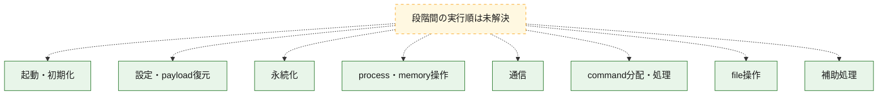
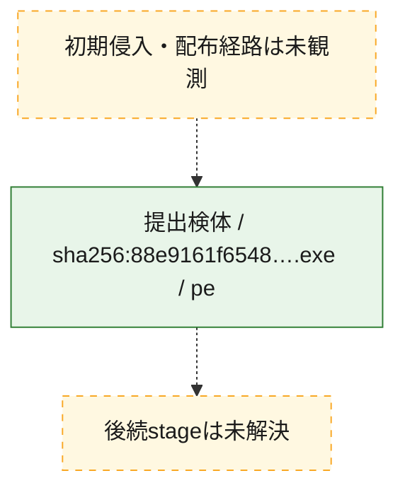
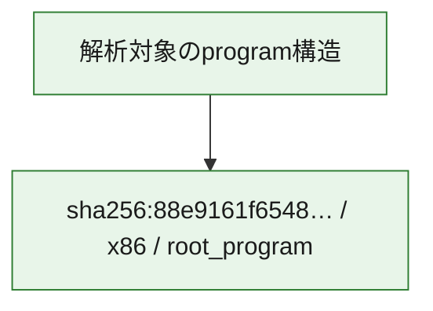

# 全体ロジック：88e9161f6548b523c713702db766a5e18b77129db89aabb2e6150f0b6e781569

代表関数の静的証跡から、起動・初期化、設定・payload復元、永続化、process・memory操作、通信、command分配・処理、file操作の処理群を確認しました。

## 読み方

- phaseの掲載順は解析上の整理順です。observed_call_edgesがない段階間の実行順を断定しません。
- 図の実線は静的に観測した関係、点線と黄色のノードは未観測・未解決の関係を示します。
- 図は静的な要約であり、動的実行を再現するものではありません。
- 詳細な関数解説とfingerprintは[STATIC-LOGIC.md](STATIC-LOGIC.md)を参照してください。

## 静的可視化

### 実行フロー

### 感染チェーン

### モジュール関係

## 処理段階

### 1. 起動・初期化

entry pointから初期化と後続処理への移行を確認します。
確度: `confirmed_static_function_evidence`

- `88e9161f6548b523c713702db766a5e18b77129db89aabb2e6150f0b6e781569:cil:0x06000002` — 初期化と主要処理への分岐を行う入口関数です。 状態: `succeeded`、選定理由: `entry_point`, `large_function:instructions=120`, `reviewed_call_centrality:48`

### 2. 設定・payload復元

設定、resource、payload、暗号化データの復元・変換を確認します。
確度: `confirmed_static_function_evidence`

- `88e9161f6548b523c713702db766a5e18b77129db89aabb2e6150f0b6e781569:cil:0x0600000a` — 暗号、hash、encoding、または復号処理に関係する関数です。 状態: `succeeded`、選定理由: `large_function:instructions=81`, `reviewed_call_centrality:16`, `role:cryptographic_transform`
- `88e9161f6548b523c713702db766a5e18b77129db89aabb2e6150f0b6e781569:cil:0x0600000b` — 設定、resource、payloadなどの解析・変換を行う関数です。 状態: `succeeded`、選定理由: `reviewed_call_centrality:20`, `role:config_or_data_transform`
- `88e9161f6548b523c713702db766a5e18b77129db89aabb2e6150f0b6e781569:cil:0x06000028` — 設定、resource、payloadなどの解析・変換を行う関数です。 状態: `succeeded`、選定理由: `reviewed_call_centrality:16`, `role:config_or_data_transform`
- `88e9161f6548b523c713702db766a5e18b77129db89aabb2e6150f0b6e781569:cil:0x06000032` — 設定、resource、payloadなどの解析・変換を行う関数です。 状態: `succeeded`、選定理由: `large_function:instructions=69`, `reviewed_call_centrality:26`, `role:config_or_data_transform`
- `88e9161f6548b523c713702db766a5e18b77129db89aabb2e6150f0b6e781569:cil:0x06000035` — 設定、resource、payloadなどの解析・変換を行う関数です。 状態: `succeeded`、選定理由: `large_function:instructions=298`, `reviewed_call_centrality:50`, `role:config_or_data_transform`
- `88e9161f6548b523c713702db766a5e18b77129db89aabb2e6150f0b6e781569:cil:0x0600004e` — 設定、resource、payloadなどの解析・変換を行う関数です。 状態: `succeeded`、選定理由: `large_function:instructions=1110`, `reviewed_call_centrality:10`, `role:config_or_data_transform`
- `88e9161f6548b523c713702db766a5e18b77129db89aabb2e6150f0b6e781569:cil:0x06000057` — 設定、resource、payloadなどの解析・変換を行う関数です。 状態: `succeeded`、選定理由: `reviewed_call_centrality:22`, `role:config_or_data_transform`
- `88e9161f6548b523c713702db766a5e18b77129db89aabb2e6150f0b6e781569:cil:0x06000058` — 設定、resource、payloadなどの解析・変換を行う関数です。 状態: `succeeded`、選定理由: `reviewed_call_centrality:24`, `role:config_or_data_transform`
- `88e9161f6548b523c713702db766a5e18b77129db89aabb2e6150f0b6e781569:cil:0x06000059` — 設定、resource、payloadなどの解析・変換を行う関数です。 状態: `succeeded`、選定理由: `large_function:instructions=122`, `reviewed_call_centrality:44`, `role:config_or_data_transform`
- `88e9161f6548b523c713702db766a5e18b77129db89aabb2e6150f0b6e781569:cil:0x0600005c` — 設定、resource、payloadなどの解析・変換を行う関数です。 状態: `succeeded`、選定理由: `reviewed_call_centrality:32`, `role:config_or_data_transform`
- `88e9161f6548b523c713702db766a5e18b77129db89aabb2e6150f0b6e781569:cil:0x0600005e` — 設定、resource、payloadなどの解析・変換を行う関数です。 状態: `succeeded`、選定理由: `large_function:instructions=113`, `reviewed_call_centrality:22`, `role:config_or_data_transform`
- `88e9161f6548b523c713702db766a5e18b77129db89aabb2e6150f0b6e781569:cil:0x0600006e` — 設定、resource、payloadなどの解析・変換を行う関数です。 状態: `succeeded`、選定理由: `large_function:instructions=230`, `reviewed_call_centrality:70`, `role:config_or_data_transform`
- `88e9161f6548b523c713702db766a5e18b77129db89aabb2e6150f0b6e781569:cil:0x0600006f` — 設定、resource、payloadなどの解析・変換を行う関数です。 状態: `succeeded`、選定理由: `large_function:instructions=100`, `reviewed_call_centrality:34`, `role:config_or_data_transform`
- `88e9161f6548b523c713702db766a5e18b77129db89aabb2e6150f0b6e781569:cil:0x0600007d` — 暗号、hash、encoding、または復号処理に関係する関数です。 状態: `succeeded`、選定理由: `large_function:instructions=256`, `reviewed_call_centrality:10`, `role:cryptographic_transform`
- `88e9161f6548b523c713702db766a5e18b77129db89aabb2e6150f0b6e781569:cil:0x06000081` — 設定、resource、payloadなどの解析・変換を行う関数です。 状態: `succeeded`、選定理由: `reviewed_call_centrality:22`, `role:config_or_data_transform`
- `88e9161f6548b523c713702db766a5e18b77129db89aabb2e6150f0b6e781569:cil:0x060000b7` — 設定、resource、payloadなどの解析・変換を行う関数です。 状態: `succeeded`、選定理由: `large_function:instructions=661`, `reviewed_call_centrality:56`, `role:config_or_data_transform`
- `88e9161f6548b523c713702db766a5e18b77129db89aabb2e6150f0b6e781569:cil:0x060000d1` — 設定、resource、payloadなどの解析・変換を行う関数です。 状態: `succeeded`、選定理由: `large_function:instructions=71`, `reviewed_call_centrality:18`, `role:config_or_data_transform`

### 3. 永続化

自動起動や永続化に関係する設定変更を確認します。
確度: `confirmed_static_function_evidence`

- `88e9161f6548b523c713702db766a5e18b77129db89aabb2e6150f0b6e781569:cil:0x060000ae` — 自動起動または永続化に関係する処理を含む関数です。 状態: `succeeded`、選定理由: `large_function:instructions=84`, `reviewed_call_centrality:16`, `role:persistence`

### 4. process・memory操作

process、thread、module、memory操作と実行移行を確認します。
確度: `confirmed_static_function_evidence`

- `88e9161f6548b523c713702db766a5e18b77129db89aabb2e6150f0b6e781569:cil:0x06000038` — process、thread、module、またはmemory操作に関係する関数です。 状態: `succeeded`、選定理由: `reviewed_call_centrality:14`, `role:process_or_memory_operation`

### 5. 通信

通信初期化、endpoint処理、送受信の役割を確認します。
確度: `confirmed_static_function_evidence`

- `88e9161f6548b523c713702db766a5e18b77129db89aabb2e6150f0b6e781569:cil:0x06000004` — 通信初期化、送受信、またはendpoint処理に関係する関数です。 状態: `succeeded`、選定理由: `reviewed_call_centrality:26`, `role:network_communication`
- `88e9161f6548b523c713702db766a5e18b77129db89aabb2e6150f0b6e781569:cil:0x06000022` — 通信初期化、送受信、またはendpoint処理に関係する関数です。 状態: `succeeded`、選定理由: `large_function:instructions=255`, `reviewed_call_centrality:98`, `role:network_communication`
- `88e9161f6548b523c713702db766a5e18b77129db89aabb2e6150f0b6e781569:cil:0x06000025` — 通信初期化、送受信、またはendpoint処理に関係する関数です。 状態: `succeeded`、選定理由: `reviewed_call_centrality:16`, `role:network_communication`
- `88e9161f6548b523c713702db766a5e18b77129db89aabb2e6150f0b6e781569:cil:0x06000026` — 通信初期化、送受信、またはendpoint処理に関係する関数です。 状態: `succeeded`、選定理由: `large_function:instructions=139`, `reviewed_call_centrality:38`, `role:network_communication`
- `88e9161f6548b523c713702db766a5e18b77129db89aabb2e6150f0b6e781569:cil:0x06000027` — 通信初期化、送受信、またはendpoint処理に関係する関数です。 状態: `succeeded`、選定理由: `large_function:instructions=108`, `reviewed_call_centrality:30`, `role:network_communication`
- `88e9161f6548b523c713702db766a5e18b77129db89aabb2e6150f0b6e781569:cil:0x0600005b` — 通信初期化、送受信、またはendpoint処理に関係する関数です。 状態: `succeeded`、選定理由: `reviewed_call_centrality:16`, `role:network_communication`

### 6. command分配・処理

受信commandやtaskの解釈、分配、個別handlerへの移行を確認します。
確度: `confirmed_static_function_evidence`

- `88e9161f6548b523c713702db766a5e18b77129db89aabb2e6150f0b6e781569:cil:0x0600002c` — commandの解釈、分配、または個別処理を担当する関数です。 状態: `succeeded`、選定理由: `large_function:instructions=207`, `reviewed_call_centrality:78`, `role:command_dispatch_or_handler`
- `88e9161f6548b523c713702db766a5e18b77129db89aabb2e6150f0b6e781569:cil:0x06000031` — commandの解釈、分配、または個別処理を担当する関数です。 状態: `succeeded`、選定理由: `large_function:instructions=76`, `reviewed_call_centrality:38`, `role:command_dispatch_or_handler`

### 7. file操作

fileやdirectoryの作成、読書き、削除を確認します。
確度: `confirmed_static_function_evidence`

- `88e9161f6548b523c713702db766a5e18b77129db89aabb2e6150f0b6e781569:cil:0x060000a1` — fileまたはdirectoryの読書き・管理に関係する関数です。 状態: `succeeded`、選定理由: `large_function:instructions=78`, `reviewed_call_centrality:16`, `role:file_operation`
- `88e9161f6548b523c713702db766a5e18b77129db89aabb2e6150f0b6e781569:cil:0x060000a2` — fileまたはdirectoryの読書き・管理に関係する関数です。 状態: `succeeded`、選定理由: `large_function:instructions=71`, `reviewed_call_centrality:14`, `role:file_operation`
- `88e9161f6548b523c713702db766a5e18b77129db89aabb2e6150f0b6e781569:cil:0x060000d2` — fileまたはdirectoryの読書き・管理に関係する関数です。 状態: `succeeded`、選定理由: `reviewed_call_centrality:14`, `role:file_operation`

### 8. 補助処理

主要処理を支える一般内部関数またはlibrary処理を確認します。
確度: `confirmed_static_function_evidence`

- `88e9161f6548b523c713702db766a5e18b77129db89aabb2e6150f0b6e781569:cil:0x0600004c` — 検体内部の一般処理を実装する関数です。 状態: `succeeded`、選定理由: `large_function:instructions=89`, `reviewed_call_centrality:24`

## 観測したcall関係

- 代表関数間で直接解決できた呼出関係はありません。

## 解析範囲と制約

- 選定外関数は全体inventoryへ残しますが、関数本体の個別解説対象にはしていません。
- indirect call、難読化、packer、VM、壊れたcontrol flowによりcall関係が欠落する場合があります。
- 文書は静的解析に基づき、検体実行や外部通信による動的確認は行っていません。
