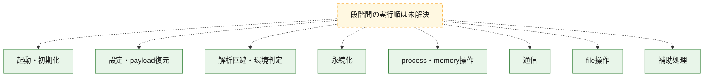
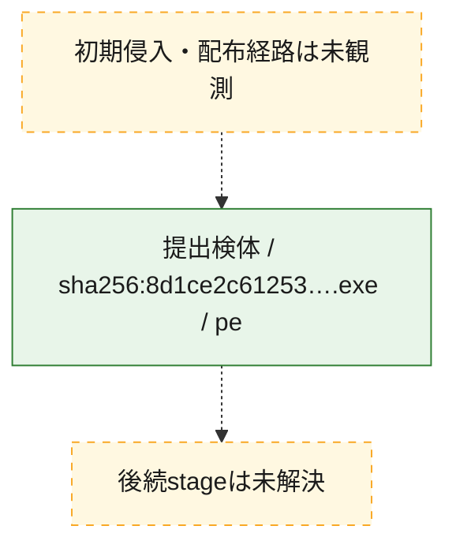
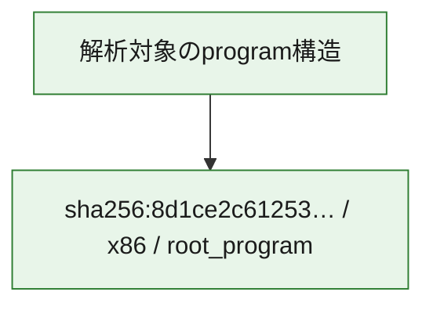

# 全体ロジック：8d1ce2c612537f4537df7192715a8be98312cd9c6cd60757c294493c7fc180ac

代表関数の静的証跡から、起動・初期化、設定・payload復元、解析回避・環境判定、永続化、process・memory操作、通信、file操作の処理群を確認しました。

## 読み方

- phaseの掲載順は解析上の整理順です。observed_call_edgesがない段階間の実行順を断定しません。
- 図の実線は静的に観測した関係、点線と黄色のノードは未観測・未解決の関係を示します。
- 図は静的な要約であり、動的実行を再現するものではありません。
- 詳細な関数解説とfingerprintは[STATIC-LOGIC.md](STATIC-LOGIC.md)を参照してください。

## 静的可視化

### 実行フロー

### 感染チェーン

### モジュール関係

## 処理段階

### 1. 起動・初期化

entry pointから初期化と後続処理への移行を確認します。
確度: `confirmed_static_function_evidence`

- `8d1ce2c612537f4537df7192715a8be98312cd9c6cd60757c294493c7fc180ac:cil:0x06000001` — 初期化と主要処理への分岐を行う入口関数です。 状態: `succeeded`、選定理由: `entry_point`, `reviewed_call_centrality:28`

### 2. 設定・payload復元

設定、resource、payload、暗号化データの復元・変換を確認します。
確度: `confirmed_static_function_evidence`

- `8d1ce2c612537f4537df7192715a8be98312cd9c6cd60757c294493c7fc180ac:cil:0x06000003` — 設定、resource、payloadなどの解析・変換を行う関数です。 状態: `succeeded`、選定理由: `large_function:instructions=65`, `reviewed_call_centrality:16`, `role:config_or_data_transform`
- `8d1ce2c612537f4537df7192715a8be98312cd9c6cd60757c294493c7fc180ac:cil:0x06000004` — 設定、resource、payloadなどの解析・変換を行う関数です。 状態: `succeeded`、選定理由: `reviewed_call_centrality:16`, `role:config_or_data_transform`
- `8d1ce2c612537f4537df7192715a8be98312cd9c6cd60757c294493c7fc180ac:cil:0x0600002d` — 暗号、hash、encoding、または復号処理に関係する関数です。 状態: `succeeded`、選定理由: `reviewed_call_centrality:20`, `role:cryptographic_transform`
- `8d1ce2c612537f4537df7192715a8be98312cd9c6cd60757c294493c7fc180ac:cil:0x0600002e` — 暗号、hash、encoding、または復号処理に関係する関数です。 状態: `succeeded`、選定理由: `reviewed_call_centrality:20`, `role:cryptographic_transform`
- `8d1ce2c612537f4537df7192715a8be98312cd9c6cd60757c294493c7fc180ac:cil:0x06000047` — 暗号、hash、encoding、または復号処理に関係する関数です。 状態: `succeeded`、選定理由: `large_function:instructions=96`, `reviewed_call_centrality:32`, `role:cryptographic_transform`
- `8d1ce2c612537f4537df7192715a8be98312cd9c6cd60757c294493c7fc180ac:cil:0x0600004d` — 暗号、hash、encoding、または復号処理に関係する関数です。 状態: `succeeded`、選定理由: `large_function:instructions=109`, `reviewed_call_centrality:38`, `role:cryptographic_transform`
- `8d1ce2c612537f4537df7192715a8be98312cd9c6cd60757c294493c7fc180ac:cil:0x0600004f` — 設定、resource、payloadなどの解析・変換を行う関数です。 状態: `succeeded`、選定理由: `large_function:instructions=133`, `reviewed_call_centrality:40`, `role:config_or_data_transform`
- `8d1ce2c612537f4537df7192715a8be98312cd9c6cd60757c294493c7fc180ac:cil:0x06000052` — 暗号、hash、encoding、または復号処理に関係する関数です。 状態: `succeeded`、選定理由: `reviewed_call_centrality:20`, `role:cryptographic_transform`
- `8d1ce2c612537f4537df7192715a8be98312cd9c6cd60757c294493c7fc180ac:cil:0x06000088` — 設定、resource、payloadなどの解析・変換を行う関数です。 状態: `succeeded`、選定理由: `large_function:instructions=659`, `reviewed_call_centrality:50`, `role:config_or_data_transform`

### 3. 解析回避・環境判定

debugger、sandbox、仮想環境、時間差などの判定を確認します。
確度: `confirmed_static_function_evidence`

- `8d1ce2c612537f4537df7192715a8be98312cd9c6cd60757c294493c7fc180ac:cil:0x06000029` — debugger、仮想環境、sandbox、または時間差の確認に関係する関数です。 状態: `succeeded`、選定理由: `large_function:instructions=73`, `reviewed_call_centrality:24`, `role:anti_analysis`
- `8d1ce2c612537f4537df7192715a8be98312cd9c6cd60757c294493c7fc180ac:cil:0x06000032` — debugger、仮想環境、sandbox、または時間差の確認に関係する関数です。 状態: `succeeded`、選定理由: `reviewed_call_centrality:30`, `role:anti_analysis`

### 4. 永続化

自動起動や永続化に関係する設定変更を確認します。
確度: `confirmed_static_function_evidence`

- `8d1ce2c612537f4537df7192715a8be98312cd9c6cd60757c294493c7fc180ac:cil:0x06000024` — 自動起動または永続化に関係する処理を含む関数です。 状態: `succeeded`、選定理由: `large_function:instructions=197`, `reviewed_call_centrality:80`, `role:persistence`
- `8d1ce2c612537f4537df7192715a8be98312cd9c6cd60757c294493c7fc180ac:cil:0x0600007f` — 自動起動または永続化に関係する処理を含む関数です。 状態: `succeeded`、選定理由: `large_function:instructions=84`, `reviewed_call_centrality:16`, `role:persistence`

### 5. process・memory操作

process、thread、module、memory操作と実行移行を確認します。
確度: `confirmed_static_function_evidence`

- `8d1ce2c612537f4537df7192715a8be98312cd9c6cd60757c294493c7fc180ac:cil:0x0600003f` — process、thread、module、またはmemory操作に関係する関数です。 状態: `succeeded`、選定理由: `reviewed_call_centrality:8`, `role:process_or_memory_operation`

### 6. 通信

通信初期化、endpoint処理、送受信の役割を確認します。
確度: `confirmed_static_function_evidence`

- `8d1ce2c612537f4537df7192715a8be98312cd9c6cd60757c294493c7fc180ac:cil:0x0600001b` — 通信初期化、送受信、またはendpoint処理に関係する関数です。 状態: `succeeded`、選定理由: `large_function:instructions=234`, `reviewed_call_centrality:88`, `role:network_communication`
- `8d1ce2c612537f4537df7192715a8be98312cd9c6cd60757c294493c7fc180ac:cil:0x0600001e` — 通信初期化、送受信、またはendpoint処理に関係する関数です。 状態: `succeeded`、選定理由: `reviewed_call_centrality:16`, `role:network_communication`
- `8d1ce2c612537f4537df7192715a8be98312cd9c6cd60757c294493c7fc180ac:cil:0x0600001f` — 通信初期化、送受信、またはendpoint処理に関係する関数です。 状態: `succeeded`、選定理由: `large_function:instructions=135`, `reviewed_call_centrality:38`, `role:network_communication`
- `8d1ce2c612537f4537df7192715a8be98312cd9c6cd60757c294493c7fc180ac:cil:0x06000020` — 通信初期化、送受信、またはendpoint処理に関係する関数です。 状態: `succeeded`、選定理由: `large_function:instructions=99`, `reviewed_call_centrality:30`, `role:network_communication`
- `8d1ce2c612537f4537df7192715a8be98312cd9c6cd60757c294493c7fc180ac:cil:0x06000021` — 通信初期化、送受信、またはendpoint処理に関係する関数です。 状態: `succeeded`、選定理由: `reviewed_call_centrality:16`, `role:network_communication`
- `8d1ce2c612537f4537df7192715a8be98312cd9c6cd60757c294493c7fc180ac:cil:0x0600002f` — 通信初期化、送受信、またはendpoint処理に関係する関数です。 状態: `succeeded`、選定理由: `large_function:instructions=104`, `reviewed_call_centrality:42`, `role:network_communication`
- `8d1ce2c612537f4537df7192715a8be98312cd9c6cd60757c294493c7fc180ac:cil:0x06000031` — 通信初期化、送受信、またはendpoint処理に関係する関数です。 状態: `succeeded`、選定理由: `reviewed_call_centrality:16`, `role:network_communication`
- `8d1ce2c612537f4537df7192715a8be98312cd9c6cd60757c294493c7fc180ac:cil:0x06000046` — 通信初期化、送受信、またはendpoint処理に関係する関数です。 状態: `succeeded`、選定理由: `large_function:instructions=123`, `reviewed_call_centrality:50`, `role:network_communication`

### 7. file操作

fileやdirectoryの作成、読書き、削除を確認します。
確度: `confirmed_static_function_evidence`

- `8d1ce2c612537f4537df7192715a8be98312cd9c6cd60757c294493c7fc180ac:cil:0x06000072` — fileまたはdirectoryの読書き・管理に関係する関数です。 状態: `succeeded`、選定理由: `large_function:instructions=78`, `reviewed_call_centrality:16`, `role:file_operation`
- `8d1ce2c612537f4537df7192715a8be98312cd9c6cd60757c294493c7fc180ac:cil:0x06000073` — fileまたはdirectoryの読書き・管理に関係する関数です。 状態: `succeeded`、選定理由: `large_function:instructions=71`, `reviewed_call_centrality:14`, `role:file_operation`
- `8d1ce2c612537f4537df7192715a8be98312cd9c6cd60757c294493c7fc180ac:cil:0x0600007d` — fileまたはdirectoryの読書き・管理に関係する関数です。 状態: `succeeded`、選定理由: `reviewed_call_centrality:14`, `role:file_operation`
- `8d1ce2c612537f4537df7192715a8be98312cd9c6cd60757c294493c7fc180ac:cil:0x06000089` — fileまたはdirectoryの読書き・管理に関係する関数です。 状態: `succeeded`、選定理由: `reviewed_call_centrality:14`, `role:file_operation`
- `8d1ce2c612537f4537df7192715a8be98312cd9c6cd60757c294493c7fc180ac:cil:0x0600008a` — fileまたはdirectoryの読書き・管理に関係する関数です。 状態: `succeeded`、選定理由: `large_function:instructions=68`, `reviewed_call_centrality:20`, `role:file_operation`
- `8d1ce2c612537f4537df7192715a8be98312cd9c6cd60757c294493c7fc180ac:cil:0x06000097` — fileまたはdirectoryの読書き・管理に関係する関数です。 状態: `succeeded`、選定理由: `large_function:instructions=73`, `reviewed_call_centrality:12`, `role:file_operation`
- `8d1ce2c612537f4537df7192715a8be98312cd9c6cd60757c294493c7fc180ac:cil:0x060000a0` — fileまたはdirectoryの読書き・管理に関係する関数です。 状態: `succeeded`、選定理由: `large_function:instructions=126`, `reviewed_call_centrality:10`, `role:file_operation`
- `8d1ce2c612537f4537df7192715a8be98312cd9c6cd60757c294493c7fc180ac:cil:0x060000a3` — fileまたはdirectoryの読書き・管理に関係する関数です。 状態: `succeeded`、選定理由: `reviewed_call_centrality:14`, `role:file_operation`

### 8. 補助処理

主要処理を支える一般内部関数またはlibrary処理を確認します。
確度: `confirmed_static_function_evidence`

- `8d1ce2c612537f4537df7192715a8be98312cd9c6cd60757c294493c7fc180ac:cil:0x0600006d` — 検体内部の一般処理を実装する関数です。 状態: `succeeded`、選定理由: `reviewed_call_centrality:12`

## 観測したcall関係

- 代表関数間で直接解決できた呼出関係はありません。

## 解析範囲と制約

- 選定外関数は全体inventoryへ残しますが、関数本体の個別解説対象にはしていません。
- indirect call、難読化、packer、VM、壊れたcontrol flowによりcall関係が欠落する場合があります。
- 文書は静的解析に基づき、検体実行や外部通信による動的確認は行っていません。
