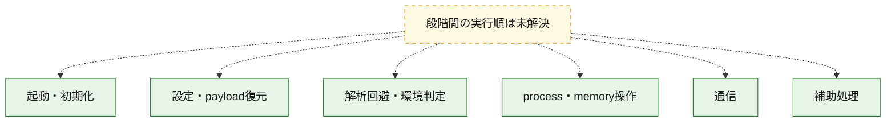
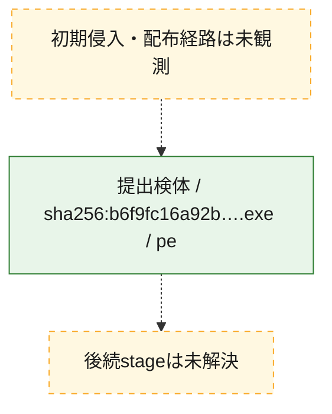
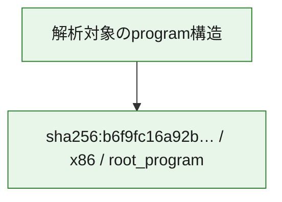

# 全体ロジック：b6f9fc16a92bb2e422f20db1a4c32018e070a20d50adde6742cd066b0c9aa870

代表関数の静的証跡から、起動・初期化、設定・payload復元、解析回避・環境判定、process・memory操作、通信の処理群を確認しました。

## 読み方

- phaseの掲載順は解析上の整理順です。observed_call_edgesがない段階間の実行順を断定しません。
- 図の実線は静的に観測した関係、点線と黄色のノードは未観測・未解決の関係を示します。
- 図は静的な要約であり、動的実行を再現するものではありません。
- 詳細な関数解説とfingerprintは[STATIC-LOGIC.md](STATIC-LOGIC.md)を参照してください。

## 静的可視化

### 実行フロー

### 感染チェーン

### モジュール関係

## 処理段階

### 1. 起動・初期化

entry pointから初期化と後続処理への移行を確認します。
確度: `confirmed_static_function_evidence`

- `b6f9fc16a92bb2e422f20db1a4c32018e070a20d50adde6742cd066b0c9aa870:cil:0x06000003` — 初期化と主要処理への分岐を行う入口関数です。 状態: `succeeded`、選定理由: `entry_point`, `large_function:instructions=64`, `reviewed_call_centrality:32`

### 2. 設定・payload復元

設定、resource、payload、暗号化データの復元・変換を確認します。
確度: `confirmed_static_function_evidence`

- `b6f9fc16a92bb2e422f20db1a4c32018e070a20d50adde6742cd066b0c9aa870:cil:0x06000009` — 暗号、hash、encoding、または復号処理に関係する関数です。 状態: `succeeded`、選定理由: `reviewed_call_centrality:16`, `role:cryptographic_transform`
- `b6f9fc16a92bb2e422f20db1a4c32018e070a20d50adde6742cd066b0c9aa870:cil:0x06000033` — 暗号、hash、encoding、または復号処理に関係する関数です。 状態: `succeeded`、選定理由: `reviewed_call_centrality:20`, `role:cryptographic_transform`
- `b6f9fc16a92bb2e422f20db1a4c32018e070a20d50adde6742cd066b0c9aa870:cil:0x06000053` — 設定、resource、payloadなどの解析・変換を行う関数です。 状態: `succeeded`、選定理由: `reviewed_call_centrality:8`, `role:config_or_data_transform`
- `b6f9fc16a92bb2e422f20db1a4c32018e070a20d50adde6742cd066b0c9aa870:cil:0x06000054` — 設定、resource、payloadなどの解析・変換を行う関数です。 状態: `succeeded`、選定理由: `large_function:instructions=133`, `reviewed_call_centrality:40`, `role:config_or_data_transform`
- `b6f9fc16a92bb2e422f20db1a4c32018e070a20d50adde6742cd066b0c9aa870:cil:0x06000057` — 暗号、hash、encoding、または復号処理に関係する関数です。 状態: `succeeded`、選定理由: `reviewed_call_centrality:20`, `role:cryptographic_transform`
- `b6f9fc16a92bb2e422f20db1a4c32018e070a20d50adde6742cd066b0c9aa870:cil:0x06000058` — 暗号、hash、encoding、または復号処理に関係する関数です。 状態: `succeeded`、選定理由: `reviewed_call_centrality:6`, `role:cryptographic_transform`
- `b6f9fc16a92bb2e422f20db1a4c32018e070a20d50adde6742cd066b0c9aa870:cil:0x0600008b` — 設定、resource、payloadなどの解析・変換を行う関数です。 状態: `succeeded`、選定理由: `reviewed_call_centrality:12`, `role:config_or_data_transform`
- `b6f9fc16a92bb2e422f20db1a4c32018e070a20d50adde6742cd066b0c9aa870:cil:0x0600008c` — 設定、resource、payloadなどの解析・変換を行う関数です。 状態: `succeeded`、選定理由: `reviewed_call_centrality:6`, `role:config_or_data_transform`
- `b6f9fc16a92bb2e422f20db1a4c32018e070a20d50adde6742cd066b0c9aa870:cil:0x0600008d` — 設定、resource、payloadなどの解析・変換を行う関数です。 状態: `succeeded`、選定理由: `large_function:instructions=659`, `reviewed_call_centrality:50`, `role:config_or_data_transform`

### 3. 解析回避・環境判定

debugger、sandbox、仮想環境、時間差などの判定を確認します。
確度: `confirmed_static_function_evidence`

- `b6f9fc16a92bb2e422f20db1a4c32018e070a20d50adde6742cd066b0c9aa870:cil:0x0600002f` — debugger、仮想環境、sandbox、または時間差の確認に関係する関数です。 状態: `succeeded`、選定理由: `reviewed_call_centrality:6`, `role:anti_analysis`

### 4. process・memory操作

process、thread、module、memory操作と実行移行を確認します。
確度: `confirmed_static_function_evidence`

- `b6f9fc16a92bb2e422f20db1a4c32018e070a20d50adde6742cd066b0c9aa870:cil:0x06000006` — process、thread、module、またはmemory操作に関係する関数です。 状態: `succeeded`、選定理由: `large_function:instructions=764`, `reviewed_call_centrality:102`, `role:process_or_memory_operation`
- `b6f9fc16a92bb2e422f20db1a4c32018e070a20d50adde6742cd066b0c9aa870:cil:0x06000029` — process、thread、module、またはmemory操作に関係する関数です。 状態: `succeeded`、選定理由: `large_function:instructions=197`, `reviewed_call_centrality:80`, `role:process_or_memory_operation`

### 5. 通信

通信初期化、endpoint処理、送受信の役割を確認します。
確度: `confirmed_static_function_evidence`

- `b6f9fc16a92bb2e422f20db1a4c32018e070a20d50adde6742cd066b0c9aa870:cil:0x06000002` — 通信初期化、送受信、またはendpoint処理に関係する関数です。 状態: `succeeded`、選定理由: `reviewed_call_centrality:6`, `role:network_communication`
- `b6f9fc16a92bb2e422f20db1a4c32018e070a20d50adde6742cd066b0c9aa870:cil:0x06000019` — 通信初期化、送受信、またはendpoint処理に関係する関数です。 状態: `succeeded`、選定理由: `role:network_communication`
- `b6f9fc16a92bb2e422f20db1a4c32018e070a20d50adde6742cd066b0c9aa870:cil:0x06000020` — 通信初期化、送受信、またはendpoint処理に関係する関数です。 状態: `succeeded`、選定理由: `large_function:instructions=234`, `reviewed_call_centrality:88`, `role:network_communication`
- `b6f9fc16a92bb2e422f20db1a4c32018e070a20d50adde6742cd066b0c9aa870:cil:0x06000025` — 通信初期化、送受信、またはendpoint処理に関係する関数です。 状態: `succeeded`、選定理由: `large_function:instructions=99`, `reviewed_call_centrality:30`, `role:network_communication`
- `b6f9fc16a92bb2e422f20db1a4c32018e070a20d50adde6742cd066b0c9aa870:cil:0x06000026` — 通信初期化、送受信、またはendpoint処理に関係する関数です。 状態: `succeeded`、選定理由: `reviewed_call_centrality:16`, `role:network_communication`
- `b6f9fc16a92bb2e422f20db1a4c32018e070a20d50adde6742cd066b0c9aa870:cil:0x06000034` — 通信初期化、送受信、またはendpoint処理に関係する関数です。 状態: `succeeded`、選定理由: `large_function:instructions=104`, `reviewed_call_centrality:42`, `role:network_communication`
- `b6f9fc16a92bb2e422f20db1a4c32018e070a20d50adde6742cd066b0c9aa870:cil:0x0600004b` — 通信初期化、送受信、またはendpoint処理に関係する関数です。 状態: `succeeded`、選定理由: `large_function:instructions=123`, `reviewed_call_centrality:50`, `role:network_communication`
- `b6f9fc16a92bb2e422f20db1a4c32018e070a20d50adde6742cd066b0c9aa870:cil:0x0600004d` — 通信初期化、送受信、またはendpoint処理に関係する関数です。 状態: `succeeded`、選定理由: `reviewed_call_centrality:12`, `role:network_communication`
- `b6f9fc16a92bb2e422f20db1a4c32018e070a20d50adde6742cd066b0c9aa870:cil:0x0600004e` — 通信初期化、送受信、またはendpoint処理に関係する関数です。 状態: `succeeded`、選定理由: `reviewed_call_centrality:10`, `role:network_communication`

### 6. 補助処理

主要処理を支える一般内部関数またはlibrary処理を確認します。
確度: `confirmed_static_function_evidence`

- `b6f9fc16a92bb2e422f20db1a4c32018e070a20d50adde6742cd066b0c9aa870:cil:0x06000024` — 検体内部の一般処理を実装する関数です。 状態: `succeeded`、選定理由: `large_function:instructions=135`, `reviewed_call_centrality:38`
- `b6f9fc16a92bb2e422f20db1a4c32018e070a20d50adde6742cd066b0c9aa870:cil:0x0600002e` — 検体内部の一般処理を実装する関数です。 状態: `succeeded`、選定理由: `large_function:instructions=73`, `reviewed_call_centrality:24`
- `b6f9fc16a92bb2e422f20db1a4c32018e070a20d50adde6742cd066b0c9aa870:cil:0x06000032` — 検体内部の一般処理を実装する関数です。 状態: `succeeded`、選定理由: `reviewed_call_centrality:20`
- `b6f9fc16a92bb2e422f20db1a4c32018e070a20d50adde6742cd066b0c9aa870:cil:0x06000037` — 検体内部の一般処理を実装する関数です。 状態: `succeeded`、選定理由: `reviewed_call_centrality:30`
- `b6f9fc16a92bb2e422f20db1a4c32018e070a20d50adde6742cd066b0c9aa870:cil:0x0600004c` — 検体内部の一般処理を実装する関数です。 状態: `succeeded`、選定理由: `large_function:instructions=96`, `reviewed_call_centrality:32`
- `b6f9fc16a92bb2e422f20db1a4c32018e070a20d50adde6742cd066b0c9aa870:cil:0x06000050` — compiler生成処理または汎用library処理とみられる関数です。 状態: `succeeded`、選定理由: `reviewed_call_centrality:12`
- `b6f9fc16a92bb2e422f20db1a4c32018e070a20d50adde6742cd066b0c9aa870:cil:0x06000052` — 検体内部の一般処理を実装する関数です。 状態: `succeeded`、選定理由: `large_function:instructions=109`, `reviewed_call_centrality:38`
- `b6f9fc16a92bb2e422f20db1a4c32018e070a20d50adde6742cd066b0c9aa870:cil:0x06000077` — 検体内部の一般処理を実装する関数です。 状態: `succeeded`、選定理由: `large_function:instructions=78`, `reviewed_call_centrality:16`
- `b6f9fc16a92bb2e422f20db1a4c32018e070a20d50adde6742cd066b0c9aa870:cil:0x06000084` — 検体内部の一般処理を実装する関数です。 状態: `succeeded`、選定理由: `large_function:instructions=84`, `reviewed_call_centrality:16`
- `b6f9fc16a92bb2e422f20db1a4c32018e070a20d50adde6742cd066b0c9aa870:cil:0x0600008f` — 検体内部の一般処理を実装する関数です。 状態: `succeeded`、選定理由: `large_function:instructions=68`, `reviewed_call_centrality:20`

## 観測したcall関係

- 代表関数間で直接解決できた呼出関係はありません。

## 解析範囲と制約

- 選定外関数は全体inventoryへ残しますが、関数本体の個別解説対象にはしていません。
- indirect call、難読化、packer、VM、壊れたcontrol flowによりcall関係が欠落する場合があります。
- 文書は静的解析に基づき、検体実行や外部通信による動的確認は行っていません。
