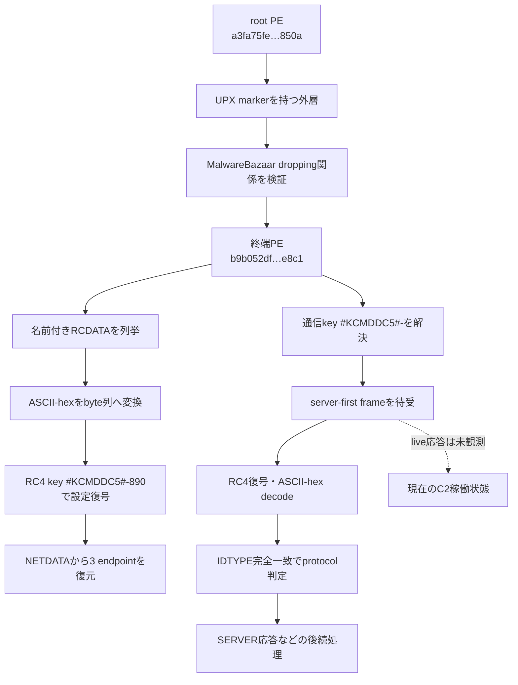
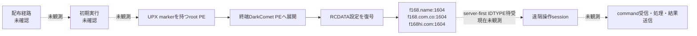
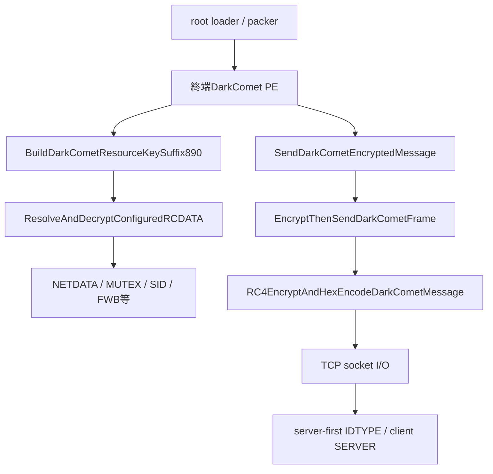

# DarkComet 全体ロジック

## 実行フロー

共通phaseは`execution`、`configuration`、`command_and_control`、`task_execution`である。設定復号鍵と通信鍵は似ているが同一ではなく、設定側だけにsuffix `890`が付く。

## 感染チェーン

rootから終端への関係は公開providerの相互drop関係と完全一致SHA-256で確認した。配布経路、初期実行、live commandは確認していないため破線で示す。

## モジュール関係

resource decoderは`#KCMDDC5#-890`を使い、wire encoderは10-byte ASCII key `#KCMDDC5#-`を使う。`PWD`は通信鍵へ連結しない。この境界を保持することがextractorとC2 detector双方の正確性に必要である。

## 他のDarkCometケースとの比較

| 比較軸 | 本ケース `a3fa75fe…` | `6090fe5a…` | `01e521b7…` |
|---|---|---|---|
| root・終端関係 | root→`b9b052df…`を完全一致で確認 | 終端関係未復元 | 終端関係未復元 |
| 設定取得 | RCDATAをfamily固有RC4で復号 | `NETDATA`/`FWB` markerのみ | `NETDATA`/`FWB` markerのみ |
| C2 endpoint | 3件を復元 | 未復元 | 未復元 |
| protocol | RC4→ASCII-hex、server-first `IDTYPE` | encrypted TCP候補まで | encrypted TCP候補まで |
| C2判定の送信量 | 0 byteの受動待受 | 固有判定未実装 | 固有判定未実装 |
| コード類似性軸 | resource key suffix、RC4/hex send chain | 特徴関数未記録 | 特徴関数未記録 |

本ケースは既存2ケースより終端・config・wire protocolの根拠が深い。`NETDATA`や`FWB` markerだけで同一builder、campaign、operatorとは判断せず、resource key導出、通信key、endpoint、関数fingerprintを追加比較する。

## 判定境界

- `terminal_payload_recovered`: 確認済み。
- `static_config_recovered`: 確認済み。
- `protocol_profile_recovered`: 確認済み。
- `live_c2_verified`: 未確認。
- TCP port openだけではDarkComet C2と判定しない。
- 受動待受で受信したASCII-hex frameを検体固有通信keyでRC4復号し、平文が`IDTYPE`へ完全一致した場合にprotocol一致とする。
