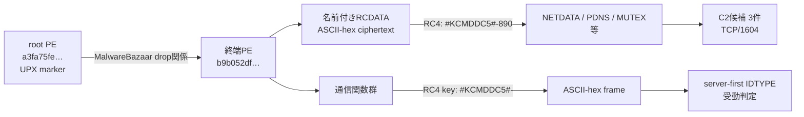

# DarkComet ケース a3fa75fe9b9c0ca9ccdc85ae6733024cbc64c545031aad9150f03fed9335850a

## 概要

- ファミリー: `DarkComet`（高確度）
- ルート検体SHA-256: `a3fa75fe9b9c0ca9ccdc85ae6733024cbc64c545031aad9150f03fed9335850a`
- 終端SHA-256: `b9b052dfb2f19bf15aaba81f07861234f91a72a5c38d83c176a7a4dcdbb2e8c1`
- 初観測: `2026-05-26 05:05:43`
- 元のファイル名: `f168pro.exe`
- 状態: `partial` / `complete=false` / `resumable=true`
- 実行・通信: 検体を実行せず、C2候補へ接続していない

rootはUPX markerを持つPEである。MalwareBazaarの`dropping_sha256`と`dropped_by_sha256`の相互関係から、展開後に相当する終端PEを完全一致で特定した。終端PEの名前付きRCDATAを静的復号し、3件のC2候補とDarkComet通信profileを復元した。C2の現在稼働は未検証なので、case全体は完了扱いにしない。

## 外部根拠

- [MalwareBazaar root exact sample](https://bazaar.abuse.ch/sample/a3fa75fe9b9c0ca9ccdc85ae6733024cbc64c545031aad9150f03fed9335850a/)は、rootの圧縮時sizeが354,816 bytes、展開後sizeが762,880 bytesであること、展開後SHA-256と`Dropping`関係が`b9b052df…b2e8c1`を指すことの根拠である。
- [MalwareBazaar terminal exact sample](https://bazaar.abuse.ch/sample/b9b052dfb2f19bf15aaba81f07861234f91a72a5c38d83c176a7a4dcdbb2e8c1/)は、上記関係で特定した終端検体の個別レコードである。rootと終端の対応はroot側の`Unpacked file`と`Dropping`表示でも照合した。
- Matasano Security / Steptoeの[PEST CONTROL](https://www.steptoe.com/a/web/pcFVegvo3ZTvF8o4ms4e9R/3ZFs52/pest-control1.pdf)は、攻撃者側clientから被害端末側serverへ`IDTYPE`、serverからclientへ`SERVER`と進むDarkComet handshakeを記載する。本文中のclient/serverは本資料のcontroller/victim表記へ読み替えた。
- Rhodes Universityの[DarkComet解析を含むMSc thesis](https://homes.cs.ru.ac.za/B.Irwin/theses/du%20Bruyn%202015%20Msc.pdf)は、接続直後に被害端末が何も送らず、C2が暗号化`IDTYPE`を送り、被害端末が暗号化`SERVER`を返すcaptureとliveness設計を示す。これをserver-firstかつclient dataを送らない受動判定方針の外部根拠とした。

外部資料は一般的なDarkCometのdrop関係表示とhandshake仕様を補強する。今回検体固有のresource鍵suffix `890`の導出、10-byte通信鍵との分離、PWD非連結、ASCII-hex framing、関数addressとcall関係は、終端検体をGhidraで確認して独立に確定した事項であり、外部資料から転記したものではない。

## 復元した実行・解析チェーン

resource設定復号鍵と通信鍵は同一ではない。resource側だけが10進suffix `890`を連結し、通信側は10-byte ASCII `#KCMDDC5#-`をそのまま使う。PWDは通信鍵へ連結されない。

## 静的解析ロジック

- 終端PEは名前付きRCDATA設定をRC4で復号し、`NETDATA`からendpointを復元する。
- 送信messageを10-byte通信鍵でRC4暗号化し、ASCII-hex frameへ変換する。
- server-first `IDTYPE`を受信する通信handlerを持ち、受動的なprotocol判定に利用できる。

## 静的設定

`NETDATA`から次の候補を復元した。

| 候補 | 根拠 | 判定 |
|---|---|---|
| `f168.name:1604` | `RCDATA/NETDATA[0]` | 静的C2候補、live未確認 |
| `f168.com.co:1604` | `RCDATA/NETDATA[1]` | 静的C2候補、live未確認 |
| `f168hi.com:1604` | `RCDATA/NETDATA[2]` | 静的C2候補、live未確認 |

3番目の生設定はhost末尾に空白を含む`f168hi.com :1604`だった。parserはこれを黙って捨てず、`whitespace_removed`を正規化根拠として記録する。PWDとGENCODEは存在のみを記録し、値を公開しない。詳細は[darkcomet-terminal-config.json](darkcomet-terminal-config.json)を参照すること。

### 既存ケースとの比較

[6090fe5a…0948](../6090fe5aec71d6047fc74967df405d5fb14a18d3eeb83449227c95c9d2fb0948/README.md)と[7e9a4368…948a](../7e9a43686183b6cf6b9ac26c6c3de0176637799bf1b7ba348b31a7407cc3948a/README.md)も、`NETDATA`、`MUTEX`、`SID`、`GENCODE`、`FWB`、`EDTPATH`という同じ6個の設定keyを持つ。ただし両ケースは`static_config_recovered=false`で、値の静的復号までは完了していない。今回の終端PEでは専用decoderにより同schemaを復号し、resource鍵の導出と通信鍵が別であることまで確定した。この6-key schemaは同じbuilder/schema系統を追跡するfingerprint候補になるが、それだけで同一campaignや同一operatorとは断定しない。

## 特徴的な関数

| address | 関数名 | 役割 |
|---|---|---|
| `0x0048b468` | `BuildDarkCometResourceKeySuffix890` | resource鍵suffixを構築する |
| `0x0048b548` | `ResolveAndDecryptConfiguredRCDATA` | 名前付きRCDATAを解決して復号する |
| `0x004741b4` | `SendDarkCometEncryptedMessage` | 送信処理へ平文messageを渡す |
| `0x0047424c` | `EncryptThenSendDarkCometFrame` | 暗号化後のframeを送信する |
| `0x00461260` | `RC4EncryptAndHexEncodeDarkCometMessage` | RC4とASCII-hex framingを行う |

関数単位の根拠とcall関係は[STATIC-LOGIC.md](STATIC-LOGIC.md)に分離した。

## C2判定profile

復元したserver-first markerは平文`IDTYPE`である。受動detectorは接続後にclient dataを送らず、受信byteを次の順で評価する。

1. 最大受信長とtimeoutを制限する。
2. raw RC4またはASCII-hexで表現されたRC4 ciphertextだけを候補にする。
3. 10-byte通信鍵で復号する。
4. 復号結果が`IDTYPE`へ完全一致した場合だけ、DarkComet protocol evidenceとして扱う。

port open、DNS解決、任意bannerだけではDarkComet C2と確定しない。現在のlive状態は未検証であり、[c2-analysis.json](c2-analysis.json)の`outcome`は`unresolved`を維持する。

## 自動化

- `extractors/darkcomet/extractor.py`: PE resourceを件数・size上限付きで読み、必須`NETDATA`と`PWD`をfail-closedで復号する。
- `extractors/config_extractor.py`: `darkcomet` familyを専用extractorへdispatchする。
- `extractors/tests/test_darkcomet_extractor.py`: 鍵分離、ASCII-hex境界、NETDATA正規化理由、resource language重複、dispatcher、秘密値非公開を回帰検証する。

## 成果物

- [report.json](report.json): partial公開状態と残作業
- [config.json](config.json): rootから終端までを含む公開設定要約
- [darkcomet-terminal-config.json](darkcomet-terminal-config.json): source gateに使う機械検証可能な終端設定
- [c2-analysis.json](c2-analysis.json): 終端・設定・C2解析契約
- [c2-observation-plan.json](c2-observation-plan.json): 限定live観測計画
- [IOC-LIST.md](IOC-LIST.md): 公開IOC一覧
- [STATIC-LOGIC.md](STATIC-LOGIC.md): 関数単位の静的ロジック
- [OVERALL-LOGIC.md](OVERALL-LOGIC.md): 実行フロー、感染チェーン、モジュール関係と他ケース比較

## 制約

- DarkCometは流出builderを含むコモディティRATであり、family一致だけではoperatorやcampaignを帰属できない。
- 厳密な版番号は確定していない。
- C2候補の限定live観測が未完了であるため、このcaseを`complete`へ昇格しない。
