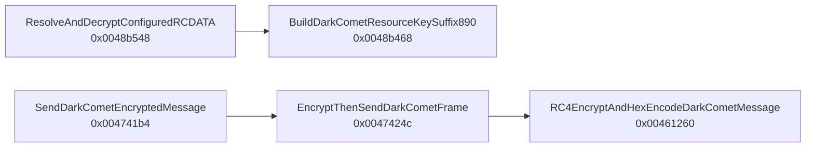

# 静的ロジック解析：a3fa75fe9b9c0ca9ccdc85ae6733024cbc64c545031aad9150f03fed9335850a

## 解析状態

- 状態: `terminal_function_analysis_completed_live_c2_pending`
- 終端SHA-256: `b9b052dfb2f19bf15aaba81f07861234f91a72a5c38d83c176a7a4dcdbb2e8c1`
- Ghidra解析プログラム数: 1
- レビュー済み特徴関数: 5
- 記録したcall edge: 3
- 生の逆コンパイル全文: 非公開

## 関数関係

## 特徴的な関数

### `BuildDarkCometResourceKeySuffix890` (`0x0048b468`)

- 役割: resource設定復号鍵のsuffix構築
- ロジック:
  1. 初期値`0x377`を使う。
  2. 4反復の更新後に10進`890`を得る。
  3. 呼出元がbase文字列`#KCMDDC5#-`へ連結する。
- 類似性観点: base文字列とsuffix導出の組合せは、同builder系統を追うfingerprintになる。

### `ResolveAndDecryptConfiguredRCDATA` (`0x0048b548`)

- 役割: 名前付きRCDATA設定の復号
- ロジック:
  1. resource名を解決する。
  2. ASCII-hex ciphertextをbyte列へ戻す。
  3. `#KCMDDC5#-890`を使ってRC4復号する。
  4. `NETDATA`等の設定値を返す。
- 制約: `DVCLAL`のようなbinary RCDATAは同じASCII-hex設定fieldとして扱わない。

### `SendDarkCometEncryptedMessage` (`0x004741b4`)

- 役割: DarkComet平文messageの送信入口
- ロジック:
  1. messageと通信key pointerを送信下位層へ渡す。
  2. pointer chainは10-byte ASCII `#KCMDDC5#-`へ解決する。
  3. PWDの連結は行わない。

### `EncryptThenSendDarkCometFrame` (`0x0047424c`)

- 役割: frame暗号化と送信の結合
- ロジック:
  1. messageをRC4/hex encoderへ渡す。
  2. 生成したASCII-hex frameをsocket送信処理へ渡す。

### `RC4EncryptAndHexEncodeDarkCometMessage` (`0x00461260`)

- 役割: 通信messageのwire framing
- ロジック:
  1. 10-byte network keyでRC4を適用する。
  2. ciphertextをASCII-hexへ変換する。
  3. 呼出元へ送信用bufferを返す。
- 判定への利用: server-first frameを同鍵で復号し、`IDTYPE`へ完全一致した場合だけprotocol evidenceとする。

## resource鍵と通信鍵の比較

| 用途 | 鍵 | PWD連結 | 根拠 |
|---|---|---|---|
| RCDATA設定復号 | `#KCMDDC5#-` + `890` | なし | `0x0048b468` / `0x0048b548` |
| C2通信 | 10-byte `#KCMDDC5#-` | なし | `0x004741b4` / `0x0047424c` / `0x00461260` |

この差を保持しないdecoderは、設定は復号できても通信判定で誤った鍵を使う。専用extractorとC2 source gateは両者を別fieldとして検証する。

## 制約

- 5関数は設定・通信に特徴的な範囲を選んだもので、全関数の意味付けではない。
- live C2へ接続していないため、静的protocol profileと現在の稼働状態を分離する。
- 生の資格情報、GENCODE、生の逆コンパイル全文は公開しない。
