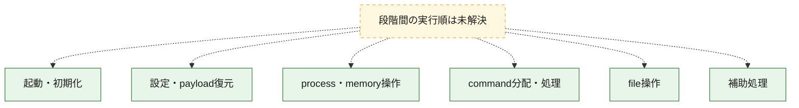
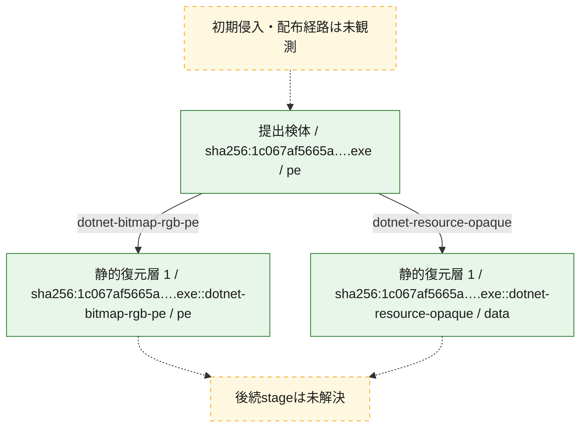
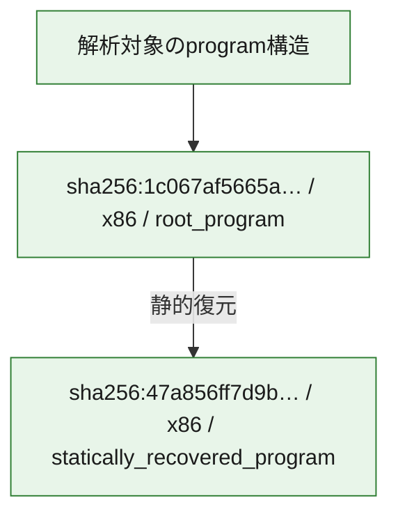

# 全体ロジック：1c067af5665a62e9251484c94bd2e2cbc734f97cf1c7243f62199abfabf43d19

代表関数の静的証跡から、起動・初期化、設定・payload復元、process・memory操作、command分配・処理、file操作の処理群を確認しました。

## 読み方

- phaseの掲載順は解析上の整理順です。observed_call_edgesがない段階間の実行順を断定しません。
- 図の実線は静的に観測した関係、点線と黄色のノードは未観測・未解決の関係を示します。
- 図は静的な要約であり、動的実行を再現するものではありません。
- 詳細な関数解説とfingerprintは[STATIC-LOGIC.md](STATIC-LOGIC.md)を参照してください。

## 静的可視化

### 実行フロー

### 感染チェーン

### モジュール関係

## 処理段階

### 1. 起動・初期化

entry pointから初期化と後続処理への移行を確認します。
確度: `confirmed_static_function_evidence`

- `1c067af5665a62e9251484c94bd2e2cbc734f97cf1c7243f62199abfabf43d19:cil:0x06000066` — 初期化と主要処理への分岐を行う入口関数です。 状態: `succeeded`、選定理由: `entry_point`, `reviewed_call_centrality:8`

### 2. 設定・payload復元

設定、resource、payload、暗号化データの復元・変換を確認します。
確度: `confirmed_static_function_evidence`

- `47a856ff7d9bf14949f9a1deed4ba4ec9495a9ef95ee41ba6d78f630561d166c:cil:0x0600000d` — 暗号、hash、encoding、または復号処理に関係する関数です。 状態: `succeeded`、選定理由: `large_function:instructions=90`, `reviewed_call_centrality:6`, `role:cryptographic_transform`
- `47a856ff7d9bf14949f9a1deed4ba4ec9495a9ef95ee41ba6d78f630561d166c:cil:0x0600000f` — 設定、resource、payloadなどの解析・変換を行う関数です。 状態: `succeeded`、選定理由: `reviewed_call_centrality:8`, `role:config_or_data_transform`
- `47a856ff7d9bf14949f9a1deed4ba4ec9495a9ef95ee41ba6d78f630561d166c:cil:0x0600002e` — 設定、resource、payloadなどの解析・変換を行う関数です。 状態: `succeeded`、選定理由: `large_function:instructions=137`, `reviewed_call_centrality:16`, `role:config_or_data_transform`
- `1c067af5665a62e9251484c94bd2e2cbc734f97cf1c7243f62199abfabf43d19:cil:0x06000067` — 設定、resource、payloadなどの解析・変換を行う関数です。 状態: `succeeded`、選定理由: `reviewed_call_centrality:2`, `role:config_or_data_transform`
- `1c067af5665a62e9251484c94bd2e2cbc734f97cf1c7243f62199abfabf43d19:cil:0x06000068` — 設定、resource、payloadなどの解析・変換を行う関数です。 状態: `succeeded`、選定理由: `reviewed_call_centrality:6`, `role:config_or_data_transform`
- `1c067af5665a62e9251484c94bd2e2cbc734f97cf1c7243f62199abfabf43d19:cil:0x06000069` — 設定、resource、payloadなどの解析・変換を行う関数です。 状態: `succeeded`、選定理由: `role:config_or_data_transform`
- `1c067af5665a62e9251484c94bd2e2cbc734f97cf1c7243f62199abfabf43d19:cil:0x0600006a` — 設定、resource、payloadなどの解析・変換を行う関数です。 状態: `succeeded`、選定理由: `role:config_or_data_transform`
- `1c067af5665a62e9251484c94bd2e2cbc734f97cf1c7243f62199abfabf43d19:cil:0x0600006b` — 設定、resource、payloadなどの解析・変換を行う関数です。 状態: `succeeded`、選定理由: `reviewed_call_centrality:4`, `role:config_or_data_transform`
- `1c067af5665a62e9251484c94bd2e2cbc734f97cf1c7243f62199abfabf43d19:cil:0x0600006c` — 設定、resource、payloadなどの解析・変換を行う関数です。 状態: `succeeded`、選定理由: `reviewed_call_centrality:4`, `role:config_or_data_transform`

### 3. process・memory操作

process、thread、module、memory操作と実行移行を確認します。
確度: `confirmed_static_function_evidence`

- `47a856ff7d9bf14949f9a1deed4ba4ec9495a9ef95ee41ba6d78f630561d166c:cil:0x06000003` — process、thread、module、またはmemory操作に関係する関数です。 状態: `succeeded`、選定理由: `reviewed_call_centrality:2`, `role:process_or_memory_operation`
- `47a856ff7d9bf14949f9a1deed4ba4ec9495a9ef95ee41ba6d78f630561d166c:cil:0x0600000c` — process、thread、module、またはmemory操作に関係する関数です。 状態: `succeeded`、選定理由: `reviewed_call_centrality:8`, `role:process_or_memory_operation`
- `47a856ff7d9bf14949f9a1deed4ba4ec9495a9ef95ee41ba6d78f630561d166c:cil:0x06000031` — process、thread、module、またはmemory操作に関係する関数です。 状態: `succeeded`、選定理由: `large_function:instructions=128`, `reviewed_call_centrality:8`, `role:process_or_memory_operation`

### 4. command分配・処理

受信commandやtaskの解釈、分配、個別handlerへの移行を確認します。
確度: `confirmed_static_function_evidence`

- `47a856ff7d9bf14949f9a1deed4ba4ec9495a9ef95ee41ba6d78f630561d166c:cil:0x06000014` — commandの解釈、分配、または個別処理を担当する関数です。 状態: `succeeded`、選定理由: `large_function:instructions=170`, `reviewed_call_centrality:54`, `role:command_dispatch_or_handler`
- `47a856ff7d9bf14949f9a1deed4ba4ec9495a9ef95ee41ba6d78f630561d166c:cil:0x06000034` — commandの解釈、分配、または個別処理を担当する関数です。 状態: `succeeded`、選定理由: `large_function:instructions=1491`, `reviewed_call_centrality:110`, `role:command_dispatch_or_handler`
- `1c067af5665a62e9251484c94bd2e2cbc734f97cf1c7243f62199abfabf43d19:cil:0x06000031` — commandの解釈、分配、または個別処理を担当する関数です。 状態: `succeeded`、選定理由: `role:command_dispatch_or_handler`
- `1c067af5665a62e9251484c94bd2e2cbc734f97cf1c7243f62199abfabf43d19:cil:0x06000032` — commandの解釈、分配、または個別処理を担当する関数です。 状態: `succeeded`、選定理由: `role:command_dispatch_or_handler`
- `1c067af5665a62e9251484c94bd2e2cbc734f97cf1c7243f62199abfabf43d19:cil:0x06000033` — commandの解釈、分配、または個別処理を担当する関数です。 状態: `succeeded`、選定理由: `role:command_dispatch_or_handler`
- `1c067af5665a62e9251484c94bd2e2cbc734f97cf1c7243f62199abfabf43d19:cil:0x06000034` — commandの解釈、分配、または個別処理を担当する関数です。 状態: `succeeded`、選定理由: `role:command_dispatch_or_handler`
- `1c067af5665a62e9251484c94bd2e2cbc734f97cf1c7243f62199abfabf43d19:cil:0x06000042` — commandの解釈、分配、または個別処理を担当する関数です。 状態: `succeeded`、選定理由: `large_function:instructions=1096`, `reviewed_call_centrality:114`, `role:command_dispatch_or_handler`
- `1c067af5665a62e9251484c94bd2e2cbc734f97cf1c7243f62199abfabf43d19:cil:0x06000047` — commandの解釈、分配、または個別処理を担当する関数です。 状態: `succeeded`、選定理由: `large_function:instructions=132`, `reviewed_call_centrality:38`, `role:command_dispatch_or_handler`
- `1c067af5665a62e9251484c94bd2e2cbc734f97cf1c7243f62199abfabf43d19:cil:0x06000049` — commandの解釈、分配、または個別処理を担当する関数です。 状態: `succeeded`、選定理由: `large_function:instructions=172`, `reviewed_call_centrality:36`, `role:command_dispatch_or_handler`
- `1c067af5665a62e9251484c94bd2e2cbc734f97cf1c7243f62199abfabf43d19:cil:0x0600004b` — commandの解釈、分配、または個別処理を担当する関数です。 状態: `succeeded`、選定理由: `large_function:instructions=72`, `reviewed_call_centrality:20`, `role:command_dispatch_or_handler`
- `1c067af5665a62e9251484c94bd2e2cbc734f97cf1c7243f62199abfabf43d19:cil:0x0600004e` — commandの解釈、分配、または個別処理を担当する関数です。 状態: `succeeded`、選定理由: `large_function:instructions=477`, `reviewed_call_centrality:72`, `role:command_dispatch_or_handler`
- `1c067af5665a62e9251484c94bd2e2cbc734f97cf1c7243f62199abfabf43d19:cil:0x06000050` — commandの解釈、分配、または個別処理を担当する関数です。 状態: `succeeded`、選定理由: `large_function:instructions=117`, `reviewed_call_centrality:36`, `role:command_dispatch_or_handler`
- `1c067af5665a62e9251484c94bd2e2cbc734f97cf1c7243f62199abfabf43d19:cil:0x06000051` — commandの解釈、分配、または個別処理を担当する関数です。 状態: `succeeded`、選定理由: `reviewed_call_centrality:10`, `role:command_dispatch_or_handler`
- `1c067af5665a62e9251484c94bd2e2cbc734f97cf1c7243f62199abfabf43d19:cil:0x06000054` — commandの解釈、分配、または個別処理を担当する関数です。 状態: `succeeded`、選定理由: `reviewed_call_centrality:4`, `role:command_dispatch_or_handler`
- `1c067af5665a62e9251484c94bd2e2cbc734f97cf1c7243f62199abfabf43d19:cil:0x06000056` — commandの解釈、分配、または個別処理を担当する関数です。 状態: `succeeded`、選定理由: `reviewed_call_centrality:4`, `role:command_dispatch_or_handler`
- `1c067af5665a62e9251484c94bd2e2cbc734f97cf1c7243f62199abfabf43d19:cil:0x0600005a` — commandの解釈、分配、または個別処理を担当する関数です。 状態: `succeeded`、選定理由: `large_function:instructions=1393`, `reviewed_call_centrality:72`, `role:command_dispatch_or_handler`
- `1c067af5665a62e9251484c94bd2e2cbc734f97cf1c7243f62199abfabf43d19:cil:0x0600005c` — commandの解釈、分配、または個別処理を担当する関数です。 状態: `succeeded`、選定理由: `large_function:instructions=163`, `reviewed_call_centrality:36`, `role:command_dispatch_or_handler`
- `1c067af5665a62e9251484c94bd2e2cbc734f97cf1c7243f62199abfabf43d19:cil:0x06000065` — commandの解釈、分配、または個別処理を担当する関数です。 状態: `succeeded`、選定理由: `large_function:instructions=642`, `reviewed_call_centrality:102`, `role:command_dispatch_or_handler`

### 5. file操作

fileやdirectoryの作成、読書き、削除を確認します。
確度: `confirmed_static_function_evidence`

- `47a856ff7d9bf14949f9a1deed4ba4ec9495a9ef95ee41ba6d78f630561d166c:cil:0x0600002f` — fileまたはdirectoryの読書き・管理に関係する関数です。 状態: `succeeded`、選定理由: `large_function:instructions=105`, `reviewed_call_centrality:16`, `role:file_operation`
- `1c067af5665a62e9251484c94bd2e2cbc734f97cf1c7243f62199abfabf43d19:cil:0x0600005f` — fileまたはdirectoryの読書き・管理に関係する関数です。 状態: `succeeded`、選定理由: `reviewed_call_centrality:24`, `role:file_operation`
- `1c067af5665a62e9251484c94bd2e2cbc734f97cf1c7243f62199abfabf43d19:cil:0x06000060` — fileまたはdirectoryの読書き・管理に関係する関数です。 状態: `succeeded`、選定理由: `large_function:instructions=145`, `reviewed_call_centrality:40`, `role:file_operation`

### 6. 補助処理

主要処理を支える一般内部関数またはlibrary処理を確認します。
確度: `confirmed_static_function_evidence`

- `47a856ff7d9bf14949f9a1deed4ba4ec9495a9ef95ee41ba6d78f630561d166c:cil:0x06000001` — 検体内部の一般処理を実装する関数です。 状態: `succeeded`、選定理由: `large_function:instructions=73`, `reviewed_call_centrality:22`
- `47a856ff7d9bf14949f9a1deed4ba4ec9495a9ef95ee41ba6d78f630561d166c:cil:0x06000002` — 検体内部の一般処理を実装する関数です。 状態: `succeeded`、選定理由: `reviewed_call_centrality:18`
- `47a856ff7d9bf14949f9a1deed4ba4ec9495a9ef95ee41ba6d78f630561d166c:cil:0x0600000b` — 検体内部の一般処理を実装する関数です。 状態: `succeeded`、選定理由: `reviewed_call_centrality:8`
- `47a856ff7d9bf14949f9a1deed4ba4ec9495a9ef95ee41ba6d78f630561d166c:cil:0x0600000e` — 検体内部の一般処理を実装する関数です。 状態: `succeeded`、選定理由: `reviewed_call_centrality:12`
- `47a856ff7d9bf14949f9a1deed4ba4ec9495a9ef95ee41ba6d78f630561d166c:cil:0x06000010` — 検体内部の一般処理を実装する関数です。 状態: `succeeded`、選定理由: `large_function:instructions=99`, `reviewed_call_centrality:12`
- `47a856ff7d9bf14949f9a1deed4ba4ec9495a9ef95ee41ba6d78f630561d166c:cil:0x06000011` — 検体内部の一般処理を実装する関数です。 状態: `succeeded`、選定理由: `large_function:instructions=76`, `reviewed_call_centrality:10`
- `47a856ff7d9bf14949f9a1deed4ba4ec9495a9ef95ee41ba6d78f630561d166c:cil:0x06000012` — 検体内部の一般処理を実装する関数です。 状態: `succeeded`、選定理由: `reviewed_call_centrality:8`
- `47a856ff7d9bf14949f9a1deed4ba4ec9495a9ef95ee41ba6d78f630561d166c:cil:0x06000013` — 検体内部の一般処理を実装する関数です。 状態: `succeeded`、選定理由: `reviewed_call_centrality:6`
- `47a856ff7d9bf14949f9a1deed4ba4ec9495a9ef95ee41ba6d78f630561d166c:cil:0x06000015` — 検体内部の一般処理を実装する関数です。 状態: `succeeded`、選定理由: `large_function:instructions=155`, `reviewed_call_centrality:10`
- `47a856ff7d9bf14949f9a1deed4ba4ec9495a9ef95ee41ba6d78f630561d166c:cil:0x06000016` — 検体内部の一般処理を実装する関数です。 状態: `succeeded`、選定理由: `large_function:instructions=92`, `reviewed_call_centrality:20`
- `47a856ff7d9bf14949f9a1deed4ba4ec9495a9ef95ee41ba6d78f630561d166c:cil:0x06000018` — 検体内部の一般処理を実装する関数です。 状態: `succeeded`、選定理由: `large_function:instructions=112`, `reviewed_call_centrality:14`
- `47a856ff7d9bf14949f9a1deed4ba4ec9495a9ef95ee41ba6d78f630561d166c:cil:0x0600001a` — 検体内部の一般処理を実装する関数です。 状態: `succeeded`、選定理由: `large_function:instructions=91`, `reviewed_call_centrality:16`
- `47a856ff7d9bf14949f9a1deed4ba4ec9495a9ef95ee41ba6d78f630561d166c:cil:0x0600001d` — 検体内部の一般処理を実装する関数です。 状態: `succeeded`、選定理由: `large_function:instructions=95`, `reviewed_call_centrality:4`
- `47a856ff7d9bf14949f9a1deed4ba4ec9495a9ef95ee41ba6d78f630561d166c:cil:0x0600001e` — 検体内部の一般処理を実装する関数です。 状態: `succeeded`、選定理由: `large_function:instructions=157`, `reviewed_call_centrality:16`
- `47a856ff7d9bf14949f9a1deed4ba4ec9495a9ef95ee41ba6d78f630561d166c:cil:0x06000020` — 検体内部の一般処理を実装する関数です。 状態: `succeeded`、選定理由: `large_function:instructions=114`, `reviewed_call_centrality:20`
- `47a856ff7d9bf14949f9a1deed4ba4ec9495a9ef95ee41ba6d78f630561d166c:cil:0x06000022` — 検体内部の一般処理を実装する関数です。 状態: `succeeded`、選定理由: `large_function:instructions=88`, `reviewed_call_centrality:14`
- `47a856ff7d9bf14949f9a1deed4ba4ec9495a9ef95ee41ba6d78f630561d166c:cil:0x06000023` — 検体内部の一般処理を実装する関数です。 状態: `succeeded`、選定理由: `large_function:instructions=97`, `reviewed_call_centrality:10`
- `47a856ff7d9bf14949f9a1deed4ba4ec9495a9ef95ee41ba6d78f630561d166c:cil:0x06000024` — 検体内部の一般処理を実装する関数です。 状態: `succeeded`、選定理由: `large_function:instructions=70`, `reviewed_call_centrality:14`
- `47a856ff7d9bf14949f9a1deed4ba4ec9495a9ef95ee41ba6d78f630561d166c:cil:0x06000025` — 検体内部の一般処理を実装する関数です。 状態: `succeeded`、選定理由: `large_function:instructions=115`, `reviewed_call_centrality:12`
- `47a856ff7d9bf14949f9a1deed4ba4ec9495a9ef95ee41ba6d78f630561d166c:cil:0x06000027` — 検体内部の一般処理を実装する関数です。 状態: `succeeded`、選定理由: `large_function:instructions=78`, `reviewed_call_centrality:8`
- `47a856ff7d9bf14949f9a1deed4ba4ec9495a9ef95ee41ba6d78f630561d166c:cil:0x0600002a` — 検体内部の一般処理を実装する関数です。 状態: `succeeded`、選定理由: `reviewed_call_centrality:6`
- `47a856ff7d9bf14949f9a1deed4ba4ec9495a9ef95ee41ba6d78f630561d166c:cil:0x0600002c` — 検体内部の一般処理を実装する関数です。 状態: `succeeded`、選定理由: `large_function:instructions=79`, `reviewed_call_centrality:8`
- `47a856ff7d9bf14949f9a1deed4ba4ec9495a9ef95ee41ba6d78f630561d166c:cil:0x0600002d` — 検体内部の一般処理を実装する関数です。 状態: `succeeded`、選定理由: `reviewed_call_centrality:10`
- `1c067af5665a62e9251484c94bd2e2cbc734f97cf1c7243f62199abfabf43d19:cil:0x0600003c` — 検体内部の一般処理を実装する関数です。 状態: `succeeded`、選定理由: `large_function:instructions=213`, `reviewed_call_centrality:36`
- `1c067af5665a62e9251484c94bd2e2cbc734f97cf1c7243f62199abfabf43d19:cil:0x06000040` — 検体内部の一般処理を実装する関数です。 状態: `succeeded`、選定理由: `large_function:instructions=213`, `reviewed_call_centrality:24`
- `1c067af5665a62e9251484c94bd2e2cbc734f97cf1c7243f62199abfabf43d19:cil:0x0600005e` — 検体内部の一般処理を実装する関数です。 状態: `succeeded`、選定理由: `large_function:instructions=188`, `reviewed_call_centrality:20`
- `1c067af5665a62e9251484c94bd2e2cbc734f97cf1c7243f62199abfabf43d19:cil:0x06000061` — 検体内部の一般処理を実装する関数です。 状態: `succeeded`、選定理由: `large_function:instructions=73`, `reviewed_call_centrality:26`
- `1c067af5665a62e9251484c94bd2e2cbc734f97cf1c7243f62199abfabf43d19:cil:0x06000062` — 検体内部の一般処理を実装する関数です。 状態: `succeeded`、選定理由: `large_function:instructions=322`, `reviewed_call_centrality:20`
- `1c067af5665a62e9251484c94bd2e2cbc734f97cf1c7243f62199abfabf43d19:cil:0x06000070` — 検体内部の一般処理を実装する関数です。 状態: `succeeded`、選定理由: `large_function:instructions=89`, `reviewed_call_centrality:28`
- `1c067af5665a62e9251484c94bd2e2cbc734f97cf1c7243f62199abfabf43d19:cil:0x06000072` — 検体内部の一般処理を実装する関数です。 状態: `succeeded`、選定理由: `large_function:instructions=117`, `reviewed_call_centrality:20`

## 観測したcall関係

- 代表関数間で直接解決できた呼出関係はありません。

## 解析範囲と制約

- 選定外関数は全体inventoryへ残しますが、関数本体の個別解説対象にはしていません。
- indirect call、難読化、packer、VM、壊れたcontrol flowによりcall関係が欠落する場合があります。
- 文書は静的解析に基づき、検体実行や外部通信による動的確認は行っていません。
