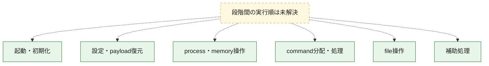
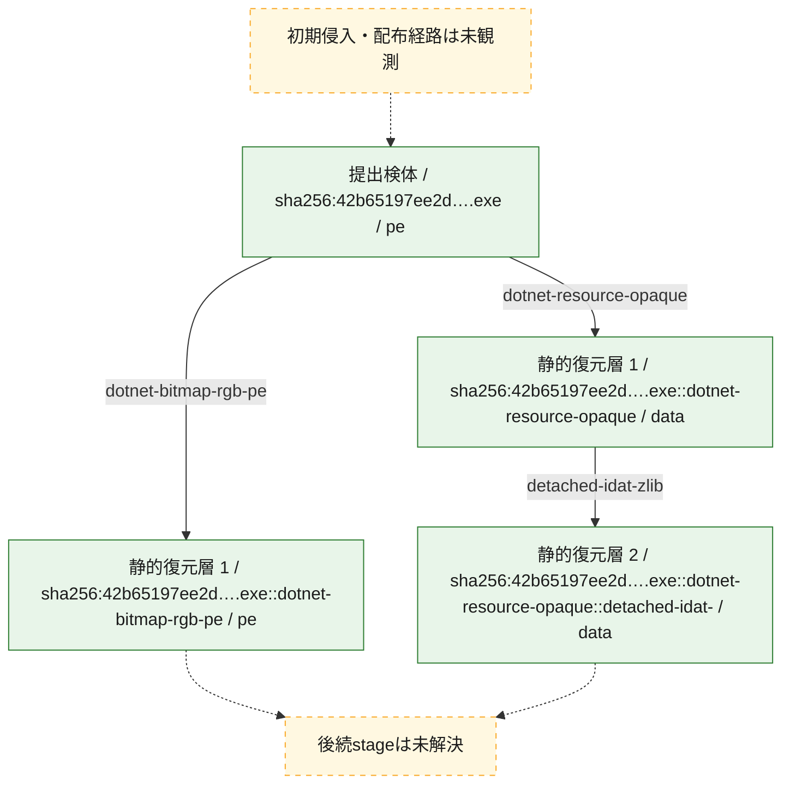
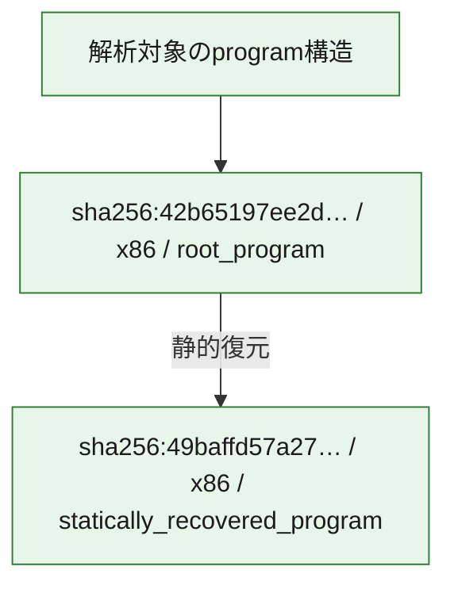

# 全体ロジック：42b65197ee2dddb7b3cae26cf2d595a0f074e20e9ba0aa2efdf41d5ec3461579

代表関数の静的証跡から、起動・初期化、設定・payload復元、process・memory操作、command分配・処理、file操作の処理群を確認しました。

## 読み方

- phaseの掲載順は解析上の整理順です。observed_call_edgesがない段階間の実行順を断定しません。
- 図の実線は静的に観測した関係、点線と黄色のノードは未観測・未解決の関係を示します。
- 図は静的な要約であり、動的実行を再現するものではありません。
- 詳細な関数解説とfingerprintは[STATIC-LOGIC.md](STATIC-LOGIC.md)を参照してください。

## 静的可視化

### 実行フロー

### 感染チェーン

### モジュール関係

## 処理段階

### 1. 起動・初期化

entry pointから初期化と後続処理への移行を確認します。
確度: `confirmed_static_function_evidence`

- `42b65197ee2dddb7b3cae26cf2d595a0f074e20e9ba0aa2efdf41d5ec3461579:cil:0x06000012` — 初期化と主要処理への分岐を行う入口関数です。 状態: `succeeded`、選定理由: `entry_point`, `large_function:instructions=116`, `reviewed_call_centrality:64`

### 2. 設定・payload復元

設定、resource、payload、暗号化データの復元・変換を確認します。
確度: `confirmed_static_function_evidence`

- `49baffd57a2753b9b97346e3d9b7c896900bdf92e9cacc5c6e1526c90e6e696d:cil:0x06000003` — 暗号、hash、encoding、または復号処理に関係する関数です。 状態: `succeeded`、選定理由: `large_function:instructions=124`, `reviewed_call_centrality:20`, `role:cryptographic_transform`
- `49baffd57a2753b9b97346e3d9b7c896900bdf92e9cacc5c6e1526c90e6e696d:cil:0x06000014` — 暗号、hash、encoding、または復号処理に関係する関数です。 状態: `succeeded`、選定理由: `large_function:instructions=111`, `reviewed_call_centrality:8`, `role:cryptographic_transform`
- `49baffd57a2753b9b97346e3d9b7c896900bdf92e9cacc5c6e1526c90e6e696d:cil:0x06000018` — 暗号、hash、encoding、または復号処理に関係する関数です。 状態: `succeeded`、選定理由: `large_function:instructions=163`, `reviewed_call_centrality:18`, `role:cryptographic_transform`
- `49baffd57a2753b9b97346e3d9b7c896900bdf92e9cacc5c6e1526c90e6e696d:cil:0x0600001c` — 暗号、hash、encoding、または復号処理に関係する関数です。 状態: `succeeded`、選定理由: `large_function:instructions=198`, `reviewed_call_centrality:20`, `role:cryptographic_transform`
- `49baffd57a2753b9b97346e3d9b7c896900bdf92e9cacc5c6e1526c90e6e696d:cil:0x06000022` — 暗号、hash、encoding、または復号処理に関係する関数です。 状態: `succeeded`、選定理由: `large_function:instructions=208`, `reviewed_call_centrality:14`, `role:cryptographic_transform`
- `49baffd57a2753b9b97346e3d9b7c896900bdf92e9cacc5c6e1526c90e6e696d:cil:0x06000024` — 暗号、hash、encoding、または復号処理に関係する関数です。 状態: `succeeded`、選定理由: `large_function:instructions=157`, `reviewed_call_centrality:12`, `role:cryptographic_transform`
- `49baffd57a2753b9b97346e3d9b7c896900bdf92e9cacc5c6e1526c90e6e696d:cil:0x06000025` — 暗号、hash、encoding、または復号処理に関係する関数です。 状態: `succeeded`、選定理由: `large_function:instructions=193`, `reviewed_call_centrality:14`, `role:cryptographic_transform`
- `49baffd57a2753b9b97346e3d9b7c896900bdf92e9cacc5c6e1526c90e6e696d:cil:0x06000026` — 暗号、hash、encoding、または復号処理に関係する関数です。 状態: `succeeded`、選定理由: `large_function:instructions=120`, `reviewed_call_centrality:10`, `role:cryptographic_transform`
- `49baffd57a2753b9b97346e3d9b7c896900bdf92e9cacc5c6e1526c90e6e696d:cil:0x06000029` — 暗号、hash、encoding、または復号処理に関係する関数です。 状態: `succeeded`、選定理由: `large_function:instructions=146`, `reviewed_call_centrality:8`, `role:cryptographic_transform`
- `49baffd57a2753b9b97346e3d9b7c896900bdf92e9cacc5c6e1526c90e6e696d:cil:0x0600002f` — 暗号、hash、encoding、または復号処理に関係する関数です。 状態: `succeeded`、選定理由: `large_function:instructions=77`, `reviewed_call_centrality:10`, `role:cryptographic_transform`
- `49baffd57a2753b9b97346e3d9b7c896900bdf92e9cacc5c6e1526c90e6e696d:cil:0x06000031` — 暗号、hash、encoding、または復号処理に関係する関数です。 状態: `succeeded`、選定理由: `large_function:instructions=198`, `reviewed_call_centrality:10`, `role:cryptographic_transform`
- `49baffd57a2753b9b97346e3d9b7c896900bdf92e9cacc5c6e1526c90e6e696d:cil:0x06000045` — 暗号、hash、encoding、または復号処理に関係する関数です。 状態: `succeeded`、選定理由: `large_function:instructions=96`, `reviewed_call_centrality:14`, `role:cryptographic_transform`
- `49baffd57a2753b9b97346e3d9b7c896900bdf92e9cacc5c6e1526c90e6e696d:cil:0x0600004f` — 暗号、hash、encoding、または復号処理に関係する関数です。 状態: `succeeded`、選定理由: `large_function:instructions=401`, `role:cryptographic_transform`
- `49baffd57a2753b9b97346e3d9b7c896900bdf92e9cacc5c6e1526c90e6e696d:cil:0x06000050` — 暗号、hash、encoding、または復号処理に関係する関数です。 状態: `succeeded`、選定理由: `reviewed_call_centrality:8`, `role:cryptographic_transform`
- `49baffd57a2753b9b97346e3d9b7c896900bdf92e9cacc5c6e1526c90e6e696d:cil:0x06000056` — 設定、resource、payloadなどの解析・変換を行う関数です。 状態: `succeeded`、選定理由: `large_function:instructions=601`, `reviewed_call_centrality:72`, `role:config_or_data_transform`
- `49baffd57a2753b9b97346e3d9b7c896900bdf92e9cacc5c6e1526c90e6e696d:cil:0x06000059` — 暗号、hash、encoding、または復号処理に関係する関数です。 状態: `succeeded`、選定理由: `large_function:instructions=2803`, `reviewed_call_centrality:44`, `role:cryptographic_transform`
- `49baffd57a2753b9b97346e3d9b7c896900bdf92e9cacc5c6e1526c90e6e696d:cil:0x0600005a` — 設定、resource、payloadなどの解析・変換を行う関数です。 状態: `succeeded`、選定理由: `large_function:instructions=138`, `reviewed_call_centrality:46`, `role:config_or_data_transform`
- `49baffd57a2753b9b97346e3d9b7c896900bdf92e9cacc5c6e1526c90e6e696d:cil:0x06000062` — 暗号、hash、encoding、または復号処理に関係する関数です。 状態: `succeeded`、選定理由: `reviewed_call_centrality:14`, `role:cryptographic_transform`
- `49baffd57a2753b9b97346e3d9b7c896900bdf92e9cacc5c6e1526c90e6e696d:cil:0x06000063` — 暗号、hash、encoding、または復号処理に関係する関数です。 状態: `succeeded`、選定理由: `reviewed_call_centrality:14`, `role:cryptographic_transform`
- `49baffd57a2753b9b97346e3d9b7c896900bdf92e9cacc5c6e1526c90e6e696d:cil:0x06000064` — 暗号、hash、encoding、または復号処理に関係する関数です。 状態: `succeeded`、選定理由: `reviewed_call_centrality:14`, `role:cryptographic_transform`
- `49baffd57a2753b9b97346e3d9b7c896900bdf92e9cacc5c6e1526c90e6e696d:cil:0x06000065` — 暗号、hash、encoding、または復号処理に関係する関数です。 状態: `succeeded`、選定理由: `reviewed_call_centrality:14`, `role:cryptographic_transform`
- `49baffd57a2753b9b97346e3d9b7c896900bdf92e9cacc5c6e1526c90e6e696d:cil:0x06000066` — 暗号、hash、encoding、または復号処理に関係する関数です。 状態: `succeeded`、選定理由: `reviewed_call_centrality:14`, `role:cryptographic_transform`
- `49baffd57a2753b9b97346e3d9b7c896900bdf92e9cacc5c6e1526c90e6e696d:cil:0x06000067` — 暗号、hash、encoding、または復号処理に関係する関数です。 状態: `succeeded`、選定理由: `reviewed_call_centrality:14`, `role:cryptographic_transform`
- `49baffd57a2753b9b97346e3d9b7c896900bdf92e9cacc5c6e1526c90e6e696d:cil:0x0600006c` — 設定、resource、payloadなどの解析・変換を行う関数です。 状態: `succeeded`、選定理由: `reviewed_call_centrality:22`, `role:config_or_data_transform`
- `49baffd57a2753b9b97346e3d9b7c896900bdf92e9cacc5c6e1526c90e6e696d:cil:0x06000092` — 暗号、hash、encoding、または復号処理に関係する関数です。 状態: `succeeded`、選定理由: `reviewed_call_centrality:30`, `role:cryptographic_transform`
- `49baffd57a2753b9b97346e3d9b7c896900bdf92e9cacc5c6e1526c90e6e696d:cil:0x060000be` — 暗号、hash、encoding、または復号処理に関係する関数です。 状態: `succeeded`、選定理由: `large_function:instructions=1361`, `reviewed_call_centrality:8`, `role:cryptographic_transform`
- `42b65197ee2dddb7b3cae26cf2d595a0f074e20e9ba0aa2efdf41d5ec3461579:cil:0x0600003e` — 設定、resource、payloadなどの解析・変換を行う関数です。 状態: `succeeded`、選定理由: `reviewed_call_centrality:2`, `role:config_or_data_transform`
- `42b65197ee2dddb7b3cae26cf2d595a0f074e20e9ba0aa2efdf41d5ec3461579:cil:0x0600003f` — 設定、resource、payloadなどの解析・変換を行う関数です。 状態: `succeeded`、選定理由: `reviewed_call_centrality:6`, `role:config_or_data_transform`
- `42b65197ee2dddb7b3cae26cf2d595a0f074e20e9ba0aa2efdf41d5ec3461579:cil:0x06000040` — 設定、resource、payloadなどの解析・変換を行う関数です。 状態: `succeeded`、選定理由: `role:config_or_data_transform`
- `42b65197ee2dddb7b3cae26cf2d595a0f074e20e9ba0aa2efdf41d5ec3461579:cil:0x06000041` — 設定、resource、payloadなどの解析・変換を行う関数です。 状態: `succeeded`、選定理由: `role:config_or_data_transform`
- `42b65197ee2dddb7b3cae26cf2d595a0f074e20e9ba0aa2efdf41d5ec3461579:cil:0x06000042` — 設定、resource、payloadなどの解析・変換を行う関数です。 状態: `succeeded`、選定理由: `reviewed_call_centrality:4`, `role:config_or_data_transform`
- `42b65197ee2dddb7b3cae26cf2d595a0f074e20e9ba0aa2efdf41d5ec3461579:cil:0x06000043` — 設定、resource、payloadなどの解析・変換を行う関数です。 状態: `succeeded`、選定理由: `reviewed_call_centrality:4`, `role:config_or_data_transform`

### 3. process・memory操作

process、thread、module、memory操作と実行移行を確認します。
確度: `confirmed_static_function_evidence`

- `49baffd57a2753b9b97346e3d9b7c896900bdf92e9cacc5c6e1526c90e6e696d:cil:0x06000033` — process、thread、module、またはmemory操作に関係する関数です。 状態: `succeeded`、選定理由: `large_function:instructions=246`, `reviewed_call_centrality:6`, `role:process_or_memory_operation`

### 4. command分配・処理

受信commandやtaskの解釈、分配、個別handlerへの移行を確認します。
確度: `confirmed_static_function_evidence`

- `49baffd57a2753b9b97346e3d9b7c896900bdf92e9cacc5c6e1526c90e6e696d:cil:0x06000016` — commandの解釈、分配、または個別処理を担当する関数です。 状態: `succeeded`、選定理由: `large_function:instructions=342`, `reviewed_call_centrality:16`, `role:command_dispatch_or_handler`
- `49baffd57a2753b9b97346e3d9b7c896900bdf92e9cacc5c6e1526c90e6e696d:cil:0x06000036` — commandの解釈、分配、または個別処理を担当する関数です。 状態: `succeeded`、選定理由: `large_function:instructions=2918`, `reviewed_call_centrality:34`, `role:command_dispatch_or_handler`
- `42b65197ee2dddb7b3cae26cf2d595a0f074e20e9ba0aa2efdf41d5ec3461579:cil:0x06000001` — commandの解釈、分配、または個別処理を担当する関数です。 状態: `succeeded`、選定理由: `reviewed_call_centrality:18`, `role:command_dispatch_or_handler`
- `42b65197ee2dddb7b3cae26cf2d595a0f074e20e9ba0aa2efdf41d5ec3461579:cil:0x06000002` — commandの解釈、分配、または個別処理を担当する関数です。 状態: `succeeded`、選定理由: `large_function:instructions=131`, `reviewed_call_centrality:58`, `role:command_dispatch_or_handler`
- `42b65197ee2dddb7b3cae26cf2d595a0f074e20e9ba0aa2efdf41d5ec3461579:cil:0x0600001c` — commandの解釈、分配、または個別処理を担当する関数です。 状態: `succeeded`、選定理由: `large_function:instructions=564`, `reviewed_call_centrality:128`, `role:command_dispatch_or_handler`
- `42b65197ee2dddb7b3cae26cf2d595a0f074e20e9ba0aa2efdf41d5ec3461579:cil:0x0600001d` — commandの解釈、分配、または個別処理を担当する関数です。 状態: `succeeded`、選定理由: `reviewed_call_centrality:4`, `role:command_dispatch_or_handler`
- `42b65197ee2dddb7b3cae26cf2d595a0f074e20e9ba0aa2efdf41d5ec3461579:cil:0x06000026` — commandの解釈、分配、または個別処理を担当する関数です。 状態: `succeeded`、選定理由: `large_function:instructions=1046`, `reviewed_call_centrality:98`, `role:command_dispatch_or_handler`
- `42b65197ee2dddb7b3cae26cf2d595a0f074e20e9ba0aa2efdf41d5ec3461579:cil:0x0600002d` — commandの解釈、分配、または個別処理を担当する関数です。 状態: `succeeded`、選定理由: `large_function:instructions=1043`, `reviewed_call_centrality:126`, `role:command_dispatch_or_handler`
- `42b65197ee2dddb7b3cae26cf2d595a0f074e20e9ba0aa2efdf41d5ec3461579:cil:0x06000032` — commandの解釈、分配、または個別処理を担当する関数です。 状態: `succeeded`、選定理由: `large_function:instructions=1103`, `reviewed_call_centrality:102`, `role:command_dispatch_or_handler`
- `42b65197ee2dddb7b3cae26cf2d595a0f074e20e9ba0aa2efdf41d5ec3461579:cil:0x06000044` — commandの解釈、分配、または個別処理を担当する関数です。 状態: `succeeded`、選定理由: `large_function:instructions=1188`, `reviewed_call_centrality:22`, `role:command_dispatch_or_handler`
- `42b65197ee2dddb7b3cae26cf2d595a0f074e20e9ba0aa2efdf41d5ec3461579:cil:0x0600008e` — commandの解釈、分配、または個別処理を担当する関数です。 状態: `succeeded`、選定理由: `role:command_dispatch_or_handler`
- `42b65197ee2dddb7b3cae26cf2d595a0f074e20e9ba0aa2efdf41d5ec3461579:cil:0x0600008f` — commandの解釈、分配、または個別処理を担当する関数です。 状態: `succeeded`、選定理由: `role:command_dispatch_or_handler`
- `42b65197ee2dddb7b3cae26cf2d595a0f074e20e9ba0aa2efdf41d5ec3461579:cil:0x06000090` — commandの解釈、分配、または個別処理を担当する関数です。 状態: `succeeded`、選定理由: `role:command_dispatch_or_handler`
- `42b65197ee2dddb7b3cae26cf2d595a0f074e20e9ba0aa2efdf41d5ec3461579:cil:0x06000091` — commandの解釈、分配、または個別処理を担当する関数です。 状態: `succeeded`、選定理由: `role:command_dispatch_or_handler`
- `42b65197ee2dddb7b3cae26cf2d595a0f074e20e9ba0aa2efdf41d5ec3461579:cil:0x06000093` — commandの解釈、分配、または個別処理を担当する関数です。 状態: `succeeded`、選定理由: `reviewed_call_centrality:2`, `role:command_dispatch_or_handler`
- `42b65197ee2dddb7b3cae26cf2d595a0f074e20e9ba0aa2efdf41d5ec3461579:cil:0x06000094` — commandの解釈、分配、または個別処理を担当する関数です。 状態: `succeeded`、選定理由: `reviewed_call_centrality:2`, `role:command_dispatch_or_handler`
- `42b65197ee2dddb7b3cae26cf2d595a0f074e20e9ba0aa2efdf41d5ec3461579:cil:0x06000095` — commandの解釈、分配、または個別処理を担当する関数です。 状態: `succeeded`、選定理由: `reviewed_call_centrality:2`, `role:command_dispatch_or_handler`
- `42b65197ee2dddb7b3cae26cf2d595a0f074e20e9ba0aa2efdf41d5ec3461579:cil:0x06000096` — commandの解釈、分配、または個別処理を担当する関数です。 状態: `succeeded`、選定理由: `large_function:instructions=133`, `reviewed_call_centrality:12`, `role:command_dispatch_or_handler`

### 5. file操作

fileやdirectoryの作成、読書き、削除を確認します。
確度: `confirmed_static_function_evidence`

- `49baffd57a2753b9b97346e3d9b7c896900bdf92e9cacc5c6e1526c90e6e696d:cil:0x06000030` — fileまたはdirectoryの読書き・管理に関係する関数です。 状態: `succeeded`、選定理由: `large_function:instructions=276`, `reviewed_call_centrality:10`, `role:file_operation`
- `49baffd57a2753b9b97346e3d9b7c896900bdf92e9cacc5c6e1526c90e6e696d:cil:0x0600005f` — fileまたはdirectoryの読書き・管理に関係する関数です。 状態: `succeeded`、選定理由: `large_function:instructions=67`, `reviewed_call_centrality:18`, `role:file_operation`
- `42b65197ee2dddb7b3cae26cf2d595a0f074e20e9ba0aa2efdf41d5ec3461579:cil:0x0600000c` — fileまたはdirectoryの読書き・管理に関係する関数です。 状態: `succeeded`、選定理由: `reviewed_call_centrality:12`, `role:file_operation`
- `42b65197ee2dddb7b3cae26cf2d595a0f074e20e9ba0aa2efdf41d5ec3461579:cil:0x06000011` — fileまたはdirectoryの読書き・管理に関係する関数です。 状態: `succeeded`、選定理由: `large_function:instructions=160`, `reviewed_call_centrality:50`, `role:file_operation`

### 6. 補助処理

主要処理を支える一般内部関数またはlibrary処理を確認します。
確度: `confirmed_static_function_evidence`

- `49baffd57a2753b9b97346e3d9b7c896900bdf92e9cacc5c6e1526c90e6e696d:cil:0x06000047` — 検体内部の一般処理を実装する関数です。 状態: `succeeded`、選定理由: `large_function:instructions=821`, `reviewed_call_centrality:12`
- `42b65197ee2dddb7b3cae26cf2d595a0f074e20e9ba0aa2efdf41d5ec3461579:cil:0x0600000b` — 検体内部の一般処理を実装する関数です。 状態: `succeeded`、選定理由: `large_function:instructions=70`, `reviewed_call_centrality:36`
- `42b65197ee2dddb7b3cae26cf2d595a0f074e20e9ba0aa2efdf41d5ec3461579:cil:0x06000015` — 検体内部の一般処理を実装する関数です。 状態: `succeeded`、選定理由: `large_function:instructions=602`, `reviewed_call_centrality:58`
- `42b65197ee2dddb7b3cae26cf2d595a0f074e20e9ba0aa2efdf41d5ec3461579:cil:0x06000016` — 検体内部の一般処理を実装する関数です。 状態: `succeeded`、選定理由: `large_function:instructions=207`, `reviewed_call_centrality:30`
- `42b65197ee2dddb7b3cae26cf2d595a0f074e20e9ba0aa2efdf41d5ec3461579:cil:0x06000020` — 検体内部の一般処理を実装する関数です。 状態: `succeeded`、選定理由: `large_function:instructions=100`, `reviewed_call_centrality:40`
- `42b65197ee2dddb7b3cae26cf2d595a0f074e20e9ba0aa2efdf41d5ec3461579:cil:0x06000021` — 検体内部の一般処理を実装する関数です。 状態: `succeeded`、選定理由: `large_function:instructions=137`, `reviewed_call_centrality:42`
- `42b65197ee2dddb7b3cae26cf2d595a0f074e20e9ba0aa2efdf41d5ec3461579:cil:0x06000029` — 検体内部の一般処理を実装する関数です。 状態: `succeeded`、選定理由: `large_function:instructions=468`, `reviewed_call_centrality:82`
- `42b65197ee2dddb7b3cae26cf2d595a0f074e20e9ba0aa2efdf41d5ec3461579:cil:0x0600002f` — 検体内部の一般処理を実装する関数です。 状態: `succeeded`、選定理由: `large_function:instructions=336`, `reviewed_call_centrality:46`

## 観測したcall関係

- 代表関数間で直接解決できた呼出関係はありません。

## 解析範囲と制約

- 選定外関数は全体inventoryへ残しますが、関数本体の個別解説対象にはしていません。
- indirect call、難読化、packer、VM、壊れたcontrol flowによりcall関係が欠落する場合があります。
- 文書は静的解析に基づき、検体実行や外部通信による動的確認は行っていません。
