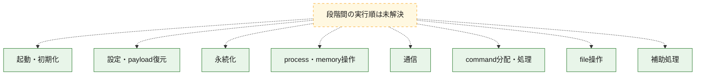
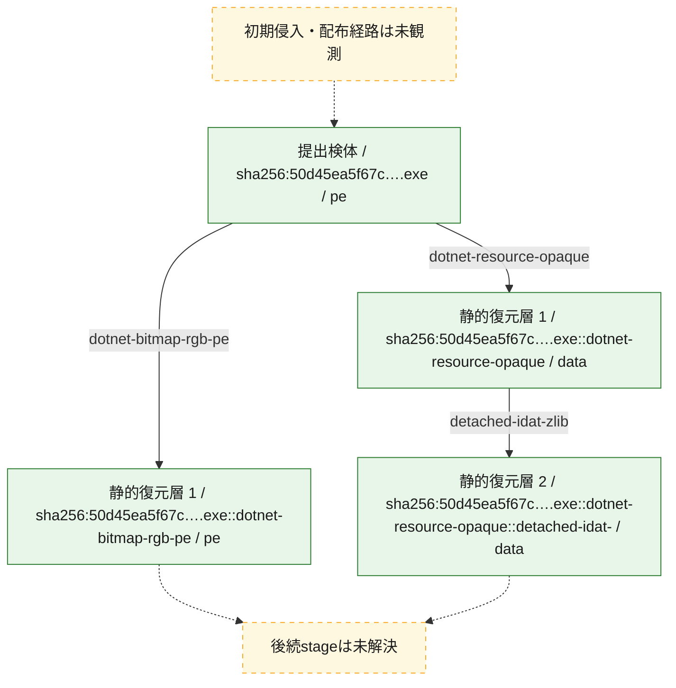
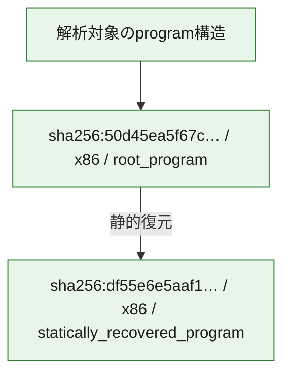

# 全体ロジック：50d45ea5f67cd018b72fbcced629ce9159a7b914750adc78f6e4f29c866db426

代表関数の静的証跡から、起動・初期化、設定・payload復元、永続化、process・memory操作、通信、command分配・処理、file操作の処理群を確認しました。

## 読み方

- phaseの掲載順は解析上の整理順です。observed_call_edgesがない段階間の実行順を断定しません。
- 図の実線は静的に観測した関係、点線と黄色のノードは未観測・未解決の関係を示します。
- 図は静的な要約であり、動的実行を再現するものではありません。
- 詳細な関数解説とfingerprintは[STATIC-LOGIC.md](STATIC-LOGIC.md)を参照してください。

## 静的可視化

### 実行フロー

### 感染チェーン

### モジュール関係

## 処理段階

### 1. 起動・初期化

entry pointから初期化と後続処理への移行を確認します。
確度: `confirmed_static_function_evidence`

- `50d45ea5f67cd018b72fbcced629ce9159a7b914750adc78f6e4f29c866db426:cil:0x06000002` — 初期化と主要処理への分岐を行う入口関数です。 状態: `succeeded`、選定理由: `entry_point`, `reviewed_call_centrality:8`

### 2. 設定・payload復元

設定、resource、payload、暗号化データの復元・変換を確認します。
確度: `confirmed_static_function_evidence`

- `df55e6e5aaf16052a3773eed8e93190ed25f47d169334672f115d927b6c32348:cil:0x0600000f` — 暗号、hash、encoding、または復号処理に関係する関数です。 状態: `succeeded`、選定理由: `large_function:instructions=132`, `reviewed_call_centrality:4`, `role:cryptographic_transform`
- `df55e6e5aaf16052a3773eed8e93190ed25f47d169334672f115d927b6c32348:cil:0x06000011` — 設定、resource、payloadなどの解析・変換を行う関数です。 状態: `succeeded`、選定理由: `reviewed_call_centrality:6`, `role:config_or_data_transform`
- `df55e6e5aaf16052a3773eed8e93190ed25f47d169334672f115d927b6c32348:cil:0x0600007f` — 暗号、hash、encoding、または復号処理に関係する関数です。 状態: `succeeded`、選定理由: `reviewed_call_centrality:30`, `role:cryptographic_transform`
- `df55e6e5aaf16052a3773eed8e93190ed25f47d169334672f115d927b6c32348:cil:0x060000ab` — 暗号、hash、encoding、または復号処理に関係する関数です。 状態: `succeeded`、選定理由: `large_function:instructions=1096`, `reviewed_call_centrality:8`, `role:cryptographic_transform`
- `50d45ea5f67cd018b72fbcced629ce9159a7b914750adc78f6e4f29c866db426:cil:0x06000004` — 設定、resource、payloadなどの解析・変換を行う関数です。 状態: `succeeded`、選定理由: `large_function:instructions=167`, `reviewed_call_centrality:16`, `role:config_or_data_transform`
- `50d45ea5f67cd018b72fbcced629ce9159a7b914750adc78f6e4f29c866db426:cil:0x06000005` — 暗号、hash、encoding、または復号処理に関係する関数です。 状態: `succeeded`、選定理由: `large_function:instructions=218`, `reviewed_call_centrality:12`, `role:cryptographic_transform`
- `50d45ea5f67cd018b72fbcced629ce9159a7b914750adc78f6e4f29c866db426:cil:0x06000019` — 暗号、hash、encoding、または復号処理に関係する関数です。 状態: `succeeded`、選定理由: `large_function:instructions=137`, `reviewed_call_centrality:18`, `role:cryptographic_transform`
- `50d45ea5f67cd018b72fbcced629ce9159a7b914750adc78f6e4f29c866db426:cil:0x0600001e` — 設定、resource、payloadなどの解析・変換を行う関数です。 状態: `succeeded`、選定理由: `large_function:instructions=110`, `reviewed_call_centrality:10`, `role:config_or_data_transform`
- `50d45ea5f67cd018b72fbcced629ce9159a7b914750adc78f6e4f29c866db426:cil:0x06000057` — 設定、resource、payloadなどの解析・変換を行う関数です。 状態: `succeeded`、選定理由: `large_function:instructions=2809`, `reviewed_call_centrality:168`, `role:config_or_data_transform`
- `50d45ea5f67cd018b72fbcced629ce9159a7b914750adc78f6e4f29c866db426:cil:0x0600008c` — 暗号、hash、encoding、または復号処理に関係する関数です。 状態: `succeeded`、選定理由: `reviewed_call_centrality:6`, `role:cryptographic_transform`
- `50d45ea5f67cd018b72fbcced629ce9159a7b914750adc78f6e4f29c866db426:cil:0x0600008d` — 暗号、hash、encoding、または復号処理に関係する関数です。 状態: `succeeded`、選定理由: `reviewed_call_centrality:8`, `role:cryptographic_transform`
- `50d45ea5f67cd018b72fbcced629ce9159a7b914750adc78f6e4f29c866db426:cil:0x06000099` — 暗号、hash、encoding、または復号処理に関係する関数です。 状態: `succeeded`、選定理由: `large_function:instructions=193`, `reviewed_call_centrality:16`, `role:cryptographic_transform`
- `50d45ea5f67cd018b72fbcced629ce9159a7b914750adc78f6e4f29c866db426:cil:0x0600009a` — 暗号、hash、encoding、または復号処理に関係する関数です。 状態: `succeeded`、選定理由: `large_function:instructions=544`, `reviewed_call_centrality:10`, `role:cryptographic_transform`
- `50d45ea5f67cd018b72fbcced629ce9159a7b914750adc78f6e4f29c866db426:cil:0x0600009c` — 暗号、hash、encoding、または復号処理に関係する関数です。 状態: `succeeded`、選定理由: `large_function:instructions=125`, `reviewed_call_centrality:6`, `role:cryptographic_transform`
- `50d45ea5f67cd018b72fbcced629ce9159a7b914750adc78f6e4f29c866db426:cil:0x0600009d` — 暗号、hash、encoding、または復号処理に関係する関数です。 状態: `succeeded`、選定理由: `reviewed_call_centrality:8`, `role:cryptographic_transform`
- `50d45ea5f67cd018b72fbcced629ce9159a7b914750adc78f6e4f29c866db426:cil:0x0600009f` — 暗号、hash、encoding、または復号処理に関係する関数です。 状態: `succeeded`、選定理由: `large_function:instructions=1106`, `reviewed_call_centrality:46`, `role:cryptographic_transform`
- `50d45ea5f67cd018b72fbcced629ce9159a7b914750adc78f6e4f29c866db426:cil:0x060000f5` — 設定、resource、payloadなどの解析・変換を行う関数です。 状態: `succeeded`、選定理由: `large_function:instructions=164`, `reviewed_call_centrality:16`, `role:config_or_data_transform`
- `50d45ea5f67cd018b72fbcced629ce9159a7b914750adc78f6e4f29c866db426:cil:0x060000f6` — 設定、resource、payloadなどの解析・変換を行う関数です。 状態: `succeeded`、選定理由: `large_function:instructions=191`, `reviewed_call_centrality:22`, `role:config_or_data_transform`
- `50d45ea5f67cd018b72fbcced629ce9159a7b914750adc78f6e4f29c866db426:cil:0x060000f9` — 設定、resource、payloadなどの解析・変換を行う関数です。 状態: `succeeded`、選定理由: `large_function:instructions=2968`, `reviewed_call_centrality:92`, `role:config_or_data_transform`
- `50d45ea5f67cd018b72fbcced629ce9159a7b914750adc78f6e4f29c866db426:cil:0x0600012d` — 暗号、hash、encoding、または復号処理に関係する関数です。 状態: `succeeded`、選定理由: `reviewed_call_centrality:8`, `role:cryptographic_transform`
- `50d45ea5f67cd018b72fbcced629ce9159a7b914750adc78f6e4f29c866db426:cil:0x0600012f` — 暗号、hash、encoding、または復号処理に関係する関数です。 状態: `succeeded`、選定理由: `large_function:instructions=138`, `reviewed_call_centrality:16`, `role:cryptographic_transform`
- `50d45ea5f67cd018b72fbcced629ce9159a7b914750adc78f6e4f29c866db426:cil:0x06000130` — 暗号、hash、encoding、または復号処理に関係する関数です。 状態: `succeeded`、選定理由: `large_function:instructions=103`, `reviewed_call_centrality:14`, `role:cryptographic_transform`
- `50d45ea5f67cd018b72fbcced629ce9159a7b914750adc78f6e4f29c866db426:cil:0x06000134` — 暗号、hash、encoding、または復号処理に関係する関数です。 状態: `succeeded`、選定理由: `large_function:instructions=975`, `reviewed_call_centrality:30`, `role:cryptographic_transform`
- `50d45ea5f67cd018b72fbcced629ce9159a7b914750adc78f6e4f29c866db426:cil:0x06000135` — 暗号、hash、encoding、または復号処理に関係する関数です。 状態: `succeeded`、選定理由: `large_function:instructions=491`, `reviewed_call_centrality:50`, `role:cryptographic_transform`
- `50d45ea5f67cd018b72fbcced629ce9159a7b914750adc78f6e4f29c866db426:cil:0x06000136` — 暗号、hash、encoding、または復号処理に関係する関数です。 状態: `succeeded`、選定理由: `large_function:instructions=463`, `reviewed_call_centrality:66`, `role:cryptographic_transform`
- `50d45ea5f67cd018b72fbcced629ce9159a7b914750adc78f6e4f29c866db426:cil:0x0600018f` — 暗号、hash、encoding、または復号処理に関係する関数です。 状態: `succeeded`、選定理由: `large_function:instructions=855`, `reviewed_call_centrality:42`, `role:cryptographic_transform`
- `50d45ea5f67cd018b72fbcced629ce9159a7b914750adc78f6e4f29c866db426:cil:0x060001c5` — 設定、resource、payloadなどの解析・変換を行う関数です。 状態: `succeeded`、選定理由: `large_function:instructions=73`, `reviewed_call_centrality:6`, `role:config_or_data_transform`

### 3. 永続化

自動起動や永続化に関係する設定変更を確認します。
確度: `confirmed_static_function_evidence`

- `df55e6e5aaf16052a3773eed8e93190ed25f47d169334672f115d927b6c32348:cil:0x060000ad` — 自動起動または永続化に関係する処理を含む関数です。 状態: `succeeded`、選定理由: `reviewed_call_centrality:2`, `role:persistence`
- `50d45ea5f67cd018b72fbcced629ce9159a7b914750adc78f6e4f29c866db426:cil:0x06000044` — 自動起動または永続化に関係する処理を含む関数です。 状態: `succeeded`、選定理由: `reviewed_call_centrality:2`, `role:persistence`

### 4. process・memory操作

process、thread、module、memory操作と実行移行を確認します。
確度: `confirmed_static_function_evidence`

- `df55e6e5aaf16052a3773eed8e93190ed25f47d169334672f115d927b6c32348:cil:0x06000033` — process、thread、module、またはmemory操作に関係する関数です。 状態: `succeeded`、選定理由: `large_function:instructions=251`, `reviewed_call_centrality:4`, `role:process_or_memory_operation`
- `df55e6e5aaf16052a3773eed8e93190ed25f47d169334672f115d927b6c32348:cil:0x06000045` — process、thread、module、またはmemory操作に関係する関数です。 状態: `succeeded`、選定理由: `large_function:instructions=96`, `reviewed_call_centrality:14`, `role:process_or_memory_operation`
- `df55e6e5aaf16052a3773eed8e93190ed25f47d169334672f115d927b6c32348:cil:0x06000047` — process、thread、module、またはmemory操作に関係する関数です。 状態: `succeeded`、選定理由: `large_function:instructions=821`, `reviewed_call_centrality:12`, `role:process_or_memory_operation`
- `df55e6e5aaf16052a3773eed8e93190ed25f47d169334672f115d927b6c32348:cil:0x0600004f` — process、thread、module、またはmemory操作に関係する関数です。 状態: `succeeded`、選定理由: `large_function:instructions=271`, `reviewed_call_centrality:2`, `role:process_or_memory_operation`
- `df55e6e5aaf16052a3773eed8e93190ed25f47d169334672f115d927b6c32348:cil:0x06000050` — process、thread、module、またはmemory操作に関係する関数です。 状態: `succeeded`、選定理由: `reviewed_call_centrality:8`, `role:process_or_memory_operation`
- `df55e6e5aaf16052a3773eed8e93190ed25f47d169334672f115d927b6c32348:cil:0x06000052` — process、thread、module、またはmemory操作に関係する関数です。 状態: `succeeded`、選定理由: `reviewed_call_centrality:8`, `role:process_or_memory_operation`
- `df55e6e5aaf16052a3773eed8e93190ed25f47d169334672f115d927b6c32348:cil:0x06000055` — process、thread、module、またはmemory操作に関係する関数です。 状態: `succeeded`、選定理由: `reviewed_call_centrality:6`, `role:process_or_memory_operation`
- `df55e6e5aaf16052a3773eed8e93190ed25f47d169334672f115d927b6c32348:cil:0x06000056` — process、thread、module、またはmemory操作に関係する関数です。 状態: `succeeded`、選定理由: `large_function:instructions=601`, `reviewed_call_centrality:72`, `role:process_or_memory_operation`
- `df55e6e5aaf16052a3773eed8e93190ed25f47d169334672f115d927b6c32348:cil:0x0600005a` — process、thread、module、またはmemory操作に関係する関数です。 状態: `succeeded`、選定理由: `large_function:instructions=148`, `reviewed_call_centrality:44`, `role:process_or_memory_operation`
- `df55e6e5aaf16052a3773eed8e93190ed25f47d169334672f115d927b6c32348:cil:0x0600005b` — process、thread、module、またはmemory操作に関係する関数です。 状態: `succeeded`、選定理由: `reviewed_call_centrality:8`, `role:process_or_memory_operation`
- `df55e6e5aaf16052a3773eed8e93190ed25f47d169334672f115d927b6c32348:cil:0x0600005e` — process、thread、module、またはmemory操作に関係する関数です。 状態: `succeeded`、選定理由: `reviewed_call_centrality:6`, `role:process_or_memory_operation`
- `df55e6e5aaf16052a3773eed8e93190ed25f47d169334672f115d927b6c32348:cil:0x0600005f` — process、thread、module、またはmemory操作に関係する関数です。 状態: `succeeded`、選定理由: `large_function:instructions=67`, `reviewed_call_centrality:18`, `role:process_or_memory_operation`
- `df55e6e5aaf16052a3773eed8e93190ed25f47d169334672f115d927b6c32348:cil:0x06000062` — process、thread、module、またはmemory操作に関係する関数です。 状態: `succeeded`、選定理由: `reviewed_call_centrality:14`, `role:process_or_memory_operation`
- `df55e6e5aaf16052a3773eed8e93190ed25f47d169334672f115d927b6c32348:cil:0x06000063` — process、thread、module、またはmemory操作に関係する関数です。 状態: `succeeded`、選定理由: `reviewed_call_centrality:14`, `role:process_or_memory_operation`
- `df55e6e5aaf16052a3773eed8e93190ed25f47d169334672f115d927b6c32348:cil:0x06000064` — process、thread、module、またはmemory操作に関係する関数です。 状態: `succeeded`、選定理由: `reviewed_call_centrality:14`, `role:process_or_memory_operation`
- `df55e6e5aaf16052a3773eed8e93190ed25f47d169334672f115d927b6c32348:cil:0x06000066` — process、thread、module、またはmemory操作に関係する関数です。 状態: `succeeded`、選定理由: `reviewed_call_centrality:14`, `role:process_or_memory_operation`
- `df55e6e5aaf16052a3773eed8e93190ed25f47d169334672f115d927b6c32348:cil:0x06000067` — process、thread、module、またはmemory操作に関係する関数です。 状態: `succeeded`、選定理由: `reviewed_call_centrality:14`, `role:process_or_memory_operation`
- `df55e6e5aaf16052a3773eed8e93190ed25f47d169334672f115d927b6c32348:cil:0x06000068` — process、thread、module、またはmemory操作に関係する関数です。 状態: `succeeded`、選定理由: `reviewed_call_centrality:8`, `role:process_or_memory_operation`
- `df55e6e5aaf16052a3773eed8e93190ed25f47d169334672f115d927b6c32348:cil:0x06000069` — process、thread、module、またはmemory操作に関係する関数です。 状態: `succeeded`、選定理由: `reviewed_call_centrality:8`, `role:process_or_memory_operation`
- `df55e6e5aaf16052a3773eed8e93190ed25f47d169334672f115d927b6c32348:cil:0x0600006c` — process、thread、module、またはmemory操作に関係する関数です。 状態: `succeeded`、選定理由: `reviewed_call_centrality:22`, `role:process_or_memory_operation`
- `50d45ea5f67cd018b72fbcced629ce9159a7b914750adc78f6e4f29c866db426:cil:0x06000042` — process、thread、module、またはmemory操作に関係する関数です。 状態: `succeeded`、選定理由: `reviewed_call_centrality:2`, `role:process_or_memory_operation`

### 5. 通信

通信初期化、endpoint処理、送受信の役割を確認します。
確度: `confirmed_static_function_evidence`

- `df55e6e5aaf16052a3773eed8e93190ed25f47d169334672f115d927b6c32348:cil:0x0600002f` — 通信初期化、送受信、またはendpoint処理に関係する関数です。 状態: `succeeded`、選定理由: `large_function:instructions=78`, `reviewed_call_centrality:6`, `role:network_communication`

### 6. command分配・処理

受信commandやtaskの解釈、分配、個別handlerへの移行を確認します。
確度: `confirmed_static_function_evidence`

- `df55e6e5aaf16052a3773eed8e93190ed25f47d169334672f115d927b6c32348:cil:0x06000016` — commandの解釈、分配、または個別処理を担当する関数です。 状態: `succeeded`、選定理由: `large_function:instructions=293`, `reviewed_call_centrality:12`, `role:command_dispatch_or_handler`
- `df55e6e5aaf16052a3773eed8e93190ed25f47d169334672f115d927b6c32348:cil:0x06000036` — commandの解釈、分配、または個別処理を担当する関数です。 状態: `succeeded`、選定理由: `large_function:instructions=2458`, `reviewed_call_centrality:32`, `role:command_dispatch_or_handler`
- `df55e6e5aaf16052a3773eed8e93190ed25f47d169334672f115d927b6c32348:cil:0x06000065` — commandの解釈、分配、または個別処理を担当する関数です。 状態: `succeeded`、選定理由: `reviewed_call_centrality:14`, `role:command_dispatch_or_handler`
- `50d45ea5f67cd018b72fbcced629ce9159a7b914750adc78f6e4f29c866db426:cil:0x06000020` — commandの解釈、分配、または個別処理を担当する関数です。 状態: `succeeded`、選定理由: `large_function:instructions=1647`, `reviewed_call_centrality:110`, `role:command_dispatch_or_handler`
- `50d45ea5f67cd018b72fbcced629ce9159a7b914750adc78f6e4f29c866db426:cil:0x060000a1` — commandの解釈、分配、または個別処理を担当する関数です。 状態: `succeeded`、選定理由: `large_function:instructions=1458`, `reviewed_call_centrality:114`, `role:command_dispatch_or_handler`
- `50d45ea5f67cd018b72fbcced629ce9159a7b914750adc78f6e4f29c866db426:cil:0x06000138` — commandの解釈、分配、または個別処理を担当する関数です。 状態: `succeeded`、選定理由: `large_function:instructions=1199`, `reviewed_call_centrality:86`, `role:command_dispatch_or_handler`
- `50d45ea5f67cd018b72fbcced629ce9159a7b914750adc78f6e4f29c866db426:cil:0x06000191` — commandの解釈、分配、または個別処理を担当する関数です。 状態: `succeeded`、選定理由: `large_function:instructions=2551`, `reviewed_call_centrality:96`, `role:command_dispatch_or_handler`

### 7. file操作

fileやdirectoryの作成、読書き、削除を確認します。
確度: `confirmed_static_function_evidence`

- `df55e6e5aaf16052a3773eed8e93190ed25f47d169334672f115d927b6c32348:cil:0x06000030` — fileまたはdirectoryの読書き・管理に関係する関数です。 状態: `succeeded`、選定理由: `large_function:instructions=261`, `reviewed_call_centrality:10`, `role:file_operation`
- `df55e6e5aaf16052a3773eed8e93190ed25f47d169334672f115d927b6c32348:cil:0x06000031` — fileまたはdirectoryの読書き・管理に関係する関数です。 状態: `succeeded`、選定理由: `large_function:instructions=167`, `reviewed_call_centrality:8`, `role:file_operation`
- `50d45ea5f67cd018b72fbcced629ce9159a7b914750adc78f6e4f29c866db426:cil:0x06000061` — fileまたはdirectoryの読書き・管理に関係する関数です。 状態: `succeeded`、選定理由: `reviewed_call_centrality:2`, `role:file_operation`

### 8. 補助処理

主要処理を支える一般内部関数またはlibrary処理を確認します。
確度: `confirmed_static_function_evidence`

- `df55e6e5aaf16052a3773eed8e93190ed25f47d169334672f115d927b6c32348:cil:0x06000027` — 検体内部の一般処理を実装する関数です。 状態: `succeeded`、選定理由: `large_function:instructions=199`, `reviewed_call_centrality:10`
- `50d45ea5f67cd018b72fbcced629ce9159a7b914750adc78f6e4f29c866db426:cil:0x0600009e` — 検体内部の一般処理を実装する関数です。 状態: `succeeded`、選定理由: `reviewed_call_centrality:8`

## 観測したcall関係

- 代表関数間で直接解決できた呼出関係はありません。

## 解析範囲と制約

- 選定外関数は全体inventoryへ残しますが、関数本体の個別解説対象にはしていません。
- indirect call、難読化、packer、VM、壊れたcontrol flowによりcall関係が欠落する場合があります。
- 文書は静的解析に基づき、検体実行や外部通信による動的確認は行っていません。
