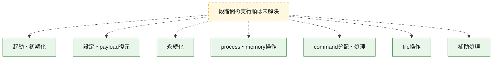
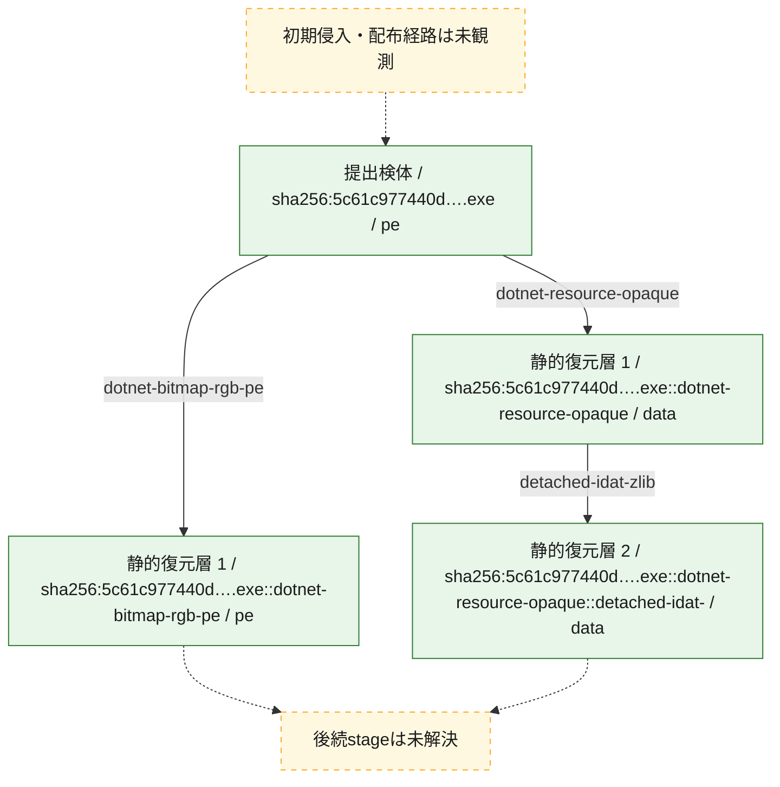
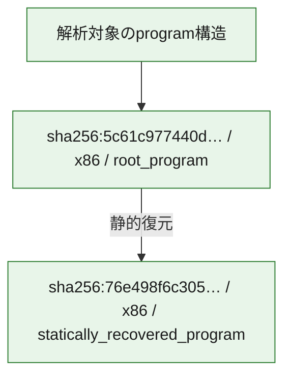

# 全体ロジック：5c61c977440dd7e870c1a63037558dd3fc2c41c8fd9d6ab67acff1c7d35abe01

代表関数の静的証跡から、起動・初期化、設定・payload復元、永続化、process・memory操作、command分配・処理、file操作の処理群を確認しました。

## 読み方

- phaseの掲載順は解析上の整理順です。observed_call_edgesがない段階間の実行順を断定しません。
- 図の実線は静的に観測した関係、点線と黄色のノードは未観測・未解決の関係を示します。
- 図は静的な要約であり、動的実行を再現するものではありません。
- 詳細な関数解説とfingerprintは[STATIC-LOGIC.md](STATIC-LOGIC.md)を参照してください。

## 静的可視化

### 実行フロー

### 感染チェーン

### モジュール関係

## 処理段階

### 1. 起動・初期化

entry pointから初期化と後続処理への移行を確認します。
確度: `confirmed_static_function_evidence`

- `5c61c977440dd7e870c1a63037558dd3fc2c41c8fd9d6ab67acff1c7d35abe01:cil:0x0600000b` — 初期化と主要処理への分岐を行う入口関数です。 状態: `succeeded`、選定理由: `entry_point`, `reviewed_call_centrality:8`

### 2. 設定・payload復元

設定、resource、payload、暗号化データの復元・変換を確認します。
確度: `confirmed_static_function_evidence`

- `76e498f6c3056812a6aa5dab98d61ce4f38fb688de62766a3d6b233f68a51f0b:cil:0x0600000f` — 暗号、hash、encoding、または復号処理に関係する関数です。 状態: `succeeded`、選定理由: `large_function:instructions=131`, `reviewed_call_centrality:4`, `role:cryptographic_transform`
- `76e498f6c3056812a6aa5dab98d61ce4f38fb688de62766a3d6b233f68a51f0b:cil:0x06000011` — 設定、resource、payloadなどの解析・変換を行う関数です。 状態: `succeeded`、選定理由: `reviewed_call_centrality:6`, `role:config_or_data_transform`
- `76e498f6c3056812a6aa5dab98d61ce4f38fb688de62766a3d6b233f68a51f0b:cil:0x06000045` — 暗号、hash、encoding、または復号処理に関係する関数です。 状態: `succeeded`、選定理由: `large_function:instructions=96`, `reviewed_call_centrality:14`, `role:cryptographic_transform`
- `76e498f6c3056812a6aa5dab98d61ce4f38fb688de62766a3d6b233f68a51f0b:cil:0x0600004a` — 暗号、hash、encoding、または復号処理に関係する関数です。 状態: `succeeded`、選定理由: `reviewed_call_centrality:2`, `role:cryptographic_transform`
- `76e498f6c3056812a6aa5dab98d61ce4f38fb688de62766a3d6b233f68a51f0b:cil:0x0600004b` — 暗号、hash、encoding、または復号処理に関係する関数です。 状態: `succeeded`、選定理由: `reviewed_call_centrality:2`, `role:cryptographic_transform`
- `76e498f6c3056812a6aa5dab98d61ce4f38fb688de62766a3d6b233f68a51f0b:cil:0x0600004f` — 暗号、hash、encoding、または復号処理に関係する関数です。 状態: `succeeded`、選定理由: `large_function:instructions=271`, `reviewed_call_centrality:2`, `role:cryptographic_transform`
- `76e498f6c3056812a6aa5dab98d61ce4f38fb688de62766a3d6b233f68a51f0b:cil:0x06000050` — 暗号、hash、encoding、または復号処理に関係する関数です。 状態: `succeeded`、選定理由: `reviewed_call_centrality:8`, `role:cryptographic_transform`
- `76e498f6c3056812a6aa5dab98d61ce4f38fb688de62766a3d6b233f68a51f0b:cil:0x06000052` — 暗号、hash、encoding、または復号処理に関係する関数です。 状態: `succeeded`、選定理由: `reviewed_call_centrality:8`, `role:cryptographic_transform`
- `76e498f6c3056812a6aa5dab98d61ce4f38fb688de62766a3d6b233f68a51f0b:cil:0x06000056` — 設定、resource、payloadなどの解析・変換を行う関数です。 状態: `succeeded`、選定理由: `large_function:instructions=601`, `reviewed_call_centrality:72`, `role:config_or_data_transform`
- `76e498f6c3056812a6aa5dab98d61ce4f38fb688de62766a3d6b233f68a51f0b:cil:0x0600005a` — 設定、resource、payloadなどの解析・変換を行う関数です。 状態: `succeeded`、選定理由: `large_function:instructions=148`, `reviewed_call_centrality:44`, `role:config_or_data_transform`
- `76e498f6c3056812a6aa5dab98d61ce4f38fb688de62766a3d6b233f68a51f0b:cil:0x0600005b` — 暗号、hash、encoding、または復号処理に関係する関数です。 状態: `succeeded`、選定理由: `reviewed_call_centrality:8`, `role:cryptographic_transform`
- `76e498f6c3056812a6aa5dab98d61ce4f38fb688de62766a3d6b233f68a51f0b:cil:0x06000062` — 暗号、hash、encoding、または復号処理に関係する関数です。 状態: `succeeded`、選定理由: `reviewed_call_centrality:14`, `role:cryptographic_transform`
- `76e498f6c3056812a6aa5dab98d61ce4f38fb688de62766a3d6b233f68a51f0b:cil:0x06000063` — 暗号、hash、encoding、または復号処理に関係する関数です。 状態: `succeeded`、選定理由: `reviewed_call_centrality:14`, `role:cryptographic_transform`
- `76e498f6c3056812a6aa5dab98d61ce4f38fb688de62766a3d6b233f68a51f0b:cil:0x06000064` — 暗号、hash、encoding、または復号処理に関係する関数です。 状態: `succeeded`、選定理由: `reviewed_call_centrality:14`, `role:cryptographic_transform`
- `76e498f6c3056812a6aa5dab98d61ce4f38fb688de62766a3d6b233f68a51f0b:cil:0x06000065` — 暗号、hash、encoding、または復号処理に関係する関数です。 状態: `succeeded`、選定理由: `reviewed_call_centrality:14`, `role:cryptographic_transform`
- `76e498f6c3056812a6aa5dab98d61ce4f38fb688de62766a3d6b233f68a51f0b:cil:0x06000066` — 暗号、hash、encoding、または復号処理に関係する関数です。 状態: `succeeded`、選定理由: `reviewed_call_centrality:14`, `role:cryptographic_transform`
- `76e498f6c3056812a6aa5dab98d61ce4f38fb688de62766a3d6b233f68a51f0b:cil:0x06000067` — 暗号、hash、encoding、または復号処理に関係する関数です。 状態: `succeeded`、選定理由: `reviewed_call_centrality:14`, `role:cryptographic_transform`
- `76e498f6c3056812a6aa5dab98d61ce4f38fb688de62766a3d6b233f68a51f0b:cil:0x0600006c` — 設定、resource、payloadなどの解析・変換を行う関数です。 状態: `succeeded`、選定理由: `reviewed_call_centrality:22`, `role:config_or_data_transform`
- `76e498f6c3056812a6aa5dab98d61ce4f38fb688de62766a3d6b233f68a51f0b:cil:0x0600007f` — 暗号、hash、encoding、または復号処理に関係する関数です。 状態: `succeeded`、選定理由: `reviewed_call_centrality:30`, `role:cryptographic_transform`
- `76e498f6c3056812a6aa5dab98d61ce4f38fb688de62766a3d6b233f68a51f0b:cil:0x060000ab` — 暗号、hash、encoding、または復号処理に関係する関数です。 状態: `succeeded`、選定理由: `large_function:instructions=1063`, `reviewed_call_centrality:8`, `role:cryptographic_transform`
- `5c61c977440dd7e870c1a63037558dd3fc2c41c8fd9d6ab67acff1c7d35abe01:cil:0x06000009` — 暗号、hash、encoding、または復号処理に関係する関数です。 状態: `succeeded`、選定理由: `reviewed_call_centrality:4`, `role:cryptographic_transform`
- `5c61c977440dd7e870c1a63037558dd3fc2c41c8fd9d6ab67acff1c7d35abe01:cil:0x0600001e` — 設定、resource、payloadなどの解析・変換を行う関数です。 状態: `succeeded`、選定理由: `reviewed_call_centrality:8`, `role:config_or_data_transform`
- `5c61c977440dd7e870c1a63037558dd3fc2c41c8fd9d6ab67acff1c7d35abe01:cil:0x0600001f` — 設定、resource、payloadなどの解析・変換を行う関数です。 状態: `succeeded`、選定理由: `large_function:instructions=72`, `reviewed_call_centrality:6`, `role:config_or_data_transform`
- `5c61c977440dd7e870c1a63037558dd3fc2c41c8fd9d6ab67acff1c7d35abe01:cil:0x06000042` — 設定、resource、payloadなどの解析・変換を行う関数です。 状態: `succeeded`、選定理由: `reviewed_call_centrality:2`, `role:config_or_data_transform`
- `5c61c977440dd7e870c1a63037558dd3fc2c41c8fd9d6ab67acff1c7d35abe01:cil:0x06000043` — 設定、resource、payloadなどの解析・変換を行う関数です。 状態: `succeeded`、選定理由: `reviewed_call_centrality:6`, `role:config_or_data_transform`
- `5c61c977440dd7e870c1a63037558dd3fc2c41c8fd9d6ab67acff1c7d35abe01:cil:0x06000046` — 設定、resource、payloadなどの解析・変換を行う関数です。 状態: `succeeded`、選定理由: `reviewed_call_centrality:4`, `role:config_or_data_transform`
- `5c61c977440dd7e870c1a63037558dd3fc2c41c8fd9d6ab67acff1c7d35abe01:cil:0x06000047` — 設定、resource、payloadなどの解析・変換を行う関数です。 状態: `succeeded`、選定理由: `reviewed_call_centrality:4`, `role:config_or_data_transform`
- `5c61c977440dd7e870c1a63037558dd3fc2c41c8fd9d6ab67acff1c7d35abe01:cil:0x06000050` — 設定、resource、payloadなどの解析・変換を行う関数です。 状態: `succeeded`、選定理由: `large_function:instructions=193`, `reviewed_call_centrality:4`, `role:config_or_data_transform`
- `5c61c977440dd7e870c1a63037558dd3fc2c41c8fd9d6ab67acff1c7d35abe01:cil:0x06000051` — 設定、resource、payloadなどの解析・変換を行う関数です。 状態: `succeeded`、選定理由: `large_function:instructions=86`, `reviewed_call_centrality:4`, `role:config_or_data_transform`
- `5c61c977440dd7e870c1a63037558dd3fc2c41c8fd9d6ab67acff1c7d35abe01:cil:0x06000052` — 設定、resource、payloadなどの解析・変換を行う関数です。 状態: `succeeded`、選定理由: `large_function:instructions=147`, `reviewed_call_centrality:4`, `role:config_or_data_transform`
- `5c61c977440dd7e870c1a63037558dd3fc2c41c8fd9d6ab67acff1c7d35abe01:cil:0x06000053` — 設定、resource、payloadなどの解析・変換を行う関数です。 状態: `succeeded`、選定理由: `reviewed_call_centrality:2`, `role:config_or_data_transform`
- `5c61c977440dd7e870c1a63037558dd3fc2c41c8fd9d6ab67acff1c7d35abe01:cil:0x06000054` — 設定、resource、payloadなどの解析・変換を行う関数です。 状態: `succeeded`、選定理由: `reviewed_call_centrality:2`, `role:config_or_data_transform`
- `5c61c977440dd7e870c1a63037558dd3fc2c41c8fd9d6ab67acff1c7d35abe01:cil:0x06000055` — 設定、resource、payloadなどの解析・変換を行う関数です。 状態: `succeeded`、選定理由: `large_function:instructions=302`, `reviewed_call_centrality:46`, `role:config_or_data_transform`
- `5c61c977440dd7e870c1a63037558dd3fc2c41c8fd9d6ab67acff1c7d35abe01:cil:0x06000056` — 設定、resource、payloadなどの解析・変換を行う関数です。 状態: `succeeded`、選定理由: `reviewed_call_centrality:6`, `role:config_or_data_transform`
- `5c61c977440dd7e870c1a63037558dd3fc2c41c8fd9d6ab67acff1c7d35abe01:cil:0x0600005a` — 設定、resource、payloadなどの解析・変換を行う関数です。 状態: `succeeded`、選定理由: `reviewed_call_centrality:2`, `role:config_or_data_transform`
- `5c61c977440dd7e870c1a63037558dd3fc2c41c8fd9d6ab67acff1c7d35abe01:cil:0x0600005c` — 設定、resource、payloadなどの解析・変換を行う関数です。 状態: `succeeded`、選定理由: `reviewed_call_centrality:2`, `role:config_or_data_transform`
- `5c61c977440dd7e870c1a63037558dd3fc2c41c8fd9d6ab67acff1c7d35abe01:cil:0x0600005d` — 設定、resource、payloadなどの解析・変換を行う関数です。 状態: `succeeded`、選定理由: `reviewed_call_centrality:2`, `role:config_or_data_transform`
- `5c61c977440dd7e870c1a63037558dd3fc2c41c8fd9d6ab67acff1c7d35abe01:cil:0x0600005e` — 設定、resource、payloadなどの解析・変換を行う関数です。 状態: `succeeded`、選定理由: `reviewed_call_centrality:2`, `role:config_or_data_transform`
- `5c61c977440dd7e870c1a63037558dd3fc2c41c8fd9d6ab67acff1c7d35abe01:cil:0x0600005f` — 設定、resource、payloadなどの解析・変換を行う関数です。 状態: `succeeded`、選定理由: `large_function:instructions=106`, `reviewed_call_centrality:8`, `role:config_or_data_transform`
- `5c61c977440dd7e870c1a63037558dd3fc2c41c8fd9d6ab67acff1c7d35abe01:cil:0x06000060` — 設定、resource、payloadなどの解析・変換を行う関数です。 状態: `succeeded`、選定理由: `reviewed_call_centrality:6`, `role:config_or_data_transform`
- `5c61c977440dd7e870c1a63037558dd3fc2c41c8fd9d6ab67acff1c7d35abe01:cil:0x06000061` — 設定、resource、payloadなどの解析・変換を行う関数です。 状態: `succeeded`、選定理由: `reviewed_call_centrality:6`, `role:config_or_data_transform`
- `5c61c977440dd7e870c1a63037558dd3fc2c41c8fd9d6ab67acff1c7d35abe01:cil:0x06000062` — 設定、resource、payloadなどの解析・変換を行う関数です。 状態: `succeeded`、選定理由: `reviewed_call_centrality:4`, `role:config_or_data_transform`

### 3. 永続化

自動起動や永続化に関係する設定変更を確認します。
確度: `confirmed_static_function_evidence`

- `5c61c977440dd7e870c1a63037558dd3fc2c41c8fd9d6ab67acff1c7d35abe01:cil:0x06000039` — 自動起動または永続化に関係する処理を含む関数です。 状態: `succeeded`、選定理由: `large_function:instructions=107`, `reviewed_call_centrality:30`, `role:persistence`
- `5c61c977440dd7e870c1a63037558dd3fc2c41c8fd9d6ab67acff1c7d35abe01:cil:0x0600003a` — 自動起動または永続化に関係する処理を含む関数です。 状態: `succeeded`、選定理由: `large_function:instructions=105`, `reviewed_call_centrality:36`, `role:persistence`

### 4. process・memory操作

process、thread、module、memory操作と実行移行を確認します。
確度: `confirmed_static_function_evidence`

- `76e498f6c3056812a6aa5dab98d61ce4f38fb688de62766a3d6b233f68a51f0b:cil:0x06000033` — process、thread、module、またはmemory操作に関係する関数です。 状態: `succeeded`、選定理由: `large_function:instructions=240`, `reviewed_call_centrality:4`, `role:process_or_memory_operation`

### 5. command分配・処理

受信commandやtaskの解釈、分配、個別handlerへの移行を確認します。
確度: `confirmed_static_function_evidence`

- `76e498f6c3056812a6aa5dab98d61ce4f38fb688de62766a3d6b233f68a51f0b:cil:0x06000016` — commandの解釈、分配、または個別処理を担当する関数です。 状態: `succeeded`、選定理由: `large_function:instructions=287`, `reviewed_call_centrality:12`, `role:command_dispatch_or_handler`
- `76e498f6c3056812a6aa5dab98d61ce4f38fb688de62766a3d6b233f68a51f0b:cil:0x06000036` — commandの解釈、分配、または個別処理を担当する関数です。 状態: `succeeded`、選定理由: `large_function:instructions=2405`, `reviewed_call_centrality:32`, `role:command_dispatch_or_handler`
- `76e498f6c3056812a6aa5dab98d61ce4f38fb688de62766a3d6b233f68a51f0b:cil:0x0600008c` — commandの解釈、分配、または個別処理を担当する関数です。 状態: `succeeded`、選定理由: `reviewed_call_centrality:4`, `role:command_dispatch_or_handler`
- `5c61c977440dd7e870c1a63037558dd3fc2c41c8fd9d6ab67acff1c7d35abe01:cil:0x0600001c` — commandの解釈、分配、または個別処理を担当する関数です。 状態: `succeeded`、選定理由: `large_function:instructions=1726`, `reviewed_call_centrality:136`, `role:command_dispatch_or_handler`
- `5c61c977440dd7e870c1a63037558dd3fc2c41c8fd9d6ab67acff1c7d35abe01:cil:0x06000028` — commandの解釈、分配、または個別処理を担当する関数です。 状態: `succeeded`、選定理由: `large_function:instructions=2093`, `reviewed_call_centrality:110`, `role:command_dispatch_or_handler`
- `5c61c977440dd7e870c1a63037558dd3fc2c41c8fd9d6ab67acff1c7d35abe01:cil:0x06000033` — commandの解釈、分配、または個別処理を担当する関数です。 状態: `succeeded`、選定理由: `large_function:instructions=1579`, `reviewed_call_centrality:94`, `role:command_dispatch_or_handler`
- `5c61c977440dd7e870c1a63037558dd3fc2c41c8fd9d6ab67acff1c7d35abe01:cil:0x06000041` — commandの解釈、分配、または個別処理を担当する関数です。 状態: `succeeded`、選定理由: `large_function:instructions=1519`, `reviewed_call_centrality:84`, `role:command_dispatch_or_handler`

### 6. file操作

fileやdirectoryの作成、読書き、削除を確認します。
確度: `confirmed_static_function_evidence`

- `76e498f6c3056812a6aa5dab98d61ce4f38fb688de62766a3d6b233f68a51f0b:cil:0x06000030` — fileまたはdirectoryの読書き・管理に関係する関数です。 状態: `succeeded`、選定理由: `large_function:instructions=276`, `reviewed_call_centrality:10`, `role:file_operation`
- `76e498f6c3056812a6aa5dab98d61ce4f38fb688de62766a3d6b233f68a51f0b:cil:0x06000031` — fileまたはdirectoryの読書き・管理に関係する関数です。 状態: `succeeded`、選定理由: `large_function:instructions=177`, `reviewed_call_centrality:8`, `role:file_operation`
- `76e498f6c3056812a6aa5dab98d61ce4f38fb688de62766a3d6b233f68a51f0b:cil:0x06000053` — fileまたはdirectoryの読書き・管理に関係する関数です。 状態: `succeeded`、選定理由: `reviewed_call_centrality:4`, `role:file_operation`
- `76e498f6c3056812a6aa5dab98d61ce4f38fb688de62766a3d6b233f68a51f0b:cil:0x06000055` — fileまたはdirectoryの読書き・管理に関係する関数です。 状態: `succeeded`、選定理由: `reviewed_call_centrality:6`, `role:file_operation`
- `76e498f6c3056812a6aa5dab98d61ce4f38fb688de62766a3d6b233f68a51f0b:cil:0x0600005f` — fileまたはdirectoryの読書き・管理に関係する関数です。 状態: `succeeded`、選定理由: `large_function:instructions=67`, `reviewed_call_centrality:18`, `role:file_operation`
- `76e498f6c3056812a6aa5dab98d61ce4f38fb688de62766a3d6b233f68a51f0b:cil:0x06000069` — fileまたはdirectoryの読書き・管理に関係する関数です。 状態: `succeeded`、選定理由: `reviewed_call_centrality:8`, `role:file_operation`
- `76e498f6c3056812a6aa5dab98d61ce4f38fb688de62766a3d6b233f68a51f0b:cil:0x0600008a` — fileまたはdirectoryの読書き・管理に関係する関数です。 状態: `succeeded`、選定理由: `reviewed_call_centrality:4`, `role:file_operation`
- `5c61c977440dd7e870c1a63037558dd3fc2c41c8fd9d6ab67acff1c7d35abe01:cil:0x06000037` — fileまたはdirectoryの読書き・管理に関係する関数です。 状態: `succeeded`、選定理由: `reviewed_call_centrality:20`, `role:file_operation`
- `5c61c977440dd7e870c1a63037558dd3fc2c41c8fd9d6ab67acff1c7d35abe01:cil:0x06000038` — fileまたはdirectoryの読書き・管理に関係する関数です。 状態: `succeeded`、選定理由: `reviewed_call_centrality:20`, `role:file_operation`

### 7. 補助処理

主要処理を支える一般内部関数またはlibrary処理を確認します。
確度: `confirmed_static_function_evidence`

- `76e498f6c3056812a6aa5dab98d61ce4f38fb688de62766a3d6b233f68a51f0b:cil:0x06000047` — 検体内部の一般処理を実装する関数です。 状態: `succeeded`、選定理由: `large_function:instructions=821`, `reviewed_call_centrality:12`
- `5c61c977440dd7e870c1a63037558dd3fc2c41c8fd9d6ab67acff1c7d35abe01:cil:0x06000013` — 検体内部の一般処理を実装する関数です。 状態: `succeeded`、選定理由: `large_function:instructions=480`, `reviewed_call_centrality:52`

## 観測したcall関係

- 代表関数間で直接解決できた呼出関係はありません。

## 解析範囲と制約

- 選定外関数は全体inventoryへ残しますが、関数本体の個別解説対象にはしていません。
- indirect call、難読化、packer、VM、壊れたcontrol flowによりcall関係が欠落する場合があります。
- 文書は静的解析に基づき、検体実行や外部通信による動的確認は行っていません。
