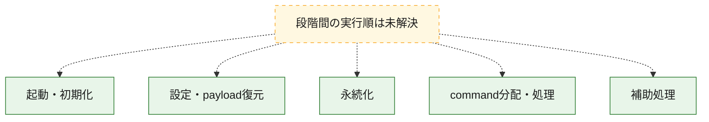
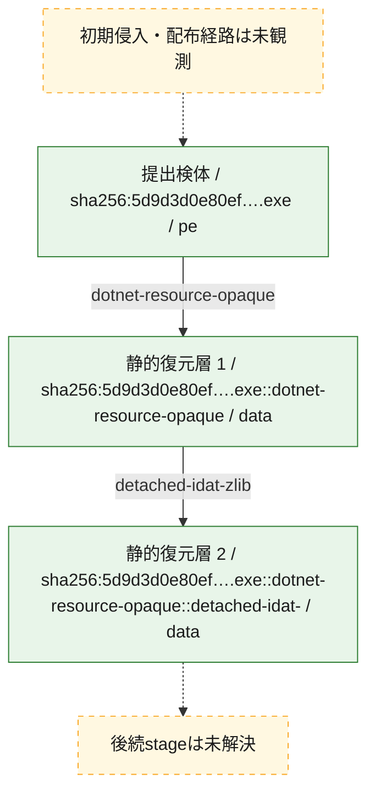
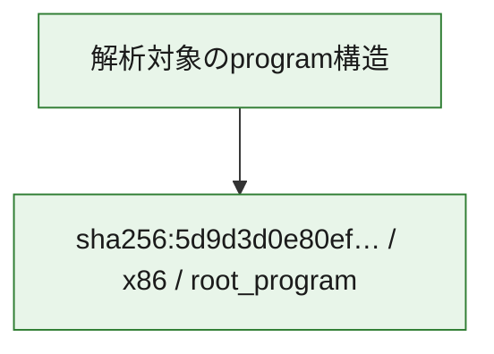

# 全体ロジック：5d9d3d0e80ef2f08455bc4c451da1a66853c3ca96e80838b139449460bd63abf

代表関数の静的証跡から、起動・初期化、設定・payload復元、永続化、command分配・処理の処理群を確認しました。

## 読み方

- phaseの掲載順は解析上の整理順です。observed_call_edgesがない段階間の実行順を断定しません。
- 図の実線は静的に観測した関係、点線と黄色のノードは未観測・未解決の関係を示します。
- 図は静的な要約であり、動的実行を再現するものではありません。
- 詳細な関数解説とfingerprintは[STATIC-LOGIC.md](STATIC-LOGIC.md)を参照してください。

## 静的可視化

### 実行フロー

### 感染チェーン

### モジュール関係

## 処理段階

### 1. 起動・初期化

entry pointから初期化と後続処理への移行を確認します。
確度: `confirmed_static_function_evidence`

- `5d9d3d0e80ef2f08455bc4c451da1a66853c3ca96e80838b139449460bd63abf:cil:0x06000003` — 初期化と主要処理への分岐を行う入口関数です。 状態: `succeeded`、選定理由: `entry_point`, `reviewed_call_centrality:8`

### 2. 設定・payload復元

設定、resource、payload、暗号化データの復元・変換を確認します。
確度: `confirmed_static_function_evidence`

- `5d9d3d0e80ef2f08455bc4c451da1a66853c3ca96e80838b139449460bd63abf:cil:0x06000020` — 設定、resource、payloadなどの解析・変換を行う関数です。 状態: `succeeded`、選定理由: `large_function:instructions=130`, `reviewed_call_centrality:28`, `role:config_or_data_transform`
- `5d9d3d0e80ef2f08455bc4c451da1a66853c3ca96e80838b139449460bd63abf:cil:0x0600003e` — 設定、resource、payloadなどの解析・変換を行う関数です。 状態: `succeeded`、選定理由: `reviewed_call_centrality:2`, `role:config_or_data_transform`
- `5d9d3d0e80ef2f08455bc4c451da1a66853c3ca96e80838b139449460bd63abf:cil:0x0600003f` — 設定、resource、payloadなどの解析・変換を行う関数です。 状態: `succeeded`、選定理由: `reviewed_call_centrality:6`, `role:config_or_data_transform`
- `5d9d3d0e80ef2f08455bc4c451da1a66853c3ca96e80838b139449460bd63abf:cil:0x06000040` — 設定、resource、payloadなどの解析・変換を行う関数です。 状態: `succeeded`、選定理由: `role:config_or_data_transform`
- `5d9d3d0e80ef2f08455bc4c451da1a66853c3ca96e80838b139449460bd63abf:cil:0x06000041` — 設定、resource、payloadなどの解析・変換を行う関数です。 状態: `succeeded`、選定理由: `role:config_or_data_transform`
- `5d9d3d0e80ef2f08455bc4c451da1a66853c3ca96e80838b139449460bd63abf:cil:0x06000042` — 設定、resource、payloadなどの解析・変換を行う関数です。 状態: `succeeded`、選定理由: `reviewed_call_centrality:4`, `role:config_or_data_transform`
- `5d9d3d0e80ef2f08455bc4c451da1a66853c3ca96e80838b139449460bd63abf:cil:0x06000043` — 設定、resource、payloadなどの解析・変換を行う関数です。 状態: `succeeded`、選定理由: `reviewed_call_centrality:4`, `role:config_or_data_transform`
- `5d9d3d0e80ef2f08455bc4c451da1a66853c3ca96e80838b139449460bd63abf:cil:0x06000044` — 暗号、hash、encoding、または復号処理に関係する関数です。 状態: `succeeded`、選定理由: `large_function:instructions=545`, `reviewed_call_centrality:26`, `role:cryptographic_transform`

### 3. 永続化

自動起動や永続化に関係する設定変更を確認します。
確度: `confirmed_static_function_evidence`

- `5d9d3d0e80ef2f08455bc4c451da1a66853c3ca96e80838b139449460bd63abf:cil:0x06000038` — 自動起動または永続化に関係する処理を含む関数です。 状態: `succeeded`、選定理由: `large_function:instructions=456`, `reviewed_call_centrality:64`, `role:persistence`

### 4. command分配・処理

受信commandやtaskの解釈、分配、個別handlerへの移行を確認します。
確度: `confirmed_static_function_evidence`

- `5d9d3d0e80ef2f08455bc4c451da1a66853c3ca96e80838b139449460bd63abf:cil:0x06000019` — commandの解釈、分配、または個別処理を担当する関数です。 状態: `succeeded`、選定理由: `large_function:instructions=1327`, `reviewed_call_centrality:138`, `role:command_dispatch_or_handler`
- `5d9d3d0e80ef2f08455bc4c451da1a66853c3ca96e80838b139449460bd63abf:cil:0x06000025` — commandの解釈、分配、または個別処理を担当する関数です。 状態: `succeeded`、選定理由: `large_function:instructions=1657`, `reviewed_call_centrality:96`, `role:command_dispatch_or_handler`
- `5d9d3d0e80ef2f08455bc4c451da1a66853c3ca96e80838b139449460bd63abf:cil:0x06000026` — commandの解釈、分配、または個別処理を担当する関数です。 状態: `succeeded`、選定理由: `reviewed_call_centrality:20`, `role:command_dispatch_or_handler`
- `5d9d3d0e80ef2f08455bc4c451da1a66853c3ca96e80838b139449460bd63abf:cil:0x0600002d` — commandの解釈、分配、または個別処理を担当する関数です。 状態: `succeeded`、選定理由: `large_function:instructions=537`, `reviewed_call_centrality:70`, `role:command_dispatch_or_handler`
- `5d9d3d0e80ef2f08455bc4c451da1a66853c3ca96e80838b139449460bd63abf:cil:0x0600002e` — commandの解釈、分配、または個別処理を担当する関数です。 状態: `succeeded`、選定理由: `large_function:instructions=115`, `reviewed_call_centrality:22`, `role:command_dispatch_or_handler`
- `5d9d3d0e80ef2f08455bc4c451da1a66853c3ca96e80838b139449460bd63abf:cil:0x06000033` — commandの解釈、分配、または個別処理を担当する関数です。 状態: `succeeded`、選定理由: `large_function:instructions=1158`, `reviewed_call_centrality:116`, `role:command_dispatch_or_handler`
- `5d9d3d0e80ef2f08455bc4c451da1a66853c3ca96e80838b139449460bd63abf:cil:0x0600003d` — commandの解釈、分配、または個別処理を担当する関数です。 状態: `succeeded`、選定理由: `large_function:instructions=1598`, `reviewed_call_centrality:86`, `role:command_dispatch_or_handler`

### 5. 補助処理

主要処理を支える一般内部関数またはlibrary処理を確認します。
確度: `confirmed_static_function_evidence`

- `5d9d3d0e80ef2f08455bc4c451da1a66853c3ca96e80838b139449460bd63abf:cil:0x06000004` — 検体内部の一般処理を実装する関数です。 状態: `succeeded`、選定理由: `large_function:instructions=194`, `reviewed_call_centrality:14`
- `5d9d3d0e80ef2f08455bc4c451da1a66853c3ca96e80838b139449460bd63abf:cil:0x06000005` — 検体内部の一般処理を実装する関数です。 状態: `succeeded`、選定理由: `large_function:instructions=571`, `reviewed_call_centrality:12`
- `5d9d3d0e80ef2f08455bc4c451da1a66853c3ca96e80838b139449460bd63abf:cil:0x06000009` — 検体内部の一般処理を実装する関数です。 状態: `succeeded`、選定理由: `reviewed_call_centrality:30`
- `5d9d3d0e80ef2f08455bc4c451da1a66853c3ca96e80838b139449460bd63abf:cil:0x0600000b` — 検体内部の一般処理を実装する関数です。 状態: `succeeded`、選定理由: `large_function:instructions=123`, `reviewed_call_centrality:20`
- `5d9d3d0e80ef2f08455bc4c451da1a66853c3ca96e80838b139449460bd63abf:cil:0x0600000c` — 検体内部の一般処理を実装する関数です。 状態: `succeeded`、選定理由: `large_function:instructions=116`, `reviewed_call_centrality:20`
- `5d9d3d0e80ef2f08455bc4c451da1a66853c3ca96e80838b139449460bd63abf:cil:0x0600000d` — 検体内部の一般処理を実装する関数です。 状態: `succeeded`、選定理由: `large_function:instructions=294`, `reviewed_call_centrality:24`
- `5d9d3d0e80ef2f08455bc4c451da1a66853c3ca96e80838b139449460bd63abf:cil:0x06000010` — 検体内部の一般処理を実装する関数です。 状態: `succeeded`、選定理由: `large_function:instructions=112`, `reviewed_call_centrality:24`
- `5d9d3d0e80ef2f08455bc4c451da1a66853c3ca96e80838b139449460bd63abf:cil:0x06000011` — 検体内部の一般処理を実装する関数です。 状態: `succeeded`、選定理由: `large_function:instructions=922`, `reviewed_call_centrality:80`
- `5d9d3d0e80ef2f08455bc4c451da1a66853c3ca96e80838b139449460bd63abf:cil:0x0600001d` — 検体内部の一般処理を実装する関数です。 状態: `succeeded`、選定理由: `reviewed_call_centrality:30`
- `5d9d3d0e80ef2f08455bc4c451da1a66853c3ca96e80838b139449460bd63abf:cil:0x0600001e` — 検体内部の一般処理を実装する関数です。 状態: `succeeded`、選定理由: `large_function:instructions=140`, `reviewed_call_centrality:26`
- `5d9d3d0e80ef2f08455bc4c451da1a66853c3ca96e80838b139449460bd63abf:cil:0x06000028` — 検体内部の一般処理を実装する関数です。 状態: `succeeded`、選定理由: `large_function:instructions=95`, `reviewed_call_centrality:16`
- `5d9d3d0e80ef2f08455bc4c451da1a66853c3ca96e80838b139449460bd63abf:cil:0x06000029` — 検体内部の一般処理を実装する関数です。 状態: `succeeded`、選定理由: `large_function:instructions=154`, `reviewed_call_centrality:38`
- `5d9d3d0e80ef2f08455bc4c451da1a66853c3ca96e80838b139449460bd63abf:cil:0x0600002a` — 検体内部の一般処理を実装する関数です。 状態: `succeeded`、選定理由: `large_function:instructions=443`, `reviewed_call_centrality:38`
- `5d9d3d0e80ef2f08455bc4c451da1a66853c3ca96e80838b139449460bd63abf:cil:0x06000036` — 検体内部の一般処理を実装する関数です。 状態: `succeeded`、選定理由: `large_function:instructions=156`, `reviewed_call_centrality:28`
- `5d9d3d0e80ef2f08455bc4c451da1a66853c3ca96e80838b139449460bd63abf:cil:0x06000058` — 検体内部の一般処理を実装する関数です。 状態: `succeeded`、選定理由: `large_function:instructions=276`, `reviewed_call_centrality:14`

## 観測したcall関係

- 代表関数間で直接解決できた呼出関係はありません。

## 解析範囲と制約

- 選定外関数は全体inventoryへ残しますが、関数本体の個別解説対象にはしていません。
- indirect call、難読化、packer、VM、壊れたcontrol flowによりcall関係が欠落する場合があります。
- 文書は静的解析に基づき、検体実行や外部通信による動的確認は行っていません。
