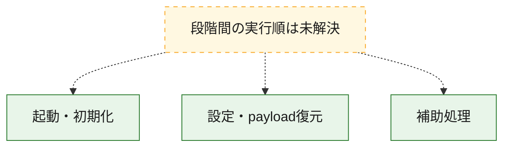
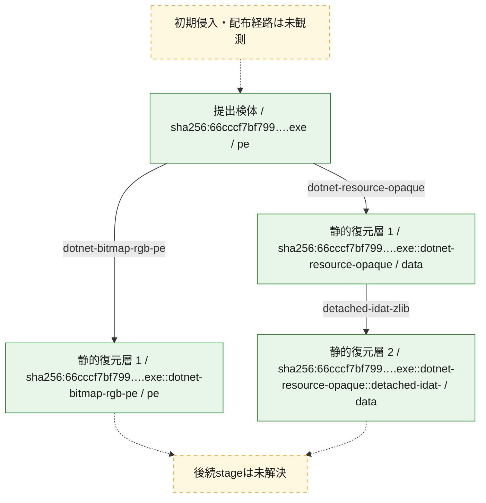
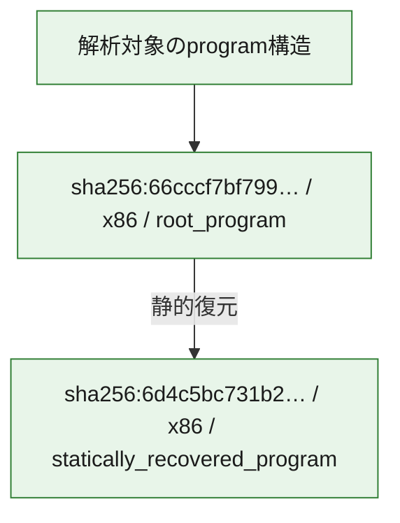

# 全体ロジック：66cccf7bf799dac1ccec9e512506343116ed04d4e7d076820305fdfcaa06f384

代表関数の静的証跡から、起動・初期化、設定・payload復元の処理群を確認しました。

## 読み方

- phaseの掲載順は解析上の整理順です。observed_call_edgesがない段階間の実行順を断定しません。
- 図の実線は静的に観測した関係、点線と黄色のノードは未観測・未解決の関係を示します。
- 図は静的な要約であり、動的実行を再現するものではありません。
- 詳細な関数解説とfingerprintは[STATIC-LOGIC.md](STATIC-LOGIC.md)を参照してください。

## 静的可視化

### 実行フロー

### 感染チェーン

### モジュール関係

## 処理段階

### 1. 起動・初期化

entry pointから初期化と後続処理への移行を確認します。
確度: `confirmed_static_function_evidence`

- `66cccf7bf799dac1ccec9e512506343116ed04d4e7d076820305fdfcaa06f384:cil:0x06000001` — 初期化と主要処理への分岐を行う入口関数です。 状態: `succeeded`、選定理由: `entry_point`, `reviewed_call_centrality:8`

### 2. 設定・payload復元

設定、resource、payload、暗号化データの復元・変換を確認します。
確度: `confirmed_static_function_evidence`

- `66cccf7bf799dac1ccec9e512506343116ed04d4e7d076820305fdfcaa06f384:cil:0x06000040` — 設定、resource、payloadなどの解析・変換を行う関数です。 状態: `succeeded`、選定理由: `reviewed_call_centrality:6`, `role:config_or_data_transform`

### 3. 補助処理

主要処理を支える一般内部関数またはlibrary処理を確認します。
確度: `confirmed_static_function_evidence`

- `6d4c5bc731b2e23fa90f0d8e916c17f57c4bf3d38278b1d02bb560cb19b85091:cil:0x06000002` — compiler生成処理または汎用library処理とみられる関数です。 状態: `succeeded`、選定理由: `large_function:instructions=69`, `reviewed_call_centrality:24`
- `6d4c5bc731b2e23fa90f0d8e916c17f57c4bf3d38278b1d02bb560cb19b85091:cil:0x06000003` — 検体内部の一般処理を実装する関数です。 状態: `succeeded`、選定理由: `reviewed_call_centrality:18`
- `6d4c5bc731b2e23fa90f0d8e916c17f57c4bf3d38278b1d02bb560cb19b85091:cil:0x0600000c` — 検体内部の一般処理を実装する関数です。 状態: `succeeded`、選定理由: `reviewed_call_centrality:8`
- `6d4c5bc731b2e23fa90f0d8e916c17f57c4bf3d38278b1d02bb560cb19b85091:cil:0x0600000f` — 検体内部の一般処理を実装する関数です。 状態: `succeeded`、選定理由: `large_function:instructions=77`, `reviewed_call_centrality:14`
- `6d4c5bc731b2e23fa90f0d8e916c17f57c4bf3d38278b1d02bb560cb19b85091:cil:0x06000010` — 検体内部の一般処理を実装する関数です。 状態: `succeeded`、選定理由: `reviewed_call_centrality:10`
- `6d4c5bc731b2e23fa90f0d8e916c17f57c4bf3d38278b1d02bb560cb19b85091:cil:0x06000011` — 検体内部の一般処理を実装する関数です。 状態: `succeeded`、選定理由: `large_function:instructions=144`, `reviewed_call_centrality:14`
- `6d4c5bc731b2e23fa90f0d8e916c17f57c4bf3d38278b1d02bb560cb19b85091:cil:0x06000012` — 検体内部の一般処理を実装する関数です。 状態: `succeeded`、選定理由: `large_function:instructions=116`, `reviewed_call_centrality:8`
- `6d4c5bc731b2e23fa90f0d8e916c17f57c4bf3d38278b1d02bb560cb19b85091:cil:0x06000013` — 検体内部の一般処理を実装する関数です。 状態: `succeeded`、選定理由: `large_function:instructions=133`, `reviewed_call_centrality:10`
- `6d4c5bc731b2e23fa90f0d8e916c17f57c4bf3d38278b1d02bb560cb19b85091:cil:0x06000015` — 検体内部の一般処理を実装する関数です。 状態: `succeeded`、選定理由: `large_function:instructions=303`, `reviewed_call_centrality:58`
- `6d4c5bc731b2e23fa90f0d8e916c17f57c4bf3d38278b1d02bb560cb19b85091:cil:0x06000016` — 検体内部の一般処理を実装する関数です。 状態: `succeeded`、選定理由: `large_function:instructions=243`, `reviewed_call_centrality:8`
- `6d4c5bc731b2e23fa90f0d8e916c17f57c4bf3d38278b1d02bb560cb19b85091:cil:0x06000017` — 検体内部の一般処理を実装する関数です。 状態: `succeeded`、選定理由: `large_function:instructions=141`, `reviewed_call_centrality:24`
- `6d4c5bc731b2e23fa90f0d8e916c17f57c4bf3d38278b1d02bb560cb19b85091:cil:0x06000019` — 検体内部の一般処理を実装する関数です。 状態: `succeeded`、選定理由: `large_function:instructions=166`, `reviewed_call_centrality:14`
- `6d4c5bc731b2e23fa90f0d8e916c17f57c4bf3d38278b1d02bb560cb19b85091:cil:0x0600001b` — 検体内部の一般処理を実装する関数です。 状態: `succeeded`、選定理由: `large_function:instructions=117`, `reviewed_call_centrality:18`
- `6d4c5bc731b2e23fa90f0d8e916c17f57c4bf3d38278b1d02bb560cb19b85091:cil:0x0600001f` — 検体内部の一般処理を実装する関数です。 状態: `succeeded`、選定理由: `large_function:instructions=230`, `reviewed_call_centrality:20`
- `6d4c5bc731b2e23fa90f0d8e916c17f57c4bf3d38278b1d02bb560cb19b85091:cil:0x06000021` — 検体内部の一般処理を実装する関数です。 状態: `succeeded`、選定理由: `large_function:instructions=181`, `reviewed_call_centrality:24`
- `6d4c5bc731b2e23fa90f0d8e916c17f57c4bf3d38278b1d02bb560cb19b85091:cil:0x06000023` — 検体内部の一般処理を実装する関数です。 状態: `succeeded`、選定理由: `large_function:instructions=137`, `reviewed_call_centrality:18`
- `6d4c5bc731b2e23fa90f0d8e916c17f57c4bf3d38278b1d02bb560cb19b85091:cil:0x06000024` — 検体内部の一般処理を実装する関数です。 状態: `succeeded`、選定理由: `large_function:instructions=128`, `reviewed_call_centrality:14`
- `6d4c5bc731b2e23fa90f0d8e916c17f57c4bf3d38278b1d02bb560cb19b85091:cil:0x06000025` — 検体内部の一般処理を実装する関数です。 状態: `succeeded`、選定理由: `large_function:instructions=101`, `reviewed_call_centrality:16`
- `6d4c5bc731b2e23fa90f0d8e916c17f57c4bf3d38278b1d02bb560cb19b85091:cil:0x06000026` — 検体内部の一般処理を実装する関数です。 状態: `succeeded`、選定理由: `large_function:instructions=173`, `reviewed_call_centrality:12`
- `6d4c5bc731b2e23fa90f0d8e916c17f57c4bf3d38278b1d02bb560cb19b85091:cil:0x06000028` — 検体内部の一般処理を実装する関数です。 状態: `succeeded`、選定理由: `large_function:instructions=125`, `reviewed_call_centrality:10`
- `6d4c5bc731b2e23fa90f0d8e916c17f57c4bf3d38278b1d02bb560cb19b85091:cil:0x0600002d` — 検体内部の一般処理を実装する関数です。 状態: `succeeded`、選定理由: `large_function:instructions=96`, `reviewed_call_centrality:8`
- `6d4c5bc731b2e23fa90f0d8e916c17f57c4bf3d38278b1d02bb560cb19b85091:cil:0x0600002e` — 検体内部の一般処理を実装する関数です。 状態: `succeeded`、選定理由: `reviewed_call_centrality:14`
- `6d4c5bc731b2e23fa90f0d8e916c17f57c4bf3d38278b1d02bb560cb19b85091:cil:0x0600002f` — 検体内部の一般処理を実装する関数です。 状態: `succeeded`、選定理由: `large_function:instructions=215`, `reviewed_call_centrality:16`
- `6d4c5bc731b2e23fa90f0d8e916c17f57c4bf3d38278b1d02bb560cb19b85091:cil:0x06000030` — 検体内部の一般処理を実装する関数です。 状態: `succeeded`、選定理由: `large_function:instructions=125`, `reviewed_call_centrality:18`
- `6d4c5bc731b2e23fa90f0d8e916c17f57c4bf3d38278b1d02bb560cb19b85091:cil:0x06000032` — 検体内部の一般処理を実装する関数です。 状態: `succeeded`、選定理由: `large_function:instructions=170`, `reviewed_call_centrality:8`
- `6d4c5bc731b2e23fa90f0d8e916c17f57c4bf3d38278b1d02bb560cb19b85091:cil:0x06000035` — 検体内部の一般処理を実装する関数です。 状態: `succeeded`、選定理由: `large_function:instructions=2760`, `reviewed_call_centrality:142`
- `6d4c5bc731b2e23fa90f0d8e916c17f57c4bf3d38278b1d02bb560cb19b85091:cil:0x06000038` — 検体内部の一般処理を実装する関数です。 状態: `succeeded`、選定理由: `reviewed_call_centrality:14`
- `6d4c5bc731b2e23fa90f0d8e916c17f57c4bf3d38278b1d02bb560cb19b85091:cil:0x06000039` — 検体内部の一般処理を実装する関数です。 状態: `succeeded`、選定理由: `reviewed_call_centrality:12`
- `6d4c5bc731b2e23fa90f0d8e916c17f57c4bf3d38278b1d02bb560cb19b85091:cil:0x0600003a` — 検体内部の一般処理を実装する関数です。 状態: `succeeded`、選定理由: `large_function:instructions=69`, `reviewed_call_centrality:12`
- `6d4c5bc731b2e23fa90f0d8e916c17f57c4bf3d38278b1d02bb560cb19b85091:cil:0x06000047` — 検体内部の一般処理を実装する関数です。 状態: `succeeded`、選定理由: `large_function:instructions=3353`, `reviewed_call_centrality:118`
- `6d4c5bc731b2e23fa90f0d8e916c17f57c4bf3d38278b1d02bb560cb19b85091:cil:0x0600007a` — 検体内部の一般処理を実装する関数です。 状態: `succeeded`、選定理由: `large_function:instructions=131`, `reviewed_call_centrality:8`
- `6d4c5bc731b2e23fa90f0d8e916c17f57c4bf3d38278b1d02bb560cb19b85091:cil:0x06000082` — 検体内部の一般処理を実装する関数です。 状態: `succeeded`、選定理由: `large_function:instructions=219`, `reviewed_call_centrality:6`
- `66cccf7bf799dac1ccec9e512506343116ed04d4e7d076820305fdfcaa06f384:cil:0x06000009` — 検体内部の一般処理を実装する関数です。 状態: `succeeded`、選定理由: `large_function:instructions=645`, `reviewed_call_centrality:82`
- `66cccf7bf799dac1ccec9e512506343116ed04d4e7d076820305fdfcaa06f384:cil:0x0600000e` — 検体内部の一般処理を実装する関数です。 状態: `succeeded`、選定理由: `large_function:instructions=236`, `reviewed_call_centrality:6`
- `66cccf7bf799dac1ccec9e512506343116ed04d4e7d076820305fdfcaa06f384:cil:0x0600000f` — 検体内部の一般処理を実装する関数です。 状態: `succeeded`、選定理由: `large_function:instructions=113`, `reviewed_call_centrality:26`
- `66cccf7bf799dac1ccec9e512506343116ed04d4e7d076820305fdfcaa06f384:cil:0x06000010` — 検体内部の一般処理を実装する関数です。 状態: `succeeded`、選定理由: `large_function:instructions=109`, `reviewed_call_centrality:24`
- `66cccf7bf799dac1ccec9e512506343116ed04d4e7d076820305fdfcaa06f384:cil:0x06000014` — 検体内部の一般処理を実装する関数です。 状態: `succeeded`、選定理由: `large_function:instructions=446`, `reviewed_call_centrality:24`
- `66cccf7bf799dac1ccec9e512506343116ed04d4e7d076820305fdfcaa06f384:cil:0x06000015` — 検体内部の一般処理を実装する関数です。 状態: `succeeded`、選定理由: `large_function:instructions=345`, `reviewed_call_centrality:28`
- `66cccf7bf799dac1ccec9e512506343116ed04d4e7d076820305fdfcaa06f384:cil:0x06000016` — 検体内部の一般処理を実装する関数です。 状態: `succeeded`、選定理由: `large_function:instructions=104`, `reviewed_call_centrality:8`
- `66cccf7bf799dac1ccec9e512506343116ed04d4e7d076820305fdfcaa06f384:cil:0x06000018` — 検体内部の一般処理を実装する関数です。 状態: `succeeded`、選定理由: `large_function:instructions=569`, `reviewed_call_centrality:86`
- `66cccf7bf799dac1ccec9e512506343116ed04d4e7d076820305fdfcaa06f384:cil:0x06000019` — compiler生成処理または汎用library処理とみられる関数です。 状態: `succeeded`、選定理由: `reviewed_call_centrality:10`
- `66cccf7bf799dac1ccec9e512506343116ed04d4e7d076820305fdfcaa06f384:cil:0x0600001b` — 検体内部の一般処理を実装する関数です。 状態: `succeeded`、選定理由: `large_function:instructions=349`, `reviewed_call_centrality:12`
- `66cccf7bf799dac1ccec9e512506343116ed04d4e7d076820305fdfcaa06f384:cil:0x0600001c` — 検体内部の一般処理を実装する関数です。 状態: `succeeded`、選定理由: `large_function:instructions=113`, `reviewed_call_centrality:26`
- `66cccf7bf799dac1ccec9e512506343116ed04d4e7d076820305fdfcaa06f384:cil:0x0600001d` — 検体内部の一般処理を実装する関数です。 状態: `succeeded`、選定理由: `large_function:instructions=109`, `reviewed_call_centrality:24`
- `66cccf7bf799dac1ccec9e512506343116ed04d4e7d076820305fdfcaa06f384:cil:0x06000021` — 検体内部の一般処理を実装する関数です。 状態: `succeeded`、選定理由: `large_function:instructions=66`, `reviewed_call_centrality:10`
- `66cccf7bf799dac1ccec9e512506343116ed04d4e7d076820305fdfcaa06f384:cil:0x06000024` — 検体内部の一般処理を実装する関数です。 状態: `succeeded`、選定理由: `large_function:instructions=503`, `reviewed_call_centrality:24`
- `66cccf7bf799dac1ccec9e512506343116ed04d4e7d076820305fdfcaa06f384:cil:0x06000025` — 検体内部の一般処理を実装する関数です。 状態: `succeeded`、選定理由: `large_function:instructions=422`, `reviewed_call_centrality:30`
- `66cccf7bf799dac1ccec9e512506343116ed04d4e7d076820305fdfcaa06f384:cil:0x06000028` — 検体内部の一般処理を実装する関数です。 状態: `succeeded`、選定理由: `large_function:instructions=757`, `reviewed_call_centrality:86`
- `66cccf7bf799dac1ccec9e512506343116ed04d4e7d076820305fdfcaa06f384:cil:0x0600002b` — 検体内部の一般処理を実装する関数です。 状態: `succeeded`、選定理由: `large_function:instructions=507`, `reviewed_call_centrality:12`
- `66cccf7bf799dac1ccec9e512506343116ed04d4e7d076820305fdfcaa06f384:cil:0x0600002c` — 検体内部の一般処理を実装する関数です。 状態: `succeeded`、選定理由: `large_function:instructions=113`, `reviewed_call_centrality:26`
- `66cccf7bf799dac1ccec9e512506343116ed04d4e7d076820305fdfcaa06f384:cil:0x0600002d` — 検体内部の一般処理を実装する関数です。 状態: `succeeded`、選定理由: `large_function:instructions=109`, `reviewed_call_centrality:24`
- `66cccf7bf799dac1ccec9e512506343116ed04d4e7d076820305fdfcaa06f384:cil:0x06000031` — 検体内部の一般処理を実装する関数です。 状態: `succeeded`、選定理由: `large_function:instructions=599`, `reviewed_call_centrality:30`
- `66cccf7bf799dac1ccec9e512506343116ed04d4e7d076820305fdfcaa06f384:cil:0x06000032` — 検体内部の一般処理を実装する関数です。 状態: `succeeded`、選定理由: `large_function:instructions=526`, `reviewed_call_centrality:28`
- `66cccf7bf799dac1ccec9e512506343116ed04d4e7d076820305fdfcaa06f384:cil:0x06000035` — 検体内部の一般処理を実装する関数です。 状態: `succeeded`、選定理由: `large_function:instructions=691`, `reviewed_call_centrality:86`
- `66cccf7bf799dac1ccec9e512506343116ed04d4e7d076820305fdfcaa06f384:cil:0x06000038` — 検体内部の一般処理を実装する関数です。 状態: `succeeded`、選定理由: `large_function:instructions=135`, `reviewed_call_centrality:32`
- `66cccf7bf799dac1ccec9e512506343116ed04d4e7d076820305fdfcaa06f384:cil:0x06000039` — 検体内部の一般処理を実装する関数です。 状態: `succeeded`、選定理由: `large_function:instructions=135`, `reviewed_call_centrality:10`
- `66cccf7bf799dac1ccec9e512506343116ed04d4e7d076820305fdfcaa06f384:cil:0x0600003a` — 検体内部の一般処理を実装する関数です。 状態: `succeeded`、選定理由: `large_function:instructions=199`, `reviewed_call_centrality:30`
- `66cccf7bf799dac1ccec9e512506343116ed04d4e7d076820305fdfcaa06f384:cil:0x0600003b` — 検体内部の一般処理を実装する関数です。 状態: `succeeded`、選定理由: `reviewed_call_centrality:16`
- `66cccf7bf799dac1ccec9e512506343116ed04d4e7d076820305fdfcaa06f384:cil:0x0600003e` — 検体内部の一般処理を実装する関数です。 状態: `succeeded`、選定理由: `large_function:instructions=863`, `reviewed_call_centrality:118`
- `66cccf7bf799dac1ccec9e512506343116ed04d4e7d076820305fdfcaa06f384:cil:0x0600004b` — 検体内部の一般処理を実装する関数です。 状態: `succeeded`、選定理由: `large_function:instructions=85`, `reviewed_call_centrality:10`
- `66cccf7bf799dac1ccec9e512506343116ed04d4e7d076820305fdfcaa06f384:cil:0x0600004d` — 検体内部の一般処理を実装する関数です。 状態: `succeeded`、選定理由: `large_function:instructions=68`, `reviewed_call_centrality:10`
- `66cccf7bf799dac1ccec9e512506343116ed04d4e7d076820305fdfcaa06f384:cil:0x0600004e` — 検体内部の一般処理を実装する関数です。 状態: `succeeded`、選定理由: `large_function:instructions=87`, `reviewed_call_centrality:16`

## 観測したcall関係

- 代表関数間で直接解決できた呼出関係はありません。

## 解析範囲と制約

- 選定外関数は全体inventoryへ残しますが、関数本体の個別解説対象にはしていません。
- indirect call、難読化、packer、VM、壊れたcontrol flowによりcall関係が欠落する場合があります。
- 文書は静的解析に基づき、検体実行や外部通信による動的確認は行っていません。
