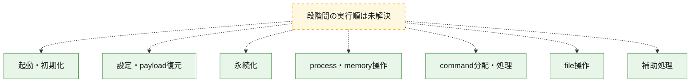
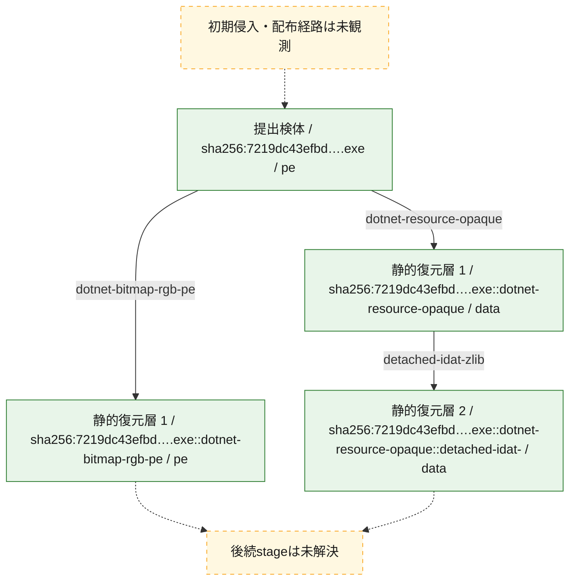
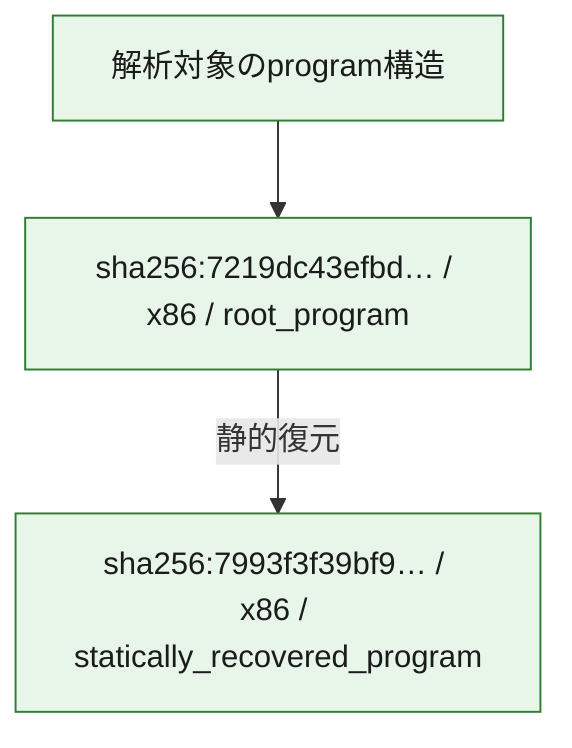

# 全体ロジック：7219dc43efbd5d57c3b8af838ef26b2426483259c1c7b36a6e4e1d3c574496e0

代表関数の静的証跡から、起動・初期化、設定・payload復元、永続化、process・memory操作、command分配・処理、file操作の処理群を確認しました。

## 読み方

- phaseの掲載順は解析上の整理順です。observed_call_edgesがない段階間の実行順を断定しません。
- 図の実線は静的に観測した関係、点線と黄色のノードは未観測・未解決の関係を示します。
- 図は静的な要約であり、動的実行を再現するものではありません。
- 詳細な関数解説とfingerprintは[STATIC-LOGIC.md](STATIC-LOGIC.md)を参照してください。

## 静的可視化

### 実行フロー

### 感染チェーン

### モジュール関係

## 処理段階

### 1. 起動・初期化

entry pointから初期化と後続処理への移行を確認します。
確度: `confirmed_static_function_evidence`

- `7219dc43efbd5d57c3b8af838ef26b2426483259c1c7b36a6e4e1d3c574496e0:cil:0x06000018` — 初期化と主要処理への分岐を行う入口関数です。 状態: `succeeded`、選定理由: `entry_point`, `reviewed_call_centrality:8`

### 2. 設定・payload復元

設定、resource、payload、暗号化データの復元・変換を確認します。
確度: `confirmed_static_function_evidence`

- `7993f3f39bf995971fca177dbfedab0008c1c5ad4b1a0197b760b46fbd744952:cil:0x06000003` — 暗号、hash、encoding、または復号処理に関係する関数です。 状態: `succeeded`、選定理由: `large_function:instructions=95`, `reviewed_call_centrality:2`, `role:cryptographic_transform`
- `7993f3f39bf995971fca177dbfedab0008c1c5ad4b1a0197b760b46fbd744952:cil:0x06000005` — 設定、resource、payloadなどの解析・変換を行う関数です。 状態: `succeeded`、選定理由: `reviewed_call_centrality:6`, `role:config_or_data_transform`
- `7993f3f39bf995971fca177dbfedab0008c1c5ad4b1a0197b760b46fbd744952:cil:0x0600003a` — 暗号、hash、encoding、または復号処理に関係する関数です。 状態: `succeeded`、選定理由: `reviewed_call_centrality:2`, `role:cryptographic_transform`
- `7993f3f39bf995971fca177dbfedab0008c1c5ad4b1a0197b760b46fbd744952:cil:0x06000068` — 暗号、hash、encoding、または復号処理に関係する関数です。 状態: `succeeded`、選定理由: `large_function:instructions=145`, `reviewed_call_centrality:18`, `role:cryptographic_transform`
- `7993f3f39bf995971fca177dbfedab0008c1c5ad4b1a0197b760b46fbd744952:cil:0x0600006a` — 設定、resource、payloadなどの解析・変換を行う関数です。 状態: `succeeded`、選定理由: `reviewed_call_centrality:8`, `role:config_or_data_transform`
- `7993f3f39bf995971fca177dbfedab0008c1c5ad4b1a0197b760b46fbd744952:cil:0x06000070` — 暗号、hash、encoding、または復号処理に関係する関数です。 状態: `succeeded`、選定理由: `large_function:instructions=64`, `role:cryptographic_transform`
- `7993f3f39bf995971fca177dbfedab0008c1c5ad4b1a0197b760b46fbd744952:cil:0x060000a1` — 暗号、hash、encoding、または復号処理に関係する関数です。 状態: `succeeded`、選定理由: `large_function:instructions=210`, `reviewed_call_centrality:32`, `role:cryptographic_transform`
- `7993f3f39bf995971fca177dbfedab0008c1c5ad4b1a0197b760b46fbd744952:cil:0x060000aa` — 暗号、hash、encoding、または復号処理に関係する関数です。 状態: `succeeded`、選定理由: `role:cryptographic_transform`
- `7219dc43efbd5d57c3b8af838ef26b2426483259c1c7b36a6e4e1d3c574496e0:cil:0x06000007` — 暗号、hash、encoding、または復号処理に関係する関数です。 状態: `succeeded`、選定理由: `reviewed_call_centrality:4`, `role:cryptographic_transform`
- `7219dc43efbd5d57c3b8af838ef26b2426483259c1c7b36a6e4e1d3c574496e0:cil:0x06000016` — 暗号、hash、encoding、または復号処理に関係する関数です。 状態: `succeeded`、選定理由: `large_function:instructions=79`, `reviewed_call_centrality:4`, `role:cryptographic_transform`
- `7219dc43efbd5d57c3b8af838ef26b2426483259c1c7b36a6e4e1d3c574496e0:cil:0x06000060` — 設定、resource、payloadなどの解析・変換を行う関数です。 状態: `succeeded`、選定理由: `reviewed_call_centrality:2`, `role:config_or_data_transform`
- `7219dc43efbd5d57c3b8af838ef26b2426483259c1c7b36a6e4e1d3c574496e0:cil:0x06000061` — 設定、resource、payloadなどの解析・変換を行う関数です。 状態: `succeeded`、選定理由: `reviewed_call_centrality:6`, `role:config_or_data_transform`
- `7219dc43efbd5d57c3b8af838ef26b2426483259c1c7b36a6e4e1d3c574496e0:cil:0x06000062` — 設定、resource、payloadなどの解析・変換を行う関数です。 状態: `succeeded`、選定理由: `role:config_or_data_transform`
- `7219dc43efbd5d57c3b8af838ef26b2426483259c1c7b36a6e4e1d3c574496e0:cil:0x06000063` — 設定、resource、payloadなどの解析・変換を行う関数です。 状態: `succeeded`、選定理由: `role:config_or_data_transform`
- `7219dc43efbd5d57c3b8af838ef26b2426483259c1c7b36a6e4e1d3c574496e0:cil:0x06000064` — 設定、resource、payloadなどの解析・変換を行う関数です。 状態: `succeeded`、選定理由: `reviewed_call_centrality:4`, `role:config_or_data_transform`
- `7219dc43efbd5d57c3b8af838ef26b2426483259c1c7b36a6e4e1d3c574496e0:cil:0x06000065` — 設定、resource、payloadなどの解析・変換を行う関数です。 状態: `succeeded`、選定理由: `reviewed_call_centrality:4`, `role:config_or_data_transform`
- `7219dc43efbd5d57c3b8af838ef26b2426483259c1c7b36a6e4e1d3c574496e0:cil:0x0600006d` — 暗号、hash、encoding、または復号処理に関係する関数です。 状態: `succeeded`、選定理由: `large_function:instructions=474`, `reviewed_call_centrality:58`, `role:cryptographic_transform`
- `7219dc43efbd5d57c3b8af838ef26b2426483259c1c7b36a6e4e1d3c574496e0:cil:0x0600007e` — 暗号、hash、encoding、または復号処理に関係する関数です。 状態: `succeeded`、選定理由: `reviewed_call_centrality:2`, `role:cryptographic_transform`
- `7219dc43efbd5d57c3b8af838ef26b2426483259c1c7b36a6e4e1d3c574496e0:cil:0x0600007f` — 暗号、hash、encoding、または復号処理に関係する関数です。 状態: `succeeded`、選定理由: `reviewed_call_centrality:6`, `role:cryptographic_transform`
- `7219dc43efbd5d57c3b8af838ef26b2426483259c1c7b36a6e4e1d3c574496e0:cil:0x06000080` — 暗号、hash、encoding、または復号処理に関係する関数です。 状態: `succeeded`、選定理由: `reviewed_call_centrality:4`, `role:cryptographic_transform`

### 3. 永続化

自動起動や永続化に関係する設定変更を確認します。
確度: `confirmed_static_function_evidence`

- `7993f3f39bf995971fca177dbfedab0008c1c5ad4b1a0197b760b46fbd744952:cil:0x0600002b` — 自動起動または永続化に関係する処理を含む関数です。 状態: `succeeded`、選定理由: `reviewed_call_centrality:10`, `role:persistence`
- `7993f3f39bf995971fca177dbfedab0008c1c5ad4b1a0197b760b46fbd744952:cil:0x0600003f` — 自動起動または永続化に関係する処理を含む関数です。 状態: `succeeded`、選定理由: `reviewed_call_centrality:2`, `role:persistence`
- `7993f3f39bf995971fca177dbfedab0008c1c5ad4b1a0197b760b46fbd744952:cil:0x06000048` — 自動起動または永続化に関係する処理を含む関数です。 状態: `succeeded`、選定理由: `reviewed_call_centrality:2`, `role:persistence`
- `7993f3f39bf995971fca177dbfedab0008c1c5ad4b1a0197b760b46fbd744952:cil:0x0600004d` — 自動起動または永続化に関係する処理を含む関数です。 状態: `succeeded`、選定理由: `large_function:instructions=164`, `reviewed_call_centrality:4`, `role:persistence`
- `7993f3f39bf995971fca177dbfedab0008c1c5ad4b1a0197b760b46fbd744952:cil:0x060000b0` — 自動起動または永続化に関係する処理を含む関数です。 状態: `succeeded`、選定理由: `reviewed_call_centrality:6`, `role:persistence`
- `7219dc43efbd5d57c3b8af838ef26b2426483259c1c7b36a6e4e1d3c574496e0:cil:0x06000027` — 自動起動または永続化に関係する処理を含む関数です。 状態: `succeeded`、選定理由: `large_function:instructions=76`, `reviewed_call_centrality:6`, `role:persistence`
- `7219dc43efbd5d57c3b8af838ef26b2426483259c1c7b36a6e4e1d3c574496e0:cil:0x0600003c` — 自動起動または永続化に関係する処理を含む関数です。 状態: `succeeded`、選定理由: `large_function:instructions=91`, `reviewed_call_centrality:6`, `role:persistence`

### 4. process・memory操作

process、thread、module、memory操作と実行移行を確認します。
確度: `confirmed_static_function_evidence`

- `7993f3f39bf995971fca177dbfedab0008c1c5ad4b1a0197b760b46fbd744952:cil:0x06000017` — process、thread、module、またはmemory操作に関係する関数です。 状態: `succeeded`、選定理由: `large_function:instructions=96`, `reviewed_call_centrality:4`, `role:process_or_memory_operation`

### 5. command分配・処理

受信commandやtaskの解釈、分配、個別handlerへの移行を確認します。
確度: `confirmed_static_function_evidence`

- `7993f3f39bf995971fca177dbfedab0008c1c5ad4b1a0197b760b46fbd744952:cil:0x06000008` — commandの解釈、分配、または個別処理を担当する関数です。 状態: `succeeded`、選定理由: `large_function:instructions=173`, `reviewed_call_centrality:12`, `role:command_dispatch_or_handler`
- `7993f3f39bf995971fca177dbfedab0008c1c5ad4b1a0197b760b46fbd744952:cil:0x06000072` — commandの解釈、分配、または個別処理を担当する関数です。 状態: `succeeded`、選定理由: `large_function:instructions=1752`, `reviewed_call_centrality:32`, `role:command_dispatch_or_handler`
- `7993f3f39bf995971fca177dbfedab0008c1c5ad4b1a0197b760b46fbd744952:cil:0x060000b2` — commandの解釈、分配、または個別処理を担当する関数です。 状態: `succeeded`、選定理由: `large_function:instructions=1604`, `reviewed_call_centrality:28`, `role:command_dispatch_or_handler`
- `7219dc43efbd5d57c3b8af838ef26b2426483259c1c7b36a6e4e1d3c574496e0:cil:0x06000025` — commandの解釈、分配、または個別処理を担当する関数です。 状態: `succeeded`、選定理由: `large_function:instructions=884`, `reviewed_call_centrality:120`, `role:command_dispatch_or_handler`
- `7219dc43efbd5d57c3b8af838ef26b2426483259c1c7b36a6e4e1d3c574496e0:cil:0x0600003b` — commandの解釈、分配、または個別処理を担当する関数です。 状態: `succeeded`、選定理由: `large_function:instructions=1036`, `reviewed_call_centrality:114`, `role:command_dispatch_or_handler`
- `7219dc43efbd5d57c3b8af838ef26b2426483259c1c7b36a6e4e1d3c574496e0:cil:0x06000052` — commandの解釈、分配、または個別処理を担当する関数です。 状態: `succeeded`、選定理由: `large_function:instructions=1165`, `reviewed_call_centrality:116`, `role:command_dispatch_or_handler`
- `7219dc43efbd5d57c3b8af838ef26b2426483259c1c7b36a6e4e1d3c574496e0:cil:0x0600005f` — commandの解釈、分配、または個別処理を担当する関数です。 状態: `succeeded`、選定理由: `large_function:instructions=1364`, `reviewed_call_centrality:106`, `role:command_dispatch_or_handler`

### 6. file操作

fileやdirectoryの作成、読書き、削除を確認します。
確度: `confirmed_static_function_evidence`

- `7993f3f39bf995971fca177dbfedab0008c1c5ad4b1a0197b760b46fbd744952:cil:0x06000015` — fileまたはdirectoryの読書き・管理に関係する関数です。 状態: `succeeded`、選定理由: `large_function:instructions=97`, `reviewed_call_centrality:10`, `role:file_operation`
- `7993f3f39bf995971fca177dbfedab0008c1c5ad4b1a0197b760b46fbd744952:cil:0x0600001c` — fileまたはdirectoryの読書き・管理に関係する関数です。 状態: `succeeded`、選定理由: `reviewed_call_centrality:6`, `role:file_operation`
- `7993f3f39bf995971fca177dbfedab0008c1c5ad4b1a0197b760b46fbd744952:cil:0x0600001d` — fileまたはdirectoryの読書き・管理に関係する関数です。 状態: `succeeded`、選定理由: `reviewed_call_centrality:6`, `role:file_operation`
- `7993f3f39bf995971fca177dbfedab0008c1c5ad4b1a0197b760b46fbd744952:cil:0x06000054` — fileまたはdirectoryの読書き・管理に関係する関数です。 状態: `succeeded`、選定理由: `reviewed_call_centrality:2`, `role:file_operation`
- `7993f3f39bf995971fca177dbfedab0008c1c5ad4b1a0197b760b46fbd744952:cil:0x06000055` — fileまたはdirectoryの読書き・管理に関係する関数です。 状態: `succeeded`、選定理由: `reviewed_call_centrality:2`, `role:file_operation`
- `7993f3f39bf995971fca177dbfedab0008c1c5ad4b1a0197b760b46fbd744952:cil:0x0600006b` — fileまたはdirectoryの読書き・管理に関係する関数です。 状態: `succeeded`、選定理由: `reviewed_call_centrality:2`, `role:file_operation`
- `7993f3f39bf995971fca177dbfedab0008c1c5ad4b1a0197b760b46fbd744952:cil:0x06000077` — fileまたはdirectoryの読書き・管理に関係する関数です。 状態: `succeeded`、選定理由: `large_function:instructions=103`, `reviewed_call_centrality:8`, `role:file_operation`
- `7993f3f39bf995971fca177dbfedab0008c1c5ad4b1a0197b760b46fbd744952:cil:0x060000ba` — fileまたはdirectoryの読書き・管理に関係する関数です。 状態: `succeeded`、選定理由: `reviewed_call_centrality:2`, `role:file_operation`
- `7219dc43efbd5d57c3b8af838ef26b2426483259c1c7b36a6e4e1d3c574496e0:cil:0x06000056` — fileまたはdirectoryの読書き・管理に関係する関数です。 状態: `succeeded`、選定理由: `large_function:instructions=121`, `reviewed_call_centrality:26`, `role:file_operation`

### 7. 補助処理

主要処理を支える一般内部関数またはlibrary処理を確認します。
確度: `confirmed_static_function_evidence`

- `7993f3f39bf995971fca177dbfedab0008c1c5ad4b1a0197b760b46fbd744952:cil:0x06000001` — 検体内部の一般処理を実装する関数です。 状態: `succeeded`、選定理由: `reviewed_call_centrality:20`
- `7993f3f39bf995971fca177dbfedab0008c1c5ad4b1a0197b760b46fbd744952:cil:0x0600000e` — 検体内部の一般処理を実装する関数です。 状態: `succeeded`、選定理由: `large_function:instructions=95`, `reviewed_call_centrality:12`
- `7993f3f39bf995971fca177dbfedab0008c1c5ad4b1a0197b760b46fbd744952:cil:0x0600002a` — 検体内部の一般処理を実装する関数です。 状態: `succeeded`、選定理由: `large_function:instructions=256`, `reviewed_call_centrality:38`
- `7993f3f39bf995971fca177dbfedab0008c1c5ad4b1a0197b760b46fbd744952:cil:0x0600002c` — 検体内部の一般処理を実装する関数です。 状態: `succeeded`、選定理由: `large_function:instructions=128`, `reviewed_call_centrality:24`
- `7993f3f39bf995971fca177dbfedab0008c1c5ad4b1a0197b760b46fbd744952:cil:0x0600009c` — 検体内部の一般処理を実装する関数です。 状態: `succeeded`、選定理由: `large_function:instructions=85`, `reviewed_call_centrality:12`
- `7993f3f39bf995971fca177dbfedab0008c1c5ad4b1a0197b760b46fbd744952:cil:0x060000ab` — 検体内部の一般処理を実装する関数です。 状態: `succeeded`、選定理由: `large_function:instructions=410`, `reviewed_call_centrality:6`
- `7993f3f39bf995971fca177dbfedab0008c1c5ad4b1a0197b760b46fbd744952:cil:0x060000b3` — 検体内部の一般処理を実装する関数です。 状態: `succeeded`、選定理由: `large_function:instructions=85`, `reviewed_call_centrality:12`
- `7219dc43efbd5d57c3b8af838ef26b2426483259c1c7b36a6e4e1d3c574496e0:cil:0x0600001f` — 検体内部の一般処理を実装する関数です。 状態: `succeeded`、選定理由: `large_function:instructions=563`, `reviewed_call_centrality:34`
- `7219dc43efbd5d57c3b8af838ef26b2426483259c1c7b36a6e4e1d3c574496e0:cil:0x0600002e` — 検体内部の一般処理を実装する関数です。 状態: `succeeded`、選定理由: `large_function:instructions=119`, `reviewed_call_centrality:16`
- `7219dc43efbd5d57c3b8af838ef26b2426483259c1c7b36a6e4e1d3c574496e0:cil:0x06000033` — 検体内部の一般処理を実装する関数です。 状態: `succeeded`、選定理由: `large_function:instructions=350`, `reviewed_call_centrality:52`
- `7219dc43efbd5d57c3b8af838ef26b2426483259c1c7b36a6e4e1d3c574496e0:cil:0x06000034` — 検体内部の一般処理を実装する関数です。 状態: `succeeded`、選定理由: `large_function:instructions=328`, `reviewed_call_centrality:50`
- `7219dc43efbd5d57c3b8af838ef26b2426483259c1c7b36a6e4e1d3c574496e0:cil:0x06000035` — 検体内部の一般処理を実装する関数です。 状態: `succeeded`、選定理由: `large_function:instructions=326`, `reviewed_call_centrality:50`
- `7219dc43efbd5d57c3b8af838ef26b2426483259c1c7b36a6e4e1d3c574496e0:cil:0x06000044` — 検体内部の一般処理を実装する関数です。 状態: `succeeded`、選定理由: `large_function:instructions=223`, `reviewed_call_centrality:24`
- `7219dc43efbd5d57c3b8af838ef26b2426483259c1c7b36a6e4e1d3c574496e0:cil:0x0600004a` — 検体内部の一般処理を実装する関数です。 状態: `succeeded`、選定理由: `large_function:instructions=350`, `reviewed_call_centrality:52`
- `7219dc43efbd5d57c3b8af838ef26b2426483259c1c7b36a6e4e1d3c574496e0:cil:0x0600004b` — 検体内部の一般処理を実装する関数です。 状態: `succeeded`、選定理由: `large_function:instructions=328`, `reviewed_call_centrality:50`
- `7219dc43efbd5d57c3b8af838ef26b2426483259c1c7b36a6e4e1d3c574496e0:cil:0x0600004c` — 検体内部の一般処理を実装する関数です。 状態: `succeeded`、選定理由: `large_function:instructions=326`, `reviewed_call_centrality:50`
- `7219dc43efbd5d57c3b8af838ef26b2426483259c1c7b36a6e4e1d3c574496e0:cil:0x06000057` — 検体内部の一般処理を実装する関数です。 状態: `succeeded`、選定理由: `large_function:instructions=120`, `reviewed_call_centrality:38`
- `7219dc43efbd5d57c3b8af838ef26b2426483259c1c7b36a6e4e1d3c574496e0:cil:0x06000059` — 検体内部の一般処理を実装する関数です。 状態: `succeeded`、選定理由: `large_function:instructions=150`, `reviewed_call_centrality:36`
- `7219dc43efbd5d57c3b8af838ef26b2426483259c1c7b36a6e4e1d3c574496e0:cil:0x06000069` — 検体内部の一般処理を実装する関数です。 状態: `succeeded`、選定理由: `large_function:instructions=131`, `reviewed_call_centrality:18`

## 観測したcall関係

- 代表関数間で直接解決できた呼出関係はありません。

## 解析範囲と制約

- 選定外関数は全体inventoryへ残しますが、関数本体の個別解説対象にはしていません。
- indirect call、難読化、packer、VM、壊れたcontrol flowによりcall関係が欠落する場合があります。
- 文書は静的解析に基づき、検体実行や外部通信による動的確認は行っていません。
